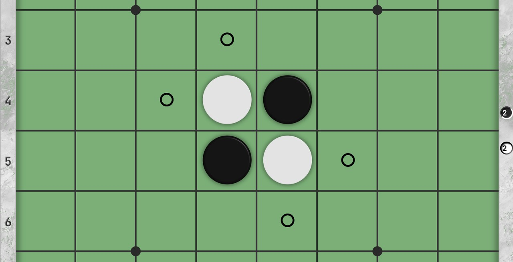

# Go语言爱好者周刊：第 57 期

这里记录每周值得分享的 Go 语言相关内容，周日发布。

本周刊开源（GitHub：[polaris1119/golangweekly](https://github.com/polaris1119/golangweekly)），欢迎投稿，推荐或自荐文章/软件/资源等，请[提交 issue](https://github.com/polaris1119/golangweekly/issues) 。

鉴于大部分人可能没法坚持把英文文章看完，因此，周刊中会尽可能推荐优质的中文文章。优秀的英文文章，我们的 GCTT 组织会进行翻译。



题图：黑白棋，Go 语言实现了这个小游戏

## 刊首语

黑白棋，又叫翻转棋（Reversi）、奥赛罗棋（Othello）、苹果棋或正反棋（Anti reversi）。黑白棋在西方和日本很流行。游戏通过相互翻转对方的棋子，最后以棋盘上谁的棋子多来判断胜负。它的游戏规则简单，因此上手很容易，但是它的变化又非常复杂。有一种说法是：只需要几分钟学会它，却需要一生的时间去精通它。

这里有一个 Go 语言实现的黑白棋，地址：<https://piccolo.click/>。可惜源码没有开放，在 Web 上通过 WebAssembly 运行的。使用 [Ebiten 2D](https://ebiten.org/) 游戏库构建。

> Piccolo 是一款以强大且具有竞争力的水平玩日本 Othello 战略游戏的 AI。Piccolo 结合使用 Negamax 深度优先搜索和 Alpha-Beta 修剪与启发式技术相结合来评估位置强度，并具有优雅的用户界面。
>
> 除了 Web 版本，还支持 Windows 和 Linux 客户端，不久会有 macOS 客户端。

以前没玩过，试完了几把，Level 2 级别的都输，AI 好强大还是我太菜？！

## 资讯

1、[Task 3.0 发布](https://github.com/go-task/task/releases/tag/v3.0.0)

任务运行器，使用 Go 语言编写。类似 GNU Make，目标是比它更简单和易于使用。

2、[用于 pkg.go.dev 的 Badge 生成工具](https://pkg.go.dev/badge/)

这是官方提供的工具，用于生成 Badge 放在 README 中。比如 studygolang 源码的 Badge：[](https://pkg.go.dev/github.com/studygolang/studygolang)。

3、[关于 Go 泛型设计最新进展和一些问题的澄清](https://groups.google.com/g/golang-nuts/c/iAD0NBz3DYw/m/VcXSK55XAwAJ)

很大可能使用方括号 `[]`，取消类型参数前面的 type 关键字，所有类型参数必须提供 constraint，引入 “any" 预声明标识符 （interface{} 的一个 alias）等。

```go
type Vector[T any] []T               
func Print[T any](s []T) { … }
func Index[T comparable](s []T, e T) { … }
```

## 文章

1、[对比三款 Go Playground：你喜欢哪款？](https://mp.weixin.qq.com/s/SYngjiM8M2T6KS0OQNonCQ)

曾几何时，语言的在线运行（Playground）似乎成了标配。确实，Playground 能够让我们可以快速试验一些想法。Go 语言在发布之初就提供了一个，这就是 https://play.golang.org。然而，由于众所周知的原因，我们访问不了。为了方便国内广大 gopher，我搞了一个国内镜像：https://play.studygolang.com，尽情使用、分享吧。

2、[关于 Golang 错误处理的一些思考](https://mp.weixin.qq.com/s/KPrzPP797efFUKOTTfY1Ow)

如果你还没在 error 上栽跟头，那么当你栽了跟头时才会哭着想起来，当年为什么没好好思考和反省错误处理这么一个宏大的话题。

3、[如果你只知道 go test 用于单元测试就太 LOW 了](https://mp.weixin.qq.com/s/LDYJMZ72k9PCSiBwJAMKlQ)

go test 命令提供了许多出色的功能，比如代码覆盖率，CPU 和 内存分析。要提供这些统计信息，Go 就需要一种方式来跟踪 CPU 使用率，或在代码覆盖中跟踪一个函数何时被用到。

4、[掌握了这30道MySQL基础面试题，我成了面霸](https://mp.weixin.qq.com/s/IoZ_BbcjTFb-OJyRvZTVPQ)

一个典型的互联网产品架构包含接入层、逻辑处理层以及存储层，其中存储层承载着数据落地和持久化的任务，同时给逻辑处理层提供数据查询功能支持。说到存储层就要说到数据库，数据库知识掌握程度也是面试考察的知识点。

5、[图解 Go 内存管理与内存清理](https://mp.weixin.qq.com/s/NTmE7GA429hfrYkySRsh4g)

清理内存是一个过程，它能够让 Go 知道哪些内存段最近可用于分配。但是，它并不会使用将位置 0 的方式来清理内存。

6、[作为 Gopher 你一定要懂的连接池](https://mp.weixin.qq.com/s/oHtdQ_Zt2PCvY_-rwzJZxQ)

作为一名Golang开发者，线上环境遇到过好几次连接数暴增问题（mysql/redis/kafka等）。纠其原因，Golang作为常驻进程，请求第三方服务或者资源完毕后，需要手动关闭连接，否则连接会一直存在。而很多时候，开发者不一定记得关闭这个连接。这样是不是很麻烦？于是有了连接池。

7、[Viper 加载远程配置的填坑之旅](https://mp.weixin.qq.com/s/tqYigx7Fw45BeTc42QyCmw)

关于 viper，无须多言，它是 Golang 社区里最流行的配置文件工具，除了常见功能之外，它还支持很多高级功能，比如可以加载远程配置，正好我最近在研究 etcd，于是我打算把二者结合起来，没想到就此开启了填坑之旅。

8、[Go 读取文件方式那么多，到底应该用哪一种呢](https://mp.weixin.qq.com/s/g3my_daXI-uYwSa0PBN0VA)

Go 语言在进行文件操作的时候，可以有多种方法。最常见的比如直接对文件本身进行`Read`和`Write`；除此之外，还可以使用`bufio`库的流式处理以及分片式处理；如果文件较小，使用`ioutil`也不失为一种方法。面对这么多的文件处理的方式，那么初学者可能就会有困惑：我到底该用那种？它们之间有什么区别？笔者试着从文件读取来对 go 语言的几种文件处理方式进行分析。

9、[从头教你使用 Hugo 搭建自己的博客](https://mp.weixin.qq.com/s/W0I_KUifTpn1aWavaFy8-Q)

手把手教你。

10、[微服务的战争：按什么维度拆分服务](https://mp.weixin.qq.com/s/tUeXHVBj0q6pHv1Vt2Xz2Q)

微服务，这三个字正在席卷着目前的互联网软件行业，尤其在近几年云原生迸发后，似乎人人都对微服务有了更广泛的使用和理解，张口就是各种各样的问号，有着强大的好奇心。但微服务的拆分维度是什么？

11、[TiDB 在知乎万亿量级业务数据下的实践和挑战](https://mp.weixin.qq.com/s/k27rXayT0C7Sr_vwoIYrUw)

2019 年底的分享。

12、[如何使得你的 Go 命令行程序变得友好？](https://mp.weixin.qq.com/s/gpkqFOAfQr0nM0ZvVvXBzw)

从一个故事开始~

13、[Go 项目实战：Golang HTTP 验证码](https://mp.weixin.qq.com/s/Zc3r_DPyyf_qQNyMeEyWzA)

网站必备的功能。

14、[优化 Docker 镜像大小常见方法](https://mp.weixin.qq.com/s/BLthC0SEs13jLNSyqb57-A)

平时我们构建的 Docker 镜像通常比较大，占用大量的磁盘空间，随着容器的大规模部署，同样也会浪费宝贵的带宽资源。本文将介绍几种常用的方法来优化 Docker 镜像大小，这里我们使用 Docker Hub 官方上的 Redis 镜像进行说明。

15、[通过 Go 语言代码理解大小端模式](https://mp.weixin.qq.com/s/V-FFnG_f7kG0D97vJ5s1Ww)

Go 语言底层实现的为小端模式，因为计算机进行计算时，都是从低位开始进行计算的，这样计算效率比较高。而大端模式比较方便用户阅读，比较符合我们的阅读习惯。

16、[聊聊自己学Go一年来的经历与成长](https://juejin.im/post/6863680036407345166)

今天偶然在掘金上看到了关于 Go 的征文稿，恰逢赶上自己学 Go 一周年的时间，最近也在部门内做了关于《Let's Go !  Go 语言入门与实践》的分享，结合自身在字节跳动的业务开发经历，整体聊聊自身关于 Go 的一些学习感悟与成长。

17、[golang net/http 超时引发大量 fin-wait2](http://xiaorui.cc/archives/6999)

通过 grafana 监控面板，发现几个高频的业务缓存节点出现了大量的 fin-wait2，而且 fin-wait2 状态持续了不短的时间。

## 开源项目

1、[ent](https://github.com/facebook/ent)

Go 的实体框架。简单而强大的 ORM，用于建模和查询数据。官网 <https://entgo.io/>，Facebook 出品。最初是一个“  Facebook 孵化器”项目，但自本周发布的 v0.4.0 起，它已成为 Facebook 的正式项目。


2、[tracesite](https://github.com/kalbhor/tracesite)

tracesite 是 traceroute 工具的简单 Go 实现，作者写了一篇文件介绍它：<https://blog.kalbhor.xyz/post/implementing-traceroute-in-go/>。

不过这个项目结构不符合 Go 规范，里面不应该有 src。

3、[askgit](https://github.com/augmentable-dev/askgit)

使用 SQL 查询 git 存储库。比如：`askgit "SELECT * FROM commits`，该库之前叫做：gitqlite。

4、[guora](https://github.com/meloalright/guora)

Go 类似知乎的私有部署问答应用，包含问答、评论、点赞、管理后台等功能。

5、[ebiten](https://github.com/hajimehoshi/ebiten)

Go 的简单 2D 开源游戏库。Ebiten 的简单 API 使您可以快速轻松地开发可在多个平台上部署的 2D 游戏。

6、[govalidator](https://github.com/asaskevich/govalidator)

用于字符串，数字，切片和结构的验证程序。

7、 [babygo](https://github.com/DQNEO/babygo)

从头开始编写的 Go 编译器。

8、 [logr](https://github.com/mattermost/logr)

mattermost 开源的 go log 工具。

## 资源&&工具

1、[nali](https://github.com/zu1k/nali)

一个查询 IP 地理信息和 CDN 提供商的离线终端工具。

2、[grpc 的那些事儿](http://xiaorui.cc/static/grpc.pdf)

峰云就她了 博主的分享 PPT。

3、[GopherCon Russia 2020 大会](https://www.youtube.com/watch?v=dGcI1OsDCio&list=PLJTW0ZQ22rrEtvqbz0rxhNQTm0bkJV4Nb)（俄文） 

疫情没有阻挡大会的正常进行。

4、[lsif-go](https://github.com/sourcegraph/lsif-go)

Language Server 索引格式生成器。

5、[回放第 101 期 2020-08-16 晓黑板 go-zero 微服务框架的架构设计](https://talkgo.org/t/topic/729)

Go 夜读 第 101 期晓黑板 go-zero 微服务框架分享。

6、[第 102 期官方标准编译器中实现的优化集锦](https://talkgo.org/t/topic/702)

Go101 作者分享。

7、[油管视频](https://www.youtube.com/watch?v=1ZjvhGfpwJ8&feature=youtu.be)

从 OO 语言到 Go 的历程。

## 订阅

这个周刊每周日发布，同步更新在[Go语言中文网](https://studygolang.com/go/weekly)和[微信公众号](https://weixin.sogou.com/weixin?query=Go%E8%AF%AD%E8%A8%80%E4%B8%AD%E6%96%87%E7%BD%91)。

微信搜索"Go语言中文网"或者扫描二维码，即可订阅。


