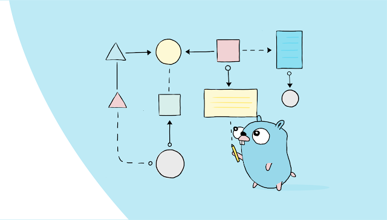
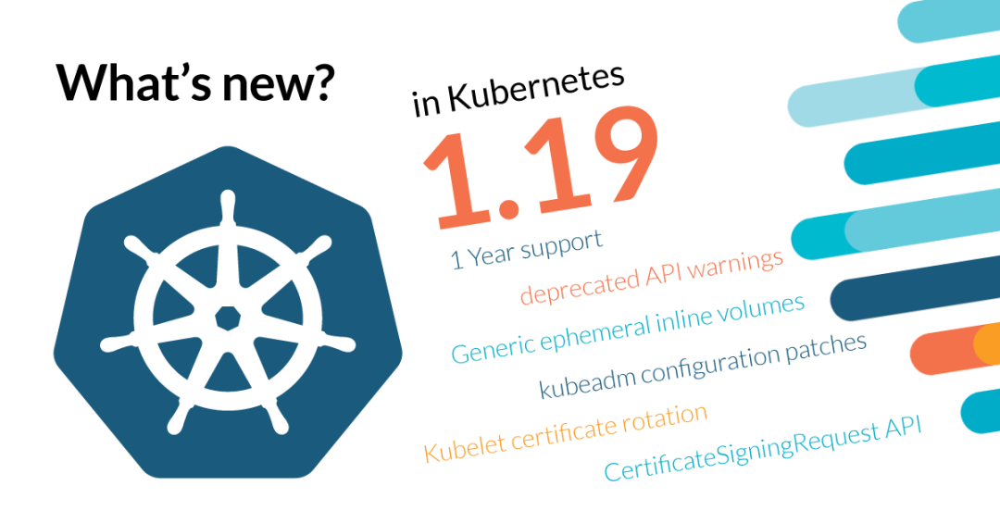
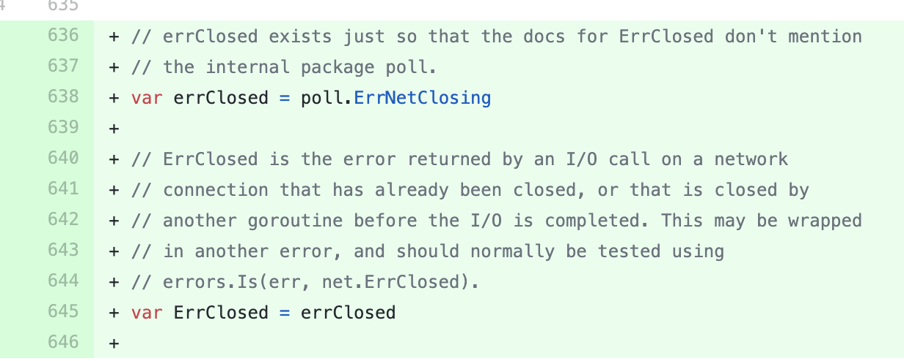

# Go语言爱好者周刊：第 58 期

这里记录每周值得分享的 Go 语言相关内容，周日发布。

本周刊开源（GitHub：[polaris1119/golangweekly](https://github.com/polaris1119/golangweekly)），欢迎投稿，推荐或自荐文章/软件/资源等，请[提交 issue](https://github.com/polaris1119/golangweekly/issues) 。

鉴于大部分人可能没法坚持把英文文章看完，因此，周刊中会尽可能推荐优质的中文文章。优秀的英文文章，我们的 GCTT 组织会进行翻译。



题图：Go 在谷歌的使用插图

## 刊首语

借用 Dave Cheney 的一道测试题作为这次周刊的刊首语。

以下程序打印什么？

```go
package main

import (
    "context"
    "fmt"
)

func f(ctx context.Context) {
    context.WithValue(ctx, "foo", -6)
}

func main() {
    ctx := context.TODO()
    f(ctx)
    fmt.Println(ctx.Value("foo"))
}
```

A. -6; B. 0; C. `<nil>`; D: panic

## 资讯

1、[关于 Go 语言泛型设计的最新进展和一些问题的说明](https://mp.weixin.qq.com/s/s_soEAcoWnubU3A3mnkv2A)

前段时间 Go 官方发布了新的泛型草案，一时间在社区引起了很大的反响，各种关于泛型的文章、讨论涌现出来。8 月 21日 Ian Lance Taylor 在 golang-nuts 讨论组总结了泛型设计的最新进展和一些问题的说明。

2、[Istio 1.5.10 发布](https://www.oschina.net/news/118181/istio-1-5-10-released)

Istio 是一个由谷歌、IBM 与 Lyft 共同开发的开源项目，旨在提供一种统一化的微服务连接、安全保障、管理与监控方式。具体来说，Istio 是一个开源服务网格平台，它确保微服务在处理故障时以指定的方式相互连接。 这是小版本升级。

3、[Kubernetes v1.19.0 正式发布](https://dylanmeeus.github.io/tags/goaudio/)

终于，我们迎来了 Kubernetes 1.19 版本，这是 2020 年的第二个版本，也是迄今为止最长的发布周期，总共持续 20 周。它由 33 项增强功能组成。12 个增强功能进入稳定版，18 个增强功能进入测试版，13 个增强功能进入 alpha 版。



4、[net 包将导出 ErrClosed 以便程序可以可靠的判断当前链接是否已经关闭](https://github.com/golang/go/commit/e9ad52e46dee4b4f9c73ff44f44e1e234815800f)

从提交可以看到这点。



## 文章

1、[Go 热重载工具 air 不好使了：goproxy.cn 的锅？](https://mp.weixin.qq.com/s/HRrxuDKZM_q3YJCn1dL89A)

大家写开源项目还是需要注意下。

2、[我擦~字符串转字节切片后，切片的容量竟然千奇百怪](https://mp.weixin.qq.com/s/pizQZSBY8cPM0AxKGJvmWA)

给结论，字符串转字节切片步骤如下：

1）判断是否是常量， 如果是常量则转换为等容量等长的字节切片

2）如果是变量， 先判断生成的切片是否发生变量逃逸

1. - 如果逃逸或者字符串长度>32， 则根据字符串长度可以计算出不同的容量
   - 如果未逃逸且字符串长度<=32, 则字符切片容量为32

3、[踩了 Go 1.15 sync.Map的一个坑](https://purewhite.io/2020/08/24/golang-sync-map-keys-never-delete/)

使用 1.15 的用户可以注意下。

4、[微服务的战争：统一且标准化](https://mp.weixin.qq.com/s/0ZtR3e0NHGpwAswvNNhYKw)

“微服务的战争” 是一个关于微服务设计思考的系列题材，主要是针对在微服务化后所出现的一些矛盾/冲突点，不涉及具体某一个知识点深入。

5、[2021 年最佳的后端编程语言会是谁？](https://mp.weixin.qq.com/s/B2sDMJdIG_DIt3vLdmb80w)

Go、Python 还是 NodeJS 等。

6、[Go 每日一库之 go-bindata — 静态资源嵌入详解](https://mp.weixin.qq.com/s/piit9iPYbr-gU-39swn4sw)

本文没有一开始给出最佳实践，而是从最简单的做法开始，展示一点一点改进的过程。长度尽量精简，希望你看到最后。

7、[手把手教你用 ETCD：一篇短文却包含众多知识](https://mp.weixin.qq.com/s/efwpeWDkRPr19-dTnGkvww)

一句话概括的话：ETCD 是一个基于 RAFT 的分布式 KV 存储系统。

8、[都说 Go 可以开启成千上万的 Goroutine，那调度器是怎么处理核上任务分配的？](https://mp.weixin.qq.com/s/_By9rjPgb8zqIpVrsJrToQ)

在 Go 中创建 Goroutine 既方便又快捷，然而 Go 在同一时间内最多在一个核上运行一个 Goroutine，因此需要一种方法来存放其他的 Goroutine，从而确保处理器（processor）负载均衡。

9、[容器基础：Cgroup](https://lessisbetter.site/2020/08/27/cgroup-1/)

Cgroup 是 Control Group 的缩写，提供对一组进程，及未来子进程的资源限制、控制、统计能力，包括CPU、内存、磁盘、网络。

10、[线上 Go 程序偶尔出现异常怎么办？这个思路可解决你的烦恼](https://mp.weixin.qq.com/s/yTep-eRbVgPDlcsrAyV2gg)

Go 项目做的比较大（主要说代码多，参与人多）之后，可能会遇到类似下面这样的问题：

- 程序老是半夜崩，崩了以后就重启了，我也醒不来，现场早就丢了，不知道怎么定位
- 这压测开压之后，随机出问题，可能两小时，也可能五小时以后才出问题，这我蹲点蹲出痔疮都不一定能等到崩溃的那个时间点啊
- 有些级联失败，最后留下现场并不能帮助我们准确地判断问题的根因，我们需要出问题时第一时间的现场

## 开源项目

1、[go-reddit](https://github.com/vartanbeno/go-reddit)

用于访问 Reddit API 的库。

2、[modernc/sqlite](https://gitlab.com/cznic/sqlite)

一个自包含，无服务器，零配置的事务型 SQL 数据库引擎的进程内实现。

3、[httpmock](https://github.com/dankinder/httpmock)

Go 轻量级的 http mock 库，建立在标准库 httptest 之上。

4、[go-nfs](https://github.com/willscott/go-nfs)

NFSv3 协议的纯 Go 实现。

5、[csvstruct](https://github.com/artyom/csvstruct)

CSV 反序列化为结构体对象库。

6、[golf-engine](https://github.com/bjatkin/golf-engine)

GoLF 游戏引擎。


7、[logr](https://github.com/go-logr/logr)

k8s 之父 Tim Hockin 创建的 go log 接口库。

8、[cassandra web ui](https://github.com/orzhaha/cassandra-web)（[yulintsai](https://github.com/yulintsai) 投稿）

cassandra-web 是一个以 golang&vue.js 为基础，以 Web-Base 方式架构在网站主机上的 cassandra 的资料库管理工具，让管理者可用 Web 界面管理 cassandra 资料库。

## 资源&&工具

1、[从头开始用 Go 处理音频](https://dylanmeeus.github.io/tags/goaudio/)

有关使用 Go 进行音频处理的一系列文章。介绍了如何使用自己创建的声波从头开始创建波形文件。

2、[minify](https://github.com/tdewolff/minify)

用于 Web 格式（CSS，HTML，JSON 等）的 Go 实现的压缩工具。这里有一个在线 Demo：<https://go.tacodewolff.nl/minify>。

3、[maddy](https://github.com/foxcpp/maddy)

可组合的多合一邮件服务器。可以用作 MTA，通过 SMTP 接收邮件，存储邮件甚至通过 IMAP 提供对它们的访问权限。

4、[播客第 134 期](https://changelog.com/gotime/143)

context.Context 的用法与误用。

5、[localchat](https://github.com/fiatjaf/localchat)

Go 编写的局域网聊天工具。

6、[script-httpd](https://github.com/beefsack/script-httpd)

将一个命令行脚本转换为 Web 服务。

7、[gitlab](https://github.com/profclems/glab)

Go 实现的 gitlab 客户端命令行工具。

8、[油管视频](https://www.youtube.com/watch?v=AgR_mdC4Rs4)

Russ Cox 讲解 go:build 设计草案。

9、[mini-blockchain](https://github.com/codingtmd/mini-blockchain)

基于教学目的区块链的 Go 语言参考实现。

10、[go-readelf](https://github.com/sad0p/go-readelf)

用 Go 编写的 elf 二进制解析实用程序。

11、[monsoon](https://github.com/RedTeamPentesting/monsoon)

用 Go 编写的快速灵活的 HTTP enumerator。


## 订阅

这个周刊每周日发布，同步更新在[Go语言中文网](https://studygolang.com/go/weekly)和[微信公众号](https://weixin.sogou.com/weixin?query=Go%E8%AF%AD%E8%A8%80%E4%B8%AD%E6%96%87%E7%BD%91)。

微信搜索"Go语言中文网"或者扫描二维码，即可订阅。


