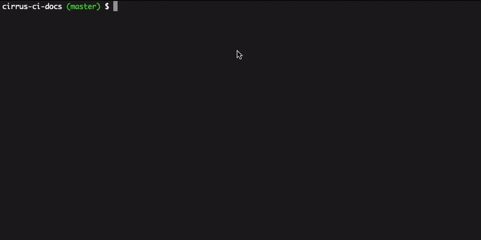
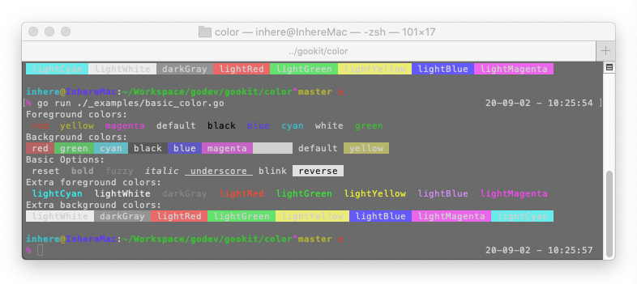

# Go语言爱好者周刊：第 59 期

这里记录每周值得分享的 Go 语言相关内容，周日发布。

本周刊开源（GitHub：[polaris1119/golangweekly](https://github.com/polaris1119/golangweekly)），欢迎投稿，推荐或自荐文章/软件/资源等，请[提交 issue](https://github.com/polaris1119/golangweekly/issues) 。

鉴于大部分人可能没法坚持把英文文章看完，因此，周刊中会尽可能推荐优质的中文文章。优秀的英文文章，我们的 GCTT 组织会进行翻译。


题图：Russ Cox 关于 Go 中内嵌静态资源的视频

## 刊首语

这期周刊再来面试题，以下代码只注释掉 ② 输出什么？如果只注释掉 ① 又输出什么？

```go
package main

import (
	"fmt"
)

func main() {
	a := [2]int{5, 6}
	b := [2]int{5, 6}
	
	// ①
	if a == b {
		fmt.Println("equal")
	} else {
		fmt.Println("not equal")
	}

	// ②
	if a[:] == b[:] {
		fmt.Println("equal")
	} else {
		fmt.Println("not equal")
	}
}
```

## 资讯

1、[Go 1.15.1 和 Go 1.14.8 发布](https://mp.weixin.qq.com/s/Fwym7ZThwqK_vvb5A3OwHA)

解决最近报告的安全问题。

2、[gorm 2.0发布](https://mp.weixin.qq.com/s/Xwgan--hF8XMLY6dLtOzVw)

为国人点赞。

3、[关于在 Go Binaries 中嵌入文件的提案的更新：预计 Go1.16 中包含](https://github.com/golang/go/issues/41191)

得益于静态编译，Go 项目部署特别方便。然而如果是一个网站项目，包含静态资源，这时如何做到只需一个文件呢？社区有很多解决方案，可见需求常有。所以，Go Team 决定内置支持。有一个视频分享：<https://www.youtube.com/embed/rmS-oWcBZaI>。

4、[zap 1.16 发布](https://github.com/uber-go/zap)

Go 中快速，结构化，支持级别的日志记录。Uber 出品。

## 文章

1、[Go 到底是不是 Google 亲生的？Rob Pike 告诉你](https://mp.weixin.qq.com/s/viOCzclBXOrhS-Ixef7fAQ)

大家都知道 Go 是 Google 的，但总是有一种错觉：Go 不是 Google 亲生的吧？！为什么会这样觉得？

2、[文本编辑器大比拼：谁才是真正的编辑器之王？](https://mp.weixin.qq.com/s/twGr49fAqRG8UguZ_9TiiA)

为大家带来玩转 VS Code 系列。

3、[动态作用域？Dave Cheney 大神由 Go 单元测试惯用形式所想](https://mp.weixin.qq.com/s/bMMJQdoBEuYavoIZG300aQ)

这是一个 API 设计的思想实验，它从典型的 Go 单元测试惯用形式开始。

4、[谈谈 Golang HTTP服务器实现原理](https://juejin.im/post/6867149633328513038)

关于 Golang HTTP 服务器实现原理，本文将通过下面两点来讲述：

- 如何创建一个 HTTP 服务器；
- HTTP 服务器实现原理；

5、[Golang 标准库 sync.WaitGroup 解读](https://juejin.im/post/6866971615717457934)

源码面前无秘密。

6、[使用 Go 实现 lock-free 的队列](https://colobu.com/2020/08/14/lock-free-queue-in-go/)

本文介绍 lock-free queue 算法的一些背景知识，并实现了三种并发队列，并提供了性能测试的结果。

7、[IO 操作库那么多，我咋选？谈谈对 Go IO 读写的困惑](https://mp.weixin.qq.com/s/6ZECGjRQpQA5BuSRY4bIOg)

Golang 的 IO 读写提供了很多种方式，目前本人知道的有 io 库、os 库、ioutil 库、bufio 库、bytes/strings 库等。

8、[用 Go 开发桌面应用程序（GUI）：Webview、Lorca 与 Electron](https://mp.weixin.qq.com/s/ZbAtpd4R6wpzu0hXClnBjQ)

本文将探讨如何使用 Lorca 和 Webview 构建应用程序，然后比较这三种的不同。

9、[玩转 VS Code 之你可能不知道的一些技巧](https://mp.weixin.qq.com/s/iV3t1jJ0okRbQtQSw8J9bA)

这篇文章介绍和具体语言无关、认为值得提到的点，方便后续用 VSCode 开发时更得心应手。

10、[CGO 如何生成兼容 C 的结构体？](https://mp.weixin.qq.com/s/k2j2nJNvriJUIi4X10rQzw)

写 CGO 的可以看看。

12、[卡通图文：你女朋友也能看懂的 Kubernetes！](https://mp.weixin.qq.com/s/aC6NDfQm6Gm4sWsr1izURg)

关键有女朋友吗？

13、[手把手带你理解 etcd：服务发现和分布式 KV 存储](https://mp.weixin.qq.com/s/1htmUfEyOJxQqO0V-HkhmA)

etcd 是用于共享配置和服务发现的分布式、一致性的 KV 存储系统。本文从 etcd 项目发展所经历的几个重要时刻开始，为大家介绍了 etcd 的总体架构及其设计中的基本原理。希望能够帮助大家更好的理解和使用 etcd。

14、[在 Go 语言中 Patch 非导出函数](http://xargin.com/patching-private-function-in-go/)

使用 <https://github.com/cch123/supermonkey> 可以 patch 任意导出/非导出函数。

## 开源项目

1、[Echelon](https://github.com/cirruslabs/echelon)

终端分层进度条。



2、[pulsar-client-go](https://github.com/apache/pulsar-client-go)

[Apache Pulsar](https://pulsar.apache.org/) Go 客户端。Apache Pulsar 最初由 Yahoo 构建的分布式消息和流媒体平台。

3、[color](https://github.com/gookit/color)

Go 下的命令行色彩使用库, 拥有丰富的色彩渲染输出，通用的 API 方法，兼容 Windows 系统。



4、[db](https://github.com/upper/db)

具有类似 ORM 功能的 PostgreSQL，CockroachDB，MySQL，SQLite 和 MongoDB 的数据访问层。这里有一个[简单教程](https://tour.upper.io/welcome/01)。

5、[pgzip](https://github.com/klauspost/pgzip)

进行并行 gzip 压缩/解压。可以作为标准库 compress/gzip 的替代品。

6、[bravetools](https://github.com/bravetools/bravetools)

端到端的系统容器管理平台。

7、[dbr](https://github.com/mailru/dbr)

database/sql 的性能增强库。

8、[lakeFS](https://github.com/treeverse/lakeFS)

一个开源平台，为基于对象存储的数据库提供弹性和可管理性。

## 资源&&工具

1、[一些使用 Go 泛型的例子](https://github.com/golang/go/tree/dev.go2go/src/cmd/go2go/testdata/go2path/src)

Go Team 维护。

2、[gomplate](https://github.com/hairyhenderson/gomplate)

用于模板渲染的灵活命令行工具。支持许多本地和远程数据源，如 JSON, YAML, AWS EC2 metadata, BoltDB, Hashicorp Consul 和 Hashicorp Vault secrets 等。简单示例如下：

```bash
$ # at its most basic, gomplate can be used with environment variables...
$ echo 'Hello, {{ .Env.USER }}' | gomplate
Hello, hairyhenderson
```

3、[httpx](https://github.com/projectdiscovery/httpx)

一个快速且多功能的 HTTP 工具包，它旨在通过增加线程来保持结果的可靠性。


4、[Go.Sed](https://github.com/rwtodd/Go.Sed)

Go 中 sed 的实现。

5、[dumpling](https://github.com/pingcap/dumpling)

由 Go 语言编写的用于对数据库进行数据导出的工具。目前支持 MySQL 协议的数据库，并且针对 TiDB 的特性进行了优化。这里有官方的一篇介绍文章：<https://segmentfault.com/a/1190000023879506>。

6、[rgo](https://github.com/rgonomic/rgo)

R 语言与 Go 集成工具。

## 订阅

这个周刊每周日发布，同步更新在[Go语言中文网](https://studygolang.com/go/weekly)和[微信公众号](https://weixin.sogou.com/weixin?query=Go%E8%AF%AD%E8%A8%80%E4%B8%AD%E6%96%87%E7%BD%91)。

微信搜索"Go语言中文网"或者扫描二维码，即可订阅。


