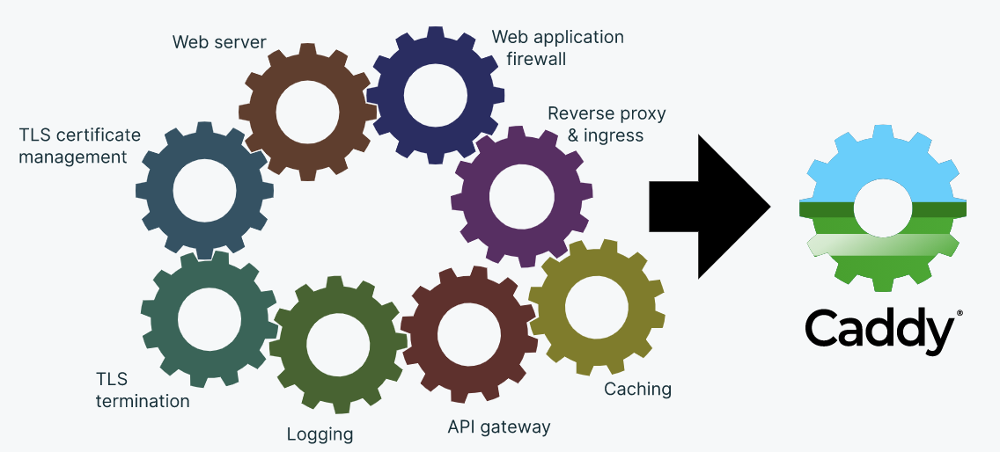
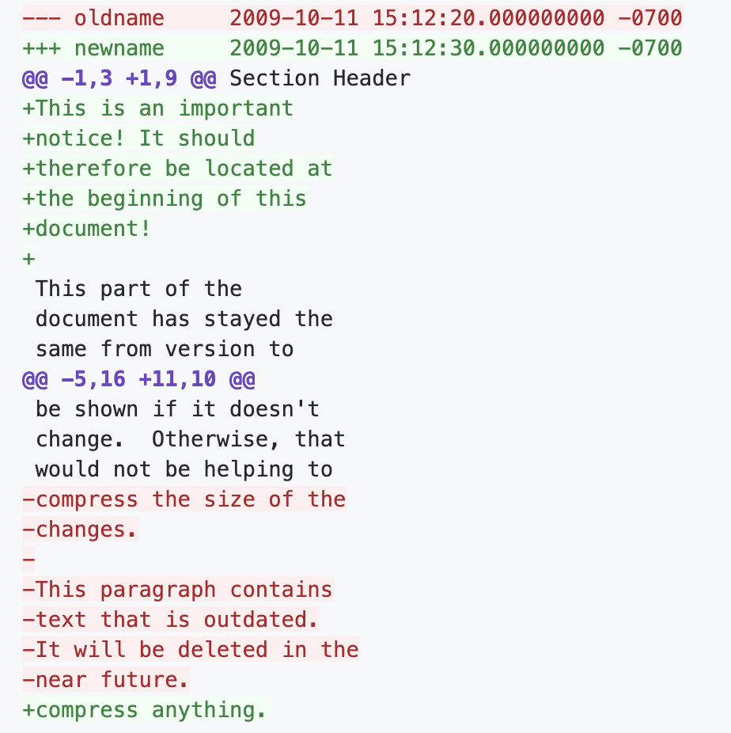

# Go语言爱好者周刊：第 60 期

这里记录每周值得分享的 Go 语言相关内容，周日发布。

本周刊开源（GitHub：[polaris1119/golangweekly](https://github.com/polaris1119/golangweekly)），欢迎投稿，推荐或自荐文章/软件/资源等，请[提交 issue](https://github.com/polaris1119/golangweekly/issues) 。

鉴于大部分人可能没法坚持把英文文章看完，因此，周刊中会尽可能推荐优质的中文文章。优秀的英文文章，我们的 GCTT 组织会进行翻译。



题图：Caddy 的组件

## 刊首语

群里有人发了一道题，分享给大家。

这样的代码：

```go
var m int32 = 0x12345678
var n int8 = int8(m)
```

请问 n 是多少？

A：0x12；B：-0x1；C：0x78；D：0x7F

## 资讯

1、[Go 1.15.2 和 Go 1.14.9 发布](https://mp.weixin.qq.com/s/GK9a1kOfBRwtbQtZ-NYuCw)

小版本，修复了十几个 Bug。

2、[Goyave 3.0 发布](https://github.com/System-Glitch/goyave)

一个优雅的 Web 框架。

3、[gofeed 1.1 发布](https://github.com/mmcdole/gofeed)

RSS、Atom 和 JSON Feed 解析器。时隔四年，发布 1.1，支持 JSON。


4、[Caddy 卖掉了](https://www.ardanlabs.com/news/2020/08/caddy-server-is-acquired/)

它的作者 Matt 继续全职为 Caddy 工作。

5、[Go 1.16 版本 module 机制将成为默认](https://github.com/golang/go/issues/41330)

同时 GOPATH 在 Go 1.17 中将成为过去时。

## 文章

1、[腾讯：汇编是深入理解 Go 的基础](https://mp.weixin.qq.com/s/2JQM1piaWPQW-uwD_P-3Cg)

Go 的汇编是 Plan 9 规则的汇编。

2、[原来还可以这么做：go version 命令的高级用法](https://mp.weixin.qq.com/s/svmWO1WjJjL5pCd6eyzPVg)

原来隐藏了这样的功能。

3、[Go：为什么你应当避免使用指针](https://mp.weixin.qq.com/s/FKxDjdShih5UinYFoQovxA)

别被作者的这个标题误导了，其实阅读完全文，发现作者并不是排斥使用指针，而是应选择适当的场景去使用指针。

4、[缓存击穿导致 Go 组件死锁的问题剖析](https://mp.weixin.qq.com/s/XWAhEVBpxbUE_fGFi1v-DA)

分享一个线上遇到的死锁问题，什么， golang 也会有死锁？

5、[王者荣耀为什么不使用微服务架构？](https://mp.weixin.qq.com/s/O_JSrriDwi9hxCbtOEJhzg)

知乎的讨论。

6、[VSCode 开发 Go 程序也可以和 GoLand 一样强大](https://mp.weixin.qq.com/s/J01LY7s6xMB8Lk10sxTFhg)

给大家介绍如何将 VSCode 打造成为一个强大的 Go 开发工具。

7、[gRPC 一定要使用 Protobuf 吗？](https://mp.weixin.qq.com/s/Ir-DThZKZIazCm8aBjMogw)

其实 JSON 也可以。

8、[微服务的战争：选型？分布式链路追踪](https://mp.weixin.qq.com/s/te_UUWFXoHG2yqUlidQCQQ)

一个关于微服务设计思考的系列题材。

## 开源项目

1、[gg](https://github.com/gg-scm/gg)

Go 语言实现，命令行 Git 的替代品，灵感来自 [Mercurial](https://www.mercurial-scm.org/)。

2、[kiwi](https://github.com/sdslabs/kiwi)

一个简约的内存键值存储器。

3、[fastrand](https://github.com/valyala/fastrand)

快速可扩展的伪随机数生成器。这里是另一个受此启发的库：<https://github.com/Villenny/fastrand64-go>。

4、[go-diff](https://github.com/sourcegraph/go-diff)

用于 Go 的统一差异分析和打印。



5、[Graviton](https://github.com/deroproject/graviton)

key-value 存储的 ZFS。

6、[deepalert](https://github.com/deepalert/deepalert)

用于自动响应安全警告的无服务器框架。

7、[go-excel](https://github.com/szyhf/go-excel)

一个轻量级的 Excel 数据读取库，用一种更`关系数据库`的方式解析 Excel。

## 资源&&工具

1、[官方 Go 模块文档](https://github.com/golang/go/wiki/Modules)

很多人可能不知道这个文档的存在，其实这是关于 Module 最权威的文档。

2、[Go 博客第 145 期](https://changelog.com/gotime/145)

关于模糊测试的深入探讨。

3、[crumbs](https://github.com/lucasepe/crumbs)

将用星号缩进的文本转换为思维导图。

4、[kok](https://github.com/RussellLuo/kok)

一款 go-kit 工具链。

5、[depaware](https://github.com/tailscale/depaware)

让你的 Go 项目的依赖一目了然。

6、[必读的 k8s 免费书](http://www.ofbizian.com/2020/09/must-read-free-kubernetes-books.html)（英文）

不是一本是很多本~

7、[Golang-Project-Structure](https://github.com/Mindinventory/Golang-Project-Structure)

Go 项目结构。

## 订阅

这个周刊每周日发布，同步更新在[Go语言中文网](https://studygolang.com/go/weekly)和[微信公众号](https://weixin.sogou.com/weixin?query=Go%E8%AF%AD%E8%A8%80%E4%B8%AD%E6%96%87%E7%BD%91)。

微信搜索"Go语言中文网"或者扫描二维码，即可订阅。


