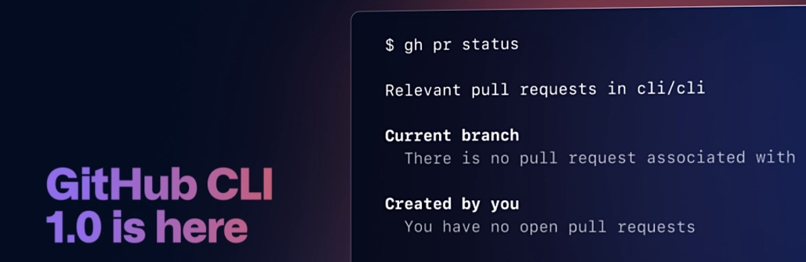
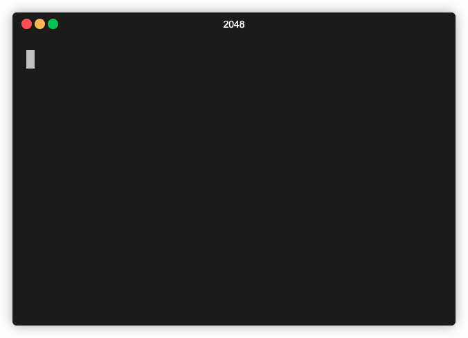
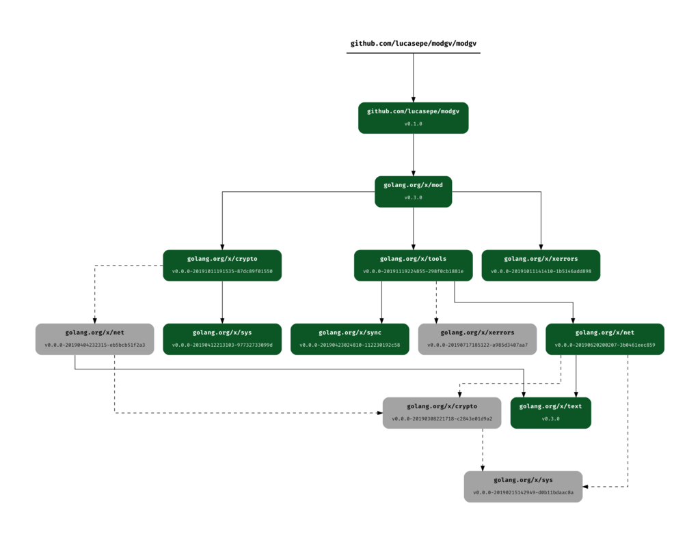
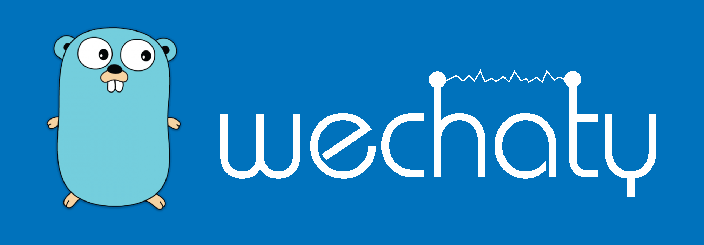

# Go语言爱好者周刊：第 61 期

这里记录每周值得分享的 Go 语言相关内容，周日发布。

本周刊开源（GitHub：[polaris1119/golangweekly](https://github.com/polaris1119/golangweekly)），欢迎投稿，推荐或自荐文章/软件/资源等，请[提交 issue](https://github.com/polaris1119/golangweekly/issues) 。

鉴于大部分人可能没法坚持把英文文章看完，因此，周刊中会尽可能推荐优质的中文文章。优秀的英文文章，我们的 GCTT 组织会进行翻译。



题图：GitHub CLI 1.0 正式发布

## 刊首语

gopls 0.5.0 发布，内存有了很大的提升。使用 VSCode 等文本编辑器开发 Go 的福音。为此站长送出 2 本 《Go语言编程之旅》，参与方式[点击这里](https://mp.weixin.qq.com/s/3E4hGhGgT0VFbS9gpta4sg)。

附上一道简单的题：

```go
package main

const cl = 100

var bl = 123

func main() {
	println(&bl, bl)
	println(&cl, cl)
}
```

以上代码是否正确？为什么？

## 资讯

1、[gopls 0.5.0 发布](https://mp.weixin.qq.com/s/3E4hGhGgT0VFbS9gpta4sg)

内存占用大幅降低。

2、[GitHub CLI 1.0 正式版发布](https://mp.weixin.qq.com/s/a6IsHgQGkc2cy_w2aoQU2g)

据说极客都喜欢这种终端命令模式。

3、[Yaegi 0.9 发布](https://github.com/traefik/yaegi)

一个优雅的 Go 解释器。可以用于其他应用程序中的脚本编写，交互式 shell 或快速原型制作。你可以将其用作 REPL 或将其嵌入到自己的应用中。

4、[Go 泛型如何实现的讨论](https://groups.google.com/g/golang-dev/c/OcW0ATRS4oM)

同时 Keith Randall 提出的两个实现方案。

- 模板方案：https://github.com/golang/proposal/blob/master/design/generics-implementation-stenciling.md
- 字典方案：https://github.com/golang/proposal/blob/master/design/generics-implementation-dictionaries.md

## 文章

1、[在 Go 语言中，我为什么使用接口](https://mp.weixin.qq.com/s/AMgCzCG_096iaCdtOJIBBA)

接口在 Go 语言中的意义。

2、[有想过如何为 Go 语言增加一个语句吗？](https://mp.weixin.qq.com/s/7J0CvKcUTuPCzzvOBxDKoA)

这是探讨 Go 编译器的文章，向 Go 语言添加了一条新语句。

3、[Go 和 Java 对比学习：单例模式](https://mp.weixin.qq.com/s/LkNlY4dIq7K2E72a8ACqpw)

你常用语言的单例模式如何实现的呢？

4、[Goroutine 是轻量的，但也得正确使用：通过 GODEBUG 提升对 Goroutine 的使用](https://mp.weixin.qq.com/s/vguihsNCuj5H7cvqXYZ4eA)

Go 协程是轻量的，在很多场景能提升你的程序性能。不幸的是，如果使用不当，也可能降低你程序的性能，因为 Go 协程的上线文切换也需要消耗一定的资源。

5、[漏桶、令牌桶限流算法的 Go 语言实现](https://mp.weixin.qq.com/s/T_LvVfAOzgANO1XSCViJrw)

限流又称为流量控制（流控），通常是指限制到达系统的并发请求数。

6、[记一次线上性能调优：火焰图是利器](https://mp.weixin.qq.com/s/smdpg0WPY_RIS2pH3Mh5-g)

面对性能调优问题，很多人往往只是单纯的套用既往的经验：先试试一个，不行再试试另一个。

7、[Go 编程的三个常见问题](https://mp.weixin.qq.com/s/0GWF7-fWhaGigLXZKQDXXw)

作者在文章中列举了使用 Go 语言过程碰到的三个常见问题，并且都给出了解决方法，一起来看下作者是怎么解决的！

8、[极端情况下收缩 Go 的线程数](https://xargin.com/shrink-go-threads/)

在 Go 的 runtime 里有一些创建了就没法回收的东西。

9、[一篇短文介绍 Defer 是如何工作的](https://mp.weixin.qq.com/s/FCMvwDym6Qa6_DWKv1HlzA)

意犹未尽。

## 开源项目

1、[bluetooth](https://github.com/tinygo-org/bluetooth)

Go 的跨平台蓝牙 API，tinygo 使用。

2、[datatable](https://github.com/datasweet/datatable)

一个 Go 内存表。用于处理表格数据，例如 excel 电子表格。受 pandas python 包和 data.frame R 结构的启发。

3、[gota](https://github.com/go-gota/gota)

这是 Go 编程语言的 DataFrames，Series 和数据整理方法的实现。

4、[2048](https://github.com/chhabraamit/2048)

Golang 中 2048 游戏的 CLI 实现。



5、[gomajor](https://github.com/icholy/gomajor)

帮助你简化 module 主版本号升级的工具。

6、[gogit](https://github.com/ssrathi/gogit)

用 Go 语言实现 git 内部命令。同时学习 Git 和 Go。

7、[vssh](https://github.com/yahoo/vssh)

通过 SSH 大规模执行命令。雅虎出品。


8、[ali](https://github.com/nakabonne/ali)

生成 HTTP 负载并实时绘制结果。


## 资源&&工具

1、[modgv](https://github.com/lucasepe/modgv)

将 go mod graph 输出转换为 Graphviz 的 DOT 语言，以图形方式可视化项目的依赖关系。



2、[yarr](https://github.com/nkanaev/yarr)

一个 rss 阅读器。


3、[leaf](https://github.com/vrongmeal/leaf)

通用的热编译工具。监视工作目录中的更改，并在文件更新时运行指定的命令。

4、[go-immutable-radix](https://github.com/hashicorp/go-immutable-radix)

Go 中的不可变基数树（radix）实现。

5、[mvn-golang](https://github.com/raydac/mvn-golang)

用于构建 Go 应用的 maven 插件。


6、[crlfuzz](https://github.com/dwisiswant0/crlfuzz)

用 Go 语言编写的快速扫描 CRLF 漏洞的工具。

7、[go-wechaty](https://github.com/wechaty/go-wechaty)

Go 语言编写的面向聊天机器人的对话式微信 SDK。



## 订阅

这个周刊每周日发布，同步更新在[Go语言中文网](https://studygolang.com/go/weekly)和[微信公众号](https://weixin.sogou.com/weixin?query=Go%E8%AF%AD%E8%A8%80%E4%B8%AD%E6%96%87%E7%BD%91)。

微信搜索"Go语言中文网"或者扫描二维码，即可订阅。


