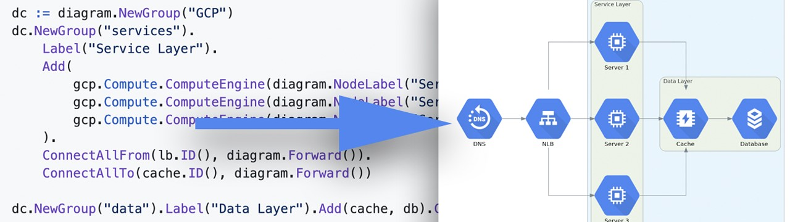
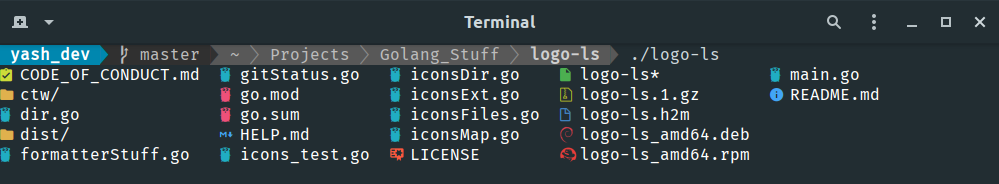

# Go语言爱好者周刊：第 62 期

这里记录每周值得分享的 Go 语言相关内容，周日发布。

本周刊开源（GitHub：[polaris1119/golangweekly](https://github.com/polaris1119/golangweekly)），欢迎投稿，推荐或自荐文章/软件/资源等，请[提交 issue](https://github.com/polaris1119/golangweekly/issues) 。

鉴于大部分人可能没法坚持把英文文章看完，因此，周刊中会尽可能推荐优质的中文文章。优秀的英文文章，我们的 GCTT 组织会进行翻译。


题图：TamaGo，一个 TinyGo ARM 替代品

## 刊首语

Go101 作者发布了一道有意思的题目，这道题主要考察细节点，Go101 这本书也是以抠细节著称。看看这道题，以下程序输出什么？（单选）

```go
package main

const s = "Go101.org"
// len(s) == 9
// 1 << 9 == 512
// 512 / 128 == 4

var a byte = 1 << len(s) / 128
var b byte = 1 << len(s[:]) / 128

func main() {
  println(a, b)
}
```

A、0 0；B、0 4；C：4 0；D：4 4

这里涉及到两个知识点，在 Go 语言规范中都有明确的说明，但确实很细节。你答对了吗？原因知晓吗？

## 资讯

1、[Go 对静态资源的内嵌支持的提案被接受，在 Go1.16 实现](https://github.com/golang/go/issues/41191#issuecomment-697710797)

提案在这里：<https://github.com/golang/proposal/blob/master/design/draft-embed.md>。

2、[pkg.go.dev 计划重新设计](https://github.com/golang/go/issues/41585)

之前写[文章分析过](https://mp.weixin.qq.com/s/btX53JVCgfOfxDy2ynQa_A)，现有的设计确实。。。期待重新设计能够更好。

3、[TinyGo 对 ESP32 和 ESP8266 的初始支持](https://aykevl.nl/2020/09/tinygo-esp32)

你可能已经听说过，上周我们在 0.15 版本的 TinyGo 中添加了 ESP32 和 ESP8266 支持。如果你熟悉微控制器，这将是令人振奋的消息，因为这些 ESP 设备既便宜又受欢迎。但是，这只是一个初始端口，在你可以利用 WiFi 和蓝牙等所有功能之前，还有很多工作要做。

4、[Caddy 2.2.0 发布](https://github.com/caddyserver/caddy/releases/tag/v2.2.0)

支持 [ZeroSSL](https://zerossl.com/features/acme/) 和 HTTP/2 server push。

5、[twirp 7.1 发布](https://github.com/twitchtv/twirp)

具有 Protobuf 服务定义的简单 RPC 框架。

6、[Go 1.16 go module 机制默认开启](https://go-review.googlesource.com/c/go/+/255052)

官方还是很谨慎。没有使用 module 真的说不过去了。

7、[k6 v0.28.0 发布](https://github.com/loadimpact/k6/releases/tag/v0.28.0)

k6 是一种现代的开源性能和负载测试工具，用 Go 编写并且可以用 JavaScript 编写脚本。

## 文章

1、[Go：跨团队协作时如何共享对象](https://mp.weixin.qq.com/s/dj4264rCAS1GAKBxyfL3KQ)

对象怎么可以共享呢？

2、[Go Playground 还能这么玩？](https://mp.weixin.qq.com/s/4EgWOSLJp5hZL1Q9L37YHg)

多人协同编辑。

3、[unsafe 真就 unsafe 吗？](https://mp.weixin.qq.com/s/RKHNKY_EVF2vR0zLQVU5_A)

知道自己在干什么还是可以使用的。

4、[你必须了解的 Go 历史：帮助理解 Go 的设计思想和每个版本的优势或弱点](https://mp.weixin.qq.com/s/Tzqn5kzdfzcQPUD5NtN2mg)

回顾 Go 版本的发展历史。

5、[2 分钟定制一个高大上的 GitHub 首页](https://mp.weixin.qq.com/s/B1Xmbo5fSp7FhxhCJzvG5w)

GitHub 这个功能出来有一段时间了，GitHub 粉应该定制下。

6、[手撕 hashicorp/raft 算法【万字长文】](https://mp.weixin.qq.com/s/OmUbYHZhpvqsflyr6Y6QbQ)

本文是第 104 期手撕 hashicrop/raft 算法的文字版，建议搭配着视频（本文文末）一起阅读。

7、[原来 9 张图就可以弄懂 Go 内存管理](https://mp.weixin.qq.com/s/CsHcVpZ_9rhO3aJy1-gBaA)

从高层看内存管理的文章，而不拘于很多细节。

8、[Go 程序性能分析](https://segmentfault.com/a/1190000024541490)

性能分析是排查内存泄露等问题的常见手段，可以让我们了解和捕获到程序堆内存和 Profile 信息，方便定位问题。Go 原生提供了丰富的分析工具，下面是通过几个内存泄露的案例对 Go 程序做性能分析，并介绍相关工具原理和细节。

## 开源项目

1、[tamago](https://github.com/f-secure-foundry/tamago)

适用于 ARM SoC 的 Bare Metal Go。该框架可在裸机 ARM System-on-Chip（SoC）设置（包括到目前为止的 Raspberry Pi 2 和 Zero）上启用 Go 应用的编译和执行。可能是更成熟的 [TinyGo](https://tinygo.org/) 的唯一 ARM 替代品，因为 TamaGo 修改了标准 Go 发行版，而 TinyGo 是基于 LLVM 的独特编译器。

2、[go-diagrams](https://github.com/blushft/go-diagrams)

使用 Go 创建漂亮的系统图。



3、[mouthful](https://github.com/vkuznecovas/mouthful)

Disqus 评论系统的自助托管 Go 替代方案。为你的网站添加评论。

4、[twtxt](https://github.com/jointwt/twtxt)

Go 实现的去中心化类 Twitter的微博客平台。

5、[prisma-client-go](https://github.com/prisma/prisma-client-go)

Prisma Client Go 是一个自动生成且完全类型安全的数据库客户端。	

6、[overseer](https://github.com/jpillora/overseer)

用于创建可监控、支持优雅重启和自升级的 Go 应用的 module。

7、[gin-metrics](https://github.com/penglongli/gin-metrics)

为 prometheus 准备的度量指标，针对 Gin 框架。

8、[gomponents](https://github.com/maragudk/gomponents)

Go 中的声明性视图组件，可以渲染为 HTML。这里有一篇介绍的文章：<https://www.maragu.dk/blog/gomponents-declarative-view-components-in-go/>。

## 资源&&工具

1、[goconst](https://github.com/jgautheron/goconst)

在 Go 中查找可以被常量替换的重复字符串。

2、https://github.com/Yash-Handa/logo-ls

现代 ls 命令与 VS Code 一样的文件"图标"和 Git 集成。



3、[siegfried](https://github.com/richardlehane/siegfried)

基于签名的文件格式识别。

4、[Dbmate](https://github.com/amacneil/dbmate)

轻量级，与框架无关的数据库迁移工具。用 Go 语言编写，但可以与以任何语言编写的使用数据库的应用程序一起使用。支持 MySQL，Postgres，SQLite 和 ClickHouse。

5、[msfs2020-go](https://github.com/lian/msfs2020-go)

使用 golang 连接到 Microsoft Flight Simulator 2020。

6、[程序员的数学](https://yurichev.com/writings/Math-for-programmers.pdf)（英文）

免费电子书，专为程序员准备。

7、[pixelvideo](https://github.com/markustenghamn/pixelvideo)

如何使用 2D 游戏库制作视频的简单示例。

## 订阅

这个周刊每周日发布，同步更新在[Go语言中文网](https://studygolang.com/go/weekly)和[微信公众号](https://weixin.sogou.com/weixin?query=Go%E8%AF%AD%E8%A8%80%E4%B8%AD%E6%96%87%E7%BD%91)。

微信搜索"Go语言中文网"或者扫描二维码，即可订阅。


