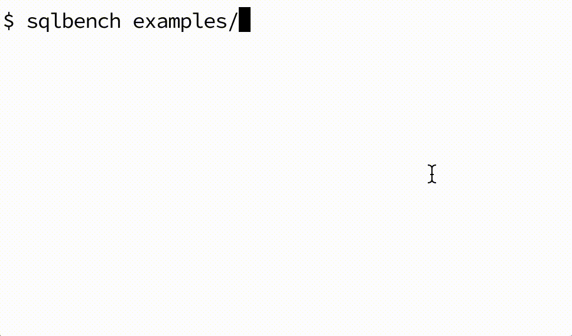

# Go语言爱好者周刊：第 63 期

这里记录每周值得分享的 Go 语言相关内容，周日发布。

本周刊开源（GitHub：[polaris1119/golangweekly](https://github.com/polaris1119/golangweekly)），欢迎投稿，推荐或自荐文章/软件/资源等，请[提交 issue](https://github.com/polaris1119/golangweekly/issues) 。

鉴于大部分人可能没法坚持把英文文章看完，因此，周刊中会尽可能推荐优质的中文文章。优秀的英文文章，我们的 GCTT 组织会进行翻译。

题图：国庆快乐。伟大的新中国成立 71 周年

## 刊首语

关注 Go 语言中文网 公众号都发现，封面图经常换，这些封面图都很可爱，陆陆续续不少人留言想要这些可爱的封面图。现全套可爱的 Gopher 图片打包送给你。关注 「polarisxu」，回复 gopher 获取。

## 资讯

1、[Ebiten v1.12.0 发布](https://ebiten.org/blog/v1.12.0.html)

该版本一个主要的特性：带有新着色语言 Kage 的自定义着色器。详细的 Release Notes 见：<https://ebiten.org/documents/1.12.html>。

2、[Cloudflare 宣布支持 grpc](https://blog.cloudflare.com/announcing-grpc/)

没学 grpc 的该好好学学了。

3、[rqlite 5.5 发布](https://github.com/rqlite/rqlite/releases/tag/v5.5.0)

支持参数化 SQL 语句。

4、[ko 0.6 发布](https://github.com/google/ko)

在 Kubernetes 上构建和部署 Go 应用程序，Google 出品。

5、[proposal: promote panic(nil) to non-nil panic value](https://github.com/golang/go/issues/25448)

关于 panic(nil) 无法被 “recover” 的讨论。

6、[好未来网校技术团队竟然大量使用 Go：等你来](https://mp.weixin.qq.com/s/o_rSwebhXe_bswwbl75Bjg)

计划一周至少发一次招聘。

7、[Go Prosopal: Generics implementation](https://github.com/golang/proposal/blob/master/design/generics-implementation-gcshape.md)

GC Shape Stenciling。

## 文章

1、[这么一道“简单”的题，为什么结果出乎我的意料](https://mp.weixin.qq.com/s/GqdzjXuaZOmjqit32Vxuzg)

很细节。

2、[15 张图带你深入理解浮点数](https://mp.weixin.qq.com/s/8JBRazwyuBKM40dYWBJUoQ)

看完肯定收获满满

3、[GoUI：一个非常简单的 GUI 框架](https://mp.weixin.qq.com/s/xOy0j4gP6VYtJmDbNeOAzQ)

大家对 Go GUI 开发不放弃。

4、[面试官：请说说 Docker 有哪些优缺点？](https://mp.weixin.qq.com/s/9u-o2Tk904y72gT02fmhqQ)

Docker 主要解决环境配置问题，它是一种虚拟化技术，对进程进行隔离，被隔离的进程独立于宿主操作系统和其它隔离的进程。

5、[为 PHP 转 Go 的朋友们推荐一款神器](https://mp.weixin.qq.com/s/eB92lLyF-pvJb0NkazPQZA)

PHP 函数查找到对应的 Go 版本。

6、[错误 error 和异常 panic](https://studygolang.com/articles/30971)

其实这么说不是太合适。

7、[Golang 函数式编程简述](https://juejin.im/post/6877505132620333064)

一般而言，Golang 的 Functional 编程都会呈现出恶形。表面上看，恶形是因为 Golang 缺少一些必要的语法糖；本质上说，恶形源于它没有高级抽象能力，正如泛型的缺失。

8、[题解：竟然半数以上的人做错了，基础真的很重要](https://mp.weixin.qq.com/s/Pa_YgypVUlVaTN0ZutSyoQ)

双节发布了两道题，结果打错的人 50% 以上。。。

## 开源项目

1、[go-string](https://github.com/boyter/go-string/)

Go 中更快的字符串匹配。可以替换 regexp 中的功能，还有一些标准库没有的功能。

2、[promptui](https://github.com/manifoldco/promptui)

命令行应用程序的交互式提示库。包括一些基于终端的优雅控件，例如密码输入，项目选择和确认提示。

3、[gotk3](https://github.com/gotk3/gotk3)

GTK3 的 Go 绑定。

4、[perennial](https://github.com/mit-pdos/perennial)

用于验证 Go 程序并发安全和崩溃安全的系统。

5、[kafka-go](https://github.com/twmb/kafka-go)

一个新的 kafka 客户端。

6、[selfupdate](https://github.com/minio/selfupdate)

支持go应用自升级的包。

7、[elsa](https://github.com/elsaland/elsa)

一个 Go 实现的 Javascript 和 Typescript 运行时。

8、[autoindex](https://github.com/nielsAD/autoindex)

轻量级的 Web 服务器，提供可搜索的目录索引。

9、[gotorch](https://github.com/wangkuiyi/gotorch)

用 Go 习语重新实现了 PyTorch 高级 API。因此，可以在 Go 和 Go+ 中进行深度学习编程。这个项目还处于初期阶段。蚂蚁集团的人主导。

## 资源&&工具

1、[数据结构和算法视频教程](https://www.youtube.com/playlist?list=PL0q7mDmXPZm7s7weikYLpNZBKk5dCoWm6#datastructures)

美女程序媛讲解，真人上镜。

2、[duf](https://github.com/muesli/duf)

类似 htop，但用于磁盘使用情况，适用于 Linux，BSD 和 macOS。

3、[sqlbench](https://github.com/felixge/sqlbench)

sqlbench 测量并比较一个或多个 SQL 查询的执行时间。目前仅适用于 Postgres，但也欢迎对其他数据库的 PR。

4、[gophernotes](https://github.com/gopherdata/gophernotes)

Jupyter notebook 的 Go 引擎，让你可使用 Jupyter notebook 学习 Go。

## 订阅

这个周刊每周日发布，同步更新在[Go语言中文网](https://studygolang.com/go/weekly)和[微信公众号](https://weixin.sogou.com/weixin?query=Go%E8%AF%AD%E8%A8%80%E4%B8%AD%E6%96%87%E7%BD%91)。

微信搜索"Go语言中文网"或者扫描二维码，即可订阅。

