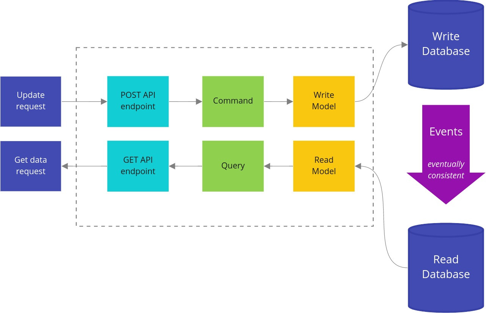
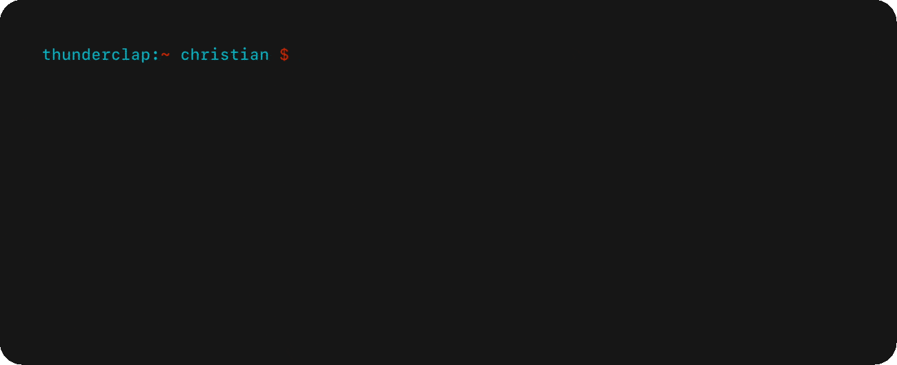
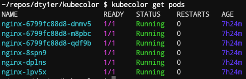

# Go语言爱好者周刊：第 64 期

这里记录每周值得分享的 Go 语言相关内容，周日发布。

本周刊开源（GitHub：[polaris1119/golangweekly](https://github.com/polaris1119/golangweekly)），欢迎投稿，推荐或自荐文章/软件/资源等，请[提交 issue](https://github.com/polaris1119/golangweekly/issues) 。

鉴于大部分人可能没法坚持把英文文章看完，因此，周刊中会尽可能推荐优质的中文文章。优秀的英文文章，我们的 GCTT 组织会进行翻译。



题图：来自 <https://threedots.tech/post/basic-cqrs-in-go/>

## 刊首语

前两天分享了[一个安装和管理 Go 版本的工具 goup](https://mp.weixin.qq.com/s/yTblk9Js1Zcq5aWVcYGjOA)，其中存在的一些问题或需要增强的功能。其中，解决升级到最新版本不能访问的问题，现在可以通过配置如下环境变量实现：

```bash
$ GOUP_GO_HOST=golang.google.cn goup install
```

Go tip 源码改成了从 GitHub 获取，但 tip 的 CL 源还是 googlesource.com，因为 CL googlesource 的概念。

此外也增加了我提到的功能：

- goup ls-ver：列出所有的 Go 版本；
- goup show：显示安装了的 Go 信息；
```bash
$ goup show
| VERSION | ACTIVE |
|---------|--------|
| 1.10.8  |        |
| 1.14.9  |        |
| 1.15.2  |   *    |
|   tip   |        |
```

- goup remove：删除某个 Go 版本；

## 资讯

1、[增加 errors.ErrUnsupported 的提议被接受](https://github.com/golang/go/issues/41198#issuecomment-705078431)

增加这个的提议，是考虑到有时候一些操作对某些平台可能不支持。这时候可以返回这个错误。

2、[Amazon CloudWatch Agent 开源了](https://github.com/aws/amazon-cloudwatch-agent)

默认包含在 Amazon Linux 2 (AL2) 中。AL2 用户可以使用 yum 软件包管理器安装 CloudWatch 代理。您还可以访问 CloudWatch 代理源代码并在 GitHub 中为其开发提供帮助。

3、[ksqlDB Go 客户端 0.0.4 发布](https://github.com/rmoff/ksqldb-go/releases/tag/v0.04)

Kafka 原生 ksqlDB 事件流数据库的客户端。


4、[Go 1.16 可能支持将 []T 转换为 `*[N]T`](https://github.com/golang/go/issues/395) 

可以看 issue 的讨论，这个 issue 可是 2009 年提的。

5、[todocheck 0.3.0 发布](https://github.com/preslavmihaylov/todocheck)

一个带有注释的 TODO 注释的静态代码分析器。

## 文章

1、[你真的懂 string 与 []byte 的转换了吗](https://mp.weixin.qq.com/s/REtrm292mlIwzaYtJrV7bw)

string 类型和 []byte 类型是我们编程时最常使用到的数据结构。本文将探讨两者之间的转换方式，通过分析它们之间的内在联系来拨开迷雾。

2、[谷歌内部 Go 使用案例：核心数据解决方案团队是如何使用 Go 的？](https://mp.weixin.qq.com/s/sgLpRxP_IuVfGE_qd_7lxw)

在这个案例研究中，Google 的核心数据解决方案团队分享了他们的 Go 旅程，包括他们决定在 Go 中重写 web 索引服务，利用 Go 的内置并发性，并观察 Go 如何帮助改进开发过程。

3、[在 iOS 和 Android 上运行 Go 代码](https://mp.weixin.qq.com/s/FDxw7JprV2bMExMopU4kYg)

在本教程中，我们将构建一个简单的 Go 包，您可以从 iOS 应用程序（Swift）和 Android 应用程序（Kotlin）运行该软件包。

4、[Gin实战项目推荐：为静态博客增加评论功能](https://mp.weixin.qq.com/s/TcaxRZ_eImRze2JLKiRFMg)

今天推荐的这个开源项目，是一个 Disqus 的开源替代品。

5、[golang 源码阅读 —— bufio](https://segmentfault.com/a/1190000027087085)

这篇博客将解析 bufio 有关文件读写方面的源代码实现及其常用的方法。

6、[Go 运行时调度器处理系统调用的巧妙方式](https://mp.weixin.qq.com/s/DxycOYH3pNpJFYdf6ESbhA)

一篇短文。

7、[想要 4 个 9？本文告诉你监控告警如何做](https://mp.weixin.qq.com/s/qaNWBlDGgE2hNnu6SV4EBg)

想真正做到上述所说的成熟且规范，业务共建，有难度，需要多方面认同和公司规范支撑才能最佳实现。因此共同认可，求同存异，多做用户反馈分析也非常重要。

8、[终于找到了一款我喜欢的安装和管理 Go 版本的工具](https://mp.weixin.qq.com/s/yTblk9Js1Zcq5aWVcYGjOA)

goup 试试？

9、[观点：Go 尚未准备好用于企业系统，原因在这里](https://mp.weixin.qq.com/s/1-PLiNd0vqhscxWVt9vLyA)

你认同吗？

10、[Golang 函数式编程简述](https://mp.weixin.qq.com/s/x7TyP-M1GF8NZ94exMinCw)

一般而言，Golang 的 Functional 编程都会呈现出恶形。表面上看，恶形是因为 Golang 缺少一些必要的语法糖；本质上说，恶形源于它没有高级抽象能力，正如泛型的缺失。

11、[调试+图解 channel 的内部实现](https://mp.weixin.qq.com/s/01Hl_eOAP_k_YDTNFErTJQ)

调试加图的方式学习 channel。

12、[一文掌握 CGO 处理字符串的问题：写 CGO 必看](https://mp.weixin.qq.com/s/vFThwyQ5LwHir89vqAvimg)

cgo 的大量文档都提到过，它提供了四个用于转换 Go 和 C 类型的字符串的函数，都是通过复制数据来实现。

## 开源项目

1、[mtproto](https://github.com/xelaj/mtproto)

Telegram API 的 Go 实现。

2、[gosoap](https://github.com/tiaguinho/gosoap)

Go soap 操作包。

3、[goconst](https://github.com/jgautheron/goconst)

在 Go 中查找可以被常量替换的重复字符串。

4、[gnomock](https://github.com/orlangure/gnomock)

无需 mock 的 Go 代码测试框架。

5、[sploit](https://github.com/zznop/sploit)

一个帮助二进制分析和开发的库。

6、[bbgo](https://github.com/c9s/bbgo)

用 Go 编写的加密货币交易框架。

7、[bubbletea](https://github.com/charmbracelet/bubbletea)

一个强大的小型 TUI 框架。构建终端应用程序的有趣，实用和有状态的方式。一个基于 Elm 架构的 Go 框架。 Bubble Tea 非常适合于简单和复杂的终端应用程序，无论是嵌入式，全窗口或两者兼而有之。



8、[go-zero](https://github.com/tal-tech/go-zero)

一个集成了各种工程实践的 web 和 rpc 框架。内置强大的goctl工具，极简API语法，一键生成微服务结构代码。

## 资源&&工具

1、[bit](https://github.com/chriswalz/bit)

现代的 Git CLI 工具。试用了下，挺棒！给 Git 带来了一些额外的好东西，包括文件和分支名称自动完成、命令和标志建议，甚至一些新的命令。


2、[Hetty](https://github.com/dstotijn/hetty)

用于安全研究的 HTTP 工具包。具有 Web 接口和代理日志查看器的拦截 HTTP 代理。目标是成为像 Burp Suite Pro 这样的商业软件的开源替代品。

3、[config-parser](https://github.com/haproxytech/config-parser)

[HAProxy](http://www.haproxy.org/) 配置解析。

4、[server](https://github.com/screego/server)

通过浏览器共享开发者屏幕。


5、[glorp](https://github.com/denandz/glorp)

一个可以进行 HTTP 截获与重放代理的 CLI 工具。

6、[播客第 149 期](https://changelog.com/gotime/149)

如何教授 Go 语言。

7、[statsviz](https://github.com/arl/statsviz)

在浏览器中实时查看 Go 应用程序运行时统计信息（GC，MemStats 等）。

8、[gotp](https://github.com/itsmewes/gotp)

一个命令行工具，用于获取，添加和删除 Google Authenticator 样式 2fa 代码。

9、[kubecolor](https://github.com/dty1er/kubecolor)

为你的 kubectl 输出着色。



10、[go-autowire](https://github.com/Just-maple/go-autowire)

使用注解自动生成 wire 依赖注入文件。

## 订阅

这个周刊每周日发布，同步更新在[Go语言中文网](https://studygolang.com/go/weekly)和[微信公众号](https://weixin.sogou.com/weixin?query=Go%E8%AF%AD%E8%A8%80%E4%B8%AD%E6%96%87%E7%BD%91)。

微信搜索"Go语言中文网"或者扫描二维码，即可订阅。


