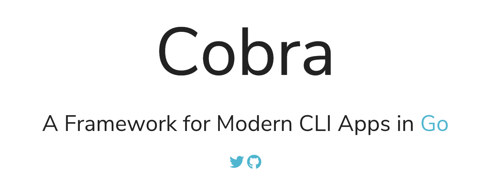

# Go语言爱好者周刊：第 65 期

这里记录每周值得分享的 Go 语言相关内容，周日发布。

本周刊开源（GitHub：[polaris1119/golangweekly](https://github.com/polaris1119/golangweekly)），欢迎投稿，推荐或自荐文章/软件/资源等，请[提交 issue](https://github.com/polaris1119/golangweekly/issues) 。

鉴于大部分人可能没法坚持把英文文章看完，因此，周刊中会尽可能推荐优质的中文文章。优秀的英文文章，我们的 GCTT 组织会进行翻译。



题图：Cobra 和 CLI，你更喜欢哪个？

## 刊首语

微信有群友问我这么一道题：

```go
package main

import (
	"encoding/json"
	"fmt"
)

type AutoGenerated struct {
	Age   int    `json:"age"`
	Name  string `json:"name"`
	Child []int  `json:"child"`
}

func main() {
	jsonStr1 := `{"age": 14,"name": "potter", "child":[1,2,3]}`
	a := AutoGenerated{}
	json.Unmarshal([]byte(jsonStr1), &a)
	aa := a.Child
	fmt.Println(aa)
	jsonStr2 := `{"age": 12,"name": "potter", "child":[3,4,5,7,8,9]}`
	json.Unmarshal([]byte(jsonStr2), &a)
	fmt.Println(aa)
}
```

他看到了网上的解释，想不通。我看了下，他看到的解释是不对的。

你觉得输出是什么呢？

A：[1 2 3]  [1 2 3] ；B：[1 2 3] [3 4 5]； C：[1 2 3] [3 4 5 6 7 8 9]；D：[1 2 3] [3 4 5 0 0 0]

## 资讯

1、[Go1.15.3 和 Go1.14.10 发布](https://mp.weixin.qq.com/s/VnntrjHJLJ02ZTRfK5jFBw)

这是两个小版本，主要修复一些 bug。修复的内容包括 cgo、编译器、runtime、go 命令，以及 bytes、plugin 和 testing 包。

2、[covid-alert-server](https://github.com/cds-snc/covid-alert-server)

加拿大开源的的 COVID（新冠病毒） 警报服务是用 Go 语言编写的。

3、[cobra 1.1 发布](https://github.com/spf13/cobra/releases/tag/v1.1.0)

[Cobra](https://cobra.dev/) 是一个构建现代 CLI APP 的框架。

4、[Fiber 2.1.0 发布](https://github.com/gofiber/fiber/releases/tag/v2.1.0)

一个类似 Node 的 Express.js Web 框架。

5、[SFTPGo 1.1 发布](https://github.com/drakkan/sftpgo)

Go 内置的功能齐全的 SFTP 服务器。现在也提供了可选的 FTP/S 和 WebDAV 支持。

6、[Go 1.16 增加GODEBUG=inittrace=1支持](https://github.com/golang/go/commit/7c58ef732efd9bf0d0882bb95371ce1909924a75)

可以输出各个包初始化（init）的执行时间和内存分配情况。

7、[在线教育的企业都有使用 Go 吗？伴鱼招聘 Go 工程师了，看什么要求](https://mp.weixin.qq.com/s/ICoO5LoKbpjaSQSlCyAPvg)

在线教育使用 Go 的真不少。

## 文章

1、[哦，原来是这么回事：Golang 中的一些常识](https://mp.weixin.qq.com/s/-l9R_QblXr1_JHGtjldoQw)

你知道多少？

2、[Go 切片的一种有趣内存泄漏方式](https://mp.weixin.qq.com/s/NdsnNEpxcTQDX0LffuDzjQ)

写一下该内存泄漏的一种形式，并说明它是如何发生的。

3、[理解真实世界中 Go 的并发 BUG](https://mp.weixin.qq.com/s/EnLxJEoPrASWytmM8jJtmg)

有几个学生研究归纳了go编程中的并发bugs，发表了一篇（英文）论文：《Understanding Real-World Concurrency Bugs in Go》。在此做一个笔记，便于查阅。

4、[Go 中的 Goroutine 和其他并发处理方案的对比](https://mp.weixin.qq.com/s/cO3VERANE-VWhTD4SSclBg)

Go 语言让使用 Goroutine 和通道变得非常有吸引力，作为在 Go 中进行并发的主要方式，它们是被有意识的提出的。

5、[面试官：聊聊 etcd 中的 Raft 吧](https://mp.weixin.qq.com/s/DKVXqeGc0dVnWiHkb1huKg)

近年来比较流行的一个一致性算法。它的原理比较容易理解，本文从工程的角度来讲讲这个算法的一个具体实现，毕竟了解原理只算是“纸上谈兵”，离真正能把它应用起来还有很长一段距离。

6、[你喜欢的 Go 第三方库：一步为系统集成可视化实时运行时统计](https://mp.weixin.qq.com/s/JzXqwmEJ_R8g2QeMYHpc5Q)

掌握系统运行状态，知道系统哪些地方可能存在问题，方便进行优化，这是一个实际系统必备的。裸奔，对系统一无所知，迟早是要出大事的。

7、[Go 二进制文件逆向分析系列文章](https://www.anquanke.com/post/id/214940)

从理论到实战。

8、[关于 runtime.KeepAlive() 你知道多少？](https://mp.weixin.qq.com/s/aF_rhlm8fsT13vS85tSZvQ)

我在看 go101 网站的 类型不安全指针一文时，偶然发现了 runtime 库的一个有趣的新方法 runtime.KeepAlive() 的一个用法。刚开始我对于怎么使用它是很困惑的， 那么按我的性格肯定要探究它是怎么工作的。

## 开源项目

1、[Gohalt: 通用节流库](https://github.com/1pkg/gohalt)

可以使用它来构建节流管道，速率限制器等。

2、[go-password-validator](https://github.com/lane-c-wagner/go-password-validator)

密码强度校验器。可用于前置密码强度计算，或仅在服务器上验证密码强度。

3、[Simple Go Workers](https://github.com/catmullet/go-workers)

安全地并发运行一组 worker，通过 channel 进行输入输出。


4、[sendgrid-go](https://github.com/sendgrid/sendgrid-go)

官方的 SendGrid 主导、社区驱动的 Go API 库。sendgrid 是一个电子邮件服务。

5、[xurls](https://github.com/mvdan/xurls)

从文本中提取 URL。

6、[lossy](https://github.com/cevatbarisyilmaz/lossy)

模拟 net.PacketConn 和 net.Conn 接口的带宽，延迟和数据包丢失。它的主要用途是测试应用程序的健壮性，以及在不可靠的传输协议（例如 UDP 或 IP）上运行的网络协议。作为附带好处，它还可以用作出站带宽限制器。

7、[eggos](https://github.com/icexin/eggos)

一个运行在 x86 裸机上的 go unikernel。

8、[kyverno](https://github.com/kyverno/kyverno)

Kubernetes 原生策略管理。

9、[coyim](https://github.com/coyim/coyim)

用 Go 实现安全可靠的聊天客户端。

10、[machine](https://github.com/autom8ter/machine)

受 errgroup.Group 启发的扩展实现。

## 资源&&工具

1、[benthos](https://github.com/Jeffail/benthos)

Go 编写的普通任务的流处理器。

2、[博客第 148 期](https://changelog.com/gotime/148)

前 Go 团队核心成员、http 库的设计和实现者 Brad Fitzpatrick 专访。

3、[rnm](https://github.com/raviqqe/rnm)

Go 编写的代码重构辅助工具（facebook/codemod 启发）。 

4、[Go 相关直播信息汇总](https://github.com/golang/go/wiki/LiveStreams)

官方整理。

5、[boundary](https://github.com/hashicorp/boundary)

hashicorp 开源，一款简单的主机/服务远程安全访问工具。

6、[waypoint](https://github.com/hashicorp/waypoint)

Hashicorp 开源，一款用于在任何平台上构建，部署和发布任何应用程序的工具。

7、[油管视频](https://www.youtube.com/watch?v=5DVV36uqQ4E)

那些你可能从来没用过的 Go 特性。

8、[temporal](https://github.com/temporalio/temporal/)

一个微服务编排平台。

## 订阅

这个周刊每周日发布，同步更新在[Go语言中文网](https://studygolang.com/go/weekly)和[微信公众号](https://weixin.sogou.com/weixin?query=Go%E8%AF%AD%E8%A8%80%E4%B8%AD%E6%96%87%E7%BD%91)。

微信搜索"Go语言中文网"或者扫描二维码，即可订阅。


