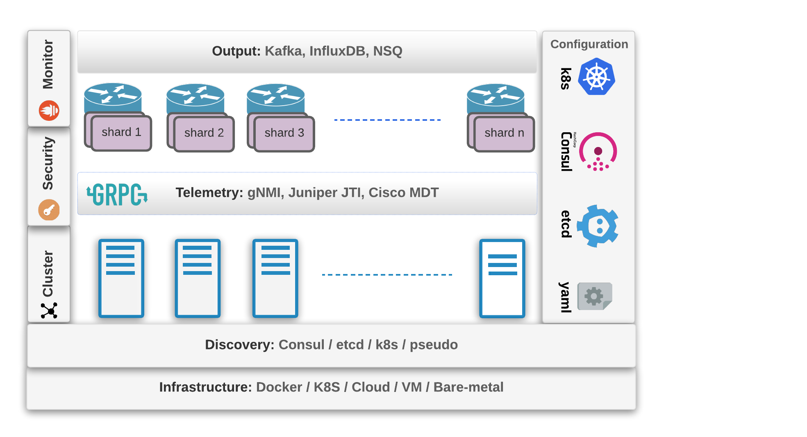
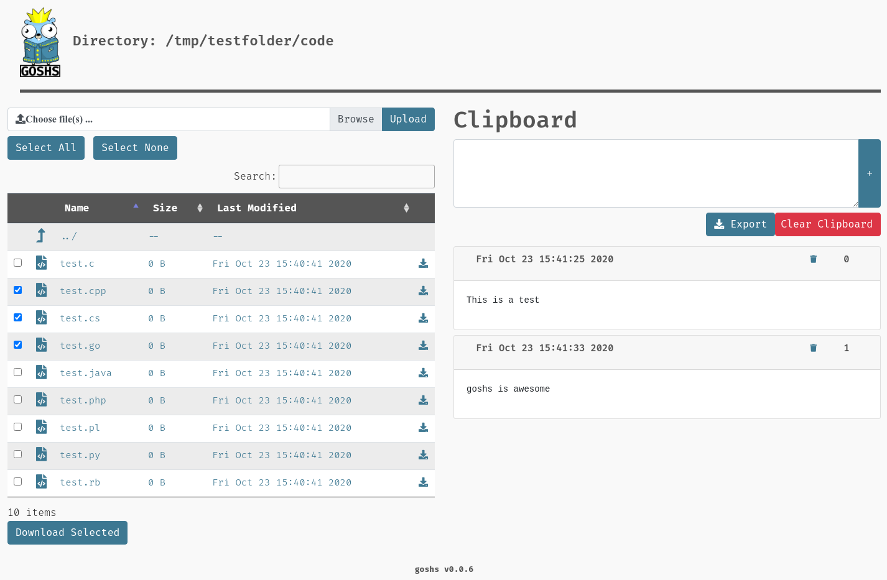

# Go语言爱好者周刊：第 66 期

这里记录每周值得分享的 Go 语言相关内容，周日发布。

本周刊开源（GitHub：[polaris1119/golangweekly](https://github.com/polaris1119/golangweekly)），欢迎投稿，推荐或自荐文章/软件/资源等，请[提交 issue](https://github.com/polaris1119/golangweekly/issues) 。

鉴于大部分人可能没法坚持把英文文章看完，因此，周刊中会尽可能推荐优质的中文文章。优秀的英文文章，我们的 GCTT 组织会进行翻译。


题图：plenti，又一个 Go 语言实现的静态网站生成器。

## 刊首语

昨天是 1024，大家没有加班吧！

今天这道题，你看看输出啥？

```go
package main

import "fmt"

type T struct {
	x int
}

func (t T) String() string { return "boo" }

func main() {
	t := T{123}
	fmt.Printf("%v\n", t)
	fmt.Printf("%#v\n", t)
}
```

A：{123}  main.T{x:123}    B：{123}  T{x:123}    C：boo boo    D：boo  main.T{x:123}

## 资讯

1、[为 Go 尽一份力的时候到了：Go 官方 2020 年开发者调查开启](https://mp.weixin.qq.com/s/A5UZ_DfNmfOBhF-Z9Mlv8w)

Go 项目组正在研究人们关于 Go 的经验和想法。您的反馈将帮助他们改进现有工具，并确定新功能的优先级，确保所有 Go 开发人员获得更好的体验。一旦调查结束，他们将与 Go 社区公开分享汇总的结果。

2、[validating 2.0 发布](https://github.com/RussellLuo/validating)

Go 库，用于验证结构，map 和切片。带有各种各样的验证器工厂（它们生成实际的验证），包括相等性，范围，包含在一组值中，长度等。

3、[gomodifytags 1.11.0 发布](https://github.com/fatih/gomodifytags)

这个工具你日常工作可能一直在用，只是不知道是它干的。如果要在结构字段中编辑，更新或添加标签，则使工作变得更轻松。与 Vim，Atom，Emacs 和 VS Code 集成。

4、[collection v1.3.1 升级记录](https://mp.weixin.qq.com/s/6_PmluLCnUQViQvb78s6VA)

一个让业务开发效率提高 10 倍的 Go 库。

## 文章

1、[卧槽！一道关于 json 和 slice 的题难倒了 80% 的人](https://mp.weixin.qq.com/s/_tebMLWLN68Zv47cYTv3Hg)

这是上期周刊的问题解答。

2、[对比三款 Go Playground：你喜欢哪款？](https://mp.weixin.qq.com/s/b5_DjIRCHZ5RRNMyY8EMqg)

官方的弱爆了。。。

3、[golang 拾遗：指针和接口](https://mp.weixin.qq.com/s/J_eW_O8AP-on_0DAJ6P1sw)

拾遗主要是收集和 golang 相关的琐碎知识。

4、[6 张图看懂特殊的 Goroutine：g0](https://mp.weixin.qq.com/s/z-Uv5bf78aHMW_nFOJgBbw)

在 Go 中创建的所有 Goroutine 都会被一个内部的调度器所管理。Go 调度器尝试为所有的 Goroutine 分配运行时间，并且在当前的 Goroutine 阻塞或者终止的时候，Go 调度器会通过运行 Goroutine 的方式使所有 CPU 保持忙碌状态。这个调度器实际上是作为一个特殊的 Goroutine 运行的。

5、[分析字节跳动高级 Go 工程师的要求，知晓自己的努力方向](https://mp.weixin.qq.com/s/VHan8uS_THs0FAMBXJs-6g)

来自一个 Go 招聘的公公众号。专门分享 Go 求职招聘等。

6、[何时使用 Rust 和何时使用 Golang？](https://mp.weixin.qq.com/s/9-LjCy-sCdWBoamLfzmagg)

在本教程中，我们将就 Golang 和 Rust 进行比较和对比，评估这两种编程语言的性能，并发性，内存管理和整体开发人员体验。我们还将概述这些元素，以帮助您一目了然地为项目选择正确的语言。

7、[Go 已经开始大爆发了 ？专注于 Go 职场、招聘和求职](https://mp.weixin.qq.com/s/p7fdcqCLVfB3CdRdoaT21Q)

Go 圈的朋友应该能发现，这两年 Go 受到越来越多的关注。我们不提跟国外，只看国内。去年年底，鹅厂公布了他们使用的 Top 语言，其中 Go 排在了第三位。据内部人士透露，今年有望进入第二。大厂大量使用 Go，这是一个很好信号。

8、[面试官：知道 MVCC 吗？ 在 etcd 中的如何实现的](https://mp.weixin.qq.com/s/mW4juWcLbkcJ7aoHbXNbQA)

在数据库领域，面对高并发环境下数据冲突的问题，业界常用的解决方案有两种：避免冲突和允许冲突。

9、[Go 语言 select 语句中实现优先级](https://mp.weixin.qq.com/s/3NqPViFwIJbSeL1hrwajTw)

Go 语言中的 select 语句用于监控并选择一组 case 语句执行相应的代码。

10、[time.Sleep(1) 后发生了什么](https://mp.weixin.qq.com/s/oz9RW1pWSCJsZBn0UtlXxA)

time.Sleep 内部代码实现大有文章，每个 Go 版本的 timer 的实现都有所不同，本文基于 Go1.14，分别从宏观和围观介绍一遍主要调度过程。

## 开源项目

1、[hc](https://github.com/brutella/hc)

一个轻量级的框架，用于在 Go 中开发 HomeKit 配件。HomeKit 是 Apple 的框架，用于管理 Apple 设备中的“智能家居”设备，您可以使用 HomeKit 附件协议（HAP）来为您选择的硬件创建 HomeKit 桥。

2、[systray](https://github.com/getlantern/systray)

一个跨平台的 Go 库，用于在通知区域中放置图标和菜单。


3、[Crowdsec](https://github.com/crowdsecurity/crowdsec)

开源的轻量级代理，可检测并响应不良行为。它还会自动受益于我们全球社区范围内的 IP 信誉数据库。

4、[scany](https://github.com/georgysavva/scany)

Go 实现的用于将数据从数据库扫描到 Go 结构的库。

5、[gobot](https://github.com/hybridgroup/gobot)

使用 Go 编程语言的 IOT 框架。

6、[gweb](https://github.com/life4/gweb)

用纯 Go 编写并编译成 WASM 的浏览器游戏库。

7、[bluge](https://github.com/blugelabs/bluge)

Go 实现的文本索引库。

8、[bot2048](https://github.com/lunatikub/bot2048)

2048游戏机器人玩家。Go 语言实现。对算法感兴趣的可以看该文：<https://thomas-joly.com/bot-2048-create-an-artificial-player/>。

## 资源&&工具

1、[verless](https://github.com/verless/verless)

一个简单、轻量级静态网站生成器。轮子有点多。这里还有一个 [plenti](https://github.com/plentico/plenti)，这个感觉比 verless 更正规？

2、[Chronos](https://github.com/amit-davidson/Chronos)

用于 Go 语言的静态竞争检测器。作者建议和 go race 结合使用。

3、 [gof](https://github.com/qiualiang/gof)

GoF 23 种设计模式的 Go 实现。

4、[panoptes-stream](https://github.com/yahoo/panoptes-stream)

yahoo 开源的云原生分布式流网络遥测工具。



5、[cassler](https://github.com/msfidelis/cassler)

SSL 证书验证工具 cassler。

6、[repull](https://github.com/jdevelop/repull)

使用较新版本的镜像重新启动 Docker 容器的工具。

7、[3d-gopher-maze](https://github.com/necrophonic/3d-gopher-maze)

基于终端的简单 3D 迷宫爬行游戏。

8、[dnsping](https://github.com/fortio/dnsping)

检查 DNS 服务器的数据包丢失和延迟问题。

9、[goshs](https://github.com/patrickhener/goshs)

Go 语言编写，替代 Python 的 SimpleHTTPServer，具有许多功能和出色的设计。



10、[pixlet](https://github.com/tidbyt/pixlet)

为基于像素的显示器构建应用程序。


## 订阅

这个周刊每周日发布，同步更新在[Go语言中文网](https://studygolang.com/go/weekly)和[微信公众号](https://weixin.sogou.com/weixin?query=Go%E8%AF%AD%E8%A8%80%E4%B8%AD%E6%96%87%E7%BD%91)。

微信搜索"Go语言中文网"或者扫描二维码，即可订阅。


