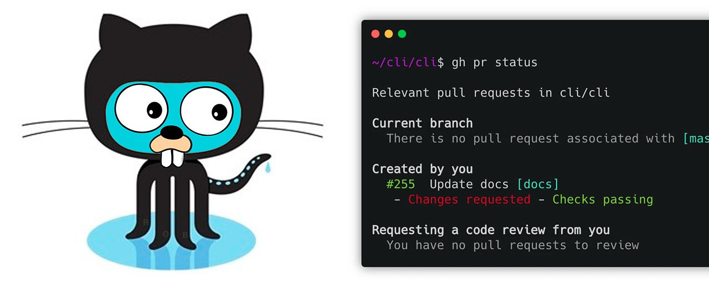
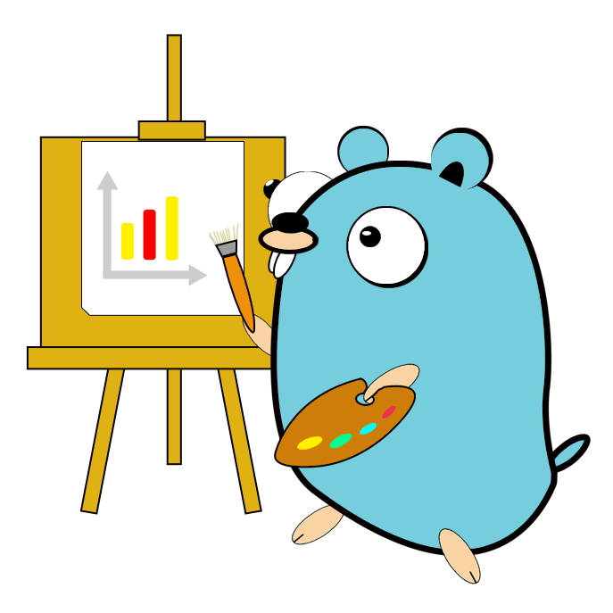
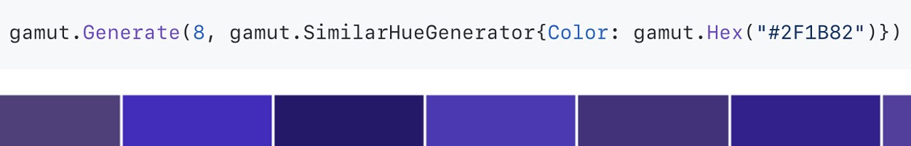
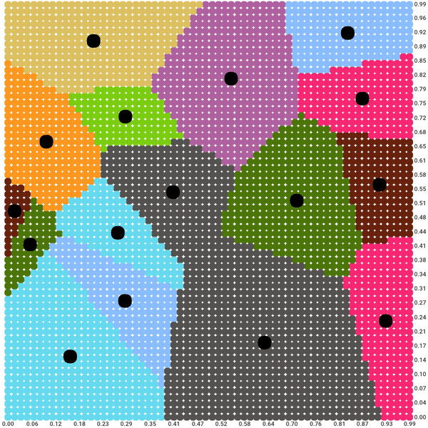
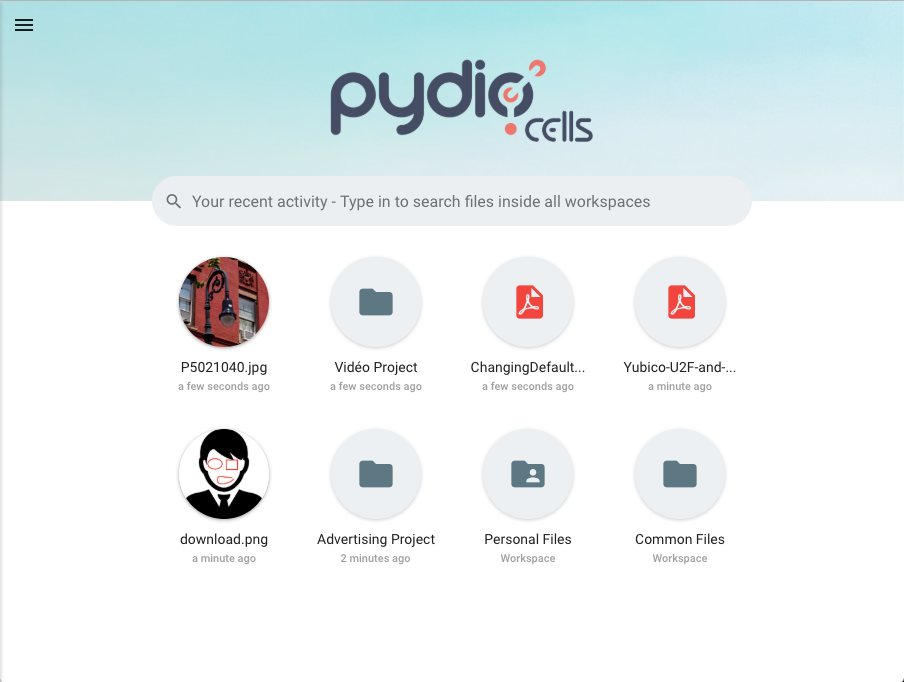

# Go语言爱好者周刊：第 67 期

这里记录每周值得分享的 Go 语言相关内容，周日发布。

本周刊开源（GitHub：[polaris1119/golangweekly](https://github.com/polaris1119/golangweekly)），欢迎投稿，推荐或自荐文章/软件/资源等，请[提交 issue](https://github.com/polaris1119/golangweekly/issues) 。

鉴于大部分人可能没法坚持把英文文章看完，因此，周刊中会尽可能推荐优质的中文文章。优秀的英文文章，我们的 GCTT 组织会进行翻译。

题图：GitHub 的 gh 和 cli

## 刊首语

由于 Go 1.16 冻结即将到来，因此现在是开始使用 gotip 构建和测试代码的好时机，请帮助 Go 团队找到 1.16 的 Bug 吧。

## 资讯

1、[官方支持内嵌资源文件已提交了实现代码](https://github.com/golang/go/commit/25d28ec55aded46e0be9c2298f24287d296a9e47)

这只是目前 Go 的实现，但最终 Go 1.16 的版本中可能会有其他增强。

2、[Ebiten 2.0 发布：Go 中轻松的 2D 游戏开发](https://ebiten.org/blog/v2.0.0.html)

最近似乎很流行，该版本没有新功能，但是一些重大更改要求版本号升级。尽管如此，Ebiten 仍然是值得一试的出色工作（特别是如果您想参加下个月的 [GitHub Game Off](https://github.blog/2020-10-27-github-game-off-2020/)）。

3、[vscode-go 0.18.0 发布](https://github.com/golang/vscode-go/releases/tag/v0.18.0)

统一Go状态用户界面，调试器的许多功能改进以及 LSP 3.16 的功能。

4、[gopls 0.5.2 发布](https://github.com/golang/tools/releases/tag/gopls%2Fv0.5.2)

没有什么大的新功能，但添加了 allExperiments 设置以选择加入随着时间推移而添加的实验功能。

5、[go-imap 1.0.6 发布](https://github.com/emersion/go-imap)

用于客户端和服务器的 IMAP4 库。

6、[Hugo 0.77.0 发布](https://gohugo.io/news/0.77.0-relnotes/)

这是一个很小但有用的版本。

7、[pkg.go.dev 新页面设计预览](https://beta.pkg.go.dev/net/http)

页面改了，不知道设计改了没？有空了解下。

## 文章

1、[闲聊极客时间的直播：现场翻车了？](https://mp.weixin.qq.com/s/MKAS-fa24e6TMVWoannaZA)

聊聊 10 月 25 日极客时间进行了一场直播，主题是：《未来 5 年将是 Go 语言的天下》。

2、[一篇理解什么是CanSet, CanAddr？](https://mp.weixin.qq.com/s/e0AZ21i0hYejlI7U0CcMIA)

反射库中的函数。

3、[使用 timeout、deadline 和 context 取消参数使 Go net/http 服务更灵活](https://mp.weixin.qq.com/s/bQQg6659HRNYdCFsi6yqjQ)

看看超时和它们是如何影响我们的 net/http 服务的。

4、[Go 监控的标配：实战 Prometheus](https://mp.weixin.qq.com/s/gXT3fWuj36EfIfFSXUuqpA)

最近手头的项目开始从 PHP，Lua 迁移到 Golang，心想正好趁此机会夯实监控，提到 Golang 的监控，不得不说 prometheus 已经是标配。

5、[有意思！Go 源代码中的那些秘密：为什么 time.minWall 是 1885？](https://mp.weixin.qq.com/s/C12gSO4jkBU5RlpPACkppg)

程序员好奇心真的可以。

6、[这个调查显示 Go 竟然是 2020 年最受欢迎的编程语言](https://mp.weixin.qq.com/s/WcvMcDRqZiygwMaFEYjGmQ)

今天看到一个 2020 年开发者调查报告，看到了 Go 的前景，忍不住想跟大家分享一下。

7、[AI 和 数据科学领域，Go 语言可能很快会取代 Python。最后的原因有点迷](https://mp.weixin.qq.com/s/NfyQSqJ1LAPFk2mUH_44bQ)

真的很迷。

8、[面试题：这道 reslice 的题 简单，但原理你知晓吗？](https://mp.weixin.qq.com/s/nUtNba22WKruf_vEh2Biuw)

很常见的题，但原理分析可能没想过。

9、[知乎社区核心业务 Golang 化实践](https://mp.weixin.qq.com/s/10BBSbuk1mn3QC5AgI5sWA)

过程值得学习。

10、[你真的了解 sync.Once 吗](https://mp.weixin.qq.com/s/-oNl_z0GURjD5bv86V6nVQ)

它是一个对象，它提供了保证某个动作只被执行一次的功能。最典型的场景当然就是单例对象的初始化操作。

## 开源项目

1、[go-echarts](https://github.com/go-echarts/go-echarts)

Golang 可爱的图表库。想将条形图，线形图，饼图或其他图表放在一起吗？该库能实现。

2、[aceptadora](https://github.com/cabify/aceptadora)

Aceptadora 提供样板来协调容器以进行验收测试。

3、[gamut](https://github.com/muesli/gamut)

生成和管理调色板和 scheme。

4、[dowork](https://git.sr.ht/~sircmpwn/dowork)

dowork 是 Go 程序的通用任务排队系统。它在 Goroutine 中对任务进行排队，执行和重新计划。

5、[soup](https://github.com/anaskhan96/soup)

Go 的 Web 爬虫工具，类似于 Python 的 [BeautifulSoup](https://www.crummy.com/software/BeautifulSoup/bs4/doc/)。

6、[harmony](https://github.com/skwair/harmony)

Harmony 是用于与 Discord API 进行交互的 Go 模块。

7、[kmeans](https://github.com/muesli/kmeans)

用 Go 编写的 k 均值聚类算法实现。

8、[dagger](https://github.com/autom8ter/dagger)

一种快速，并发安全，可变的，基于内存的有向图实现。

9、 [jwt]( https://github.com/kataras/jwt)

高性能 go jwt 实现。

10、[holmes](https://github.com/mosn/holmes) 

程序抖动问题定位库。

11、[cells](https://github.com/pydio/cells)

面向未来的内容写作平台。Pydio Cells 是组织的下一代文件共享平台。它遵循微服务体系结构，使用 Go 语言完全重写了 Pydio 项目。

12、[nano](https://github.com/lonng/nano)

轻便，高性能，基于 golang 的高性能游戏服务器框架。

13、[progress-go](https://github.com/vardius/progress-go)

Go 简单的进度条库。

14、[rod](https://github.com/go-rod/rod)

Go 实现浏览器审查工具驱动。

## 资源&&工具

1、[Go Time 153 期](https://changelog.com/gotime/153)

讨论 GitHub 的 Go-Powered CLI。在这期，讨论了 Mislav 构建两个 Github CLI（hub 和 gh）的经验。我们会遇到以下问题：“是什么导致决定完全用 Go 重写 CLI？”，“如何测试CLI，尤其是在过渡期间？”和“正在使用什么 Go 库来构建 CLI？ ”。

2、[go-ora](https://github.com/sijms/go-ora)

纯 Go 的 Oracle  客户端。

3、[simple-deflicker](https://github.com/StruffelProductions/simple-deflicker)

轻巧易用的工具，可对图像序列进行抖动处理。

4、[thola](https://github.com/inexio/thola)

一款 Go 实现的监控和设置网络设备的工具。

5、[Go Time 第 151 期](https://changelog.com/gotime/151)

向你的团队介绍 Go。

6、[tempo](https://github.com/grafana/tempo)

一个开放源代码，易于使用的大规模分布式跟踪后端。

7、[GoWest 2020 大会全集](https://www.youtube.com/playlist?list=PLYTHA7h-zVD1OI47lYQDv5Pm03zH30uRE)

油管视频，英文的。

8、[weaver](https://github.com/grantseltzer/weaver)

使用 uprobes 和 eBPF 跟踪 Go 应用。

9、[go-wasm](https://github.com/JohnStarich/go-wasm)

用于 Go 的浏览器内置 IDE，即使用 WASM 实现 Go 在线编译。在线地址：<https://go-wasm.johnstarich.com/>。

10、[fyne-theme-generator](https://github.com/lusingander/fyne-theme-generator)

Fyne 的所见即所得的主题编辑器。Fyne 要发新版本了，官方主页也改的好看多了。

11、[earthly](https://github.com/earthly/earthly)

为容器时代构建自动化。

12、[gitjacker](https://github.com/liamg/gitjacker)

来自配置错误的网站的 Git 仓库泄漏。

13、[免费的 Go 并发编程视频教程](https://hakin9.org/concurrency-in-golang-demonstration-free-course-video/)

不过是英文的。

## 订阅

这个周刊每周日发布，同步更新在[Go语言中文网](https://studygolang.com/go/weekly)和[微信公众号](https://weixin.sogou.com/weixin?query=Go%E8%AF%AD%E8%A8%80%E4%B8%AD%E6%96%87%E7%BD%91)。

微信搜索"Go语言中文网"或者扫描二维码，即可订阅。

