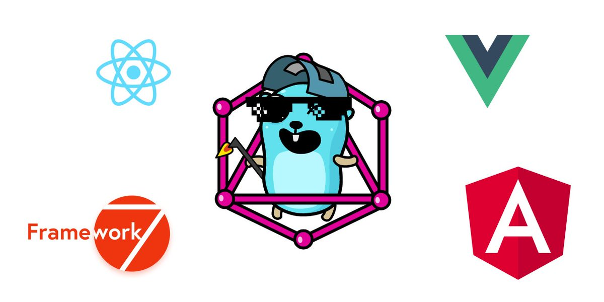
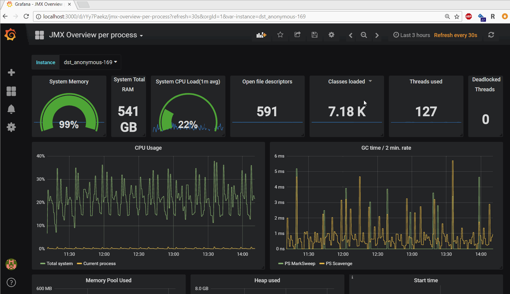
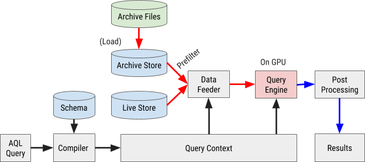
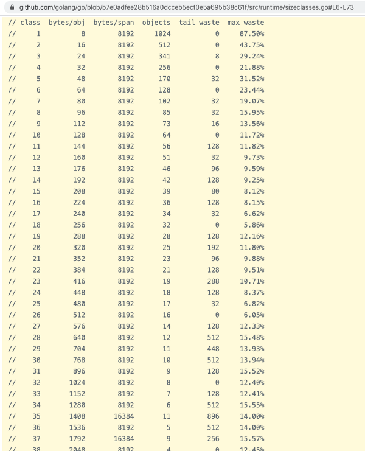

# Go语言爱好者周刊：第 68 期

这里记录每周值得分享的 Go 语言相关内容，周日发布。

本周刊开源（GitHub：[polaris1119/golangweekly](https://github.com/polaris1119/golangweekly)），欢迎投稿，推荐或自荐文章/软件/资源等，请[提交 issue](https://github.com/polaris1119/golangweekly/issues) 。

鉴于大部分人可能没法坚持把英文文章看完，因此，周刊中会尽可能推荐优质的中文文章。优秀的英文文章，我们的 GCTT 组织会进行翻译。



题图：<https://github.com/guark/guark>，使用 Go 构建超棒的桌面应用

## 刊首语

Go 1.16（还未发布）编译的文件比 1.15 小了，有人利用 VictoriaMetrics 做了测试。

```bash
$ ls -lGg --si bin/
total 34M
-rwxr-xr-x 1 19M Nov  7 01:19 victoria-metrics-go1.15.4
-rwxr-xr-x 1 16M Nov  7 01:21 victoria-metrics-go-tip
```

这期看一道关于 IEEE-754 浮点数的题，以下代码输出什么？（题目来自 Go101）

```go
package main

import "math"

func main() {
	a, b, c := 2.0, 1.0, 0.0
	x, y := a/c, b/c     // infinity
	n := math.NaN()      // not a number
	m := math.Sqrt(-1.0) // not a number
	println(x == y, m == n)
}
```

A：true true；B：true false；C：false false；D：false true

## 资讯

1、[Micro 3.0.0 发布](https://github.com/micro/micro)

云原生微服务开发平台，相比之前有特别大的变化。

2、[Go1.15.4 和 Go1.14.11 发布](https://mp.weixin.qq.com/s/KwsyQ65C6rEM2EHVJoSz8Q)

小版本发布，修复一些 bug。

3、[怎么看待脉脉上有美团员工说用 Go 的简历基本不看？](https://mp.weixin.qq.com/s/xavYDlcdVIcqDrgKZDJ-LQ)

只是个人的言论吧。

4、[tbls 1.44.0 发布](https://github.com/k1LoW/tbls)

用于记录数据库文档的 CI 友好工具。

5、[GoLand 2020.3 EAP＃7](https://blog.jetbrains.com/go/2020/11/06/goland-2020-3-eap-7/)

支持类型参数中的方括号。欢迎试用提建议。

## 文章

1、[提前试用将在 Go1.16 中发布的内嵌静态资源功能](https://mp.weixin.qq.com/s/SiCTV7R2wA_I2nCQkC3GGQ)

2020 年 10 月 30 日，Russ Cox 提交了最终的实现，意味着你在 tip 版本可以试用该功能了。Go1.16 版本会包含该功能。欢迎大家试用，反馈建议。

2、[图解：宏观角度看 Go 语言如何实现垃圾回收中的 Stop the World](https://mp.weixin.qq.com/s/rt4lxGwaYo8IkTdmo186Cg)

本篇文章讨论实现原理基于 Go 1.13。

3、[go-zero 是如何追踪你的请求链路的](https://studygolang.com/articles/31415)

微服务架构中，调用链可能很漫长，从 http 到 rpc ，又从 rpc 到 http 。而开发者想了解每个环节的调用情况及性能，最佳方案就是 全链路跟踪。

4、[来自 HackerNew 的讨论：人生苦短，我要换Go！](https://mp.weixin.qq.com/s/fbkqesbvcTF_A3B54ZQgYg)

Python 爱好者换 Go？

5、[从来没有这么强烈想推荐一个工具](https://mp.weixin.qq.com/s/w0_cur6qrwlcmplDoD1a4w)

这个工具值得大家一试。

6、[Go 中的循环是如何转为汇编的？看完你懂了吗？](https://mp.weixin.qq.com/s/unriXjXaexHVFPu8-hR9Pw)

看懂需要一定的功力。

7、[那些迷人的 Go 命令行工具](https://mp.weixin.qq.com/s/W1cm2VJH2ai4XDgkY983IQ)

Glow，Charm 主打的产品。

8、[Go 切片传递的隐藏危机](https://mp.weixin.qq.com/s/VVB1-7DcaYmbcppK7gDx_A)

切片底层不就是指针指向底层数组数据吗，为何不直接传递切片，两者有什么区别？

9、[Go 是如何确保内存安全的？](https://mp.weixin.qq.com/s/tLqaplgZZU0R_XgwMDzKSg)

Go 的一系列内存管理手段（内存分配，垃圾回收，内存访问检查）使许多开发者的开发工作变得很轻松。编译器通过在代码中引入“边界检查” 来确保安全地访问内存。

10、[如何调试 Go mod 的各种异常](https://mp.weixin.qq.com/s/eC1l1BKtQDSd1Z3uR5Q8-w)

本文记录了一些我的踩坑经验，希望能给还在挣扎中的 Gopher 一些帮助。

## 开源项目

1、[limiter](https://github.com/ulule/limiter)

Rate Limit 中间件，支持 HTTP、FastHTTP，Gin、Echo 等框架。

2、[go-sqlbuilder](https://github.com/huandu/go-sqlbuilder)

灵活而强大的 SQL 字符串构建器库以及零配置 ORM。

3、[scan](https://github.com/blockloop/scan)

直接将 database/sql 行扫描到结构体、slice 和基本类型。

4、[gosivy](https://github.com/nakabonne/gosivy)

实时图形化展示 Go 进程度量数据。

5、[paketo-buildpacks/go](https://github.com/paketo-buildpacks/go)

Go 云原生构建包。

6、[gogm](https://github.com/mindstand/gogm)

用于 Neo4j 的 Golang 对象图映射器。

7、[carbon](https://github.com/golang-module/carbon)

用于日期时间的简单，语义化且对开发人员友好的 golang 软件包。

8、[goyave-template](https://github.com/System-Glitch/goyave-template)

优雅的 Web 框架 goyave 模板项目。

9、[qs](https://github.com/sonh/qs)

用于将结构体编码为 URL 查询参数的库。

10、[webbrowser](https://github.com/toqueteos/webbrowser)

Go 中的 Python 网络浏览器。用于在默认浏览器上打开网页的简单 API。

## 资源&&工具

1、[imgcat](https://github.com/trashhalo/imgcat)

在终端上将图像输出为 RGB ANSI 图形的工具。

2、https://github.com/pterm/pterm

一个现代化的 Go 模块，用于美化控制台输出。具有图表、进度条、表格、树等，完全可配置且 100% 跨平台兼容。

3、[goxygen](https://github.com/Shpota/goxygen)

使用 Go, Angular, React 或 Vue 快速开发现代 Web 项目。这是在原来的基础上做了改进。

4、[kubei](https://github.com/Portshift/Kubei)

k8s 集群中镜像的即时漏洞扫码工具。

5、[Go 学习知识地图 2020](https://github.com/sangam14/GopherLabs)

和之前版本没区别？

6、[博客第 154 期](https://changelog.com/gotime/154)

Go 语言是如何帮助拯救美国医保网站的。

7、[reporter](https://github.com/IzakMarais/reporter)

从 Grafana 仪表板生成 PDF 报告的服务。



8、[aresdb](https://github.com/uber/aresdb)

由 GPU 驱动的实时分析存储和查询引擎。Uber 出品。



9、[structslop](https://github.com/orijtech/structslop)

Go 的静态分析器，建议对结构字段进行重新布置以提供最大的空间/分配效率。这里有一篇介绍文章：<https://medium.com/orijtech-developers/efficient-struct-packing-guided-pass-for-go-92255872ec72>。



10、[Ruleguard by example](https://go-ruleguard.github.io/by-example/)

它通过有意义的示例介绍了大多数功能和概念。

## 订阅

这个周刊每周日发布，同步更新在[Go语言中文网](https://studygolang.com/go/weekly)和[微信公众号](https://weixin.sogou.com/weixin?query=Go%E8%AF%AD%E8%A8%80%E4%B8%AD%E6%96%87%E7%BD%91)。

微信搜索"Go语言中文网"或者扫描二维码，即可订阅。


