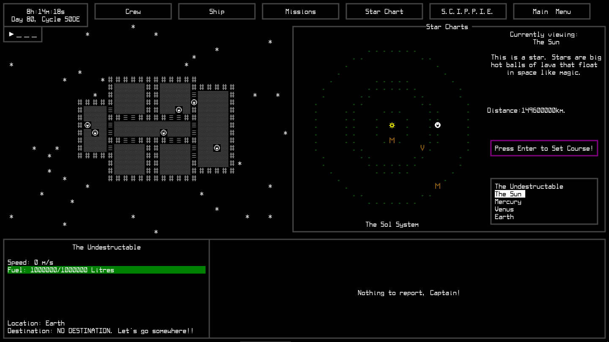
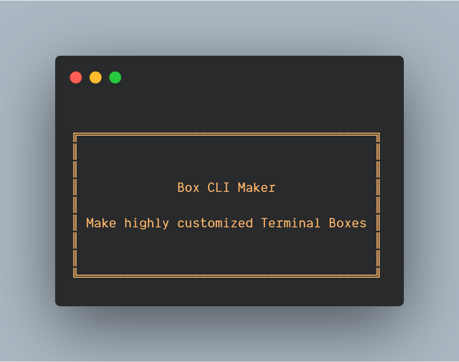
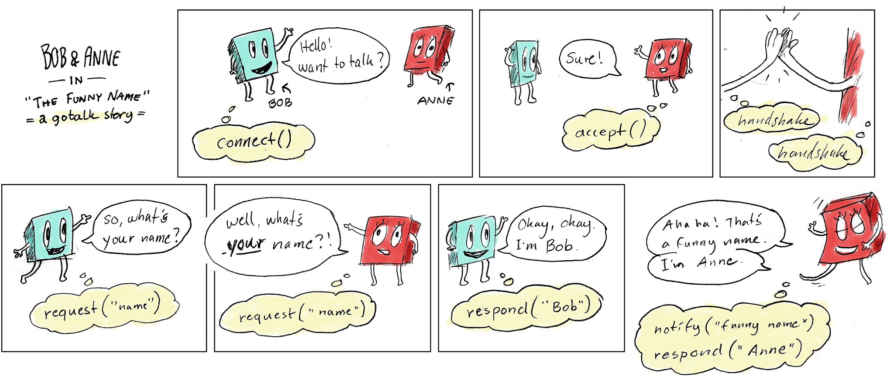
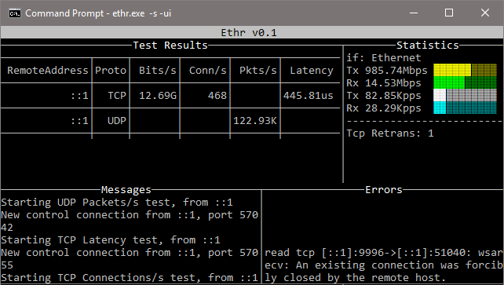

# Go语言爱好者周刊：第 71 期

这里记录每周值得分享的 Go 语言相关内容，周日发布。

本周刊开源（GitHub：[polaris1119/golangweekly](https://github.com/polaris1119/golangweekly)），欢迎投稿，推荐或自荐文章/软件/资源等，请[提交 issue](https://github.com/polaris1119/golangweekly/issues) 。

鉴于大部分人可能没法坚持把英文文章看完，因此，周刊中会尽可能推荐优质的中文文章。优秀的英文文章，我们的 GCTT 组织会进行翻译。



题图：一个宇宙飞船模拟游戏 <https://github.com/BenNicholls/spaceshippers>

## 刊首语

看到一道题，挺有意思。以下代码能否通过编译？

```go
package main

import (
	"fmt"
)

type worker interface {
	work()
}

type person struct {
	name string
	worker
}

func main() {
	var w worker = person{}
	fmt.Println(w)
}
```

A: 能；B: 不能；C: 不知道

## 资讯

1、[Go SYSTEMS CONF SF 会议](https://systemsconf.io/)

2020 年 12 月 03 日举行。Go Systems Conf SF 是一个免费的在线 Go 会议，将于下周举行，关注构建和可扩展 Go 系统。来自 Monzo、VMware 和 DigitalOcean 等公司的优秀演讲者阵容。该会议中 PingCAP 的 CTO 黄东旭也是演讲者。

2、[vscode-go 0.19.0 发布](https://github.com/golang/vscode-go/releases/tag/v0.19.0)

GitHub-Actions 自动发布的说明。

3、[olric 0.3.0 发布](https://github.com/buraksezer/olric)

分布式缓存和内存键/值数据存储。它既可以用作嵌入式 Go 库，也可以用作独立于语言的服务。

4、[GoLand 2020.3 RC 发布](https://blog.jetbrains.com/go/2020/11/27/goland-2020-3-rc-now-available/)

离正式版不远了。

5、[Hugo 0.79.0 发布](https://gohugo.io/news/0.79.0-relnotes/)

小版本，但有用。

6、[go-zero 1.0.29 发布](https://github.com/tal-tech/go-zero)

goctl 增加了一些功能。

## 文章

1、[CNCF 刚宣布 etcd 正式毕业：赶紧实战下 etcd 的服务发现](https://mp.weixin.qq.com/s/44duJY9BSS3Ki07jt4pgOA)

在云原生的时代，服务发现已经是必不可少的功能，我借着最近迁移 gRPC 服务的机会尝试了一下如何用 etcd 实现服务发现，期间遇到诸多问题，本文逐一记之。

2、[一文搞懂 Go 语言中的切片排序](https://mp.weixin.qq.com/s/Iv5AZcbD_ubEyWC4jyp9eQ)

切片是Go语言中引入的用于在大多数场合替代数组的语法元素。切片是长度可变的同类型元素序列，它不支持存储不同类型的元素，当然如果你非用sl := []interface{}{"hello", 11,  3.14}来抬杠^_^，那就另当别论。

3、[重度使用 Go 的“后遗症“，你有吗？](https://mp.weixin.qq.com/s/S12_Nf29iHgkovGRZNXRDA)

很多人可能会有。

4、[实战：150 行 Go 实现高性能 socks5 代理](https://mp.weixin.qq.com/s/WjRRCU3xKvDRKgru9dZ7hg)

光说不练假把式，不如上手试试，这篇来写个有点卵用的东西。

5、[基于 Golang 语言的微服务熔断器](https://mp.weixin.qq.com/s/pNVeAPIYQDW2JJ82xu95Kg)

从单体服务拆分到微服务过程中，原来模块间交互逐渐抽离成远程调用，可能 http，rpc，tcp 等等，那么这些模块在调用中一定存在某种依赖关系。

6、[Blackrota, 一个 Go 开发的高度混淆的后门](https://blog.netlab.360.com/blackrota-an-obfuscated-backdoor-written-in-go/)

最近，我们通过 Anglerfish 蜜罐捕获到一个利用 Docker Remote API 未授权访问漏洞来传播的 Go 语言编写的恶意后门程序，鉴于它上线的 C2 为 blackrota.ga ，我们把它命名为 Blackrota。

## 开源项目

1、[clock](https://github.com/benbjohnson/clock)

Clock 是 Go 中用来模拟时间的一个小库。


2、[box-cli-maker](https://github.com/Delta456/box-cli-maker)

为你的 CLI 应用制作高度定制的盒子（方框）。



3、[machinery](https://github.com/RichardKnop/machinery)

一个基于分布式消息传递的异步任务队列/作业队列。

4、[aws-lambda-go-api-proxy](https://github.com/awslabs/aws-lambda-go-api-proxy)

可以轻松地将使用 Gin 等框架编写的 API 移植到 AWS Lambda 和 Amazon API Gateway。

5、[netaddr](https://github.com/inetaf/netaddr)

Go 网络地址包，据说比 net.IP 更好，不过目前还不建议用于生产环境。

6、[grocksdb](https://github.com/linxGnu/grocksdb)

rocksdb 的 Go binding。

7、[gotalk](https://github.com/rsms/gotalk)

异步对等通信协议和库。



8、[stripe-go](https://github.com/stripe/stripe-go)

转到 Stripe API 库。

9、[cogman](https://github.com/Joker666/cogman)

高效的后台处理，后端支持 RabbitMQ 和 Redis。

10、[go-archaius](https://github.com/go-chassis/go-archaius)

分布式系统中使用的动态配置框架。


11、[simplecert](https://github.com/foomo/simplecert)

用于自动获取 Let's Encrypt SSL 证书的 Golang 库。

12、[fab.io](https://github.com/kooinam/fab.io)

Fab.io 是用 Go 语言编写的轻量级游戏后端框架。

13、[participle](https://github.com/alecthomas/participle)

Go 的解析库。

## 资源&&工具

1、[ethr](https://github.com/microsoft/ethr)

一个用于 TCP、UDP 和 HTTP 的网络性能测量工具。微软出品。



2、[smithy](https://github.com/honza/smithy)

如果你喜欢 gitea 之类的东西，可以在 git 存储库中使用一个简单的前端。

3、[maddy](https://github.com/foxcpp/maddy)

Maddy Mail Server 实现了运行电子邮件服务器所需的所有功能。

4、[油管视频](https://www.youtube.com/watch?v=fuYwyQllMpE)

为什么 GitHub 客户端命令行组从 Ruby 切换到 Go？这是 [Go Time 第 153 期](https://changelog.com/gotime/153)。

5、[ham](https://github.com/PaluMacil/ham)

用 Go 检测垃圾短信。

6、[cdb](https://github.com/alldroll/cdb)

常量数据库 golang 实现。

7、[zq](https://github.com/brimsec/zq)

结构化日志的搜索和分析工具。

8、[cron](https://github.com/lnquy/cron)

CLI 工具（hcron）和 Go 库（cron），用于将 CRON 表达式转换为人类可读的描述。

9、[glsnip](https://github.com/bradwood/glsnip)

跨机器复制和粘贴。

10、[webify](https://github.com/beefsack/webify)

将 Shell 命令转换为 Web 服务。

11、[gophertunnel](https://github.com/Sandertv/gophertunnel)

Go 语言编写的 Minecraft 软件的瑞士军刀。


12、[gospider](https://github.com/jaeles-project/gospider)

快速的 Web 爬虫。	

## 订阅

这个周刊每周日发布，同步更新在[Go语言中文网](https://studygolang.com/go/weekly)和[微信公众号](https://weixin.sogou.com/weixin?query=Go%E8%AF%AD%E8%A8%80%E4%B8%AD%E6%96%87%E7%BD%91)。

微信搜索"Go语言中文网"或者扫描二维码，即可订阅。


