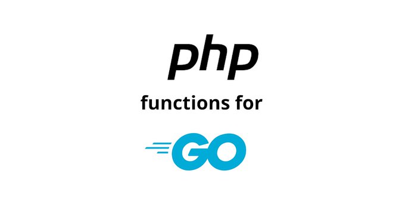
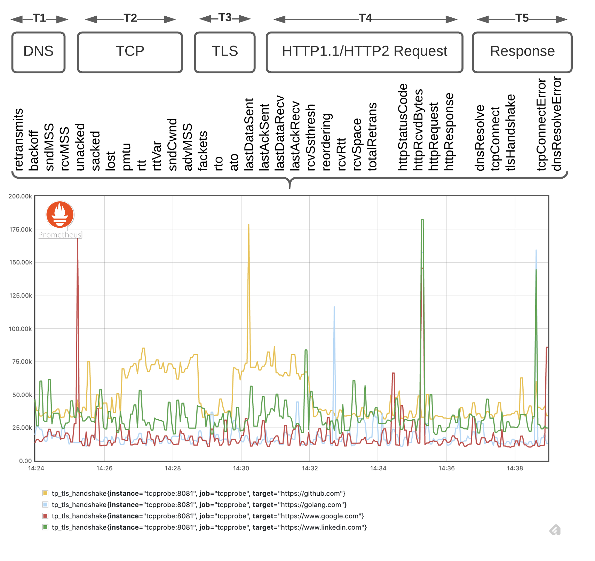

# Go语言爱好者周刊：第 72 期

这里记录每周值得分享的 Go 语言相关内容，周日发布。

本周刊开源（GitHub：[polaris1119/golangweekly](https://github.com/polaris1119/golangweekly)），欢迎投稿，推荐或自荐文章/软件/资源等，请[提交 issue](https://github.com/polaris1119/golangweekly/issues) 。

鉴于大部分人可能没法坚持把英文文章看完，因此，周刊中会尽可能推荐优质的中文文章。优秀的英文文章，我们的 GCTT 组织会进行翻译。


题图：Go 泛型

## 刊首语

以下代码输出什么？你清楚为什么吗？

```go
package main

func main() {
	var (
		a int         = 0
		b int64       = 0
		c interface{} = int(0)
		d interface{} = int64(0)
	)

	println(c == 0)
	println(c == a)
	println(c == b)
	println(d == b)
	println(d == 0)
}
```

A: true true false true false；  B: true false false true false； C: true true true false false；D: true true false true true；

## 资讯

1、[GoLand 2020.3 正式发布](https://mp.weixin.qq.com/s/eXUsjYstKmzlOnZKamAGgg)

这是 2020 年第 3 个版本，也是最后一个版本。


2、[Go 1.15.6 和 Go 1.14.13 发布了](https://mp.weixin.qq.com/s/qX6RqhN14XnF7-WrqbNY5g)

Go 官方宣布 Go1.15.6 和 Go 1.14.13 发布了，这是两个小版本，主要修复了编译器、链接器、运行时、go 命令 和 io 包。

3、[Gitea 1.13.0 发布](https://blog.gitea.io/2020/12/gitea-1.13.0-is-released/)

如果你想要自己的基于 GitHub 的基于 Web 的git界面，而 GitLab 对你来说太重，那么 Gitea 就适合你。

4、[Kubernetes 弃用 Docker 刷屏，官方声明：不必惊慌](https://mp.weixin.qq.com/s/JztqyiSEjS-HeIDyhp8g4A)

在 1.20 版本之后，Kubernetes 将不再支持把 Docker 作为容器运行时使用。不必惊慌，实际上没多大影响。

5、[gopls v0.5.5 发布](https://github.com/golang/tools/releases/tag/gopls%2Fv0.5.5)

一些 bug 修复。

## 文章

1、[Go 项目实战：实现一个 Redis (1) 之编写 TCP 服务器](https://mp.weixin.qq.com/s/ZcH-iLVEdGlfweviMbJUjg)

这是一个实战系列教程，更新到 [Go 项目实战：实现一个 Redis(2) 之实现 Redis 协议解析器](https://mp.weixin.qq.com/s/6XJpY2rkvXelBhUHVZ68sw)。

2、[Hugo + GitHub Pages 搭建自己的网站](https://mp.weixin.qq.com/s/pW7iHOQLwMDkFU_bgXeTuA)

静态博客很流行。

3、[Go 语言：全面分析为什么我们需要泛型](https://mp.weixin.qq.com/s/vnQuPMD7piUe6l0KVDbePA)

为什么我们需要泛型，没有泛型时我们在做什么，泛型会带来哪些影响，泛型能拯救我们吗？

4、[列举一些 Go1.16 中可能对大家有影响的变化](https://mp.weixin.qq.com/s/QMpQZXrrZNTVxmGN-3cSCg)

struct tag 支持同名合并很棒。

5、[都知晓滴滴大量使用 Go，它招聘普通 Go 工程师的 JD 啥要求？](https://mp.weixin.qq.com/s/OUR1AZ7cKFLeHSlHYfuEow)

多看看招聘需求。

6、[图解 Goroutine 与抢占机制](https://mp.weixin.qq.com/s/VwjEglM0ZRMvYg7cwV5b5Q)

本篇文章讨论实现原理基于 Go 1.13。

7、[让你的 Go 服务优雅的重启 (解决代码发布 Go 服务闪断的问题)](https://mp.weixin.qq.com/s/u3qoN8PRKQRBjDVD7hrgag)

有同学反馈 发布 Go 服务代码 监控报警会出现一堆 5xx 报警，如何解决？

8、[一文告诉你如何抢先体验 Go 泛型](https://mp.weixin.qq.com/s/14WeOQBdezWTC5OqQrJtfg)

全面介绍一下，小伙伴们可以根据自己的情况任选一种抢先体验 Go 泛型！

9、[必须要学的 Go 进程诊断工具 gops](https://mp.weixin.qq.com/s/iS7R0NTZcTlonUw8bq0jKQ)

Google 官方开发的工具。

10、[Go 语言应用之 template](https://mp.weixin.qq.com/s/9FFp0-cj4raPhdUUpSy4Og)

Go 语言内置了两个 template 相关的包：text/template、html/template。

## 开源项目

1、[rod](https://github.com/go-rod/rod)

Rod 是直接基于 DevTools 协议的高级驱动程序。它是为 Web 自动化和抓取而设计的。 

2、[Mortar](https://github.com/go-masonry/mortar)

构建 gRPC（和 REST）Web 服务的框架。


3、[dicom](https://github.com/suyashkumar/dicom)

Go 中的高性能 DICOM 医学图像解析器。

4、[baker](https://github.com/adroll/baker)

Baker 是大数据时代的高性能，可组合且可扩展的数据处理管道。

5、[go-admin](https://github.com/GoAdminGroup/go-admin)

数据可视化与管理平台构建框架。官方网址：<https://www.go-admin.cn/>，看着挺不错。

6、[treemux](https://github.com/vmihailenco/treemux)

快速灵活的 HTTP 路由器，和 httprouter 一样快，但路由规则灵活。

7、[phpfuncs](https://github.com/serkanalgur/phpfuncs)

PHP 函数的 Go 实现。该包适用于以前开发过 PHP 的 Go 初学者。



8、[prysm](https://github.com/prysmaticlabs/prysm)

以太坊 2.0 区块链 Go 实现。

9、[twtxt](https://github.com/jointwt/twtxt)

Go 实现的分布式、独立部署的类 Twitter 微博客平台。

10、[godog](https://github.com/cucumber/godog)

Golang BDD 框架。

11、[please](https://github.com/thought-machine/please)

Go 实现的跨语言构建系统。

## 资源&&工具

1、[Go 与 Rust 对比学习](https://programming-idioms.org/cheatsheet/Go/Rust)

超过两百个常见的编程任务，并排放置。作为一个备忘单，一个有趣的比较形式，甚至学习资料。这个网站可以对比各种语言。

2、[sqs_clipboard](https://github.com/jftuga/sqs_clipboard)

使用 AWS SQS 作为剪贴板在不同系统和平台之间复制和粘贴。

3、[ciak](https://github.com/GaruGaru/ciak)

用 Go 编写的轻量级媒体服务器。

4、[Go Systems Conf SF 2020](https://www.youtube.com/watch?v=inrqE0Grgk0)

油管视频。这里可以看到演讲主题：<https://systemsconf.io/agenda>。

5、[kong](https://github.com/alecthomas/kong)

一个命令行解析器。

6、[gen](https://github.com/clipperhouse/gen)

类型驱动的 Go 代码生成。

7、[fibratus](https://github.com/rabbitstack/fibratus)

Go 实现的 Windows 内核探索与跟踪利器。

8、[tcpprobe](https://github.com/mehrdadrad/tcpprobe)

网络性能、路径、统计信息监视工具。



9、[Go 夜聊第 1 期](https://www.xiaoyuzhoufm.com/episode/5fca1f69dee9c1e16dea5713?s=eyJ1IjogIjVlN2VjNzNkMGE3YmQ4MDljMmU5MTJkNCJ9)

聊聊参加 GopherCon 2020。

10、[播客第 158 期](https://changelog.com/gotime/158)

play-with-go.dev 网站的台前幕后的故事。

## 订阅

这个周刊每周日发布，同步更新在[Go语言中文网](https://studygolang.com/go/weekly)和[微信公众号](https://weixin.sogou.com/weixin?query=Go%E8%AF%AD%E8%A8%80%E4%B8%AD%E6%96%87%E7%BD%91)。

微信搜索"Go语言中文网"或者扫描二维码，即可订阅。


