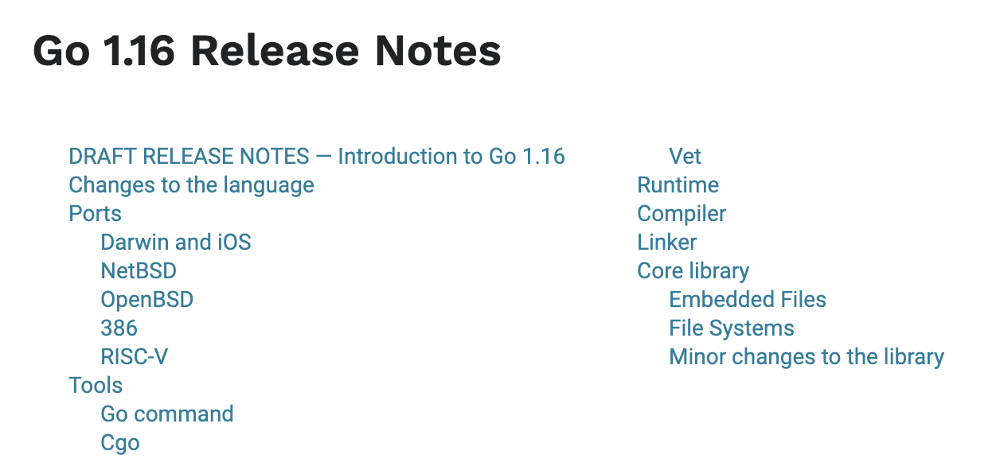
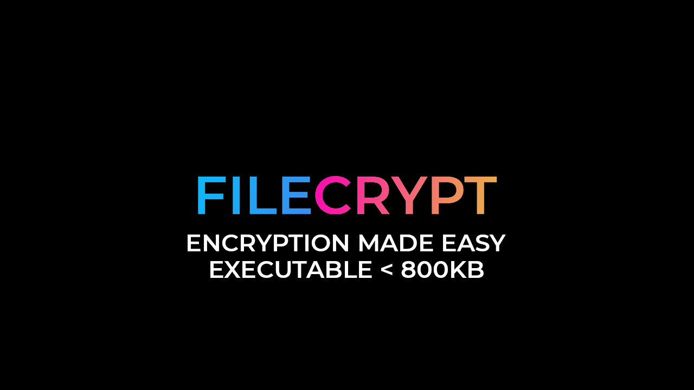

# Go语言爱好者周刊：第 73 期

这里记录每周值得分享的 Go 语言相关内容，周日发布。

本周刊开源（GitHub：[polaris1119/golangweekly](https://github.com/polaris1119/golangweekly)），欢迎投稿，推荐或自荐文章/软件/资源等，请[提交 issue](https://github.com/polaris1119/golangweekly/issues) 。

鉴于大部分人可能没法坚持把英文文章看完，因此，周刊中会尽可能推荐优质的中文文章。优秀的英文文章，我们的 GCTT 组织会进行翻译。



题图：Go 1.16 发布说明草案，文档大部分已经完成，具体参见：<https://tip.golang.org/doc/go1.16>

## 刊首语

一道考察你能否看懂的题目。

```go
var x int
inc := func() int {
    x++
    return x
}
fmt.Println(func() (a, b int) {
    return inc(), inc()
}())
```

以上代码输出什么：

A：1 1；B：1 2；C：2 2；D：不确定

## 资讯

1、[Hugo 在 Apple M1 的性能测试](https://gohugo.io/news/hugo-macos-intel-vs-arm/)

苹果的 M1 芯片带来了更多的乐趣，这次运行的是 Hugo 的一系列基准测试，该测试显示了一个芯片明显胜过另一个芯片。


2、[FOSDEM 2021 年将在线上举行](https://github.com/go-devroom/cfp)

这是一个流行的开源活动，有 Go 相关的，有兴趣的可以了解下。

3、[k8s v1.20 发布](https://github.com/kubernetes/kubernetes/blob/master/CHANGELOG/CHANGELOG-1.20.md)

改动比较多，其中被大家传的最多的就是 Docker 不是默认的容器运行时。

4、[Docker 20.10 发布](https://docs.docker.com/engine/release-notes/#version-2010)

本文档介绍了 Docker Engine 的最新更改，新增功能，已知问题和修复。

## 文章

1、[推荐一个网站：其实是三个网站](https://mp.weixin.qq.com/s/xX1-DoBsuY17K69TjmE8dg)

学习不错的网站。

2、[惊呆了！这个 Go 语言的 Bug 价值十亿美元](https://mp.weixin.qq.com/s/qXaRUDa6UWOUnWOOIjSDIQ)

十亿美元（billion dollar）的错误 / bug 貌似是美国的一个梗，大概的意思是，对于那些市值上几千亿的大企业，如果一个错误能够导致市值下跌个百分之零点几，就已经是十亿左右了。

3、[理解 Go 并发以及调度器亲和性](https://mp.weixin.qq.com/s/XnqF5aZ_0F3-cZPUm9pM7w)

将 Goroutine 从一个 OS 线程切换到另一个线程需要一定开销，并且，如果这种操作过于频繁的话会降低应用性能。

4、[震惊！Gorm 终于可以操作 Oracle 了](https://mp.weixin.qq.com/s/6mq8EZmhqvUFpNFANUB1aA)

寻求贡献者一起维护。

5、[经常被误解的 mutex](https://juejin.cn/post/6902799781509201927)

深入分析 mutex 与 cas 的底层实现。

6、[Go 运行时中的 Mutex](https://colobu.com/2020/12/06/mutex-in-go-runtime/)

Go channel 中的实现中使用了 mutex，这个 mutex 和标准库中的 Mutex 有什么不同。

7、[揭密容器环境下 Golang 回收子进程的运行机制](https://mp.weixin.qq.com/s/3HsqtHwWReX1S3ggP2_owg)

本文通过分析一个父进程没有 wait 子进程的问题，了解到了进程 reaper 机制，并进一步了解到它在 container 这种特殊系统环境下的存在意义。

8、[分析 Go 程序的 Off-CPU 性能](https://colobu.com/2020/11/12/analyze-On-CPU-in-go/)

性能问题可以分为两种类型：On-CPU 和 Off-CPU。

9、[聊聊 Golang 的 zap 的 WriteSyncer](https://segmentfault.com/a/1190000038431605)

本文研究 zap 的 WriteSyncer。

10、[Go 函数调用链跟踪的一种实现思路](https://tonybai.com/2020/12/10/a-kind-of-thinking-about-how-to-trace-function-call-chain/)

这篇文章的初衷是想解答知乎上的一位知友提出的问题。

11、[Go 语言中观察 GC 的几种方式](https://juejin.cn/post/6904280087668097038)

使用四种不同的方式来介绍如何观察 GC。

## 开源项目

1、[gosnmp](https://github.com/gosnmp/gosnmp)

一个 SNMP（Simple Network Management Protocol）库。SNMP 是一种协议，用于管理或监视有关 IP 网络上的设备（例如路由器，服务器，打印机）的数据。 gosnmp 可让您用 Go 查询和设置数据。

2、[gnomock](https://github.com/orlangure/gnomock)

使用临时 Docker 容器进行无障碍测试。

3、[phpgrep](https://github.com/quasilyte/phpgrep)

为 PHP 代码准备的。

4、[gocrest](https://github.com/corbym/gocrest)

类似 [Hamcrest](https://github.com/hamcrest) 的匹配器，GoCrest 匹配器是可组合的，自我描述的，可以以更易读的形式串在一起以创建灵活的断言。

5、[kanzi-go](https://github.com/flanglet/kanzi-go)

Go 实现的无损压缩库。

6、[gaio](https://github.com/xtaci/gaio)

Go 语言高性能网络通信框架。

7、[Prophecis](https://github.com/WeBankFinTech/Prophecis)

微众银行开源的 Go 实现的一站式云原生机器学习平台。

8、[sariaf](https://github.com/majidsajadi/sariaf)

一个快速，简单，轻巧的 HTTP 路由器，代码一共才 200+ 行。

9、[cel-spec](https://github.com/google/cel-spec)

Google 开源的通用表达式语言(cel)。

10、[hashfs](https://github.com/benbjohnson/hashfs)

实现 Go 1.16 的 io/fs.FS，将 SHA256 哈希附加到文件名中，以实现主动 HTTP 缓存。

11、[arpc](https://github.com/lesismal/arpc)

支持更有效的网络通信。作者投稿，有一篇[文章介绍](https://github.com/polaris1119/golangweekly/issues/22)。

## 资源&&工具

1、[jsondiff](https://github.com/wI2L/jsondiff)

基于 [RFC6902](https://tools.ietf.org/html/rfc6902) 的 Go JSON diff 库。

2、[omniparser](https://github.com/jf-tech/omniparser)

Omniparser 是本地的 Golang ETL 解析器，它以流方式提取各种格式（CSV, txt, fixed length/width, XML, EDI/X12/EDIFACT, JSON 和自定义格式）的输入数据，并将数据转换为基于用 JSON 编写的模式。以下是在线的 Demo 示例：<https://omniparser.herokuapp.com/>。


3、[basiclander](https://gitlab.com/tslocum/basiclander)

Lunar Lander 是 1979 年的 Atari 游戏，玩家必须在特定位置放置太空飞船。这是用 Go 语言编写的基于终端的版本，你也可以直接将 ssh 定向到正在运行的实例（使用 [sshtargate](https://gitlab.com/tslocum/sshtargate)）。

4、[nerdctl](https://github.com/AkihiroSuda/nerdctl)

与 docker 兼容的 containerd 客户端工具。

5、[油管视频：掌控您对 Go 开发的热情](https://www.youtube.com/watch?v=eXQl1z6is8U)

快速，简单的 Go + Docker 开发。

6、[lens](https://github.com/lensapp/lens)

k8s IDE 发布了 v4.0 版本。

7、[sops](https://github.com/mozilla/sops)

Mozilla 开源的 Go 实现的管理敏感数据的工具。

8、[一本帮助你成为更棒 Go 开发者的图书免费下载](https://mp.weixin.qq.com/s/kkLghCSeobeSNX2VLpZsnQ)

Mastering Go。有中文版。

9、[IDE](https://github.com/thestrukture/IDE)

Go 打造的在浏览器中使用的 Go IDE。

10、[filecrypt](https://github.com/flew-software/filecrypt)

使用 Go 编写的超级易用的文件加密实用程序。



## 订阅

这个周刊每周日发布，同步更新在[Go语言中文网](https://studygolang.com/go/weekly)和[微信公众号](https://weixin.sogou.com/weixin?query=Go%E8%AF%AD%E8%A8%80%E4%B8%AD%E6%96%87%E7%BD%91)。

微信搜索"Go语言中文网"或者扫描二维码，即可订阅。


