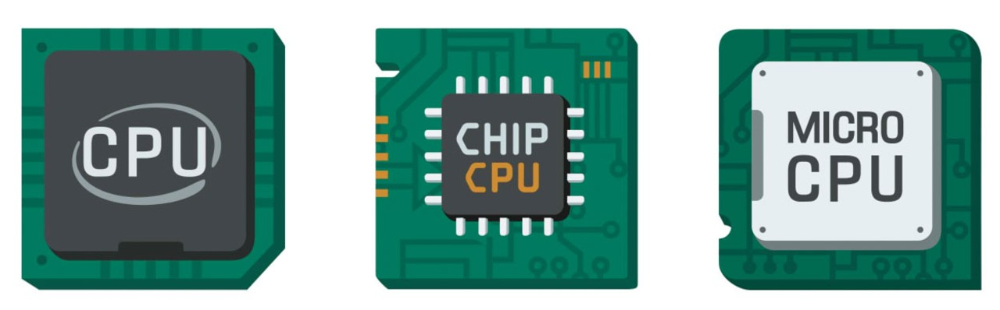
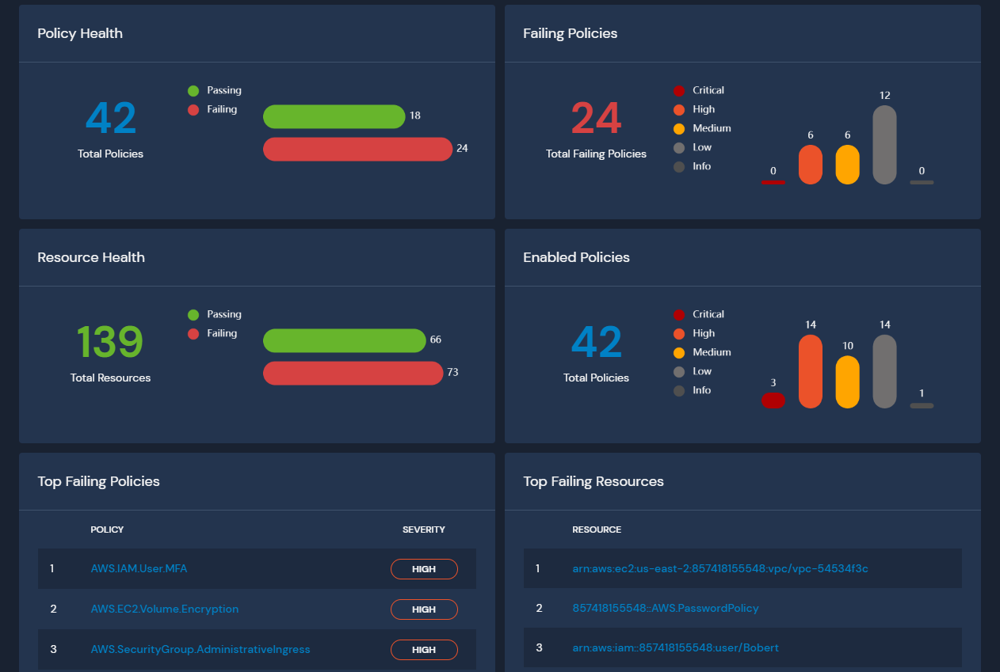

# Go语言爱好者周刊：第 74 期

这里记录每周值得分享的 Go 语言相关内容，周日发布。

本周刊开源（GitHub：[polaris1119/golangweekly](https://github.com/polaris1119/golangweekly)），欢迎投稿，推荐或自荐文章/软件/资源等，请[提交 issue](https://github.com/polaris1119/golangweekly/issues) 。

鉴于大部分人可能没法坚持把英文文章看完，因此，周刊中会尽可能推荐优质的中文文章。优秀的英文文章，我们的 GCTT 组织会进行翻译。



题图：Go 对各种 CPU 架构的支持。

## 刊首语

这道题看起来很迷惑，目测很多人可能会答错。以下代码输出什么？

```go
package main

import (
	"encoding/json"
	"fmt"
	"time"
)

func main() {
	t := struct {
		time.Time
		N int
	}{
		time.Date(2020, 12, 20, 0, 0, 0, 0, time.UTC),
		5,
	}

	m, _ := json.Marshal(t)
	fmt.Printf("%s", m)
}
```

A：`{"Time": "2020-12-20T00:00:00Z", "N": 5 }`；B：`"2020-12-20T00:00:00Z"`；C：`{"N": 5}`；D：`<nil>`

## 资讯

1、[Go 1.16 Beta1 发布，支持 Apple M1 芯片](https://mp.weixin.qq.com/s/LMtg_nilQaDbEZUFuyWlog)

正式版预计 2021 年 2 月发布。欢迎测试反馈。

2、[godoc.org 将重定向到 pkg.go.dev](https://docs.studygolang.com/blog/godoc.org-redirect)

2021 年年初会生效。godoc.org 要关闭了，但有人对 pkg.go.dev 不满，弄了个 godocs.io。。。

[3、gopls 0.6.0 发布](https://github.com/golang/tools/releases/tag/gopls%2Fv0.6.0)

VSCode 用户会自动更新。

4、[Ebiten in 2020](https://ebiten.org/blog/2020.html)

Ebiten 是一个流行的开源游戏库，用于在 Go 中构建 2D 游戏。这个项目竟然已经 7 年了。很棒！

5、[fyne-cross 发布 1.0 版本](https://fyne.io/blog/2020/12/14/fyne-cross-v1-release.html)

这是 Go GUI 框架 fyne 的全平台打包发布工具。

6、[Docker 发布支持 apple M1 芯片的 docker desktop 预览版](https://www.docker.com/blog/download-and-try-the-tech-preview-of-docker-desktop-for-m1/)

跟进很快！

## 文章

1、[Gopher Dinner 第 1 期结束，简单聊聊](https://mp.weixin.qq.com/s/gSq6DtD2qO5qy_A3wNqYrg)

上周六的聚会小结。

2、[你是不是没想过，结构体竟然可以内嵌一个接口？](https://mp.weixin.qq.com/s/2eED64tnb3bDong_3_HJoA)

这是第 71 期周刊题目的解析。

3、[Go：gsignal，信号的掌控者](https://mp.weixin.qq.com/s/qVzRf27YA5KbF1rQwKKwpw)

signal 包提供了信号处理器，让我们的 Go 程序可以与发送来的信号进行交互。

4、[新买了 Apple M1 Mac，却不知道如何安装 Go？](https://mp.weixin.qq.com/s/IuKZBnvJlskpqdHJqMcTXw)

虽然 Go 1.16 Beta1 已经发布，但了解下源码编译相关知识还是有帮助的。

5、[Go 错误处理：用 panic 取代 err != nil 的模式](https://mp.weixin.qq.com/s/p77V3_LkREuXPVLdebmmmQ)

虽然官方不推荐，但有人这么用。好不好自己清楚！

6、[听说你还不知道如何查看 Go 历史文档？](https://mp.weixin.qq.com/s/NGG7bxOHjTElHQ88j_q1tA)

这是 pkg.go.dev 比官方网站强大的地方。

7、[英雄联盟（LOL）所在公司竟然大量使用 Go 语言：这是他们的实战分享](https://mp.weixin.qq.com/s/lyMj5vjhH1KytWHDWgnYGg)

游戏行业也在使用 Go。

8、[一次完整的腾讯 Go 开发岗位面试记录](https://mp.weixin.qq.com/s/t6XpRpgFVD60k4wktB05rw)

这些题目你会多少？

9、[在编程中，有两件事情最难：聊聊 Go 中的简短变量名](https://mp.weixin.qq.com/s/gcTM1zM7kUkth-tCHDZjzA)

你为命名发愁过吗？

10、[跟 Dave Cheney 大神重学 Go Slice：有新收获](https://mp.weixin.qq.com/s/A5hyvYdqsGcntbZlJyB3Iw)

每次讨论到 Go 的切片问题，都会从这个变量是不是切片开始，换句话说，就是 Go 的序列类型，在 Go 中，数组有两种关联属性。

11、[从 PHP 转 Go](https://mp.weixin.qq.com/s/_gP_8_BF84mQ-YsNVLD3Tg)

一篇国外文章翻译版。写这篇文章的时候 PHP 最新版本是 PHP7.4，Go 的最新版本是 Go1.13。

12、[「对比 Python 学习 Go」- 高级数据结构](https://segmentfault.com/a/1190000038498305)

从 Python 转 Go 的可以看看。

## 开源项目

1、[yomo](https://github.com/yomorun/yomo)

开源的低时延边缘计算 Streaming Serverless Framework。

2、[fastwego](https://fastwego.dev/)

FastWeGo 是一组 Go 服务快速开发 sdk，支持微信公众号、小程序、小游戏、企业微信、微信支付等微信服务，以及 飞书、钉钉。「快」是核心特性，5 分钟即可完成一套 Go 服务开发。

3、[panther](https://github.com/panther-labs/panther)

使用日志数据检测威胁并改善云安全状况。



4、[graphik](https://github.com/graphikDB/graphik)

作为身份识别文档和图形数据库实现的后端即服务（Backend as a Service），并支持 gRPC 和 graphQL。

5、[frames](https://github.com/v3io/frames)

基于 Golang 的远程数据帧访问（通过 gRPC 或 HTTP 流）。

6、[chili](https://github.com/5anthosh/chili)

Go 的简单表达式评估引擎。

## 资源&&工具

1、[school-of-sre](https://github.com/linkedin/school-of-sre)

LinkedIn 在 GitHub 上开源了其企业内部的 SRE 技术课程，主要包含 Linux、Git、Python、Web、MySQL、大数据、系统设计、网络安全等内容。

2、[imgdiff](https://github.com/n7olkachev/imgdiff)

最快的逐像素图片比对工具。

3、[Go 学习网站](https://golangresources.com/)

网络上最好的 Go 学习资源: 精选最佳文章，练习，课程，讲座和视频来学习 Go。不过是英文的。

4、[油管视频](https://youtu.be/AtiUf0uJ4YE)

为一个 Go 项目构建 pipeline。

5、[criticalityscore](https://github.com/engelsjk/criticalityscore)

该项目会评估一个开源项目的重要性并给出一个评估分数，打分算法来自 Rob Pike。Python 版本：<https://github.com/ossf/criticality_score>。

6、[Google 面试最常问的 20 个问题](https://www.programming-hero.com/blog/20-most-frequently-asked-google-interview-questions.html)

很语言没太多关系。英文的。

7、[专注于 Go 高性能编程实践的开源电子书项目](https://github.com/geektutu/high-performance-go)

极客兔兔出品，项目主页：[Go 语言高性能编程](https://geektutu.com/post/high-performance-go.html)。

8、[lazyssh](https://github.com/stephank/lazyssh)

跳转主机 SSH 服务器，可按需启动计算机。

9、[doggo](https://github.com/mr-karan/doggo)

人类更可读的命令行 DNS 客户端。受 Rust 的 [dog](https://github.com/ogham/dog/) 项目启发。


## 订阅

这个周刊每周日发布，同步更新在[Go语言中文网](https://studygolang.com/go/weekly)和[微信公众号](https://weixin.sogou.com/weixin?query=Go%E8%AF%AD%E8%A8%80%E4%B8%AD%E6%96%87%E7%BD%91)。

微信搜索"Go语言中文网"或者扫描二维码，即可订阅。


