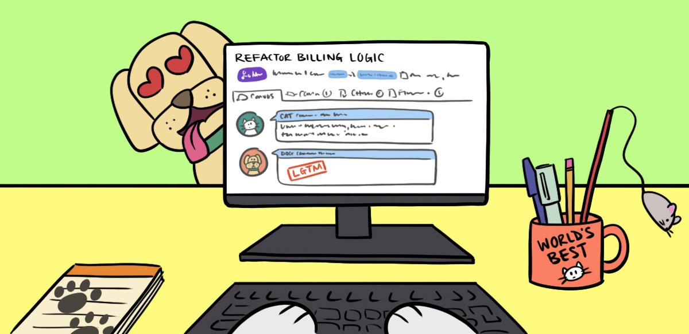
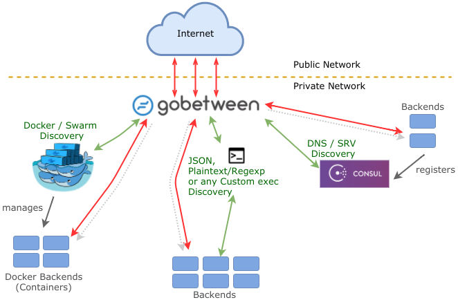
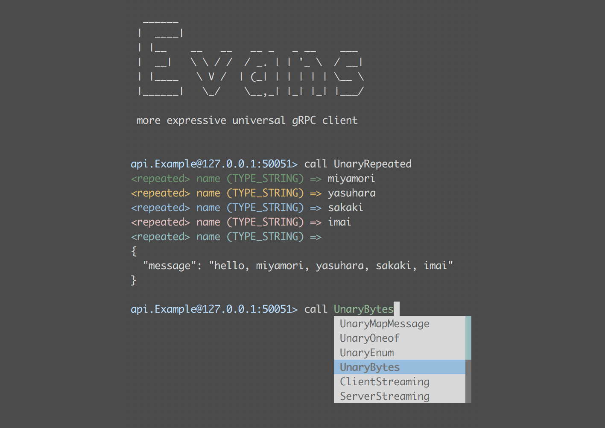

# Go语言爱好者周刊：第 75 期

这里记录每周值得分享的 Go 语言相关内容，周日发布。

本周刊开源（GitHub：[polaris1119/golangweekly](https://github.com/polaris1119/golangweekly)），欢迎投稿，推荐或自荐文章/软件/资源等，请[提交 issue](https://github.com/polaris1119/golangweekly/issues) 。

鉴于大部分人可能没法坚持把英文文章看完，因此，周刊中会尽可能推荐优质的中文文章。优秀的英文文章，我们的 GCTT 组织会进行翻译。



题图：爱上 Code Review

## 刊首语

接着上期周刊，看大家是否掌握了该知识点。如果上期题目做错了，建议先看看 [《这道题竟然只有 12% 的人答对。。。》](https://mp.weixin.qq.com/s/2HFch2rFKi9d9F9WrpYI3Q) 。

以下代码输出什么？如果你不确定，建议你查阅相关文档再作答。

```go
package main

import(
	"fmt"
	"encoding/json"
	"context"
)

func main() {
	data, _ := json.Marshal(context.WithValue(context.Background(), "a", "b"))
	fmt.Println(string(data))
}
```

A：{}；B：`{"a":"b”}`；C：`{"Context":0}`；D：`a,b`

## 资讯

1、[vscode-go 计划将 gopls 作为默认语言服务器](https://github.com/golang/vscode-go/issues/1037)

目前默认是不启用 gopls 的。

2、[go module 即将成为你的唯一选择](https://utcc.utoronto.ca/~cks/space/blog/programming/GoModulesOnlyFuture)

别挣扎了，赶紧换成 module 吧。

3、[webrtc v3.0.0 发布](https://github.com/pion/webrtc/wiki/Release-WebRTC@v3.0.0)

著名 Go WebRTC 框架。

4、[GoLand IDE 2021.1 raodmap](https://blog.jetbrains.com/go/2020/12/24/goland-2021-1-roadmap/)

看看会加哪些新功能。

## 文章

1、[CockroachDB errors 系列文章](https://mp.weixin.qq.com/s/S_04n2Uzse3VwptCH9gpow)

一个可以替代 errors 和 pkg/errors 的库。

- [Go 格式化 API — CockroachDB errors 库（第2篇）](https://mp.weixin.qq.com/s/t5bNcsNm4QJmo0a--9drFQ)
- [Go error 打印灾难 — CockroachDB errors 库（第3篇）](https://mp.weixin.qq.com/s/YNy8opP0DVNZniLNuMeHqw)
- [除了 fmt.Errorf() 之外—Go 中的日常错误对象：CockroachDB errors 库（第4篇）](https://mp.weixin.qq.com/s/7DmmKjoRdf9nd9_CXe47mw)

2、[这道题竟然只有 12% 的人答对。。。](https://mp.weixin.qq.com/s/2HFch2rFKi9d9F9WrpYI3Q)

这是本周刊上期（74 期）的问题解析。

3、[Go 中没有引用传递？](https://mp.weixin.qq.com/s/WyDHVScoXjikOmtAZHTUKw)

先说清楚，在 go 中没有引用变量，所以更不存在什么引用传值了。

4、[又是 Python，又是 Go 和 Rust，你觉得这个招聘到底是要什么人才？](https://mp.weixin.qq.com/s/rB8Han9VrHify-G0Fl6egw)

掌握多门语言是趋势？

5、[谈服务可用性监控](https://mp.weixin.qq.com/s/g3S9c2MqD25O4MXr3tW9XA)

一个服务的监控从整体考虑，要达到哪些才能算是完善的？我想，如果没有一个全局性的监控思考，一个服务的监控即使加的再多也是会有监控盲区的。

6、[图解 Go pprof 收集数据的工作流](https://mp.weixin.qq.com/s/HQzz2NQ2lSg_LLsNB7C-mw)

pprof 是用于分析诸如 CPU 或 内存分配等 profile 数据的工具。分析程序的 profile 数据需要收集运行时的数据用来在之后统计和生成画像。

7、[2020 年字节跳动 Go 面试总结](https://mp.weixin.qq.com/s/mUqa3xfxySPREv-U9wLoZQ)

虽然是 Go 面试，但完全是 Go 的内容真不多。可见大家准备时，一定不能只盯着 Go 语言本身。

8、[Go 运行程序中的线程数](https://colobu.com/2020/12/20/threads-in-go-runtime/)

可以控制线程数吗？

9、[grafana 的主体架构是如何设计的？](https://mp.weixin.qq.com/s/xG0PVcm5SnJoOxKr4XbGPA)

这篇想解释下它的主体架构的设计思路，如果你对 grafana 有兴趣，不妨让这篇成为源码阅读入门读物。

10、[Golang最细节篇— struct{} 空结构体究竟是啥？](https://mp.weixin.qq.com/s/Rd1kUFK0F4Z-UTfl5wBcPw)

基于 go1.13.3 linux/amd64 分析。

## 开源项目

1、[owncast](https://github.com/owncast/owncast)

Go实现的自托管的实时流服务器。

2、[go-containerregistry](https://github.com/google/go-containerregistry)

与镜像仓库互操作的 Go 包。

3、[DocHub](https://github.com/TruthHun/DocHub)

基于 Beego 开发的类似百度文库站点。

4、[trigger](https://github.com/graphikDB/trigger)

基于 Google 通用表达式语言（CEL）的决策和触发 Go 框架。

5、[diff3](https://github.com/nasdf/diff3)

diff3 文本合并算法的 Go 实现。

6、[progress_bar](https://github.com/ermanimer/progress_bar)

进度条的 Go 实现。

7、[redcon](https://github.com/tidwall/redcon)

用于 Go 的 Redis 兼容服务器框架。

8、[goatcounter](https://github.com/zgoat/goatcounter)

一个开源 Web 分析平台，可作为托管服务（非商业用途免费）或自托管应用程序。

9、[gobetween](https://github.com/yyyar/gobetween)

Сloud 时代的现代简约负载均衡器。



10、[clutch](https://github.com/lyft/clutch)

可扩展的基础架构管理平台。


11、[fusion](https://github.com/spy16/fusion)

用 Go 语言编写的微型流处理库。

12、[low](https://github.com/openacid/low)

Golang 中的底层数据类型和 utils。

13、[email-verifier](https://github.com/aftership/email-verifier)

作者自荐。一个高性能、多维度检查的 email 地址校验库。

## 资源&&工具

1、[油管视频](https://www.youtube.com/watch?v=vnA-aSoQSeE&t=359s)

Go 机器学习实例解析。

2、[一本有关 Go 网络编程的书要出版了](https://nostarch.com/networkprogrammingwithgo)

no starch 出版社的《Network Programming with Go》将在明年 2 月与 gopher 见面。

3、[brockly](https://github.com/thestrukture/brockly)

使用 brockly 以图形化方式构建一个 Go Web Server。

4、[2020 腾讯社招 Golang 后端面试题](https://mp.weixin.qq.com/s/XWMiKR8xMi_Qb0eedv34pg)

没有答案，靠自己了。

5、[油管视频](https://www.youtube.com/watch?v=YoDGTwwQTso&feature=youtu.be)

Go 1.16 文件嵌入教程。

6、[GopherCon 2020 技术大会视频全集](https://www.youtube.com/playlist?list=PL2ntRZ1ySWBfUint2hCE1JRxRWChloasB)

相应全套 PPT 可以关注该公众号回复「gophercon2020」获取。

7、[MIT 课程《Distributed Systems 》中文版](https://github.com/feixiao/Distributed-Systems)

使用 Go 作为课程设计和示例编程语言。

8、[油管视频](https://www.youtube.com/watch?v=1I1WmeSjRSw)

Go 1.14 增加的 goroutine 抢占调度背后的故事 by Austin Clements。

9、[aquatone](https://github.com/michenriksen/aquatone)

Aquatone 是用于对大量主机上的网站进行视觉检查的工具，可以方便地快速获得基于 HTTP 的攻击面的概述。

10、[cointop](https://github.com/miguelmota/cointop)

基于轻量级交互式终端的 UI 应用程序，用于跟踪加密货币。

11、[cds](https://github.com/tal-tech/cds)

基于 go-zero 构建的 ClickHouse 的大数据数据同步、存储、计算系统。

12、[clash](https://github.com/Dreamacro/clash)

Go 中基于规则的隧道。

13、[evans](https://github.com/ktr0731/evans)

更具表现力的通用 gRPC 客户端。



## 订阅

这个周刊每周日发布，同步更新在[Go语言中文网](https://studygolang.com/go/weekly)和[微信公众号](https://weixin.sogou.com/weixin?query=Go%E8%AF%AD%E8%A8%80%E4%B8%AD%E6%96%87%E7%BD%91)。

微信搜索"Go语言中文网"或者扫描二维码，即可订阅。


