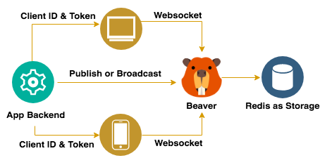

# Go语言爱好者周刊：第 76 期

这里记录每周值得分享的 Go 语言相关内容，周日发布。

本周刊开源（GitHub：[polaris1119/golangweekly](https://github.com/polaris1119/golangweekly)），欢迎投稿，推荐或自荐文章/软件/资源等，请[提交 issue](https://github.com/polaris1119/golangweekly/issues) 。

鉴于大部分人可能没法坚持把英文文章看完，因此，周刊中会尽可能推荐优质的中文文章。优秀的英文文章，我们的 GCTT 组织会进行翻译。

题图：2021 元旦快乐

## 刊首语

2020 年已经过去了，你是否进行了必要的总结、思考、复盘？新的一年开始了，建议做一个新年计划，一起加油！

## 资讯

1、[GoLand 2020.3.1发布，兼容 Apple M1芯片](https://blog.jetbrains.com/go/2020/12/30/goland-2020-3-1-is-out/)

支持 Go1.16 新的 GOOS 和 GOARCH，以及一些 bug 修复。

2、[2020 年终总结：希望对你有所帮助](https://mp.weixin.qq.com/s/ONc1gC4mshKyzzEq9Jmxtg)

站长个人的年终总结。

3、[Go 语言中文网 2020 年回顾暨 2021 年工作计划](https://mp.weixin.qq.com/s/n80ibYBbNqUBVG0NJgSEzg)

回顾一下 Go 语言中文网 2020 年的工作，同时展望一下 2021 年。

4、[与 gohugo 作者 Steve Francia 对话](https://tonybai.com/2021/01/02/go-language-13-years)

诞生 13 年的 Go 语言：生态系统，进化和未来。（因为 Go 项目是 2007 年启动的）

5、[Hugo v0.8.0 发布](https://gohugo.io/news/0.80.0-relnotes/)

开源项目这么拼，2020 年最后一天还发布新版本。

6、[新的基于 Go 的 Crypto 蠕虫病毒，可感染 Windows 和 Linux 服务器](https://securityaffairs.co/wordpress/112825/malware/golang-based-worm-windows-linux.html)

该恶意软件自 12 月初以来一直活跃在针对面向公众的服务，其中包括使用弱密码保护的 MySQL，Tomcat 管理面板和 Jenkins。

## 文章

1、[Go 1.16 的这个新变化需要适应下：go get 和 go install 的变化](https://mp.weixin.qq.com/s/18AZEEX1UeShLx6-9Ir9Zw)

go install 可能有些人都没用过？可以了解下。

2、[Go 微服务过载保护原理与实战](https://mp.weixin.qq.com/s/ImCJ62t4Ie4ZOf_ZmHb6-Q)

在微服务中由于服务间相互依赖很容易出现连锁故障，连锁故障可能是由于整个服务链路中的某一个服务出现故障，进而导致系统的其他部分也出现故障。

3、[详解 Go 内联优化](https://mp.weixin.qq.com/s/89QLSqGzH0yUM6cO6V4zmQ)

为了保证程序的执行高效与安全，现代编译器并不会将程序员的代码直接翻译成相应地机器码，它需要做一系列的检查与优化。

4、[漫画：Go 布道师的“神秘”社区在召唤你](https://mp.weixin.qq.com/s/dyo1TBOkS4Sfql3TUTWWxw)

猜猜是谁？

5、[由 C# 改为 Go，用更少的资源将 API 的响应时间减少了 87％](https://mp.weixin.qq.com/s/VcW9IPIpkUm6TYH62EYGKw)

往往评论比较有意思。请微信打开查看。

6、[像跟踪分布式服务调用那样跟踪Go函数调用链](https://mp.weixin.qq.com/s/WAKBipoBNzCKraIjyLaYdA)

这篇文章的初衷是想解答知乎上的一位知友提出的问题。

7、[我的 Promtheus 到底啥时候报警？](https://mp.weixin.qq.com/s/NOdjVY_W6RwSyCLuA9Zhwg)

最近又被问到了 Prometheus 为啥不报警，恰好回忆起之前经常解答相关问题，不妨写一篇文章来解决。

8、[解密 Go 语言之反射 reflect](https://mp.weixin.qq.com/s/onl3sBCSNs8l42uihi_p4A)

在所有的语言中，反射这一功能基本属于必不可少的模块。

9、[当 Go struct 遇上 Mutex](https://mp.weixin.qq.com/s/OYGVR0d-fq1hgOvrdsUnYA)

struct 是我们写 Go 必然会用到的关键字, 不过当 struct 遇上一些比较特殊类型的时候, 例如: Mutex, 你注意过你的程序是否依然正常吗 ?

10、[微服务高可用之熔断器实现原理与 Golang 实践](https://mp.weixin.qq.com/s/NwhAqx49FcTafcTRoIdOqQ)

在微服务架构中，经常会碰到服务超时或通讯失败的问题，由于服务间层层依赖，很可能由于某个服务出现问题，不合理的重试和超时设置，导致问题层层传递引发雪崩现象，而限流和熔断是解决这个问题重要的方式。

11、[那些年曹大写过的博客](https://mp.weixin.qq.com/s/g5AZxFOS9kwnAPmb3e3OUQ)

对曹大“情有独钟”的男人。

## 开源项目

1、[livego](https://github.com/gwuhaolin/livego)

Go 实现的直播服务器。

2、[OpenPokemonRed](https://github.com/pokemium/OpenPokemonRed)

Pokémon Red(口袋妖怪红)游戏的 Go 开源实现。在开发中。

3、[aegis](https://github.com/rafael-santiago/aegis)

多平台调试状态监测库。

4、[fast-levenshtein](https://github.com/ka-weihe/fast-levenshtein)

最快 Levenshtein 字符串距离算法的 Go 实现。

5、[chatto](https://github.com/jaimeteb/chatto)

开源聊天机器人的最小框架。

6、[huobi-eco-chain](https://github.com/HuobiGroup/huobi-eco-chain)

基于 go-ethereum 实现的火币客户端。

7、[Beaver](https://github.com/Clivern/Beaver)

Go 实现的实时消息服务器。

8、[opensource](https://github.com/kerberos-io/opensource)

开源的视频监视管理系统。

9、[valast](https://github.com/hexops/valast)

将 Go 的值转为 go/ast 格式。对 AST 感兴趣的可以了解下。

## 资源&&工具

1、[lab](https://github.com/Ackerr/lab)

GitLab 的非官方命令行工具。

2、[油管视频](https://www.youtube.com/watch?v=sRffQKZfkds)

使用 Testify 进行 Go 测试指南。

3、[gdu](https://github.com/dundee/gdu)

Go 编写的磁盘分析工具。

4、[packiffer](https://github.com/massoudasadi/packiffer)

跨平台的包嗅探工具。

5、[crow](https://github.com/maaslalani/crow)

在特定文件发生变化时执行任意命令。

6、[uroboros](https://github.com/evilsocket/uroboros)

一个 GNU/Linux 监控和性能分析工具，专注于单个进程。

7、[imageserver](https://github.com/pierrre/imageserver)

图片服务器工具。

## 订阅

这个周刊每周日发布，同步更新在[Go语言中文网](https://studygolang.com/go/weekly)和[微信公众号](https://weixin.sogou.com/weixin?query=Go%E8%AF%AD%E8%A8%80%E4%B8%AD%E6%96%87%E7%BD%91)。

微信搜索"Go语言中文网"或者扫描二维码，即可订阅。

