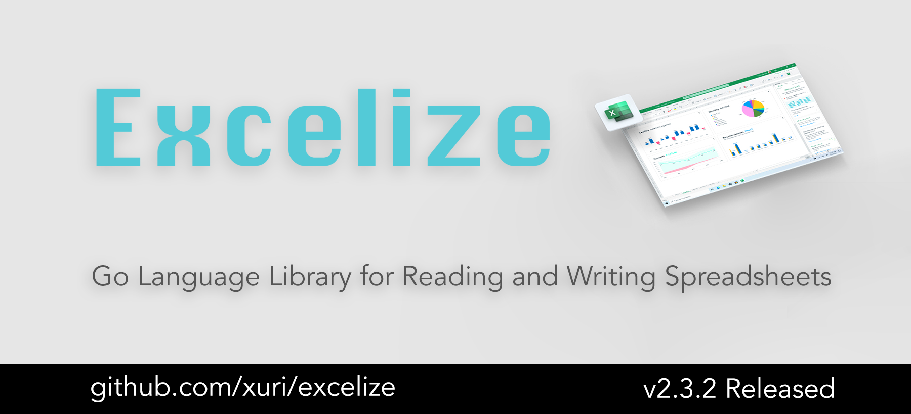
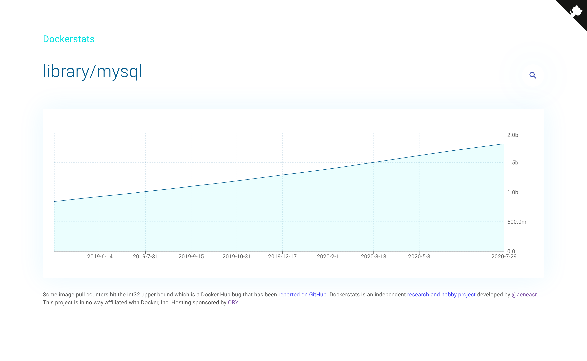

# Go语言爱好者周刊：第 77 期

这里记录每周值得分享的 Go 语言相关内容，周日发布。

本周刊开源（GitHub：[polaris1119/golangweekly](https://github.com/polaris1119/golangweekly)），欢迎投稿，推荐或自荐文章/软件/资源等，请[提交 issue](https://github.com/polaris1119/golangweekly/issues) 。

鉴于大部分人可能没法坚持把英文文章看完，因此，周刊中会尽可能推荐优质的中文文章。优秀的英文文章，我们的 GCTT 组织会进行翻译。



题图：excelize 2.3.2 发布

## 刊首语

以下代码输出结果中， goroutine 的数量是几个？（Go 1.15.x）

```go
package main

import (
	"fmt"
	"io/ioutil"
	"net/http"
	"runtime"
)

func main() {
	num := 6
	for index := 0; index < num; index++ {
		resp, _ := http.Get("https://www.baidu.com")
		_, _ = ioutil.ReadAll(resp.Body)
	}
	fmt.Printf("此时goroutine个数= %d\n", runtime.NumGoroutine())
}
```

A：1；B：3；C：13；D：7

## 资讯

1、[Excelize 2.3.2 发布](https://github.com/360EntSecGroup-Skylar/excelize)

用于读取和写入 Excel 文件的库。读取和写入 XLSX 文件，设置和读取单元格值，添加图表。最新版本改进了对数据透视表的支持，并添加了各种新的公式函数。

2021年1月4日，社区正式发布了 2.3.2 版本，该版本包含了多项新增功能、错误修复和兼容性提升优化：<https://xuri.me/excelize/zh-hans/releases/v2.3.2.html>。

2、[Go 1.16 中原本欲支持的结构体字段标签合并写法特性被取消了](https://github.com/golang/go/issues/40281)

大概原因是这个特性需要 Go 官方工具链和很多第三方工具都需要适当修改以应对这个变化，而完成这些修改的代价相对此特性带来的好处来说太大。

3、[ethr 1.0 发布，微软出品](https://logicpundit.com/blog/ethr-v1/)

全面的网络测量和分析工具。

4、[go-redis 8.4.6 发布](https://github.com/go-redis/redis)

类型安全的 Redis Go 客户端。

## 文章

1、[浅谈配置文件](https://mp.weixin.qq.com/s/BDH9jc3tA-Sk-ZF2geJRxg)

这几乎是项目不可避免的。

2、[你遇到过哪些高质量的 Go 语言面试题？](https://mp.weixin.qq.com/s/_RGIG19v3H9BOuXkrRLSjw)

来自知乎的一个问题和一些答案的整理。

3、[深入理解 Go 语言的类型](https://mp.weixin.qq.com/s/Bm5IpdsHjYhLmmX_cl8cGw)

无论什么语言，类型都涉及到了编程语法的方方面面。加强对于类型和指针的理解，对于提高编程水平十分关键。

4、[知乎问答：为什么 Go 的 Web 框架速度还不如 Java？](https://mp.weixin.qq.com/s/i2sPVjhR4Fl3xGif2VyMvw)

提问者由此问题的根据来自：https://www.techempower.com/benchmarks/#section=data-r18&hw=ph&test=json，不过提问时说：Go 不是编译型语言吗，速度怎么还不如 Java？显然这个说法有问题。

5、[详解 Go 内联优化](https://mp.weixin.qq.com/s/89QLSqGzH0yUM6cO6V4zmQ)

本文重点讨论内联优化相关内容。

6、[全面的整理：golang 调试分析的高阶技巧](https://mp.weixin.qq.com/s/SvzMEdhxHfI9hYU62r1C7g)

本文专注 golang debug 的一些技巧应用，以及相关工具的实用用法，再也不用怕 golang 怎么调试。

7、[Go 精妙的互斥锁设计](https://mp.weixin.qq.com/s/j0NCgrU6M8ps0zIOkOT3FQ)

多线程程序在多核 CPU 机器上访问共享资源时，难免会遇到问题。

8、[探索 Golang 协程实现——从 v1.0 开始](https://mp.weixin.qq.com/s/foG3tUl2U2nTh6L-f4wktA)

提起协程，你可能会说，不就 go func 吗，我分分钟就能创建上万个协程。可是协程到底是什么呢？都说协程是用户态线程，这里的用户态是什么意思？都说协程比线程更轻量，协程轻量在哪里呢？

9、[通过 cobra 开发天气查询小工具](https://mp.weixin.qq.com/s/ieu8lBMaLrwhpFVCR_E1TA)

通过命令行输入城市名或者城市码获取当前城市的温度情况。

10、[Go 语言同步原语的基石](https://mp.weixin.qq.com/s/BITpMB8KrUsQaFST299YpA)

Go 是一门以并发编程见长的语言，它提供了一系列的同步原语方便开发者使用。

11、[Golang 中线性表的实现](https://segmentfault.com/a/1190000038836868)

最常见的数据结构之一。

12、[go os/exec 简明教程](https://colobu.com/2020/12/27/go-with-os-exec/)

该标准库的详解。

13、[Go 微服务缓存原理与最佳实践](https://mp.weixin.qq.com/s/LgCESuXg-Ri2A7twMfmweA)

先从一个老生常谈的问题开始谈起：我们的程序是如何运行起来的？

## 开源项目

1、[Ebiten UI](https://github.com/blizzy78/ebitenui)

UI 引擎和 [Ebiten](https://ebiten.org/) 的小部件库。

2、[oto](https://github.com/hajimehoshi/oto)

低级别的库，可在多个平台上播放声音。Windows, macOS, Android, iOS, 甚至浏览器 (via GopherJS)。

3、[tpack](https://github.com/reugn/tpack)

将 Go 工作流或函数打包成 Unix 风格的管道命令。

4、[go-in-go](https://skuz.xyz/go-in-go.html)

将 Go 用作动态插件语言。

5、[ember](https://github.com/maja42/ember)

在运行时将任意文件嵌入到二进制文件中。

6、[minikeyvalue](https://github.com/geohot/minikeyvalue)

自动驾驶技术公司 comma.ai 在生产环境中使用的分布式 key-value 数据库，仅不到 1k 行 Go 代码。

7、[trandoshan](https://github.com/creekorful/trandoshan)

快速且高度可配置的云原生网络爬虫。

8、[minict](https://github.com/Ripolak/minict)

用 Go 语言编写的最小的容器运行时，主要用于学习目的，并且旨在尽可能地简化。

## 资源&&工具

1、[go2cs](https://go2cs.net/)

Go 到 C# 的转换器。

2、[gomerge](https://github.com/Cian911/gomerge)

gomerge 是一种工具，可以快速合并来自终端的多个拉取请求。

3、[clair](https://github.com/quay/clair)

容器的漏洞静态分析。

4、[dockerstats](https://github.com/aeneasr/dockerstats)

查看所有公共 Docker 映像的历史 pull 图。



5、[template](https://github.com/golang-common-packages/template)

应用 clean architecture 的 Go 工程模板。

6、[油管视频](https://www.youtube.com/watch?v=mvkIruEGRr4)

都 2021 年了，你不应该手动更新 Go 测试了。

7、[awesome-go-with-stars](https://github.com/amanbolat/awesome-go-with-stars)

带有 star 数量的 awesome-go 列表。

8、[播客第 161 期](https://changelog.com/gotime/161)

Go panic。

9、[grasp](https://github.com/lucasepe/grasp)

使用易于记忆的单词创建强密码。

```bash
$ grasp google.com pinco.pallo@gmail.com Vercingetorige! 
Xj>_Cl.K3nRa
```

## 订阅

这个周刊每周日发布，同步更新在[Go语言中文网](https://studygolang.com/go/weekly)和[微信公众号](https://weixin.sogou.com/weixin?query=Go%E8%AF%AD%E8%A8%80%E4%B8%AD%E6%96%87%E7%BD%91)。

微信搜索"Go语言中文网"或者扫描二维码，即可订阅。


