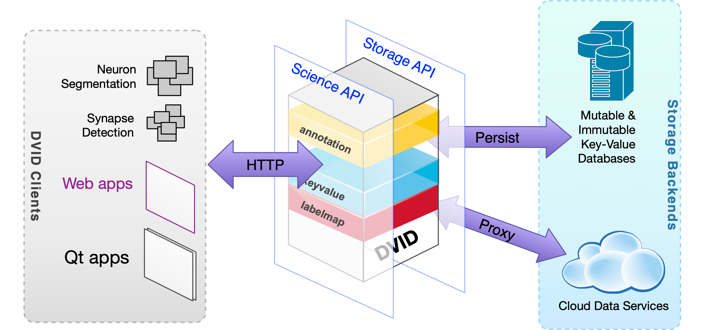

# Go语言爱好者周刊：第 78 期

这里记录每周值得分享的 Go 语言相关内容，周日发布。

本周刊开源（GitHub：[polaris1119/golangweekly](https://github.com/polaris1119/golangweekly)），欢迎投稿，推荐或自荐文章/软件/资源等，请[提交 issue](https://github.com/polaris1119/golangweekly/issues) 。

鉴于一些人可能没法坚持把英文文章看完，因此，周刊中会尽可能推荐优质的中文文章。优秀的英文文章，我们的 GCTT 组织会进行翻译。


题图：来自 @System32Comics

## 刊首语

2021 年 1 月 12 日，官方正式提出将泛型特性加入 Go 语言，且最新的草案设计已经更新，预计 Go1.18 加入泛型，官方博文见：<https://docs.studygolang.com/blog/generics-proposal>。

本期题目：以下代码输出什么？

```go
package main

import (
	"fmt"
  "time"
)

func main() {
	ch1 := make(chan int)
  go fmt.Println(<-ch1)
  ch1 <- 5
  time.Sleep(1 * time.Second)
}
```

A：5、B：不能编译；C：运行时死锁

## 资讯

1、[gofakeit 6.0.0 发布](https://github.com/brianvoe/gofakeit)

随机伪数据生成器。具有 160 多种功能，可用于生成名称，电子邮件，位置，颜色，用户代理等等。

2、[Bleve 2.0 发布](https://blevesearch.com/)

Go 全文搜索和索引。

3、[GoLand 计划保存时执行 go fmt](https://blog.jetbrains.com/go/2021/01/12/running-go-fmt-on-save/)

你觉得怎么样？

4、[Resty 2.4 发布](https://github.com/go-resty/resty)

用于 Go 的简单 HTTP 和 REST 客户端库。

## 文章

1、[2021 年这 8 种编程语言最流行：Go 入榜原来是这个原因](https://mp.weixin.qq.com/s/ZPdQ4V89df2z0jdpNi_6eQ)

怎样判断哪种编程语言最流行？正如要挑选最受欢迎的冰激凌一样，每个人都有自己的最爱。

2、[学到了：goroutine 可能使程序变慢](https://mp.weixin.qq.com/s/aolQTL-VOvNqEicC95kYZw)

下面，我们将会展示一个关于 for 循环的代码，将输入分成几个序列添加到 Goroutines 里面！

3、[请接收37岁老码农寒冬里给年轻人上的一节 Go 面经课](https://mp.weixin.qq.com/s/50uRQ5u-egBR7EAAPb48zw)

面试的公司是二线及以下。不包括阿里，头条，快手，美团，拼多多。面试的职位是 Go 后端研发。

4、[第 77 期周刊题解：关于 goroutine 数量的，你答对了吗？](https://mp.weixin.qq.com/s/0MFJD3Vu5gTaZf02JOUcBQ)

这道题的正确率很低。这篇文章给大家解惑！

5、[用 Go 如何实现精准统计文章字数](https://mp.weixin.qq.com/s/1QcQolmK7kV27YmxBpmmZA)

今天要聊的内容应该可以当做一道面试题，你可以先想想该怎么实现。

6、[惊呆了：我用这个 Go 框架一周实现了一个中台系统](https://mp.weixin.qq.com/s/LRyn60vJy_m14-U6nkJcXw)

使用 go-zero。

7、[为什么要学习更多的编程语言？同时认为 Go 是最佳](https://mp.weixin.qq.com/s/V2_rYXql47qiq0GT8bvAqg)

作者学了好几门语言。

8、[Golang 类型断言 vs 类型转换](https://mp.weixin.qq.com/s/DtrJ7yXvSPnaOfyRklpThQ)

这是一篇译文，原文出处：https://www.sohamkamani.com/golang/type-assertions-vs-type-conversions/。

9、[Go内置数据结构原理](https://zhuanlan.zhihu.com/p/341945051)

从C++切换到Go语言一年多了，有必要深入了解一下Go语言内置数据结构的实现原理，本文结合示例与Go源码深入到Go语言的底层实现。

10、[Golang 时间操作大全](https://mp.weixin.qq.com/s/p4MMRqPsuVRAKGfO_d4G0Q)

平时开发过程中，时间相关的操作用的还是很多的。接下来就与大家一起总结下与时间有关的操作，主要涉及到 time 包，核心数据结构是 time.Time。

11、[写一个 panic blame 机器人](https://mp.weixin.qq.com/s/y9pVNtC6w8Fn0Xqq6EonCw)

实现一个 panic blame 机器人比较简单，但考虑服务稳定性的话，还是有一些点要注意的。

12、[一文带你解密 Go 语言之通道 channel](https://mp.weixin.qq.com/s/ZXYpfLNGyej0df2zXqfnHQ)

这篇文章主要是针对 Go channel 的重点分析。

13、[聊聊 gorm 的 IsolationLevel](https://studygolang.com/articles/32566)

本文主要研究一下 gorm 的 IsolationLevel。

## 开源项目

1、[gocache](https://github.com/eko/gocache)

完整的 Go 缓存库，为你带来多种管理缓存的方式。

2、[go-oci8](https://github.com/mattn/go-oci8)

Oracle 的 Go 驱动，使用标准库 database/sql。

3、[juicefs](https://github.com/juicedata/juicefs)

基于 redis 和 S3 构建的分布式 POSIX 文件系统。

4、[go-jwt-middleware](https://github.com/auth0/go-jwt-middleware)

Go 编程语言中间件，用于检查 HTTP 请求上的 JWT。

5、[gobook](https://github.com/brendonmatos/gobook)

基于 golive 实现的在浏览器中运行的交互式解释器。

6、[GistFS](https://github.com/jhchabran/gistfs) 

实现了go 1.16的 io/fs 接口，支持从 github gist 读取文件。

7、[colorgrad](https://github.com/mazznoer/colorgrad)

Go 色标库，支持自定义颜色渐变、预设梯度、硬边渐变等色彩方案。

8、[sorvor](https://github.com/osdevisnot/sorvor)

适用于现代 Web 应用程序的超快速，零配置服务器。

9、[atoll](https://github.com/GGP1/atoll)

密码安全且高度随机的秘密生成器。

10、[dvid](https://github.com/janelia-flyem/dvid)

分布式，版本化，面向图的数据服务。



11、[heart](https://github.com/Hyperspace-Logistics/heart)

使用 Go 实现的高性能 lua web 服务器。

## 资源&&工具

1、[Go Slice Tricks Cheat Sheet](https://ueokande.github.io/go-slice-tricks/)

Go Wiki 上共享的“[切片技巧](https://github.com/golang/go/wiki/SliceTricks)”更直观的表示。

2、[act](https://github.com/nektos/act)

在本地运行 GitHub Action。

3、[re-txt](https://github.com/alash3al/re-txt)

将文本格式从一种转换为另一种，如果要将 json 文件重新格式化为 yaml，toml 为 yaml，csv 为 yaml 等，这非常有用。

4、[jira-cli](https://github.com/ankitpokhrel/jira-cli/)

jira 命令行交互工具。

5、[iron-chart-go](https://github.com/ironpeakservices/iron-chart-go)

基于 Github 自动部署 Go Web 服务。

6、[5 分钟内学习 Go](https://gist.github.com/prologic/5f6afe9c1b98016ca278f4d507e65510)（英文）

你觉得可能吗？

7、[Go 实现一个简单的编程语言](https://github.com/karminski/pineapple/blob/main/README-zh-CN.md)

它包含了个手写的递归下降解析器和一个简单的解释器。

8、[mnm](https://github.com/networkimprov/mnm)

一种电子邮件的替代品。

9、[go-git-semver](https://github.com/chrisDeFouRire/go-git-semver)

Go 编写的 git 的 semver 插件。

10、[播客第 162 期](https://changelog.com/gotime/162)

和 “CI/CD with Docker and Kubernetes” 一书作者一起谈 CI/CD。

11、[nancy](https://github.com/sonatype-nexus-community/nancy)

用于查找 Go 依赖包中漏洞的工具。

12、[swag](https://github.com/zc2638/swag)

一个规范且完整的框架，用于生成、描述、调用和可视化 RESTful 风格的 Web 服务。这里有一篇介绍文章：<https://studygolang.com/topics/12949>。

## 订阅

这个周刊每周日发布，同步更新在[Go语言中文网](https://studygolang.com/go/weekly)和[微信公众号](https://weixin.sogou.com/weixin?query=Go%E8%AF%AD%E8%A8%80%E4%B8%AD%E6%96%87%E7%BD%91)。

微信搜索"Go语言中文网"或者扫描二维码，即可订阅。


