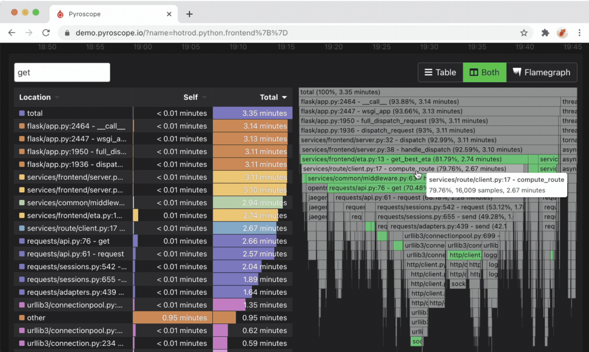
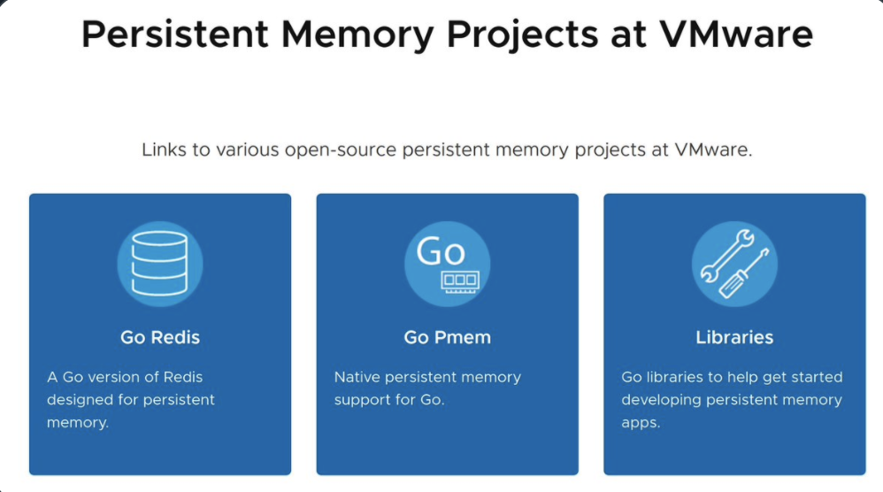
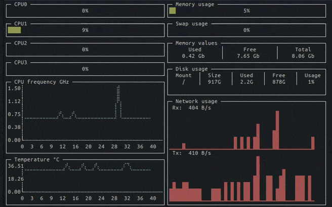

# Go语言爱好者周刊：第 79 期

这里记录每周值得分享的 Go 语言相关内容，周日发布。

本周刊开源（GitHub：[polaris1119/golangweekly](https://github.com/polaris1119/golangweekly)），欢迎投稿，推荐或自荐文章/软件/资源等，请[提交 issue](https://github.com/polaris1119/golangweekly/issues) 。

鉴于一些人可能没法坚持把英文文章看完，因此，周刊中会尽可能推荐优质的中文文章。优秀的英文文章，我们的 GCTT 组织会进行翻译。


题图：来自 twitter

## 刊首语

在 Twitter 看到一道题（从作者描述看，是工作中真实遇到的），超级变态，真是没有最变态，只有更变态。这里主要让大家看一下，日常绝不会遇到这样的情况吧。

```go
package main

import (
	"errors"
	"fmt"
)

func main() {
	еrr := errors.New("foo")
	var err error
	if еrr != nil {
		fmt.Printf("%T %v", err, err)
	}
}
```

以上代码，你有没有觉得很奇怪？咋一看，肯定编译不通过。你可以复制到文件中编译运行看看，或者直接访问该链接查看：<https://play.studygolang.com/p/Cj7T86gwEnO>。

这道“题”就看看玩笑一下~

## 资讯

1、[Go 1.15.7 新鲜出炉：修复安全问题，建议升级](https://mp.weixin.qq.com/s/L1b3tUPiZXP3CKdKrHOfEQ)

Go 官方刚刚发布了 Go 1.15.7 和 Go 1.14.14，以解决最近报告的安全问题。建议所有用户都更新到以下版本之一（如果不确定哪个版本，请选择 Go 1.15.7）。

2、[快报：Go 1.16 将会废弃 io/ioutil 包！](https://mp.weixin.qq.com/s/3wM-YWbGyw92PHeyvxgJZQ)

标记为弃用，不代表破坏兼容性，该包还是会保留，只是不建议使用了。相关 issue：<https://github.com/golang/go/issues/42026>。

3、[Go issue 43810](https://github.com/golang/go/issues/43810)

Go 对 persistent memory 的原生支持的提案。

## 文章

1、[第 78 期周刊题目解析：答题正确率有点低](https://mp.weixin.qq.com/s/1FiX1WU6GDkZrFxC-b8k8Q)

基础扎不扎实？！

2、[图书《Go 语言标准库》更新了：io/fs 包讲解](https://mp.weixin.qq.com/s/8ukhxjSPqK5e9wSJyKGTZA)

Go 1.16 新包 io/fs 长文解析。

3、[Unicode 和 UTF-8 是什么关系？本文为你解惑](https://mp.weixin.qq.com/s/6w0FYXN11wbuyj1IptAKEw)

相信看完对字符编码有更好的掌握。

4、[项目实战：使用 Go 构建 GraphQL API](https://mp.weixin.qq.com/s/bPeAxcrgK3SVIZT2t6JbvQ)

本博文中将使用 Go、GraphQL、PostgreSQL 创建一个 API。

5、[对未初始化的的 chan 进行读写，会怎么样？为什么？](https://mp.weixin.qq.com/s/zqfGjzKzoDTCyGCPRyHBXg)

关于 `chan` 的面试题非常多，这个是比较常见的其中一个。

6、[从这个问题谈起：channel 的哪些操作会引发 panic？](https://mp.weixin.qq.com/s/RVBeIjOf5I2WLcPi06JVmg)

主要讲解 channel 的一些应用场景。

7、[golang sync.Pool 在 1.14 中的优化](https://mp.weixin.qq.com/s/KbPELnB1an_7v_RyVtjpag)

基于 golang 1.14 对 sync.Pool 进行分析。

8、[字节跳动 Go RPC 框架 KiteX 性能优化实践](https://mp.weixin.qq.com/s/Xoaoiotl7ZQoG2iXo9_DWg)

KiteX 是字节跳动框架组研发的下一代高性能、强可扩展性的 Go RPC 框架。

9、[原来这样使用 Go HTTP 客户端才能获取更高性能](https://mp.weixin.qq.com/s/vamtQSnvYwgqf1adbqPY6w)

大多数语言都有提供各自的 HTTP 客户端，文章接下来部分我们将动手实践如何使用 Go 语言发起 HTTP 请求，并讨论其中有可能遇到的问题。

## 开源项目

1、[go-enry](https://github.com/go-enry/go-enry)

更快的编程语言检测库。

2、[goridge](https://github.com/spiral/goridge)

高性能的 PHP-to-Go IPC 桥接器。

3、[dragonboat](https://github.com/lni/dragonboat)

一个高性能纯 Go 语言实现的多组 Raft 共识算法库。

4、[statigz](https://github.com/vearutop/statigz)

在 Go 中使用 http 提供预压缩的嵌入式文件。基于 Go1.16。

5、[swaggerui](https://github.com/flowchartsman/swaggerui)

带自托管 swagger-ui 的 Go 服务器。

6、[pyroscope](https://github.com/pyroscope-io/pyroscope)

Go 实现的持续 profiling 平台，目前支持 Go、Ruby、Python 等。



7、[Pglet](https://github.com/pglet/pglet)

后端开发人员的 Web UI 框架。


8、[bitmaelum-suite](https://github.com/bitmaelum/bitmaelum-suite)

安全的电邮系统替代品（实验性）。

9、[pjson](https://github.com/tidwall/pjson)

Go 的 JSON 流解析器。作者 tidwall 好几个优秀库。

10、[go-pmem](https://github.com/jerrinsg/go-pmem)

支持 Go 的开源的 Native persistent memory 实现。



11、[gomoji](https://github.com/forPelevin/gomoji)

在 Golang 中使用表情符号的有用功能。

## 资源&&工具

1、[wuzz](https://github.com/asciimoo/wuzz)

想象下 curl，但可以使用文本 UI 来展示请求和响应头，参数等。


2、[sealos](https://github.com/fanux/sealos)

一条命令部署 Kubernetes 高可用集群。

3、[Go 播客第 163 期](https://changelog.com/gotime/163)

通过 CUE 配置赋能开发人员。

4、[whatchanged](https://github.com/axetroy/whatchanged)

Golang 编写的变更日志生成器，用于生成 Git 仓库的变更日志的工具，并且提供了[在线演示](https://axetroy.github.com/whatchanged/)。

5、[pitop](https://github.com/PierreKieffer/pitop)

基于 Raspberry Pi 4/3 终端的活动监视器。



## 订阅

这个周刊每周日发布，同步更新在[Go语言中文网](https://studygolang.com/go/weekly)和[微信公众号](https://weixin.sogou.com/weixin?query=Go%E8%AF%AD%E8%A8%80%E4%B8%AD%E6%96%87%E7%BD%91)。

微信搜索"Go语言中文网"或者扫描二维码，即可订阅。


