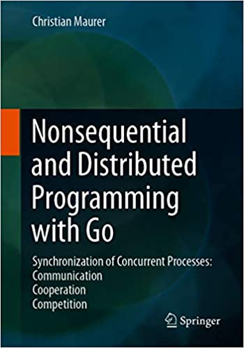
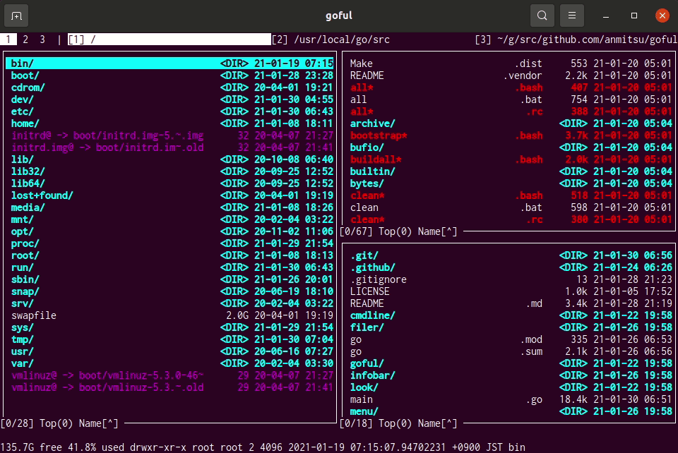
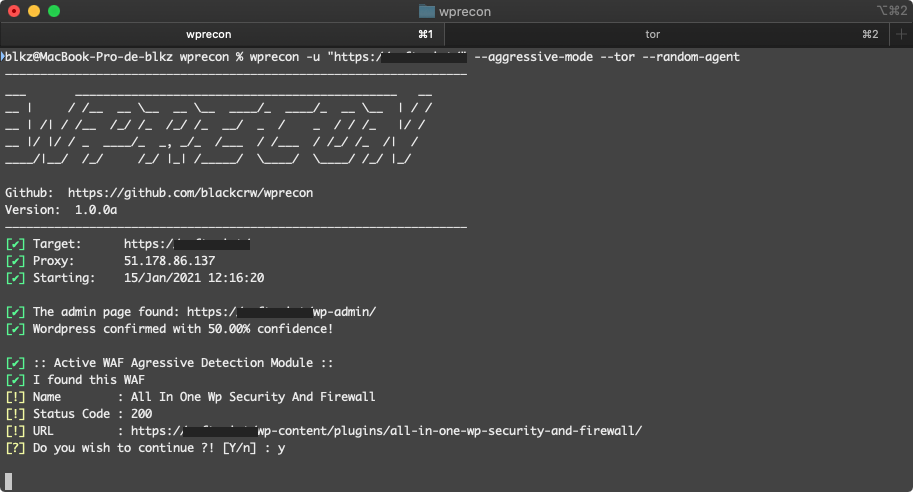

# Go语言爱好者周刊：第 80 期

这里记录每周值得分享的 Go 语言相关内容，周日发布。

本周刊开源（GitHub：[polaris1119/golangweekly](https://github.com/polaris1119/golangweekly)），欢迎投稿，推荐或自荐文章/软件/资源等，请[提交 issue](https://github.com/polaris1119/golangweekly/issues) 。

鉴于一些人可能没法坚持把英文文章看完，因此，周刊中会尽可能推荐优质的中文文章。优秀的英文文章，我们的 GCTT 组织会进行翻译。


题图：goful

## 刊首语

以下代码输出什么？

```go
package main

import (
	"unsafe"
	"fmt"
)

func main() {
	type T1 struct {
		a struct{}
		x int64
	}
	fmt.Println(unsafe.Sizeof(T1{}))

	type T2 struct {
		x int64
		a struct{}
	}
	fmt.Println(unsafe.Sizeof(T2{}))
}
```

A：8 8；B：8 16；C：16 16；D：16 8

## 谁在招 Gopher

整理近期的 Go 职位。有招聘需求可以到「Go招聘」发布！

1、[字节跳动教育业务研发岗太缺人了吧！！测试开发也招 Go](https://mp.weixin.qq.com/s/Zm5ZgNDFUmMiflwjovIiGA)

2、[阿里云边缘计算团队P7/8职位来了，北京/杭州可选](https://mp.weixin.qq.com/s/scvgOa-CcF3is8a0kxJeBA)

3、[推荐一个阿里 Go 实习岗：别错过跟着大牛提升的机会](https://mp.weixin.qq.com/s/VoFsMw2xlmXJ3DnlDQcG3g)

4、[小鱼儿给土拨鼠送苹果，要还是不要？](https://mp.weixin.qq.com/s/RtVG8UMSRwsiNcPUsySY3g)

## 资讯

1、[Go 1.16 RC1 发布](https://studygolang.com/topics/13048)

配置好 GOPROXY，可以直接如下安装试用。

1、[GopherCon Europe 2021](https://www.papercall.io/gceu2021)

2021 欧洲 GopherCon，线上进行，时间是 2021 年 5 月 26 ~ 28 日。

2、[Bill Kennedy 准备出 Go 新书了](https://twitter.com/goinggodotnet/status/1353801890820202497)

预计 2021 年 3 月出版。


3、[Delve 1.6.0 发布](https://github.com/go-delve/delve/blob/master/CHANGELOG.md#160-2021-01-28)

支持 Go1.16。

4、[go-reddit 2.0 发布](https://github.com/vartanbeno/go-reddit)

Reddit API 的 Go 封装。

5、[Vitess 9 发布](https://vitess.io/blog/2020-01-26-announcing-vitess-9/)

Vitess 是用于部署、扩展和管理大型 MySQL 实例集群的数据库解决方案。

6、[Springer 出版的 Go 新书](https://www.springer.com/gb/book/9783658297817)

书名《Nonsequential and Distributed Programming with Go》。



7、[Go 编译器和运行时会议记录常设 issue](https://github.com/golang/go/issues/43930)

方便社区了解 Go 编译器演进的最新情况。

## 文章

1、[关于 Go 是否会成为美国出口管制的讨论](https://mp.weixin.qq.com/s/f_dEKys-pFKm03Wde7e-MQ)

Go 不会受到影响，对此你有什么看法？

2、[函数是一等公民，这到底在说什么？](https://mp.weixin.qq.com/s/H3iuhkvQWonZbi7AzmokSA)

来自 Go 语言中文网微信群里的问题。

3、[知乎问答：为什么字节跳动选择使用 Go 语言？](https://mp.weixin.qq.com/s/qSRPEST7N1u8E0X90T-9ZA)

一鸣不喜欢 Java 亮了。

4、[Go 中的 SSRF 攻防战：对没看错，不是 CSRF](https://mp.weixin.qq.com/s/nTmdf9wseJgKem2oNksubw)

SSRF 英文全拼为 Server Side Request Forgery，翻译为服务端请求伪造。

5、[项目实战：用 Go 创建一个简易负载均衡器](https://mp.weixin.qq.com/s/pe0CQa3tdrUmC86OSRBNeg)

负载均衡器在 Web 架构中扮演了很关键的角色。它们能在一组后端机器分配负载。这使得服务扩展性更好。因为配置了很多的后端机器，服务也因此能在某次请求失败后找到正常运行的服务器而变得高可用。

6、[Go 1.17 要增加的模糊测试是什么鬼？通过本文了解下](https://mp.weixin.qq.com/s/CWwBl0A2hTJsr4VoBlZyjQ)

不出意外的话，2021 年 8 月份发布的 Go 1.17 会加入模糊测试。本文提前了解下相关技术，主要介绍第三方模糊测试包。

7、[Go 并发编程-信号量的使用方法和其实现原理](https://mp.weixin.qq.com/s/Pc9iWLvW7kfP-19QnaYYVA)

信号量是并发编程中常见的一种同步机制，在需要控制访问资源的线程数量时就会用到信号量

8、[Golang unsafe.Pointer 使用原则以及 uintptr 隐藏的坑](https://mp.weixin.qq.com/s/Z69DmbG6kVBFoODoE6mDrA)

使用 uintptr 始终要注意两点，哪两点？见文章。

9、[2020 年 Go 语言盘点：新冠大流行阻挡不了 Go 演进的步伐](https://mp.weixin.qq.com/s/HeMzxOUl96VPul1tpccYeQ)

在这篇文章中，我们就来做一下 2020 年 Go 语言的盘点，看看在 2020 年围绕 Go 语言、Go 社区和 Go 生态圈都发生了哪些有影响和有意义的事情。

10、[深入解析 Go 中 Slice 底层实现](https://mp.weixin.qq.com/s/8b6FudzXStKN3d6p8wYSqQ)

切片是 Go 中的一种基本的数据结构，使用这种结构可以用来管理数据集合。

11、[一文吃透 Go 语言解密之上下文 context](https://mp.weixin.qq.com/s/A03G3_kCvVFN3TxB-92GVw)

本文将对标准库 context 进行深入剖析，看看他里面到底暗含了何物，又为何能够做那么多事。

12、[提案：在Go语言中增加对持久化内存的支持](https://mp.weixin.qq.com/s/iXIf87-jjNrczai_bJXeGQ)

持久化存储器是一种新的存储器技术，其有接近 DRAM 的访问速度，并提供类似磁盘的持久化。Linux 和 Windows 服务器已经支持持久内存，服务器可用的商用硬件现在也已经推出了。关于这项技术的更多细节可以在 pmem.io 找到。

## 开源项目

1、[wire](https://github.com/google/wire)

编译期依赖注入库，谷歌出品。

2、[go-financial](https://github.com/razorpay/go-financial)

numpy-financial 的 Go 版本。

3、[MinDoc](https://github.com/lifei6671/mindoc)

基于 Beego 框架的接口在线文档管理系统。

4、[hego](https://github.com/ccssmnn/hego)

性能卓越的几种元启发式算法（黑盒优化算法）的 Go 实现。

5、[lz4](https://github.com/pierrec/lz4)

LZ4 压缩算法的 Go 实现。

6、[Berty](https://github.com/berty/berty)

一款安全的点对点消息传递应用程序。

7、[fixer](https://github.com/peterhellberg/fixer)

Go 实现的获取外汇汇率和货币转换 API。

8、[sabakan](https://github.com/cybozu-go/sabakan)

大型本地数据中心网络启动服务器。

9、[powergate](https://github.com/textileio/powergate)

基于 Filecoin 和 IPFS 的多层文件存储 API。

10、[Squzy](https://github.com/squzy/squzy)

一个用 Go 和 Bazel 编写的高性能开源监视、事件和警报系统。

## 资源&&工具

1、[goful](https://github.com/anmitsu/goful)

Goful 是一个 CUI 文件管理器。



2、[dyff](https://github.com/homeport/dyff)

用于 yaml 文件的 diff 工具。

3、[油管视频](https://www.youtube.com/watch?v=yczwWzkbFAQ&feature=youtu.be)

以 Gopher 视角看 Devops。

4、[pipecd/pipe](https://github.com/pipe-cd/pipe)

声明性 Kubernetes，无服务器和基础架构应用程序的持续交付工具。

5、[Go 内部 ABI 规范](https://github.com/golang/go/blob/dev.regabi/src/cmd/compile/internal-abi.md)

官方的文档。

6、[Wprecon-CMS](https://github.com/blackbinn/wprecon)

Wordpress 中的漏洞识别工具，100％ Go 语言开发。



7、[depaware](https://github.com/tailscale/depaware)

输出你的 Go 源码所有依赖，并标记所属平台以及是否使用 cgo/unsafe。

8、[team-manager](https://github.com/cilium/team-manager)

cillium 团队开源基于 GitHub 的团队管理实用程序。

9、[Litestream](https://github.com/benbjohnson/litestream)

用于 SQLite 的独立流复制工具。

## 订阅

这个周刊每周日发布，同步更新在[Go语言中文网](https://studygolang.com/go/weekly)和[微信公众号](https://weixin.sogou.com/weixin?query=Go%E8%AF%AD%E8%A8%80%E4%B8%AD%E6%96%87%E7%BD%91)。

微信搜索"Go语言中文网"或者扫描二维码，即可订阅。

