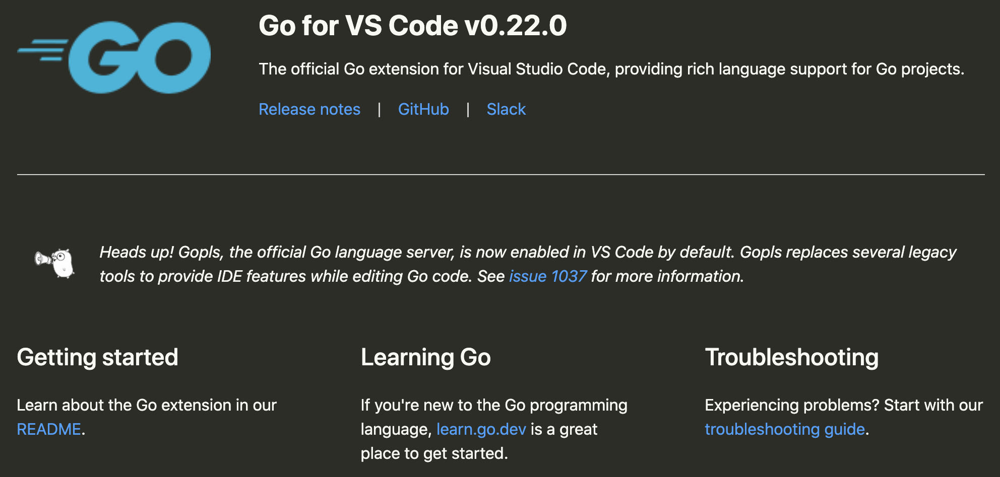
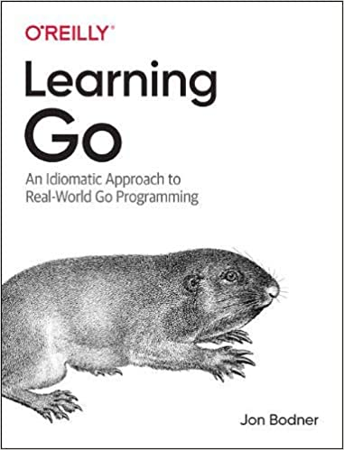

# Go语言爱好者周刊：第 81 期

这里记录每周值得分享的 Go 语言相关内容，周日发布。

本周刊开源（GitHub：[polaris1119/golangweekly](https://github.com/polaris1119/golangweekly)），欢迎投稿，推荐或自荐文章/软件/资源等，请[提交 issue](https://github.com/polaris1119/golangweekly/issues) 。

鉴于一些人可能没法坚持把英文文章看完，因此，周刊中会尽可能推荐优质的中文文章。优秀的英文文章，我们的 GCTT 组织会进行翻译。



题图：vscode-go 插件 v0.22.0 默认启用 gopls。

## 刊首语

这期周刊两道题。

题一：以下代码输出什么？

```go
package main

import (
	"fmt"
)

type MS struct {
	Name string
	Cgs  int
}

func main() {
	hashRun := make(map[string]*MS)
	mss := []MS{
		MS{Name: "m", Cgs: 100},
		MS{Name: "m", Cgs: 1},
	}
	for _, ms := range mss {
		if h, ok := hashRun[ms.Name]; ok {
			h.Cgs += ms.Cgs
		} else {
			hashRun[ms.Name] = &ms
		}
	}
	for _, ms := range hashRun {
		fmt.Println(ms.Cgs)
	}
}
```

A：101；B：100；C：1；D：2

题二：下面代码输出什么？

```go
package main

import (
  "fmt"
)

func main() {
  nums := []int{1, 2, 3, 4, 5}
  sum := 0
  for i, n := range nums {
    i = 6
    sum += n
  }
  fmt.Println(sum)
}
```

A：1；B：15；C：panic index out of range；D：doesn’t compile

## 谁在招 Gopher

整理近期的 Go 职位。有招聘需求可以到「Go招聘」发布！

1、[腾讯云存储/NoSQL 招聘 Go：腾讯喜欢开源作者](https://mp.weixin.qq.com/s/1b_c_HMecePUkf_OZ3jviw)

2、[金山云招这么多 Gopher？福利还真香](https://mp.weixin.qq.com/s/ct_W79AS7iWmXV2LW1bNzQ)

## 资讯

1、[Go 1.15.8 发布](https://mp.weixin.qq.com/s/sXJDOC5bhqfpI3qieCXi1g)

Go 官方发布了 Go 1.15.8 和 Go1.14.15，这是小版本更新。主要修复一些 bug。

2、[ent 0.6 发布](https://entgo.io/)

facebook 出品的 Entity 框架，简单而强大的 ORM，用于建模和查询数据。

3、[官博：VSCode Go 扩展默认将启用 gopls](https://docs.studygolang.com/blog/gopls-vscode-go)

VSCode 值得拥有。

4、[O’Reilly Go 新书《Learning Go》预售](https://www.amazon.com/Learning-Go-Idiomatic-Real-World-Programming/dp/1492077216/)

真实世界 Go 编程的惯用方法，英文版。



5、[Go 泛型提案进入“likely accept”阶段](https://github.com/golang/go/issues/43651#issuecomment-772720103)

真的不远了。

6、[gocenter 不建议使用了](https://jfrog.com/blog/into-the-sunset-bintray-jcenter-gocenter-and-chartcenter/)

JFrog 在 5 月 1 日将关闭 Bintray，JCenter，GoCenter 和 ChartCenter 服务，使用 JFrog GoCenter 作为 GOPROXY 的 gopher 可以切换到其他 GOPROXY 服务。

## 文章

1、[10 年 Java 经验者：你应该尝试 Go 的 7 个理由](https://mp.weixin.qq.com/s/UCtXcFr4XdE8WwJYK016gg)

本文作者是一位工作了 20+ 年的工程师，其中 10+ 年使用 Java，7+ 年使用 C#，最近 3+ 年使用 Go。文章的观点是作者的个人总结，提倡你尝试并使用 Go 语言。目前作者已经不使用 Java 和 C# 了。

2、[苦于没有 Go 实战项目？也许本文的一些想法可以试试](https://mp.weixin.qq.com/s/iAPe91YZEhVQZJ3QupDGFw)

实践是最好的学习！但新手学习完 Go 基础后，却不知道如何进行实践，因为很多人工作中还没有机会使用 Go。这里是一些对初学者友好的项目和资源，可以作为你项目实践的基础，甚至在将来项目中使用。

3、[Go 开发者 Top 6 IDE：你知道几个，又用哪个？](https://mp.weixin.qq.com/s/-z3jyFpsHh67MfPc4V9QWQ)

这个 Top 排行，没有直接数据支持，凭直觉的，哈哈哈哈哈。（其实也结合了部分网上资料，比如 2019 年官方的调查结果）。

4、[图解 Go GOMAXPROCS 和实时更新](https://mp.weixin.qq.com/s/Zqh6eFRo5TU01kQg35Hbdw)

GOMAXPROCS 控制着同时执行代码的 OS 线程的最大数量。这（GOMAXPROCS 值的设定）在程序启动期间，甚至在程序运行期间完成。一般来说，Go 将这个值设置为可用逻辑 CPU 的数量，但并不总是这样。

5、[怎么知道某个 API 是在哪个 Go 版本添加的？这个功能如何实现的](https://mp.weixin.qq.com/s/kbIhf3MRphlT_YxrSMKE6g)

因为 Go 的兼容性做的很好，很多人不太关心 Go 的具体版本。然而有时候可能会涉及到版本的问题，比如你想使用 strings.Builder，Go 版本就必须 >= 1.10，但以下代码在 Go1.10 却编译不通过。

[一文详解如何在调试过程中查找 Goroutine](https://mp.weixin.qq.com/s/3dKlH8tfopLYYGdUW8lN_A)

Goroutines 是大多数用 Go 编写的程序的重要组成部分。但是，使用大量 goroutines 会使程序难以调试。那怎么办？在此博文中，我们将介绍如何使用自定义数据为 goroutine 加上标签。

7、[深度解析 Sentinel Go 滑动窗口统计结构的设计](https://mp.weixin.qq.com/s/ax1lEicUDysFgcRgsou2Bg)

本文主要分析 Sentinel Go 流量指标统计底层滑动窗口的实现。

8、[四舍五入在 Go 语言中为何如此困难](https://mp.weixin.qq.com/s/hEHLOcvmUynK5eqJ1OhbCw)

四舍五入是一个非常常见的功能，在流行语言标准库中往往存在 Round 的功能，它最少支持常用的 Round half up 算法。

9、[在校生的万字长文：gRPC 实操指南（golang）](https://mp.weixin.qq.com/s/ZUQQEn4SVLYcIdbW-6YFZQ)

RPC 即远程调用协议，简单来说就是调用远程的函数。

10、[Go - 实现项目内链路追踪](https://mp.weixin.qq.com/s/IGYiCWvrHZUKRS2V__9R_A)

为什么项目内需要链路追踪？

11、[Go channel 的妙用](https://mp.weixin.qq.com/s/jAUfqu-5nbs8hcua_F7ueQ)

昨天在内网上看到一篇讲数据库连接的文章，列出了一些 sql 包的一些源码，我注意到其中取用、归还连接的方式非常有意思——通过临时创建的 channel 来传递连接。

12、[我做了一个Go语言的微服务工具包](https://mp.weixin.qq.com/s/wyysxxZnUXY_O_ZrckdSfw)

为了表达我对这种语言的热爱，我开发了一个工具包，以帮助希望使用 Go 来增强微服务的其他开发人员。

## 开源项目

1、[localizer](https://github.com/razor-1/localizer)

Go 本地化框架。

2、[go-tagexpr](https://github.com/bytedance/go-tagexpr)

字节跳动出品，一个有趣的 go struct 标签表达式语法，用于字段验证等。

3、[go-fluent-ffmpeg](https://github.com/modfy/go-fluent-ffmpeg)

fluent-ffmpeg 的 Go 语言实现。FFMPEG 是视频处理和编辑的命令行瑞士军刀。

4、[notify](https://github.com/nikoksr/notify)

发送通知到各种消息服务。支持 Discord, Microsoft Tems, Slack, Telegram, Pushbullet 和 Email 等。

5、[go-mysql-server](https://github.com/dolthub/go-mysql-server)

新轮子：纯 Go 实现的 mysql server 引擎。

6、[cdb](https://github.com/jbarham/cdb)

DJ Bernstein 的 cdb 常量数据库库的 Pure Go 实现。

7、[pongo2](https://github.com/flosch/pongo2)

可用于 Go 的类 Django 模板语法的模板语言。

8、https://github.com/jfyne/live

仅使用 Go 及其模板来编写交互式、实时 Web 应用程序，无需 js。

9、[s3fs](https://github.com/jszwec/s3fs)

Go1.16 filesystem 接口的 S3 存储实现。

10、[eventually-go](https://github.com/eventually-rs/eventually-go)

Go event sourcing 框架。

11、[franz-go](https://github.com/twmb/franz-go)

纯 Go 编写的全功能 kafka 客户端。

12、[macdriver](https://github.com/progrium/macdriver)

适用于 Go 的原生Mac API。

13、[paco](https://github.com/pacolang/paco)

Go 语言实现的静态编译型语言，目标是 C。

## 资源&&工具

1、[ticker](https://github.com/achannarasappa/ticker)

实时更新和位置跟踪的终端股票行情工具，Go 语言实现。


2、[yq](https://github.com/mikefarah/yq)

便携式命令行 YAML 处理器。[jq](https://github.com/stedolan/jq) 是从命令行使用 JSON 的流行工具 — 而 yq 使用 YAML。

3、[gapid](https://github.com/google/gapid)

Google 开源的图形 API 调试器，不过目前开发不活跃。

4、[Walrus](https://github.com/Clivern/Walrus)

Go 实现的快速，安全，可靠的系统备份工具，可备份诸如 MySQL，PostgreSQL，Redis，etcd 等。

5、[油管视频](https://www.youtube.com/playlist?list=PLLf6iaZKV_xsp2EKR7cgRZFW5u9yVuzBi)

精通 Go 标准库系列。

6、[眼睛会跟着鼠标移动的 Gopher](https://mp.weixin.qq.com/s/PgV2FRTmAOS6j3Oq3j83KA)

网址：<https://egonelbre.com/js/gopher/>，canvas 实现的。

7、[网址分享](https://instamock.tcardenas.me/)

为指定 Go 接口定义自动生成对应的接口实现。

8、[golang-cheat-sheet](https://github.com/a8m/golang-cheat-sheet)

Go 语法速查表。

## 订阅

这个周刊每周日发布，同步更新在[Go语言中文网](https://studygolang.com/go/weekly)和[微信公众号](https://weixin.sogou.com/weixin?query=Go%E8%AF%AD%E8%A8%80%E4%B8%AD%E6%96%87%E7%BD%91)。

微信搜索"Go语言中文网"或者扫描二维码，即可订阅。

