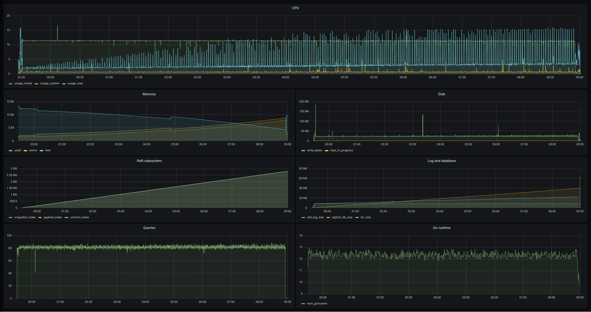
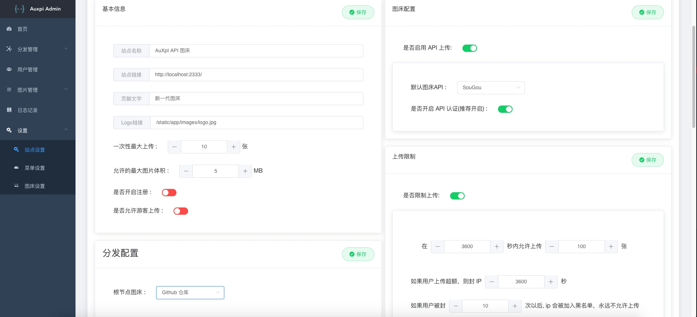

# Go语言爱好者周刊：第 82 期

这里记录每周值得分享的 Go 语言相关内容，周日发布。

本周刊开源（GitHub：[polaris1119/golangweekly](https://github.com/polaris1119/golangweekly)），欢迎投稿，推荐或自荐文章/软件/资源等，请[提交 issue](https://github.com/polaris1119/golangweekly/issues) 。

鉴于一些人可能没法坚持把英文文章看完，因此，周刊中会尽可能推荐优质的中文文章。优秀的英文文章，我们的 GCTT 组织会进行翻译。

题图：新春快乐

## 刊首语

新年，不出题目了。了解了解 Go 相关资讯即可。新年快乐！今天还是情人节，祝天下有情人终成眷属！

Go 牛年晚会感觉还是挺不错的，感谢大家支持！

白天陪娃，只能半夜来整理周刊！感谢大家多多支持！

## 谁在招 Gopher

整理近期的 Go 职位。有招聘需求可以到「Go招聘」发布！

1、[加入米哈游，技术宅拯救世界](https://mp.weixin.qq.com/s/vQK4NE1v0nbqswrMDpfefQ)

## 资讯

1、[泛型最终确认](https://mp.weixin.qq.com/s/1L5o1OdurO_7XgoVNj_8pw)

目前应该会按原计划发布。对，2021 年底发布 Beta 版！

2、[GoLand 2021.1 EAP build #2 发布](https://blog.jetbrains.com/2021/02/05/goland-2021-1-eap-2/)

支持 Go 1.16 的 go:embed。

3、[rqlite 5.10.0 发布](https://www.philipotoole.com/rqlite-5-10-0-released-comparing-its-disk-usage-to-5-6-0/)

rqlite 是用 Go 语言编写的轻量级分布式关系数据库系统，使用 SQLite 作为其存储引擎。 5.10.0 非常注重减少磁盘使用量。

4、[v8go 0.5 发布](https://github.com/rogchap/v8go/releases/tag/v0.5.0)

Go 中支持 JavaScript。

5、[Wasmer Go 1.0](https://github.com/wasmerio/wasmer-go)

Go 语言 WebAssembly Runtime。

6、[Solr-Go 0.2 发布](https://sf9v.github.io/posts/solr-go-0.2-released/)

Solr 的 Go 客户端。

7、[Fiber 2.5.0 发布](https://github.com/gofiber/fiber)

受 Express.js 启发的 Web 框架。

8、[Resty 2.5 发布](https://github.com/go-resty/resty)

Go 的简单 HTTP 和 REST 客户端库。

9、[bitbar](https://github.com/matryer/bitbar/issues/607)

Mat Ryer 重启 bitbar 开发，这次用 Go。

10、[Go GC Pacer 重设计的草案](https://github.com/golang/go/issues/44167)

英文的。

## 文章

1、[聊聊近期出版或将出版的几本 Go 图书](https://mp.weixin.qq.com/s/8sgn-skCiB8eajjYkSXVgA)

几本不错的书。

2、[图解 Go Select 语句的执行顺序](https://mp.weixin.qq.com/s/Elk2u0UZXoW1Hbn03QfNEg)

select 允许在一个 goroutine 中管理多个 channel。但是，当所有 channel 同时就绪的时候，go 需要在其中选择一个执行。此外，go 还需要处理没有 channel 就绪的情况，我们先从就绪的 channel 开始。

3、[Go：符号表是什么？如何利用](https://mp.weixin.qq.com/s/_jxmbfML5bkqUjFcC7MBKg)

符号表是由编译器生成和维护的，保存了与程序相关的信息，如函数和全局变量。理解符号表能帮助我们更好地与之交互和利用它。

4、[Dave 大神解释 Go 1.14 中接口的菱形组合](https://mp.weixin.qq.com/s/nPYfxCV0E2u42S9BlObp9Q)

按照部分重叠的接口提议，Go 1.14 现在允许嵌入有部分方法重叠的接口。本文是一篇解释这次修改的简要说明。

5、[为 Go 打造一个原生 GUI 程序是一种什么体验？](https://mp.weixin.qq.com/s/t7WU7Zg4u2dhlb6S3yRjVA)

本文是 macdriver 作者写的，这是一个 Go 语言的 Objective-C 桥接器，使得 Go 可以使用 Mac API。如果做过 Apple 相关应用开发，可以试试这个。

6、[Golang WaitGroup 原理深度剖析](https://mp.weixin.qq.com/s/CkSd2aldYaoLbd-IKhkpWg)

sync.WaitGroup 是 Golang 中常用的并发措施，我们可以用它来等待一批 Goroutine 结束。

7、[官方文档：管理 go module 依赖](https://tip.golang.org/doc/modules/managing-dependencies)

自己解决访问问题。

## 开源项目

1、[agogo](https://github.com/gorgonia/agogo)

AlphaGo 的 Go 实现。

2、[go-libp2p](https://github.com/libp2p/go-libp2p)

libp2p 的 Go 实现。

3、[copyist](https://github.com/cockroachdb/copyist)

在 Go 测试中模拟 SQL 数据库的方法。

4、[kube-batch](https://github.com/kubernetes-sigs/kube-batch)

Kubernetes 批处理任务调度器。

5、[magma](https://github.com/magma/magma)

一个开源软件平台，可为网络运营商提供开放，灵活和可扩展的移动核心网络解决方案。

6、[notify](https://github.com/nikoksr/notify)

一个简单、用于将通知发送到各种消息服务(支持 mail，slack，microsoft team 等)的 Go 库。

7、[go-json](https://github.com/goccy/go-json)

高性能且兼容 encoding/json 的 json 编解码库。

8、[hdfs](https://github.com/colinmarc/hdfs)

Go 实现的 HDFS 客户端。

9、[dither](https://github.com/makeworld-the-better-one/dither)

Go 图像抖动算法库。

## 资源&&工具

1、[chk](https://github.com/Ripolak/chk)

用于检查各种协议下从本地计算机到远程目标的连接的小工具。

2、[auxpi](https://github.com/0xDkd/auxpi)

集合多家 API 的新一代图床。

3、[git-chglog](https://github.com/git-chglog/git-chglog)

Go 实现的 changelog 生成器。

4、[Osiris-pwm](https://github.com/Gyro7/Osiris-pwm)

一个基于 Fyne GUI 的轻量级密码管理工具。

5、[faker](https://github.com/jaswdr/faker)

零依赖的终极 fake 数据生成器，Go 实现。

6、[tcpdog](https://github.com/mehrdadrad/tcpdog)

基于 eBPF 的 TCP 观察工具。

7、[logit](https://github.com/life4/logit)

将 json 格式的 log 聚合存储。

8、[WirePenguin](https://github.com/pwdz/WirePenguin)

Go实现的网络包嗅探工具。

9、[gin-annotation](https://github.com/1-st/gin-annotation)

用于实现 gin annotation 的命令行工具。

10、[go-resume](https://github.com/penguingovernor/go-resume)

简历创建工具。

11、[gomodest-template](https://github.com/adnaan/gomodest-template)

使用 Go，html 和 javascript 快速构建动态 Web 应用程序的模板。

## 订阅

这个周刊每周日发布，同步更新在[Go语言中文网](https://studygolang.com/go/weekly)和[微信公众号](https://weixin.sogou.com/weixin?query=Go%E8%AF%AD%E8%A8%80%E4%B8%AD%E6%96%87%E7%BD%91)。

微信搜索"Go语言中文网"或者扫描二维码，即可订阅。

