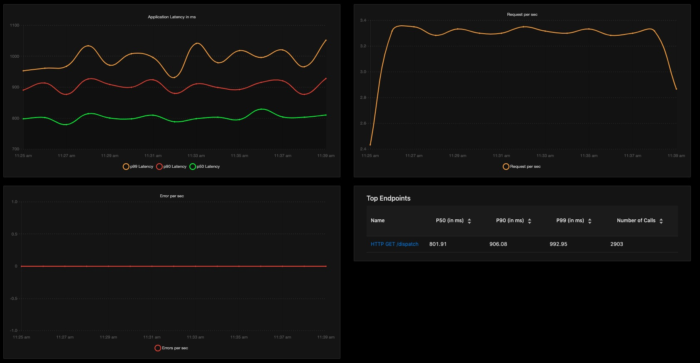

# Go语言爱好者周刊：第 83 期

这里记录每周值得分享的 Go 语言相关内容，周日发布。

本周刊开源（GitHub：[polaris1119/golangweekly](https://github.com/polaris1119/golangweekly)），欢迎投稿，推荐或自荐文章/软件/资源等，请[提交 issue](https://github.com/polaris1119/golangweekly/issues) 。

鉴于一些人可能没法坚持把英文文章看完，因此，周刊中会尽可能推荐优质的中文文章。优秀的英文文章，我们的 GCTT 组织会进行翻译。

题图：Go1.16 变化一览，来自 Reddit。

## 刊首语

这回所有人应该都过完春节要上班了吧。Go 1.16 也已经发布，几个重要的新功能大家可以试用试用。祝各位牛年财源滚滚，技术不断高升。今天就不出题了~

## 谁在招 Gopher

整理近期的 Go 职位。有招聘需求可以到「Go招聘」发布！

1、[成都同程艺龙来招Gopher啦！！！](https://mp.weixin.qq.com/s/xw2AhvbY15f0qnnL-AsiqA)

## 资讯

1、[来了来了！Go1.16 重磅发布](https://mp.weixin.qq.com/s/eqquyrWN0CqEzmwXquRlAA)

embed 包和 Apple M1 支持等。

2、[esbuild 越来越受欢迎](https://esbuild.github.io/faq/#why-is-esbuild-fast)

这是一个 Go 实现的，非常快速的 JavaScript 捆绑器。

3、[GoLand 2021.2 EAP 3](https://blog.jetbrains.com/go/2021/02/12/goland-2021-1-eap-3/)

go:embed 支持，同时还可以针对远程目标进行编译。

4、[Logrus 1.8 发布](https://github.com/sirupsen/logrus)

功能丰富的结构化 Logger。

5、[Dapr 1.0 发布](https://dapr.io/)

可移植，事件驱动的分布式应用程序运行时。

6、[Go1.17 快报：将移除 GOPATH](https://mp.weixin.qq.com/s/Lwt5c9Z5TD7TAg7-Yt6wAA)

官方计划在 Go1.17 移除 GOPATH。

7、[利好！极大可能在 Go 1.17 中就能尝试泛型](https://mp.weixin.qq.com/s/WPVYDKW5a-h9M8yzijO6bg)

泛型代码已经合入 master 分支。

## 文章

1、[我与 sync.Once 的爱恨纠缠](https://mp.weixin.qq.com/s/7IrUm-jxIlgmOLe9Tao4DA)

官方描述 Once is an object that will perform exactly one action。

2、[golang 面试题：能说说 uintptr 和 unsafe.Pointer的区别吗？](https://mp.weixin.qq.com/s/zY-sqds-DhbdqzKq4pAupg)

灵魂拷问！

3、[Go 语言标准库中 atomic.Value 的前世今生](https://mp.weixin.qq.com/s/9aNfjX2UMQKLLgSW037_uQ)

在 Go 语言标准库中，sync/atomic 包将底层硬件提供的原子操作封装成了 Go 的函数。

4、[Go 官博：正式提案将泛型加入 Go](https://mp.weixin.qq.com/s/TXUMh5nfCNLaTRIifnMLDA)

泛型不远了。

5、[Go：gops 如何与 runtime 交互？](https://mp.weixin.qq.com/s/xyG7KYb72qIbmdEZep35Sg)

gops 旨在帮助开发人员诊断 Go 进程并与之交互。

6、[从 Go 的二进制文件中获取其依赖的模块信息](https://juejin.cn/post/6930762439201914893)

我们用 Go 构建的二进制文件中默认包含了很多有用的信息。

7、[那些年我们一起追过的大佬](https://mp.weixin.qq.com/s/x2W8Rf1e-a9dSYE53Lu1DA)

Go 语言中文网牛年春晚饶大的分享文字版。

8、[Go 中可取消的读取操作](https://mp.weixin.qq.com/s/eitsMVVqnd3l2xWyrURoDA)

在使用 Go 进行工作时，使用 io.Reader 和 io.Writer 接口是最常见的情场景之一。这很合理，它们是数据传输的主力接口。

## 开源项目

1、[kiara](https://github.com/genkami/kiara)

一个 Pub Sub 的抽象库,支持 Redis、NATS。

2、[wasmer](https://github.com/wasmerio/wasmer-go)

一个 Go WebAssembly 运行时的实现。

3、[tailetc](https://github.com/tailscale/tailetc)

全内存缓存的 etcd v3 客户端。

4、[opentracing](https://github.com/go-gorm/opentracing)

对 gorm2 的 opentracing 支持。

5、[Terratest](https://github.com/gruntwork-io/terratest)

一个可以轻松地为基础结构代码编写自动化测试的 Go 库。

6、[esme](https://github.com/stkr89/esme)

通过 json 配置生成一个模拟 rest 服务。

7、[dither](https://github.com/makeworld-the-better-one/dither)

一个高效、正确的图像抖动处理类库。

8、[haraqa](https://github.com/haraqa/haraqa)

一个可伸缩消息队列，用于微服务之间的数据持久性和实时数据流传输。

9、[vektor](https://github.com/suborbital/vektor)

快速构建生产级的 Web 服务。

10、[pjson](https://github.com/tidwall/pjson)

Go json 流解析器。

11、[web-dev-golang-anti-textbook](https://github.com/thewhitetulip/web-dev-golang-anti-textbook)

不使用框架进行 Go Web 开发。

## 资源&&工具

1、[Go 安全性备忘单：8 个安全性最佳实践](https://snyk.io/blog/go-security-cheatsheet-for-go-developers/)

英文的。如何写出安全的 Go 代码。

2、[5 分钟学习 embed 包](https://www.youtube.com/watch?v=mBNIZHHi5Rg&feature=youtu.be)

视频教程，英文的。

3、[pgcenter](https://github.com/lesovsky/pgcenter)

用于观察和排除 Postgres 的命令行工具。目前只支持 Linux 系统。

4、[textnote](https://github.com/dkaslovsky/textnote)

用于在命令行上创建和组织日常笔记的简单工具。

5、[mdconv](https://github.com/Palexer/mdconv)

一款终端使用的 markdown 转换器,支持转为 HTML 和 PDF。

6、[pcp](https://github.com/dennis-tra/pcp)

基于 libp2p 的命令行对等数据传输工具。

7、[signoz](https://github.com/SigNoz/signoz)

开源的可观察性平台。Datadog 替代品。

8、[go-wasm-http-server](https://github.com/nlepage/go-wasm-http-server)

在浏览器中部署 Go HTTP 服务器。

9、[GopherCon TW 2020](https://space.bilibili.com/756684/channel/detail?cid=169470)

同胞的 Go 大会。

10、[Go 语言中文网牛年春晚回放来咯！！！](https://mp.weixin.qq.com/s/IWsv8__Xj1aj-XrzLuTrBg)

3 个多小时，有美女哦！

11、[infracost](https://github.com/infracost/infracost)

Terraform 项目的云成本估算工具。

12、[go-ml-benchmarks](https://github.com/nikolaydubina/go-ml-benchmarks)

Go 机器学习框架的性能基准测试对比。

13、[Go 播客第 167 期](https://changelog.com/gotime/167)

阅读文档的艺术。

14、[shhgit](https://github.com/eth0izzle/shhgit)

代码仓库中敏感信息的检测工具。

15、[gdlv](https://github.com/aarzilli/gdlv)

Go 调试器 dlv 的图形化前端。

## 订阅

这个周刊每周日发布，同步更新在[Go语言中文网](https://studygolang.com/go/weekly)和[微信公众号](https://weixin.sogou.com/weixin?query=Go%E8%AF%AD%E8%A8%80%E4%B8%AD%E6%96%87%E7%BD%91)。

微信搜索"Go语言中文网"或者扫描二维码，即可订阅。

