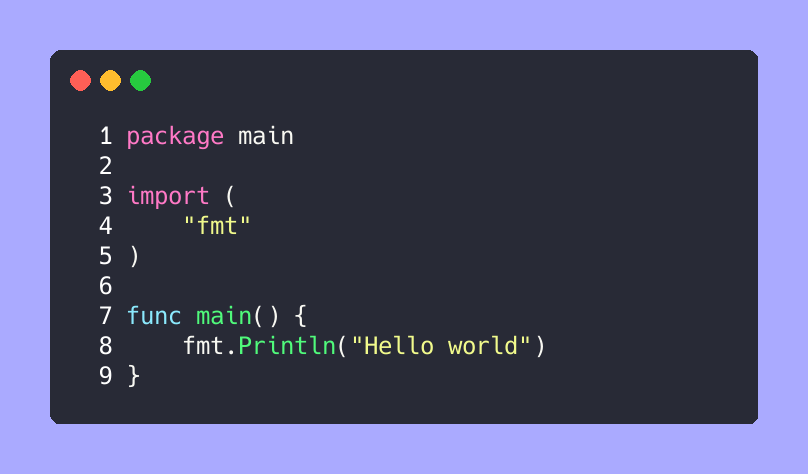

# Go语言爱好者周刊：第 84 期

这里记录每周值得分享的 Go 语言相关内容，周日发布。

本周刊开源（GitHub：[polaris1119/golangweekly](https://github.com/polaris1119/golangweekly)），欢迎投稿，推荐或自荐文章/软件/资源等，请[提交 issue](https://github.com/polaris1119/golangweekly/issues) 。

鉴于一些人可能没法坚持把英文文章看完，因此，周刊中会尽可能推荐优质的中文文章。优秀的英文文章，我们的 GCTT 组织会进行翻译。


题图：Go is not easy language

## 刊首语

Go101 作者出的一道题，有点意思：

```go
package main

func main() {
  println(f(1))
}

func f(x int) (_, __ int) {
  _, __ = x, x
  return
}
```

A：0 0；B：0 1；C：1 1；D：1 0

## 谁在招 Gopher

整理近期的 Go 职位。有招聘需求可以到「Go招聘」发布！

1、[安全企业竹云科技来寻Gopher了](https://mp.weixin.qq.com/s/_qWxAfI32gsHj30s1uncUA)

2、[成都招聘 Go 开发工程师的真不少](https://mp.weixin.qq.com/s/8kU7UlwiDh0sc4_HAdXLIQ)

3、[字节跳动招 Go 要求这么低的吗？这么缺人？](https://mp.weixin.qq.com/s/wizc4W9yo0-3hI5s_nh32A)

4、[上海扩博智能招Gopher，奖金真不少](https://mp.weixin.qq.com/s/R1vkcT1qnMbQPF3oasY7LA)

5、[金三银四，聊聊换工作的那些事](https://mp.weixin.qq.com/s/kaOIwV50zUvHv8tIjejFxA)

6、[Golang 校招面经](https://mp.weixin.qq.com/s/Ojz3qRCrZwmkyO9B_4k17Q)

## 资讯

1、[GoMock 1.5.0 发布](https://github.com/golang/mock)

Go 官方的 Mock 框架。

2、[go-ipfs 0.8.0 发布](https://github.com/ipfs/go-ipfs)

IPFS（InterPlanetary File System）是用于组织分布式文件系统的对等协议和网络。

3、[scc 3.0 发布](https://github.com/boyter/scc)

与 cloc，sloccount 和 tokei 类似的工具。用于计数许多编程语言中的代码行，空行，注释行和源代码的物理行。

4、[gohugo v0.81.0 发布](https://gohugo.io/news/0.81.0-relnotes/)

原生支持 apple m1。

5、[新提案](https://github.com/golang/go/issues/44551)

Go 1.17 在 go test 框架中原生增加对 fuzz test 的支持。

6、[GoLand 2021.1 EAP 5 发布](https://blog.jetbrains.com/go/2021/02/26/goland-2021-1-eap-5/)

新的 Postfix 完成，内置的 goimports-本地支持，更好的 Go 1.16 支持等等。

7、[有人计划写 Go 泛型图书了](https://leanpub.com/generic-golang)

动作很快。

## 文章

1、[从 go-chi 框架撤回所有主版本聊 Go1.16 的新特性](https://mp.weixin.qq.com/s/mBJ3hQ6oR1V9YtdXpkTnow)

但 chi 作者还是妥协了，最近刚发布了 [v5.0.0 版本](https://github.com/go-chi/chi/releases/tag/v5.0.0)。

2、[韩信大招：一致性哈希](https://mp.weixin.qq.com/s/eAQ1_Lsmd57DJWMFH60cgQ)

韩信点兵的成语来源淮安民间传说。常与多多益善搭配。寓意越多越好。

3、[Go 高效截取字符串的一些思考](https://mp.weixin.qq.com/s/WtZ93UrpMiEZDSK80CBrWQ)

一个看似简单问题的思考过程

4、[Go 官方应该搞一个类似 Rustup 的管理工具](https://mp.weixin.qq.com/s/uqKl8u8Tyz1-d0Ew3dpVJQ)

你觉得呢？

5、[克制挺难的](https://mp.weixin.qq.com/s/Dfclabvj-sea3dMurKzF5w)

Go 泛型会被乱用吗？

6、[类似 csv 的数据日志组件设计与 Go 实现](https://mp.weixin.qq.com/s/qCVKQCl-LxUbGyQ7HP0sDg)

我们业务每天需要记录大量的日志数据，且这些数据十分重要，它们是公司收入结算的主要依据，也是数据分析部门主要得数据源，针对这么重要的日志，且高频率的日志，我们需要一个高性能且安全的日志组件，能保证每行日志格式完整性，我们设计了一个类 csv 的日志拼接组件

7、[滴滴：如何提高代码的可读性，以 Go 为例！](https://mp.weixin.qq.com/s/FUOUEWOFr-NMJkqZHHengw)

本文整理自 taowen 在滴滴内部的分享。

8、[一文完全掌握 Go math/rand](https://mp.weixin.qq.com/s/dbdP_Jz9OHCuLO1ffOmCNg)

Go 获取随机数是开发中经常会用到的功能, 不过这个里面还是有一些坑存在的, 本文将完全剖析 Go math/rand, 让你轻松使用 Go Rand。

9、[Go 还是需要泛型的](https://mp.weixin.qq.com/s/JlNlq8KAZ3jULwkPpXuxzQ)

曹大的分享。

10、[灵魂拷问 Go 语言：这个变量到底分配到哪里了？](https://mp.weixin.qq.com/s/mFfza7DayFqsiS93Ep15BA)

一起来深挖下 Go 在这块的奥妙，自己动手丰衣足食！

11、[实习生 Gopher 给大家送一份微芯研究院面经](https://mp.weixin.qq.com/s/m5-vhsqEc0o-tRrTUXfF2Q)

可以看看。

## 开源项目

1、[Container-lang](https://github.com/odddollar/Container-lang)

纯 Go 实现的编程语言。

2、[FrodoKEM 的 Go 实现](https://github.com/kuking/go-frodokem)

frodokem 是一个实用量子安全密钥封装。

3、[gofp](https://github.com/rbrahul/gofp)

Javascript 的 lodash 函数库的 Go 移植。

4、[dendrite](https://github.com/matrix-org/dendrite)

用 Go 编写的第二代 Matrix 家庭服务器。

5、[gostruct](https://github.com/itsubaki/gostruct)

运行时动态构建结构体类型示例。

6、[kure](https://github.com/GGP1/kure)

终端命令行形式的密钥管理器。

7、[deferfuzz](https://github.com/mdempsky/deferfuzz)

用于对 Go defer/panic/recover 进行 fuzztest。

8、[seof](https://github.com/kuking/seof)

golang os.File 的加密替换文件，存储的文件将具有 768 位加密。

9、[iouring-go](https://github.com/Iceber/iouring-go)

基于 Linux 5.1 新增的异步接口 io_uring ，结合 golang 的异步机制实现的易用的异步 IO 框架。[作者自荐](https://github.com/polaris1119/golangweekly/issues/32)。

## 资源&&工具

1、[mubeng](https://github.com/kitabisa/mubeng)

高性能代理检查器和 IP 旋转器。

2、[germanium](https://github.com/matsuyoshi30/germanium)

将源码转换为图片的命令行工具。



3、[油管视频](https://www.youtube.com/watch?v=sTFJtxJXkaY)

详解 Go 指针。

4、[Go 博客第 168 期：那些不该加入 Go 的提案](https://changelog.com/gotime/168)

分两部分，第一部分[在这里](https://changelog.com/gotime/166)。

5、[lgo](https://github.com/yunabe/lgo)

Jupyter 交互的 Go 编程。

6、[cogs](https://github.com/Bestowinc/cogs)

Go 实现配置管理 cli。

7、[transfer.sh](https://github.com/dutchcoders/transfer.sh)

从命令行轻松快速地共享文件。

8、[go-mysql-transfer](https://github.com/wj596/go-mysql-transfer)

一款MySQL数据库实时增量同步工具。能够监听MySQL二进制日志(Binlog)的变动，将变更内容形成指定格式的消息，实时发送到接收端。从而在数据库和接收端之间形成一个高性能、低延迟的增量数据同步更新管道。[作者自荐](https://github.com/polaris1119/golangweekly/issues/31)。

## 订阅

这个周刊每周日发布，同步更新在[Go语言中文网](https://studygolang.com/go/weekly)和[微信公众号](https://weixin.sogou.com/weixin?query=Go%E8%AF%AD%E8%A8%80%E4%B8%AD%E6%96%87%E7%BD%91)。

微信搜索"Go语言中文网"或者扫描二维码，即可订阅。


