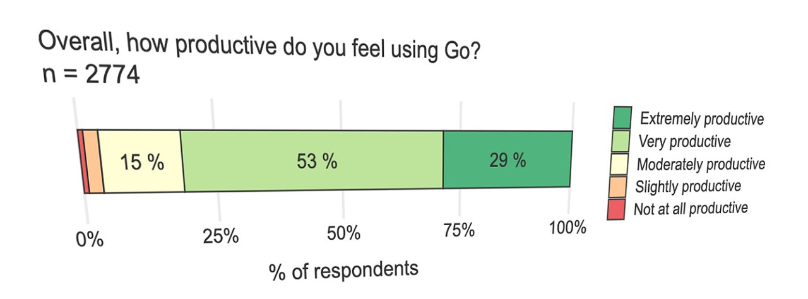
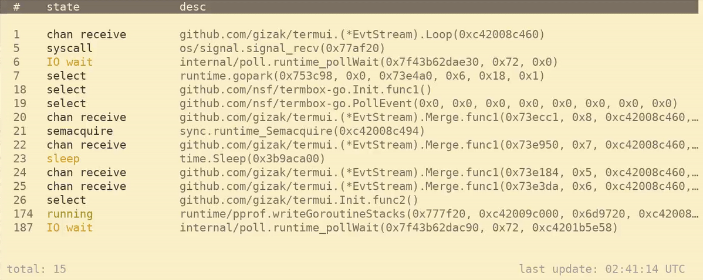

# Go语言爱好者周刊：第 86 期

这里记录每周值得分享的 Go 语言相关内容，周日发布。

本周刊开源（GitHub：[polaris1119/golangweekly](https://github.com/polaris1119/golangweekly)），欢迎投稿，推荐或自荐文章/软件/资源等，请[提交 issue](https://github.com/polaris1119/golangweekly/issues) 。

鉴于一些人可能没法坚持把英文文章看完，因此，周刊中会尽可能推荐优质的中文文章。优秀的英文文章，我们的 GCTT 组织会进行翻译。



题图：Go 官方 2020 年开发者调查报告。报告详细内容可以阅读翻译版：[Go 官方 2020 年开发者调查报告](https://mp.weixin.qq.com/s/mw3ktRLNL9H4m32Es_nU_A)。

## 刊首语

以下程序输出什么？

```go
package main

import (
	"fmt"
)

func main() {
	ch := 'b'
	fmt.Println(ch/2.0)
}
```

A：编译错误；B：49.0；C：49

## 谁在招 Gopher

整理近期的 Go 职位。有招聘需求可以到「Go招聘」发布！

1、[单身的Gopher快来‘探探’路](https://mp.weixin.qq.com/s/wCMKDJfcZQ0gAaLIjqXr7A)

2、[计算机系统最底层、最具挑战的领域招 Go，敢不敢来？](https://mp.weixin.qq.com/s/N8J7V_GHjXR5F7bpJH2wLg)

3、[360 加大 Go 招聘，Go 形势大好！你来吗？](https://mp.weixin.qq.com/s/F5SP2s1PrEHx_3IyszCC1Q)

4、[什么？腾讯招前端竟然希望熟悉 Go](https://mp.weixin.qq.com/s/a_fYCkgzmVkieU8YvreJ-w)

5、[珠海怎么样？好几个 Go 相关职位等你来](https://mp.weixin.qq.com/s/11wwK7L1Sfh_64eHVQAPUg)

## 资讯

1、[Go1.16.2 和 Go1.16.1 发布](https://studygolang.com/dl)

参考：[快一个月，Go1.16 才发现了比较严重的 Bug，但这个 Bug 有点 Low。。。](https://mp.weixin.qq.com/s/AddZm8qaWBY-Hgexq6tWkA)，以及文章 [为什么 Go1.16.1 发布的第二天又发布 1.16.2？](https://mp.weixin.qq.com/s/mbMCxhmz8pF8VUMKm3XYtA)。

2、[pixelizer 2.0 发布](https://github.com/eleby/pixelizer)

高效的图片素化器。

3、[TinyGo 0.17.0 发布](https://github.com/tinygo-org/tinygo/releases/tag/v0.17.0)

适用于嵌入式。

4、[vscode-go 将 staticcheck 作为默认 lint 工具](https://github.com/golang/vscode-go/commit/fd0328225d16ecc97e09e72c8c354cf106928984)

目前默认是 golint。

5、[图书《Go 语言编程之旅》开源](https://golang2.eddycjy.com/)

我和煎鱼写的图书，免费让大家阅读。感谢支持！

6、[Go 文档和代码阅读神器 Golds 已更新到 0.2.x 版本了](https://mp.weixin.qq.com/s/uVX1hQzE6Qc0p-JiTd5ytQ)

Go101 作者出品。

7、[Kubernetes 稳定性保障手册 -- 极简版](https://mp.weixin.qq.com/s/Udl25deXsEo7qc_2MAmpFg)

Kubernetes 在生产环境中的采用率越来越高，复杂度越来越高，由此带来的稳定性保障的挑战越来越大。

## 文章

1、[Go：死锁是如何触发的？](https://mp.weixin.qq.com/s/ZezoXyGn0HA-8j7yForU6Q)

死锁是当 Goroutine 被阻塞而无法解除阻塞时产生的一种状态。Go 提供了一个死锁检测器，可以帮助开发人员避免陷入这种情况。

2、[polarisxu 对话无闻](https://mp.weixin.qq.com/s/RZdSx8C36QdG59XdqQ2svg)

无闻是怎么学习 Go 的？

3、[虽然有争议，但 Go 还是需要泛型的](https://mp.weixin.qq.com/s/UEGI0Zl6XuSGLDzMG6tnng)

不喜欢你可以选择不用。

4、[究竟是什么让Go语言成为恶意软件作者的最爱](https://mp.weixin.qq.com/s/Q1MfJuBKgUEX3w3raneA8g)

最大的惊喜是当我们得知 Go 被用于编写恶意软件时。您无法控制谁将使用您的作品或他们将如何使用它。

5、[Go 中定时器实现原理及源码解析](https://www.luozhiyun.com/archives/458)

本文使用的 Go 的源码 15.7，需要注意的是由于 timer 是 1.14 版本进行改版，但是 1.14 和 1.15 版本的 timer 并无很大区别。

6、[Golang 在即刻后端的实践](https://mp.weixin.qq.com/s/cepoYJR5Xeloan31-D1iQg)

随着业务变迁，即刻后端服务内积累了大量的陈旧代码，维护成本较高，代码重构甚至重写被提上了日程。相比起 Node.js ，Golang 有着一定的优点。由于即刻后端已经较好地服务化了，其他业务在 Go 上也有了一定的实践，直接使用 Go 重写部分即刻服务是一个可行的选择。在此过程中我们可以验证在同一个业务上两种语言的差异，并且可以完善 Go 相关的配套设施。

## 开源项目

1、[netaddr](https://github.com/inetaf/netaddr)

一个更好的 IP 地址类型。

2、[authelia](https://github.com/authelia/authelia)

一个开源的认证和授权服务器，为你的其他应用程序提供 2FA 和 SSO。


3、[marcel](https://github.com/davidbanham/marcel)

一个以原始 MIME 格式生成符合 IETF 的电子邮件的库。

4、[fsql](https://github.com/kashav/fsql)

使用类似 sql 的查询搜索文件系统。


5、[goovus](https://github.com/nofeaturesonlybugs/goovus)

Go 包/module vanity url 服务器。

6、[pg](https://github.com/go-pg/pg)

Go ORM库，专注于 PostgreSQL 的特性和性能。

7、[kglb](https://github.com/dropbox/kglb)

dropbox 开源的用 Go 开发的基于 ip_vs 的四层负载均衡器。

8、[cosign](https://github.com/sigstore/cosign)

为镜像库中的容器签名，验证和存储，sigstore子项目。

## 资源&&工具

1、[gopherdoc](https://github.com/ravener/gopherdoc)

带语法高亮的 go doc。

2、[ego-demo](https://github.com/myteksi/ego-demo)

如何用 Go 为 envoy 构建一个 Filter。

3、[paper](https://songlh.github.io/paper/gcatch.pdf)

自动检测和修复 Go 软件系统中的并发性错误。

4、[grmon](https://github.com/bcicen/grmon)

goroutine 的命令行监控工具。



5、[fstabfmt](https://github.com/xyproto/fstabfmt)

格式化 /etc/fstab。

## 订阅

这个周刊每周日发布，同步更新在[Go语言中文网](https://studygolang.com/go/weekly)和[微信公众号](https://weixin.sogou.com/weixin?query=Go%E8%AF%AD%E8%A8%80%E4%B8%AD%E6%96%87%E7%BD%91)。

微信搜索"Go语言中文网"或者扫描二维码，即可订阅。


