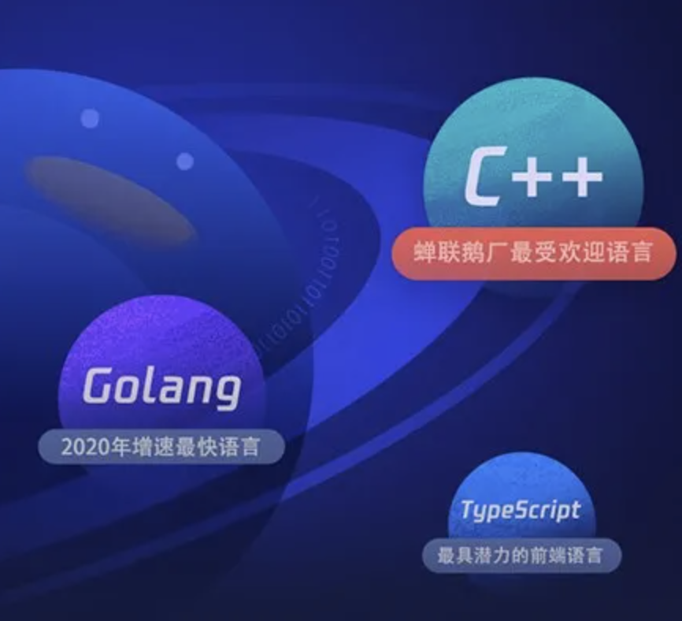

# Go语言爱好者周刊：第 87 期

这里记录每周值得分享的 Go 语言相关内容，周日发布。

本周刊开源（GitHub：[polaris1119/golangweekly](https://github.com/polaris1119/golangweekly)），欢迎投稿，推荐或自荐文章/软件/资源等，请[提交 issue](https://github.com/polaris1119/golangweekly/issues) 。

鉴于一些人可能没法坚持把英文文章看完，因此，周刊中会尽可能推荐优质的中文文章。优秀的英文文章，我们的 GCTT 组织会进行翻译。


题图：Go VS Rust 一起才更好，螃蟹会夹土拨鼠吗？

## 刊首语

以下代码输出什么：

```go
package main

import (
	"fmt"
)

func main() {
	a := []int{2: 1}
	fmt.Println(a)
}
```

A：编译错误；B：[2 1]；C：[0 0 1]；D：[0 1]

## 谁在招 Gopher

整理近期的 Go 职位。有招聘需求可以到「Go招聘」发布！

1、[快来AiBee跟果果小姐姐做同事啦](https://mp.weixin.qq.com/s/zK2FyXMLocwKRXcV5q-LBw)

2、[北京超高福利公司招Go，你心动吗？](https://mp.weixin.qq.com/s/0IrzVAjPJo4JyCzUyWziog)

## 资讯

1、[SQLBoiler 4.5 发布](https://github.com/volatiletech/sqlboiler)

生成针对你的数据库架构量身定制的 Go ORM。

2、[mod](https://docs.studygolang.com/ref/mod)

Go module 官方参考指南。

3、[go-cache-benchmark](https://github.com/vmihailenco/go-cache-benchmark)

Go cache 开源项目的 benchmark 对比。

4、[腾讯重磅发布：Go 已经成为其第二大编程语言](https://mp.weixin.qq.com/s/dCMpjbADtwbfkj4gwSsI_w)

Go 增长速度最快。



## 文章

1、[不要在生产环境使用 http.DefaultServerMux？](https://mp.weixin.qq.com/s/ldMdmrC32f0o8pQvpPzvCw)

没有经过任何验证，不要引入任何不可信的第三方库！

[周末看完这本 gRPC 的书后，我决定送 10 本给读者](https://mp.weixin.qq.com/s/sWDeK2de5pTLU1wrXYGAIA)

gRPC 值得学习。

3、[关于 emoji，Go 语言可以这么操作](https://mp.weixin.qq.com/s/sZh9h2gb1X9Gu03A3OexmA)

emoji 就是一些意形符号。

4、[map 和 switch 如何选？match 又是什么？](https://mp.weixin.qq.com/s/MaovIWtQWVp9ZZL1DlppOQ)

看到标题别惊讶，虽然 map 和 switch 似乎没啥关系，但有些场景它们俩都可以用。

5、[发现 go version 的一个另类用法：你肯定想不到](https://mp.weixin.qq.com/s/RnV752Aez0Xdgscw38kNYw)

有时候可能有用。

[优化 Go 应用性能就是在浪费时间？你怎么看](https://mp.weixin.qq.com/s/jJM0N5yk9kk4w92yI8jjoQ)

可读性更重要？

7、[Go 笔试题精选 一： 25 道选择题](https://mp.weixin.qq.com/s/U1EV6qfyvU9gDg9sIDGqww)

看看自己做对了多少？[Go 笔试题精选 二： 25 道选择题](https://mp.weixin.qq.com/s/RPHTsKdXKqHM_JywR5kxvA)。

8、[用 Go 看到进程中发生的系统调用](https://mp.weixin.qq.com/s/b9TlrMU8skpIlpmk5ph-4A)

strace 命令。

9、["go build -X" 的妙用](https://mp.weixin.qq.com/s/uzaymD5izrBJMKDrn9OpBw)

将一些信息编译进二进制中。

10、[Go 群友提问：学习 defer 时很懵逼，这道不会做！](https://mp.weixin.qq.com/s/lELMqKho003h0gfKkZxhHQ)

很常见的题目。

11、[为什么 Kubernetes 要替换 Docker](https://mp.weixin.qq.com/s/03RsI1JbjxiizjHnxrK7RQ)

Kubernetes 是今天容器编排领域的事实标准。

12、[Kubernetes 稳定性保障手册 -- 日志专题](https://mp.weixin.qq.com/s/KIauQSWz1BBfuqyIvbKBWg)

阿里出品。

## 开源项目

1、[gchalk](https://github.com/jwalton/gchalk)

终端颜色控制，能自动检测到颜色支持，支持 Windows 10，并具有一个很好的表达 API。


2、[goverter](https://github.com/jmattheis/goverter)

用于创建类型安全转换器的工具。

3、[go-unsplash](https://github.com/hbagdi/go-unsplash)

[Unsplash](https://unsplash.com/) API 客户端。

4、[Mockc](https://github.com/KimMachineGun/mockc)

用于 Go 的类型安全的编译阶段 mock 测试生成器。

5、[mattermost](https://github.com/mattermost/focalboard)

开源的看板工具，可自托管，可作为 Trello，Notion 和 Asana 的替代品。

6、[errf](https://github.com/serhiy-t/errf)

声明式的错误处理。

7、[brotli](https://github.com/andybalholm/brotli)

google brotli 压缩算法的 Go 实现。

8、[checker](https://github.com/liangyaopei/checker)

Go 参数校验。

9、[nbio](https://github.com/lesismal/nbio)（作者投稿）

高性能、事件驱动、易用易扩展、省协程省内存、节能环保。[发布个 golang 高性能异步网络框架 nbio，单机百万不是梦！](https://studygolang.com/topics/13182)。

10、[go-featureprocessing](https://github.com/nikolaydubina/go-featureprocessing)（作者投稿）

简单、快速的类 [sklearn](https://scikit-learn.org/stable/modules/preprocessing.html) 特性处理库。

## 资源&&工具

1、[glow](https://github.com/charmbracelet/glow)

终端渲染 Markdown。

2、[netbootd](https://github.com/DSpeichert/netbootd)

一个轻量级的网络启动服务器，支持无人值守的操作系统安装。

3、[bombardier](https://github.com/codesenberg/bombardier)

跨平台高性能 http 性能基准测试工具。

4、[Go 播客第 170 期](https://changelog.com/gotime/170)

谈谈 Go 代码生成。

5、[go-concurrency-patterns](https://github.com/lotusirous/go-concurrency-patterns)

常用 Go 并发模式汇总。

6、[TikTok 终端工具](https://github.com/irevenko/tiktik)

可浏览和下载 TikTok 视频。

7、[sqlfuzz](https://github.com/PumpkinSeed/sqlfuzz)

生成随机数据并加载到 SQL 表中以备后续测试。

8、[video-srt-windows](https://github.com/wxbool/video-srt-windows)

这是一个可以识别视频语音自动生成字幕 SRT 文件的开源 Windows-GUI 软件工具，使用 Go 实现。

9、[wormhole-gui](https://github.com/Jacalz/wormhole-gui)

Wormhole-gui 是 magic-wormhole 的跨平台图形界面，使你可以轻松地在设备之间共享文件，文件夹和文本。

10、[mylg](https://github.com/mehrdadrad/mylg)

Go 实现的命令行网络诊断工具。

11、[semaphore](https://github.com/ansible-semaphore/semaphore)

Go 实现的 Ansible UI 工具。

12、[roumon](https://github.com/becheran/roumon)

使用 pprof 和 termui 实现的通用 goroutine 监视器。

13、[硬核论文](https://songlh.github.io/paper/gcatch.pdf) - 英文

自动检测和修复 Go 中的并发错误。

14、[Go 播客第 171 期](https://changelog.com/gotime/171)

聊聊 go:embed。

15、[tecli](https://github.com/awslabs/tecli)

Terraform 命令行工具。

## 订阅

这个周刊每周日发布，同步更新在[Go语言中文网](https://studygolang.com/go/weekly)和[微信公众号](https://weixin.sogou.com/weixin?query=Go%E8%AF%AD%E8%A8%80%E4%B8%AD%E6%96%87%E7%BD%91)。

微信搜索"Go语言中文网"或者扫描二维码，即可订阅。


