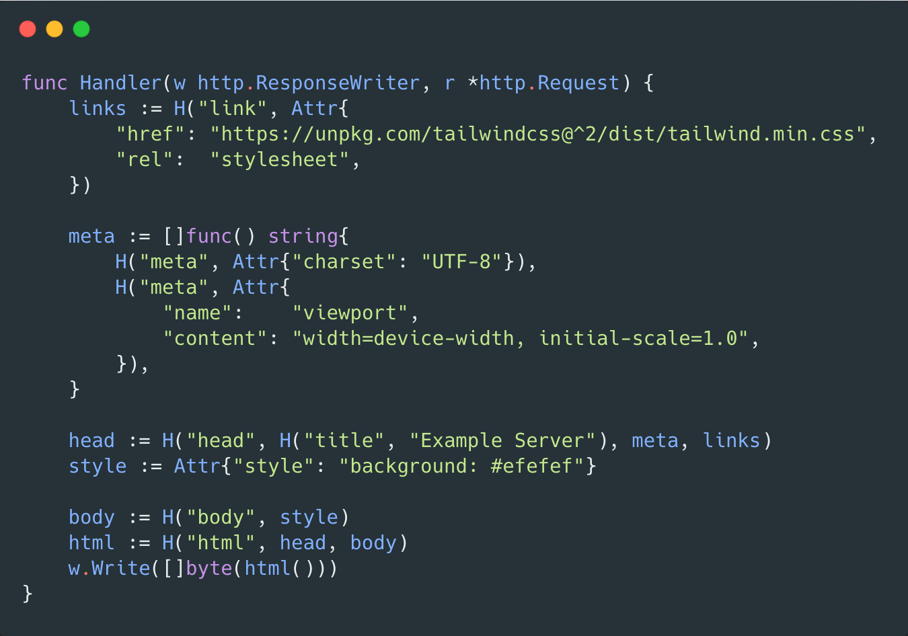
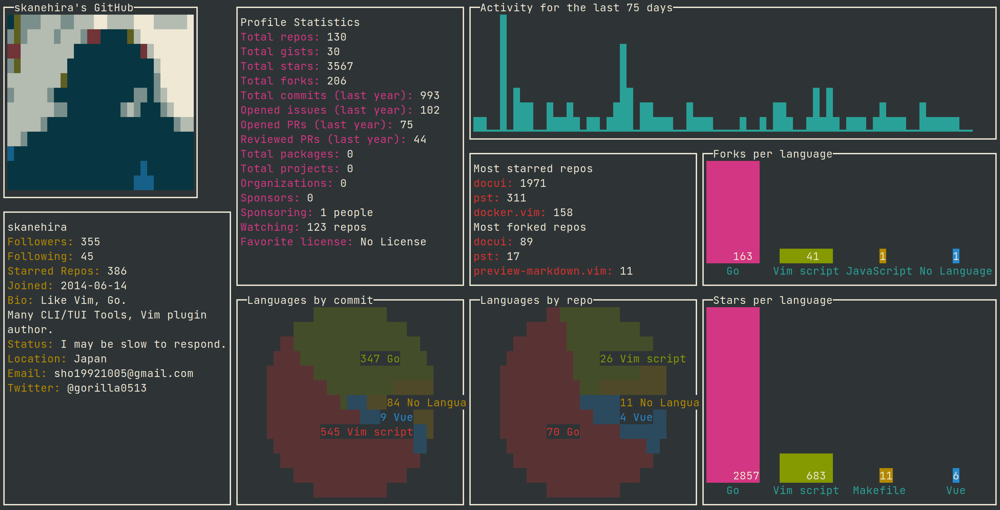

# Go语言爱好者周刊：第 88 期

这里记录每周值得分享的 Go 语言相关内容，周日发布。

本周刊开源（GitHub：[polaris1119/golangweekly](https://github.com/polaris1119/golangweekly)），欢迎投稿，推荐或自荐文章/软件/资源等，请[提交 issue](https://github.com/polaris1119/golangweekly/issues) 。

鉴于一些人可能没法坚持把英文文章看完，因此，周刊中会尽可能推荐优质的中文文章。优秀的英文文章，我们的 GCTT 组织会进行翻译。

 

题图：一本在线图书

## 刊首语

Go101 又除了一道细节的题目，看看你答对了吗？（之前周刊有过一道类似的题目）

```go
package main

func main() {
  var x = []int{4:44, 55, 66, 1:77, 88}
  println(len(x), x[2])
}
```

A：5 66；B：5 88；C：7 88；D：以上都不对

## 谁在招 Gopher

整理近期的 Go 职位。有招聘需求可以到「Go招聘」发布！

1、[真区块链项目招Go，就看你来不来吧](https://mp.weixin.qq.com/s/vfFKtajHUUwqGmGjWdZE2Q)

2、[成都 Go 是要起飞吗？最近职位真不少](https://mp.weixin.qq.com/s/AtvFknQPYGjAs4lFCmwVKw)

3、[50k 的 Go 招聘是什么要求？](https://mp.weixin.qq.com/s/kKEduz_MEnVpA_QQ0AzxCA)

## 资讯

1、[Afero 1.6 发布](https://github.com/spf13/afero)

用于访问各种文件系统一致的 API。还可以让你创建完全不依赖磁盘的模拟和测试文件系统。viper 和 cobra 作者的又一开源作品。目前已经支持 Go1.16 的 io/fs.FS 接口。

2、[Grafana 7.5.0 和 7.5.1 发布](https://www.oschina.net/news/134855/grafana-7-5-released)

Grafana 是一个功能丰富的指标标准仪表板和图形编辑器，用于分析和监控 Graphite、Elasticsearch、OpenTSDB、Prometheus 和 InfluxDB。

## 文章

1、[RedMonk 编程语言排行榜，说 Go 正走向衰退，你认可吗？](https://mp.weixin.qq.com/s/PHG53qPe2ZLYIo1_0crv_w)

2021 年 3 月 1 日，RedMonk 发布了 2021 年 1 月 编程语言排行榜（实际是 1 月 和 2 月的数据）。

2、[微软真给力：出了 Go 语言教程，免费，而且是中文版](https://mp.weixin.qq.com/s/sgqXwqvn2HpYwWnAqmB63Q)

在微软 Docs 网站发现了一个 Go 教程，英文叫做：《Take your first steps with Go》，中文叫做：《开始使用 Go》。

3、[Go 泛型尝鲜](https://mp.weixin.qq.com/s/jQ3BIJq3Xyi_KmyxmVZMRA)

可以通过自己编译 master 分支的方式，开始领略 Go 泛型的风采。

4、[吐槽 Go 依赖管理：Go Module 之痛](https://mp.weixin.qq.com/s/p1iCWg__JoFsHv8oDtyL0g)

本文会列举一些我和我的同事使用 go mod 时碰到的问题，有些问题是 go mod 本身的问题，有些可能是第三方 goproxy 实现的问题。

5、[Go 中基于 IP 地址的 HTTP 请求限流](https://mp.weixin.qq.com/s/aj_hULmeqy3whILr2ytECQ)

在本教程中，我们将创建一个基于用户 IP 地址进行速率限制的简单的中间件。

6、[Go 构建 CLI 实践: 在 ETL 中使用扇出模式](https://mp.weixin.qq.com/s/4tiiZzr_b4OucAQLFXwLAQ)

Go 语言在构建微服务、特别是有使用 gRPC 的应用中，非常地流行，其实在构建命令行程序时也是特别地好用。为了学习扇出模式，我会基于我们公司使用 ETL 的例子，来介绍这个模式。

7、[对 Go 代码进行分析，常用这个技术：AST](https://mp.weixin.qq.com/s/gKnaHxoiBZrBMsXKsz2kvw)

本文不深入探讨如何解析源代码，先从 AST 建立后的描述开始。

8、[深入研究 Go interface 底层实现](https://halfrost.com/go_interface/)

接口是高级语言中的一个规约，是一组方法签名的集合。

9、[Go语言GC实现原理及源码分析](https://mp.weixin.qq.com/s/W5O_Pnrt3NPcaErlnPmIZQ)

本文使用的 Go 的源码1.15.7

10、[Go 群友提问：进程、线程都有 ID，为什么 Goroutine 没有 ID？](https://mp.weixin.qq.com/s/qFAtgpbAsHSPVLuo3PYIhg)

这篇文章我们根据 GoroutineID 的历史，作用，原因，骇客方法进行了逐一梳理，摸索了下里面究竟为何物。

11、[对 Go 1.16 io/fs 设计的第一感觉：得劲儿！](https://mp.weixin.qq.com/s/_pUtGQSl_oSRnmmfROJ6ZQ) 

Go语言的接口是Gopher最喜欢的语法元素之一，其隐式的契约满足和“当前唯一可用的泛型机制”的特质让其成为面向组合编程的强大武器，其存在为Go建立事物抽象奠定了基础，同时也是建立抽象的主要手段。

12、[这可能是最容易理解的 Go Mutex 源码剖析](https://mp.weixin.qq.com/s/irXUkd9CZMInTUTu7pbriQ)

本文就从源码角度剖析 Go Mutex, 揭开 Mutex 的迷雾。

13、[难以驾驭的 Go timer，一文带你参透计时器的奥秘](https://mp.weixin.qq.com/s/gxX-q2EvgWZEWe-deRITSw)

这篇文章中我们将对 timer 做分析和研讨。

## 开源项目

1、[pb](https://github.com/cheggaaa/pb)

控制台程序的简单进度条。

2、[daz](https://github.com/stevelacy/daz)

可组合的 HTML 组件。



3、[go-github](https://github.com/google/go-github)

针对 GitHub v3 API，REST 风格。Google 出品。

4、[惠普开源 structex](https://github.com/HewlettPackard/structex)

Go 结构注释，支持编码和解码；支持位域打包，自描述布局参数和对齐方式。

5、[go-wayland](https://github.com/rajveermalviya/go-wayland)

wayland 协议的 Go 实现。

6、[ant](https://github.com/yields/ant)

Go 实现的 Web 爬虫。

## 资源&&工具

1、[xbar](https://github.com/matryer/xbar)

将任何脚本或程序的输出放入您的 macOS 菜单栏中。

2、[go-concurrency](https://github.com/code-review-checklists/go-concurrency)

Go 并发代码评审 checklist。

3、[octotui](https://github.com/irevenko/octotui)

在命令行终端查看 GitHub 状态。



4、[又一本在线免费的 Go 语言图书](https://mp.weixin.qq.com/s/Z01xRLy9dMVbHpejKN1RpA)

这本书的目标是以渐进方式讲解 Go 语言。作者还试图解释一些难以掌握的计算机科学概念，对于新人来说很有用。

5、[Feta-Feles-Remastered](https://github.com/TheTophatDemon/Feta-Feles-Remastered)

使用 Go Ebiten 重写老旧的 flash 游戏。

6、[mubeng](https://github.com/kitabisa/mubeng)

令人难以置信的快速代理检查器和 IP 旋转器。

7、[Go 播客第 172 期](https://changelog.com/gotime/172)

Go设计哲学。

8、[ksniff](https://github.com/eldadru/ksniff)

用于 k8s pod 间流量 sniff 的 kubectl 插件。

9、[teller](https://github.com/spectralops/teller)

开发人员使用的密码管理器。

## 订阅

这个周刊每周日发布，同步更新在[Go语言中文网](https://studygolang.com/go/weekly)和[微信公众号](https://weixin.sogou.com/weixin?query=Go%E8%AF%AD%E8%A8%80%E4%B8%AD%E6%96%87%E7%BD%91)。

微信搜索"Go语言中文网"或者扫描二维码，即可订阅。


