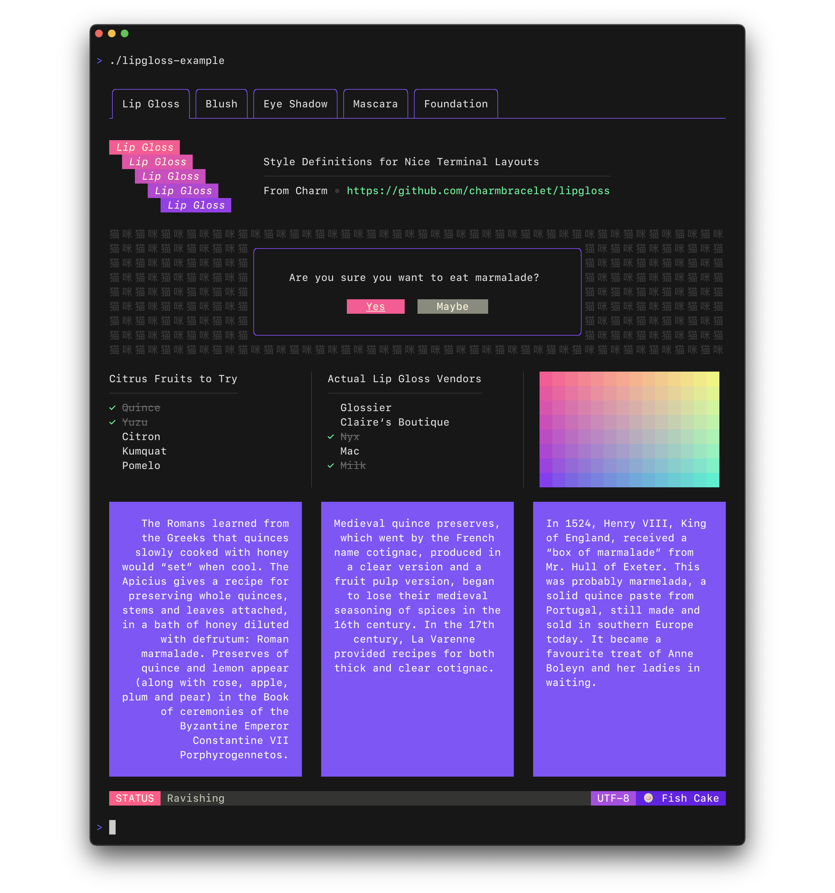

# Go语言爱好者周刊：第 89 期

这里记录每周值得分享的 Go 语言相关内容，周日发布。

本周刊开源（GitHub：[polaris1119/golangweekly](https://github.com/polaris1119/golangweekly)），欢迎投稿，推荐或自荐文章/软件/资源等，请[提交 issue](https://github.com/polaris1119/golangweekly/issues) 。

鉴于一些人可能没法坚持把英文文章看完，因此，周刊中会尽可能推荐优质的中文文章。优秀的英文文章，我们的 GCTT 组织会进行翻译。

题图：golangweekly

## 刊首语

Go 泛型设计可能又有新简化：去掉约束中的 type 关键字，具体参考：<https://github.com/golang/go/issues/45346>。

## 谁在招 Gopher

整理近期的 Go 职位。有招聘需求可以到「Go招聘」发布！

1、[风水轮流转：这次大广州 Gopher 走一波，福利还不错哦](https://mp.weixin.qq.com/s/t6-fLG1LPthb13kY1SSh_Q)

2、[西安也是起飞的节奏，大厂狂招 Gopher](https://mp.weixin.qq.com/s/Fha7qOzLreG1aoKJ7oFyjA)

## 资讯

1、[模糊测试加入标准库的提案已被接受](https://github.com/golang/go/issues/44551#issuecomment-811607377)

fuzz test 支持。

2、[omniparser 1.0 发布](https://github.com/jf-tech/omniparser)

Omniparser 是本地的 Golang ETL 解析器，它以流方式提取各种格式（CSV, txt, fixed length/width, XML, EDI/X12/EDIFACT, JSON 和自定义格式）的输入数据，并将数据转换为基于用 JSON 编写的模式。以下是在线的 Demo 示例：<https://omniparser.herokuapp.com/>。

3、[Go 1.16.3 发布](https://mp.weixin.qq.com/s/lOfOw7y3qxqtuGmO-T937A)

Go 官方发布了 1.16.3 和 1.15.11，这是小版本发布，主要修复 bug，包括 compiler、linker、runtime 和 go 命令，以及 testing 和 time 包。

4、[Go 漏洞数据库](https://github.com/golang/proposal/blob/master/design/draft-vulndb.md)

该填希望为 Go 开发人员提供低噪声，可靠的方式，以警告影响其应用程序的已知安全漏洞。

5、[go-sql-driver/mysql 1.6.0 发布](https://github.com/go-sql-driver/mysql)

距离上次发布一年多了。

## 文章

1、[Go周刊题解：切片的另类初始化 — 该题正确率出奇的低](https://mp.weixin.qq.com/s/QZdRU7rA93PrJRfSmhACAg)

25% 的正确率。

2、[Go 那么多数值类型，应该选哪个？](https://mp.weixin.qq.com/s/zCWzCBnszJ032h5qchk8cA)

int 很多时候是比较好的选择。

3、[一本 Go 新书：美国盗版图书这么厉害？](https://mp.weixin.qq.com/s/CSgQDfW9v_-tmbGkkQDqQg)

Learning Go。

4、[重磅发布：第一本包含泛型的 Go 图书](https://mp.weixin.qq.com/s/8YZzVtdSxegT6K956sf0oA)

Go In Action 作者的新书。

5、[我无语了，Go 中 +-*/ 四个运算符竟然可以连着用](https://mp.weixin.qq.com/s/kMFfSkKbV7w0lwPOgGK-CQ)

我只想来句：卧槽。

6、[如何编译调试 Go runtime 源码](https://www.luozhiyun.com/archives/506)

可以更好的学习研究 runtime。

7、[那些想替代 C 的语言怎么样？Go、Rust、C++ 和 Zig 生产力对比](https://mp.weixin.qq.com/s/jUWLmeqwVJyI9HTw66yLiA)

C 还是很牛逼。

8、[Go 内存泄露之痛，这篇把 Go timer.After 问题根因讲透了！](https://mp.weixin.qq.com/s/KSBdPkkvonSES9Z9iggElg)

很容易误用的一个函数。

9、[Hugo作者、Go核心团队成员Steve Francia谈诞生13年的Go语言：生态系统、演化与未来](https://mp.weixin.qq.com/s/P5_wFaNgWkoNZKA7w3g_xA)

Go 开源于 2009 年，如果从那时算起，Go 才 11 岁；但在 Go 核心 开发团队眼中，Go 的真正诞生年份是 2007 年，至今 13 个年头了。

## 开源项目

1、[go-version](https://github.com/hashicorp/go-version)

版本号解析和验证库。

2、[ctop](https://github.com/bcicen/ctop)

类似 top，但用于容器。

3、[msgpack](https://github.com/vmihailenco/msgpack)

Go MessagePack 编解码库。

4、[dingo](https://github.com/sarulabs/dingo)

Go 中生成的依赖项注入容器。

5、[urlsh](https://github.com/adhocore/urlsh)

Go 实现的 url 短链接服务。

6、[simgo](https://github.com/fschuetz04/simgo)

Go 离散事件仿真库。

7、[caddy-ratelimit](https://github.com/mholt/caddy-ratelimit)

caddy web 服务器的限速插件。

8、[lipgloss](https://github.com/charmbracelet/lipgloss)

漂亮的终端布局的样式定义（基于 TUI）。

## 资源&&工具

1、[typer](https://github.com/maaslalani/typer)

在命令行终端测试打字水平的工具。

2、[netmaker](https://github.com/gravitl/netmaker)

Go 实现的构建虚拟网络工具。

3、[spaghetti](https://github.com/adonovan/spaghetti)

基于 Web 的交互式的 Go 包依赖分析工具。

4、[golangrepo.com](https://golangrepo.com)（[reposhub](https://github.com/reposhub) 投稿）

一个 Golang 开源项目分类汇总查询的网站。

5、[netz](https://github.com/SpectralOps/netz)

网络错误配置扫描器。

6、[fast](https://github.com/adhocore/fast)

互联网测速命令行工具。

## 订阅

这个周刊每周日发布，同步更新在[Go语言中文网](https://studygolang.com/go/weekly)和[微信公众号](https://weixin.sogou.com/weixin?query=Go%E8%AF%AD%E8%A8%80%E4%B8%AD%E6%96%87%E7%BD%91)。

微信搜索"Go语言中文网"或者扫描二维码，即可订阅。

