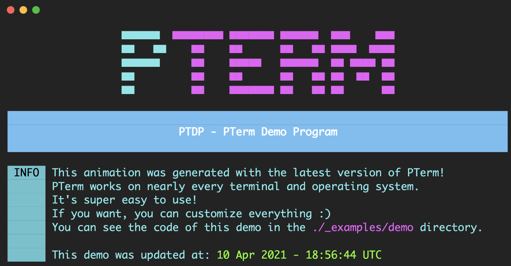
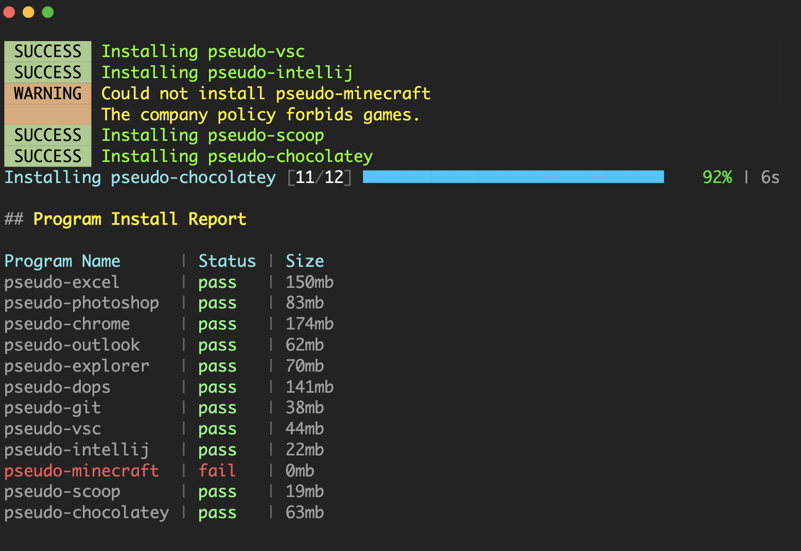
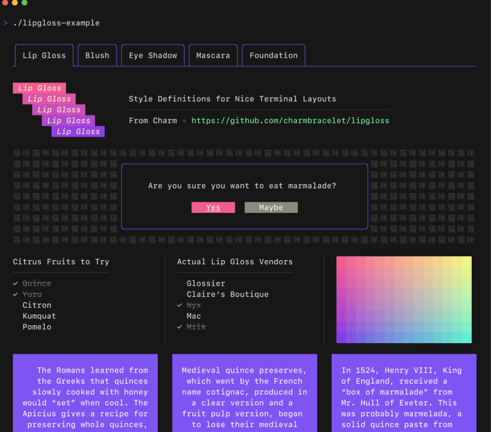
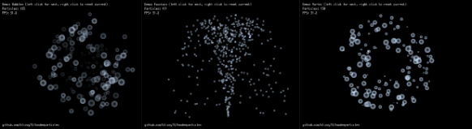

# Go语言爱好者周刊：第 90 期

这里记录每周值得分享的 Go 语言相关内容，周日发布。

本周刊开源（GitHub：[polaris1119/golangweekly](https://github.com/polaris1119/golangweekly)），欢迎投稿，推荐或自荐文章/软件/资源等，请[提交 issue](https://github.com/polaris1119/golangweekly/issues) 。

鉴于一些人可能没法坚持把英文文章看完，因此，周刊中会尽可能推荐优质的中文文章。优秀的英文文章，我们的 GCTT 组织会进行翻译。



题图：pterm

## 刊首语

以下代码输出什么？

```go
package main

import "fmt"

func app() func(string) string {
	t := "Hi"
	c := func(b string) string {
		t = t + " " + b
		return t
	}
	return c
}

func main() {
	a := app()
	b := app()
	a("go")
	fmt.Println(b("All"))
}
```

A：`Hi All`；B：`Hi go All`；C：` Hi`；D：`go All`

## 谁在招 Gopher

整理近期的 Go 职位。有招聘需求可以到「Go招聘」发布！

1、[gopher 们都想有个好未来？那就来这吧](https://mp.weixin.qq.com/s/Le4-3rAjGyFdNyRRUAG4vg)

2、[Baidu 职位来啦，高薪不加班还真香](https://mp.weixin.qq.com/s/_lcrbfGZiciKbhnTzwIbgw)

3、[高薪不加班的远程工作了解一下？](https://mp.weixin.qq.com/s/eMt7vHflqzbOM27NmSxxVw)

4、[错过金三，别错过银四：看看这个Go招聘你符合吗？](https://mp.weixin.qq.com/s/MD6a3l6yWoKgiQ8Q1kztBA)

## 资讯

1、[tidb 5.0 发布](https://github.com/pingcap/tidb/releases/tag/v5.0.0)

这是大版本发布。

2、[MacDriver 0.1 发布](https://github.com/progrium/macdriver)

用于使用 Apple/Mac API 和 Frameworks 的工具包。

3、[RxGo 2.5.0 发布](https://github.com/ReactiveX/RxGo)

如果你熟悉 JavaScript 世界的 RxJS，那对这个应该也不会陌生。

4、[ldap 3.3.0 发布](https://github.com/go-ldap/ldap)

基本 LDAP v3 功能实现。

5、[Kubernetes 1.21 发布](https://kubernetes.io/blog/2021/04/08/kubernetes-1-21-release-announcement/)

主题：Power to the Community。

6、[GoLand 2021.1 重磅发布：新特性试用报告](https://mp.weixin.qq.com/s/Wt1ADroTJmWUL9bcpZ44pw)

有些特性还不错。

## 文章

1、[为什么你应该慎重考虑使用 Kubernetes](https://mp.weixin.qq.com/s/3Od9u1YUH5KGQvo7Ky3O6w)

很多团队都很兴奋地开始使用 Kubernetes。使用 Kubernetes 有好处也有坏处。

2、[三月你股了么](https://mp.weixin.qq.com/s/Wv9jSRj_wyKrUUfwbxZ1tw)

Go 语言相关面试题和答案汇总。

3、[答应我，这次一定彻底搞懂 Go 中的类型别名](https://mp.weixin.qq.com/s/vtgFEXkjaItmkqUzcj64tg)

有一道题引出相关知识点。

4、[Go：使用 Ebiten 在 2D 视频游戏中进行图像渲染](https://mp.weixin.qq.com/s/KMPpwMiAoXoh0eicVjwblA)

本文基于 Ebiten 1.10。

5、[Go 惯用模式：函数选项模式](https://mp.weixin.qq.com/s/58rdkWbWpA4OnvQJF4u_ew)

作为 Golang 开发者，遇到的许多问题之一就是尝试将函数的参数设置成可选项。这是一个十分常见的场景，您可以使用一些已经设置默认配置和开箱即用的对象，同时您也可以使用一些更为详细的配置。

6、[Go 语言格式化动词，一篇理清](https://mp.weixin.qq.com/s/SCsxIYvyt5N-tRlwLnECzQ)

fmt 包。

7、[像大神一样调试 Go](https://juejin.cn/post/6947868469270577159)

一旦你了解了基础知识，Golang 可以让你比以前更有效率。

## 开源项目

1、[pterm](https://github.com/pterm/pterm)

一个现代的 Go 模块，用于美化控制台输出。看起来真的很漂亮。



2、[Spaghetti](https://github.com/adonovan/spaghetti)

包依赖分析工具。

3、[lipgloss](https://github.com/charmbracelet/lipgloss)

漂亮的终端布局的风格定义。



4、[twodeeparticles](https://github.com/blizzy78/twodeeparticles)

用于 Go 的发动机无关的 2D 粒子系统模拟器。



5、[vald](https://github.com/vdaas/vald)

高度可扩展的分布式矢量搜索引擎。

6、[xsel](https://github.com/ChrisTrenkamp/xsel)

兼容 XPath 1.0 的 Go 包。

7、[Teleport](https://github.com/gravitational/teleport)

一种身份识别、支持多协议的访问代理。

8、[teams-api](https://github.com/fossteams/teams-api)

非官方 microsoft team go api 包。

9、[go-gitlab](https://github.com/xanzy/go-gitlab)

与 gitlab 交互的 go client api。

10、[keto](https://github.com/ory/keto)

谷歌全球一致性授权系统的开源 Go 实现。

## 资源&&工具

1、[gographs.io](https://gographs.io/)

图形化展示 Go 包依赖关系。

2、[docuowl](https://github.com/docuowl/docuowl)

Go 实现的文档生成工具。

3、[photon](https://gitlab.com/microo8/photon)

Go 实现的 rss 阅读工具。

4、[jennifer](https://github.com/dave/jennifer)

Go 代码生成器。

5、[garble](https://github.com/burrowers/garble)

Go 构建混淆工具。

6、[gostackparse](https://github.com/DataDog/gostackparse)

datadog 开源的 go stack 输出解析工具。

7、[Go 播客第 174 期](https://changelog.com/gotime/174)

Go 中测试的磨难。

## 订阅

这个周刊每周日发布，同步更新在[Go语言中文网](https://studygolang.com/go/weekly)和[微信公众号](https://weixin.sogou.com/weixin?query=Go%E8%AF%AD%E8%A8%80%E4%B8%AD%E6%96%87%E7%BD%91)。

微信搜索"Go语言中文网"或者扫描二维码，即可订阅。


