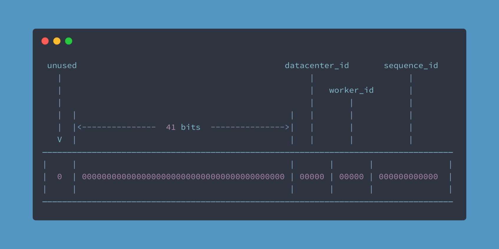
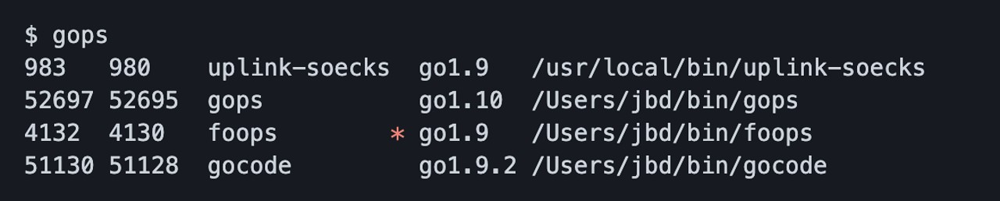

# Go语言爱好者周刊：第 91 期

这里记录每周值得分享的 Go 语言相关内容，周日发布。

本周刊开源（GitHub：[polaris1119/golangweekly](https://github.com/polaris1119/golangweekly)），欢迎投稿，推荐或自荐文章/软件/资源等，请[提交 issue](https://github.com/polaris1119/golangweekly/issues) 。

鉴于一些人可能没法坚持把英文文章看完，因此，周刊中会尽可能推荐优质的中文文章。优秀的英文文章，我们的 GCTT 组织会进行翻译。


题图：Go With The Domain

## 刊首语

网友贡献的一道题：

```go
package main

import "fmt"

type T1 struct {
	String func() string
}

func (T1) Error() string {
	return "T1.Error"
}

type T2 struct {
	Error func() string
}

func (T2) String() string {
	return "T2.String"
}

var t1 = T1{String: func() string { return "T1.String" }}
var t2 = T2{Error: func() string { return "T2.Error" }}

func main() {
	fmt.Println(t1.Error())
	fmt.Println(t1.String())

	fmt.Println(t2.Error())
	fmt.Println(t2.String())

	fmt.Println(t1)
	fmt.Println(t2)
}
```

以上代码输出什么？

## 谁在招 Gopher

整理近期的 Go 职位。有招聘需求可以到「Go招聘」发布！

1、[Go远程工作越来越多了，真羡慕](https://mp.weixin.qq.com/s/weIMgKlFinQvaqpHKXYi1g)

2、[没错，可以全职参与开源语言开发：国人开发的语言 Go+ 团队招人](https://mp.weixin.qq.com/s/9xlQsW5X57fBYLRkwOELxA)

3、[当下最流行的全职开源，你不心动吗？](https://mp.weixin.qq.com/s/Tuf4tPRrCJ48Ml5Y6uCXBg)

## 资讯

1、[ION 1.9 发布](https://github.com/pion/ion)

分布式实时通信（RTC）系统，基于 Go 和 Flutter。

2、[Gitea 1.14.0 发布](https://blog.gitea.io/2021/04/gitea-1.14.0-is-released/)

Go 开发的 Git 自助服务。

3、[基于寄存器 ABI 改造完成](https://github.com/golang/go/issues/40724#issuecomment-821758073)

Go 基于寄存器的ABI规范的改造基本完工，平均性能提升 6%。

## 文章

1、[一道 Go 闭包题，面试官说原来自己答错了：面别人也涨知识](https://mp.weixin.qq.com/s/gfyW0pBIHsf2oYluQNbP8A)

本文从一道题引出 Go 中的闭包。这是 Go 语言爱好者周刊第 90 期的一道题目。

2、[Goroutine 开启和退出到底做了什么？](https://mp.weixin.qq.com/s/_ngJ6QfZRK5sGTA-CfsORg)

在 Go 中，协程就是一个包含程序运行时的信息的结构体，如栈，程序计数器，或者它当前的 OS 线程。调度器还必须注意 Goroutine 的开始和退出，这两个阶段需要谨慎管理。

4、[注释竟然还有特殊用途？一文解惑 //go:linkname 指令](https://mp.weixin.qq.com/s/4OlbpQwchWwxnQmSOL6xYA)

别告诉我你还不会。

5、[把 Go 当脚本语言用](https://mp.weixin.qq.com/s/7Svvbh1BRPkmlpZLpWP8FQ)

虽然目前 Go 还未准备好作为脚本语言 “开箱即用” 的特性，用来替代 Python 和 Bash ，但是我们只需要一点点准备工作就可以达到想要的目标。

6、[极速精简 Go 版 Logstash](https://mp.weixin.qq.com/s/pYmp3ZVWhY_jbQc0mRDu-A)

go-zero 生态的一个组件 go-stash。

7、[用 Golang 实现 RSA 加密和签名（有示例）](https://mp.weixin.qq.com/s/w976zzchogZy8xkWGN--Ww)

本文介绍 RSA 干了什么，以及我们怎样用 Go 实现它。

8、[大佬的思路很清晰：Go+的设计原来是怎么思考的](https://mp.weixin.qq.com/s/AuJv6wnMbo2iryXvopAFag)

七牛云 CEO、ECUG 发起人许式伟以「Go+ 与数据科学」 为主题进行了分享，讲述了对数据科学变迁的理解，对新语言 Go+ 的设想和规划，并大胆指出数据科学正迎来爆发期，像字节跳动一样的新型公司只会越来越多。

9、[深入 Go 并发原语 — Channel 底层实现](https://mp.weixin.qq.com/s/VyLyhtJCcLwpwhUpSCqJZA)

作为 Go 并发原语的第一篇文章，一定绕不开 Go 的并发哲学。从 Tony Hoare 写的 Communicating Sequential Processes 这篇文章说起，这篇经典论文算是 Go 语言并发原语的根基。

10、[详解 Go 程序的启动流程，你知道 g0，m0 是什么吗？](https://mp.weixin.qq.com/s/YK-TD3bZGEgqC0j-8U6VkQ)

Go 程序启动过程解析。

## 开源项目

1、[encore](https://github.com/encoredev/encore)

​	一个框架，可以快速创建 API 和分布式系统。

2、[go-snowflake](https://github.com/godruoyi/go-snowflake)

基于 Twitter 雪花算法的无锁 ID 生成器。



3、[reproxy](https://github.com/umputun/reproxy)

Go 实现的极简反向代理。

4、[dasel](https://github.com/TomWright/dasel)

使用选择符(.)查询和修改数据结构中的字段，支持 JSON, TOML, YAML, XML 和 CSV 等。

5、[weaviate](https://github.com/semi-technologies/weaviate)

 云原生、模块化、实时矢量搜索引擎。

6、[inspr](https://github.com/inspr/inspr)

用于简单、快速和安全地开发分布式应用程序的应用网格（app mesh）。

7、[gotuna](https://github.com/gotuna/gotuna)

渐进式 Web 开发框架。

8、[fonts](https://github.com/go-swiss/fonts)

Go 系统字体操作包。

## 资源&&工具

1、[gops](https://github.com/google/gops)

查看正在运行 Go 进程的列表和诊断工具。作者欢迎大家提需求。



2、[gitleaks](https://github.com/zricethezav/gitleaks)

检测 Git 代码仓库中有没有存入敏感信息，比如密码。

3、[pingme](https://github.com/kha7iq/pingme)

可向多个消息平台和电子邮件发送消息或警报的 cli 工具。

4、[播客第 175 期](https://changelog.com/gotime/175)

GopherCon 提案的终极指南。

5、[播客第 173 期](https://changelog.com/gotime/173)

聊 Go 应用的发布。

6、[scilla](https://github.com/edoardottt/scilla)

网络信息收集工具。

7、[gidevice](https://github.com/electricbubble/gidevice)

Golang 实现的 iOS 设备通信工具。

8、[httpit](https://github.com/gonetx/httpit)（[kiyonlin](https://github.com/kiyonlin) 投稿）

一款基于 fasthttp的 http(s) benchmark 工具，实时统计显示测试结果。

## 订阅

这个周刊每周日发布，同步更新在[Go语言中文网](https://studygolang.com/go/weekly)和[微信公众号](https://weixin.sogou.com/weixin?query=Go%E8%AF%AD%E8%A8%80%E4%B8%AD%E6%96%87%E7%BD%91)。

微信搜索"Go语言中文网"或者扫描二维码，即可订阅。


