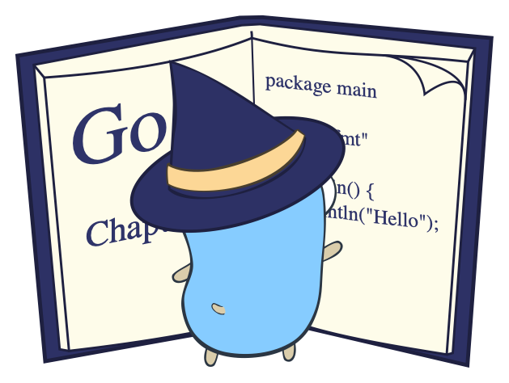

# Go语言爱好者周刊：第 92 期

这里记录每周值得分享的 Go 语言相关内容，周日发布。

本周刊开源（GitHub：[polaris1119/golangweekly](https://github.com/polaris1119/golangweekly)），欢迎投稿，推荐或自荐文章/软件/资源等，请[提交 issue](https://github.com/polaris1119/golangweekly/issues) 。

鉴于一些人可能没法坚持把英文文章看完，因此，周刊中会尽可能推荐优质的中文文章。优秀的英文文章，我们的 GCTT 组织会进行翻译。

题图：A student’s handbook

## 刊首语

4 月 23 日是世界读书日，当天分享了一份书单，没看的可以看看，虽然优惠没了。[站长的书单](https://mp.weixin.qq.com/s/--Ea9Vz69JpRJBzFKxaxxQ)

## 谁在招 Gopher

整理近期的 Go 职位。有招聘需求可以到「Go招聘」发布！

1、[我靠！Gopher推荐成功居然给0.5个BTC](https://mp.weixin.qq.com/s/iQpVTT378kHDX9xgIxT7rA)

2、[广告公司真香，不加班美女还多，文末有彩蛋哦](https://mp.weixin.qq.com/s/QXt72JsZgxl19AyvdHeKcg)

3、[不加班还不够香？那见明星呢](https://mp.weixin.qq.com/s/UZ8XdmWK43TWFD1pnzSqww)

4、[Go 在 AI 领域也火了？这招聘不错，薪资不低](https://mp.weixin.qq.com/s/ePqrEN40ch6NGShHRHPx2Q)

## 资讯

1、[Fiber 2.8.0 发布](https://github.com/gofiber/fiber)

一个受 Express 启发的 Web 框架。

2、[Raft 1.3.0 发布](https://github.com/hashicorp/raft)

Raft 协议的 Go 实现。

3、[Go 1.17 新特性](https://github.com/golang/go/issues/395)

支持将一个切片转换为一个数组指针。

4、[Excelize 2.4.0 发布，新增 152 项公式函数支持](https://xuri.me/excelize/zh-hans/releases/v2.4.0.html)

这是 Go 语言编写的用于操作 Office Excel 文档基础库，基于 ECMA-376，ISO/IEC 29500 国际标准。可以使用它来读取、写入由 Microsoft Excel™ 2007 及以上版本创建的电子表格文档。支持 XLSX / XLSM / XLTM 等多种文档格式，高度兼容带有样式、图片(表)、透视表、切片器等复杂组件的文档，并提供流式读写 API，用于处理包含大规模数据的工作簿。可应用于各类报表平台、云计算、边缘计算等系统。

## 文章

1、[我又来推荐免费 Go 新书了：一本用 Go 讲架构的书](https://mp.weixin.qq.com/s/UqTvfvwhIHARnClCJftjMg)

英文版的。

2、[Go 中使用别名，简单且高效](https://mp.weixin.qq.com/s/xiSD2cmDC50qncqNL-7fEQ)

Go 1.9 版本引入了别名，开发者可以为一个已存在的类型赋其他的名字。这个特性旨在促进大型代码库的重构，这对大型的项目至关重要。

3、[代码会死循环吗？Go 异步抢占](https://mp.weixin.qq.com/s/NIYxzycAqHzeVSgU7ixhNg)

抢占是调度器的重要部分，基于抢占调度器可以在各个协程中分配运行的时间。实际上，如果没有抢占机制，一个长时间占用 CPU 的协程会阻塞其他的协程被调度。1.14 版本引入了一项新的异步抢占的技术，赋予了调度器更大的能力和控制力。

4、[用 Go 搭建一个自己的照片管理神器](https://mp.weixin.qq.com/s/7rFJKE14cTIIIKI9ahQ38g)

Go + Vue 实现，很棒。

5、[图文讲解：Go 中的循环是如何转为汇编的？](https://mp.weixin.qq.com/s/GRkXojUmoC4HuuR8wJ1Cjw)

循环在编程中是一个重要的概念，且易于上手。但是，循环必须被翻译成计算机能理解的底层指令。它的编译方式也会在一定程度上影响到标准库中的其他组件。让我们开始分析循环吧。

6、[Go 语言如何实现垃圾回收中的 Stop the World (STW)](https://mp.weixin.qq.com/s/0yIlm79EKgIUlL3TW_rcVw)

本篇文章讨论实现原理基于 Go 1.13。

7、[true != true？面试官，你坑人！！！](https://mp.weixin.qq.com/s/3cPsMRrsk4CaNAbpx283kw)

本文总结一些初学者很容易犯错的知识点。

8、[嗯，你觉得 Go 在什么时候会抢占 P？](https://mp.weixin.qq.com/s/WAPogwLJ2BZvrquoKTQXzg)

解密该过程。

9、[深度阅读之《Mastering Go》](https://mp.weixin.qq.com/s/3JnJskE_bK6AeUSeQThhfg)

本书讲得内容非常全面，语言也很顺畅，生词非常少，并且内容没有太大难度，看起来比较过瘾，算是全面复习一下 Go 语言。如果你想开始练习阅读英文书，这本将是一个非常好的开始。

10、[Go 语言源码贡献官方指导文档](https://mp.weixin.qq.com/s/dJ0t4owm3ChIljP4hL1e1Q)

先参与 Go 语言本身的，可以看看。

## 开源项目

1、[Vugu](https://www.vugu.org/)

类似 Vue，但基于 Go、HTML 和 CSS 实现。

2、[tunny](https://github.com/Jeffail/tunny)

Goroutine 池。

3、[xsel](https://github.com/ChrisTrenkamp/xsel)

兼容 XPath 1.0 的库。

4、[gronx](https://github.com/adhocore/gronx)

轻量、快速、零依赖的 Cron 表达式解析器。

5、[sprig](https://github.com/Masterminds/sprig)

提供很多 Go 模板函数。

6、[lark](https://github.com/go-lark/lark)

飞书非官方 Go SDK。

7、[thdwb](https://github.com/danfragoso/thdwb)

纯 Go 实现的浏览器和浏览器引擎。

8、[reproxy](https://github.com/umputun/reproxy)

简单的边缘代理服务器。

9、[kenny](https://github.com/smf8/kenny)

使用 webrtc 实现的命令行语音通讯。

10、[kong-gateway-go-plugin](https://konghq.com/blog/kong-gateway-go-plugin)

使用 Go 开发一个 kong 的插件。

11、[go-storage](https://github.com/aos-dev/go-storage)

面向 Go 应用的统一存储层。

## 资源&&工具

1、[sx](https://github.com/v-byte-cpu/sx)

快速，现代，易于使用的网络扫描仪。

2、[vcluster](https://github.com/loft-sh/vcluster)

在 k8s 集群中创建虚拟 k8s 集群。

3、[油管视频](https://www.youtube.com/watch?v=N0fIANJkwic)

一小时学习 Go。

4、[goldmark-pdf](https://github.com/stephenafamo/goldmark-pdf)

Goldmark markdown 解析器的 pdf 渲染工具。

5、[network-node-manager](https://github.com/kakao/network-node-manager)

Kubernetes node 网络管理器。

6、[go-generics-example](https://github.com/mattn/go-generics-example)

Go 1.17 泛型语法样例集。

7、[arch-go](https://github.com/fdaines/arch-go)

Go 项目架构检查。

8、[git-xargs](https://github.com/gruntwork-io/git-xargs)

同时操作多个 git 仓库的工具。

9、[播客第 176 期](https://changelog.com/gotime/176)

与《Network Programming with Go》的作者聊聊 TCP&UDP。

10、[油管视频：使用 Fyne 实现国际象棋游戏](https://www.youtube.com/watch?v=zlPDWBLhn6c)

这么牛逼的吗？

## 订阅

这个周刊每周日发布，同步更新在[Go语言中文网](https://studygolang.com/go/weekly)和[微信公众号](https://weixin.sogou.com/weixin?query=Go%E8%AF%AD%E8%A8%80%E4%B8%AD%E6%96%87%E7%BD%91)。

微信搜索"Go语言中文网"或者扫描二维码，即可订阅。

