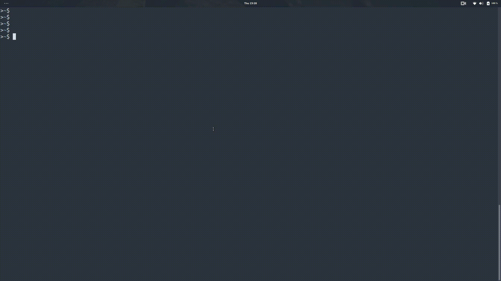

# Go语言爱好者周刊：第 93 期

这里记录每周值得分享的 Go 语言相关内容，周日发布。

本周刊开源（GitHub：[polaris1119/golangweekly](https://github.com/polaris1119/golangweekly)），欢迎投稿，推荐或自荐文章/软件/资源等，请[提交 issue](https://github.com/polaris1119/golangweekly/issues) 。

鉴于一些人可能没法坚持把英文文章看完，因此，周刊中会尽可能推荐优质的中文文章。优秀的英文文章，我们的 GCTT 组织会进行翻译。

题图：devdash

## 刊首语

五一节日快乐！个人号无套路送一本架构书：[《架构师的自我修炼》](https://mp.weixin.qq.com/s/TQgYP24H_Qgm5BZdGMI1hA)，5 月 5 日开奖，感兴趣的可以参与下。

## 谁在招 Gopher

整理近期的 Go 职位。有招聘需求可以到「Go招聘」发布！

1、[一手资源在手，说Go就Go](https://mp.weixin.qq.com/s/t4bxO8PBUf0BLhlWFs-O_A)

2、[国际电商福利好还不加班，爱了爱了](https://mp.weixin.qq.com/s/T7jhXipYkCezKN9LjK_sEQ)

## 资讯

1、[devdash 0.5 发布](https://github.com/Phantas0s/devdash)

DevDash 是一个高度可配置的终端仪表板，适用于希望在一个地方选择并显示所需的最新指标的开发人员。

2、[Chroma 0.9 发布](https://github.com/alecthomas/chroma)

纯 Go 语言实现的通用语法高亮库。

3、[usql 0.9 发布](https://github.com/xo/usql)

数据库的通用 cli 工具，可以认为是数据库的瑞士军刀。

4、[Russ Cox 看不下去了：golang-standards/project-layout 不是 Go 标准布局](https://mp.weixin.qq.com/s/eZrIRO3Etu9vgZi7lkR81A)

果然有人提了 [proposal](https://github.com/golang/go/issues/45861)。

5、[五一快乐！Go 团队开始重视安全问题了](https://mp.weixin.qq.com/s/-Zv1QwM1lYNWEvIoUNjmXQ)

rsc 做的提案。

## 文章

1、[Go 真的也可以进行 GUI 开发：还有这样的图书呢](https://mp.weixin.qq.com/s/2kms7zoK39CL6aVSWrpAbQ)

有完整的构建示例。

2、[Go 语言一些最佳实践：建议收藏](https://mp.weixin.qq.com/s/75e43zUD4ClpTQGZtZwU2Q)

中文版：<https://github.com/cristaloleg/go-advice/blob/master/README_ZH.md>。

3、[使用 timeout、deadline 和 context 取消参数使 Go net/http 服务更灵活](https://mp.weixin.qq.com/s/Wse5avtLhhtMeBTVRPNwow)

关于超时，可以把开发者分为两类：一类是了解超时多么难以捉摸的人，另一类是正在感受超时如何难以捉摸的人。

4、[图解 g0：特殊的 goroutine](https://mp.weixin.qq.com/s/_Tl1cGTdPxwSF1ctHc1yZg)

在 Go 中创建的所有 Goroutine 都会被一个内部的调度器所管理。这个调度器实际上是作为一个特殊的 Goroutine 运行的。

5、[Go 语言中 runtime.KeepAlive() 方法的一些随笔](https://mp.weixin.qq.com/s/0-14E7Enk6TsZ1_vifznvA)

大概率你没有用过。

6、[Go 运行时调度器处理系统调用的巧妙方式](https://mp.weixin.qq.com/s/zyvCj2bC9aTkrFB_J_kQcA)

GPM 面试必考？！

7、[掌握 cgo 的字符串函数](https://mp.weixin.qq.com/s/RFMKhSmc22GwxeIeI8MAGQ)

cgo 的大量文档都提到过，它提供了四个用于转换 Go 和 C 类型的字符串的函数。

8、[翻车了，记一次 Go 线上事故](https://mp.weixin.qq.com/s/TCLYIxhuLdXnHXezKM660g)

关键词：golang、go、gorm、零值、有担当的富人。

## 开源项目

1、[tank](https://github.com/eyebluecn/tank)

Go 实现的云盘系统。

2、[slim](https://github.com/openacid/slim)

一个空间效率高效的数据类型的集合，可通过序列化 API 将数据持久化在磁盘上或用于传输。

3、[boyermoore](https://github.com/sarpdag/boyermoore)

Boyer-Moore 快速字符串搜索算法在 Go 中的实现。

4、[yolov3](https://github.com/wimspaargaren/yolov3)

基于 gocv 的对象检测系统。

5、[kubeless](https://github.com/kubeless/kubeless)

k8s 原生 serverless 框架。

6、[wechat](https://github.com/chanxuehong/wechat)

第三方微信公众平台和微信商户平台 Go SDK。

7、[chisel](https://github.com/jpillora/chisel)

快速 TCP/UDP 通道。

8、[udpt](https://github.com/balacode/udpt)

加密 UDP 传输库。

9、[goyave](https://github.com/go-goyave/goyave)

优雅的 Go rest api 框架。

10、[graphql-go-tools](https://github.com/jensneuse/graphql-go-tools)

编写高性能 GraphQL 应用的 Go 包。

## 资源&&工具

1、[triangle](https://github.com/esimov/triangle)

使用 Delaunay 三角测量将图像转换为艺术风格。

2、[htui](https://github.com/PierreKieffer/htui)

管理您的应用，实时浏览日志等。

3、[Go 播客](https://changelog.com/gotime/177)

使用 Go 构建初创公司技术栈。

4、[trivy](https://github.com/aquasecurity/trivy)

一个针对容器镜像、Git 存储库和文件系统的简单而全面的漏洞扫描器。

## 订阅

这个周刊每周日发布，同步更新在[Go语言中文网](https://studygolang.com/go/weekly)和[微信公众号](https://weixin.sogou.com/weixin?query=Go%E8%AF%AD%E8%A8%80%E4%B8%AD%E6%96%87%E7%BD%91)。

微信搜索"Go语言中文网"或者扫描二维码，即可订阅。

