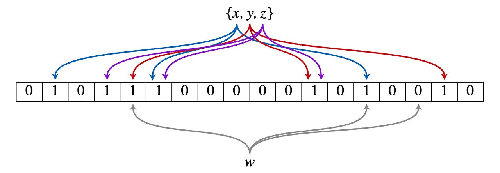
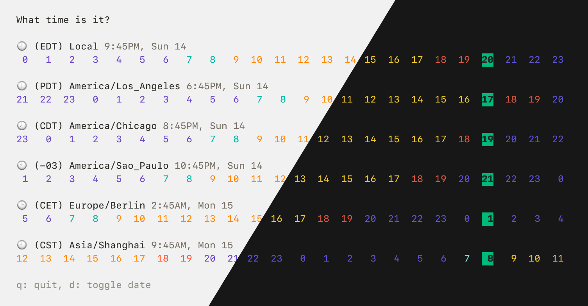

# Go语言爱好者周刊：第 95 期

这里记录每周值得分享的 Go 语言相关内容，周日发布。

本周刊开源（GitHub：[polaris1119/golangweekly](https://github.com/polaris1119/golangweekly)），欢迎投稿，推荐或自荐文章/软件/资源等，请[提交 issue](https://github.com/polaris1119/golangweekly/issues) 。

鉴于一些人可能没法坚持把英文文章看完，因此，周刊中会尽可能推荐优质的中文文章。优秀的英文文章，我们的 GCTT 组织会进行翻译。


题图：PingMe

## 刊首语

上周周刊的题目，正确率 62%，挺出乎意料的。不过有些人提到，感觉有陷阱，总觉得不那么简单。当然也有些人真的是做错了。可见，不少人的基础还是太弱，要加强！

今天依然一道简单的题目，希望你能自信点。

```go
package main

import (
	"fmt"
)

func main() {
	s := []int{9, 8, 7}
	p := &s
	r := *p
	r[0] = 11
	fmt.Println(s[0])
}
```

A：9；B：11；C：编译错误；D：不确定

另外，大家有好的题目，欢迎提交给我。加我微信（274768166 或到 GitHub 提交 Issue：<https://github.com/polaris1119/golangweekly>）。

## 资讯

1、[Echo 4.3 发布](https://github.com/labstack/echo)

高性能的 Web 框架。

2、[Heimdall 7.0 发布](https://github.com/gojek/heimdall)

Go 的增强型 HTTP 客户端。

3、[v8go 0.6.0 发布](https://github.com/rogchap/v8go)

在 Go 中执行 JavaScript。

## 谁在招 Gopher

整理近期的 Go 职位。有招聘需求可以到「Go招聘」发布！

1、[Wow，联通数科也招Gopher了](https://mp.weixin.qq.com/s/tVY3AuUOYEnMKi7Km4eBCw)

2、[薪资比肩北上广，你会考虑回老家吗？急招哦](https://mp.weixin.qq.com/s/koCxSjX8tXMMY3Yn8c4KpA)

## 文章

1、[图解 Go 内存管理分配](https://mp.weixin.qq.com/s/bMr4lZgf-Fn1oaOSPPSDIQ)

在内存从分配到回收的生命周期中，内存不再被使用的时候，标准库会自动执行 Go 的内存管理。

2、[再一次看到了 Go 的节制：int128 类型要不要支持？](https://mp.weixin.qq.com/s/5uW2rcIEhFPCCTPqrhwOow)

克制还是很重要的。

3、[unsafe 包真的不安全吗？](https://mp.weixin.qq.com/s/rIqkKNUecvnZ6gadThf4gg)

使用是一定要注意安全。

4、[Go Team Leader — rsc大神新开源了一个库，增强模板功能](https://mp.weixin.qq.com/s/3DFejimkPY9tg9QQL2QTqw)

说不定什么时候需要使用。

5、[Go：跨团队协作时如何共享对象](https://mp.weixin.qq.com/s/zJaruocUDSzld8ttDyawng)

想过这个问题吗？

6、[Uber 使用 Go 的规模这么大？！都自己定制的 Go 编译器了](https://mp.weixin.qq.com/s/MO0WNlwecDVLx4QfWklamA)

大厂很强。

7、[面试官：聊聊 defer 的工作原理。。。](https://mp.weixin.qq.com/s/oWlQU9c9z11CHdOwOMOHxA)

延迟函数（ deferred functions ）在所在函数返回前，以与声明相反的顺序立即被调用。

8、[面试官：说说unsafe.Pointer和uintptr的区别和联系](https://mp.weixin.qq.com/s/l-ZQws4SH4QsvMhmJddiww)

unsafe 很强大，但一定要注意安全。

9、[深度解密Go语言之基于信号的抢占式调度](https://mp.weixin.qq.com/s/ESfbVoCGUIdpwFOfGyvz1w)

不知道大家在实际工作中有没有遇到过老版本 Go 调度器的坑：死循环导致程序“死机”。

10、[Go 存储基础 — 内存结构体怎么写入文件？](https://mp.weixin.qq.com/s/mfNz7r76vZOOgiMSmuVeJA)

一个 Go 编程的使用技巧：怎么把内存的结构体写入到磁盘？又怎么读出来？

11、[实现无限缓存的 channel](https://colobu.com/2021/05/11/unbounded-channel-in-go/)

Go语言的channel又两种类型，一种是无缓存的channel，一种是有缓存的buffer，这两种类型的channel大家都比较熟悉了。

12、[Go 数组比切片好在哪？](https://mp.weixin.qq.com/s/zp1vdhGukEYKpzAdPt--Mw)

你觉得呢？

## 开源项目

1、[bloom](https://github.com/bits-and-blooms/bloom)

Bloom Filter 的 Go 语言实现。



2、[eliasdb](https://github.com/krotik/eliasdb)

图数据库。

3、[secure](https://github.com/unrolled/secure)

HTTP 安全中间件，包含很多安全策略。

4、[codename](https://github.com/lucasepe/codename)

生成随机的、可发音的名字，像 docker 给容器起的默认名字那样。

5、[bofied](https://github.com/pojntfx/bofied)

一个网络启动服务器，支持PXE服务协议。

6、[milvus](https://github.com/milvus-io/milvus)

开源向量数据库搜索引擎。

7、[singularity](https://github.com/sylabs/singularity)

一个开源的容器平台。

8、[mk48](https://github.com/SoftbearStudios/mk48)

Go 实现的开源游戏项目。

9、[nats-roundtripper](https://github.com/ripienaar/nats-roundtripper)

使用 NATS 作为 http.RoundTripper 的实现。

## 资源&&工具

1、[mangadesk](https://github.com/darylhjd/mangadesk)

MangaDex 的终端客户端。

2、[teams-cli](https://github.com/fossteams/teams-cli)

微软 Teams 的命令行终端 UI 工具。

3、[dblab](https://github.com/danvergara/dblab)

支持与 PostgreSQL 和 MySQL 交互的终端命令行工具。

4、[popeye](https://github.com/derailed/popeye)

一个实时扫描 Kubernetes 集群并报告部署资源和配置的潜在问题的工具。

5、[magia](https://github.com/pokemium/magia)

Go 实现的 GBA 游戏模拟器。

6、[ctop](https://github.com/bcicen/ctop)

像 top 那样的容器度量数据采集工具。

7、[tz](https://github.com/oz/tz)

时区辅助工具。



8、[pingme](https://github.com/kha7iq/pingme)

发送消息或警告到多个平台或邮箱，比如 slack、telegram 等。

## 订阅

这个周刊每周日发布，同步更新在[Go语言中文网](https://studygolang.com/go/weekly)和[微信公众号](https://weixin.sogou.com/weixin?query=Go%E8%AF%AD%E8%A8%80%E4%B8%AD%E6%96%87%E7%BD%91)。

微信搜索"Go语言中文网"或者扫描二维码，即可订阅。

