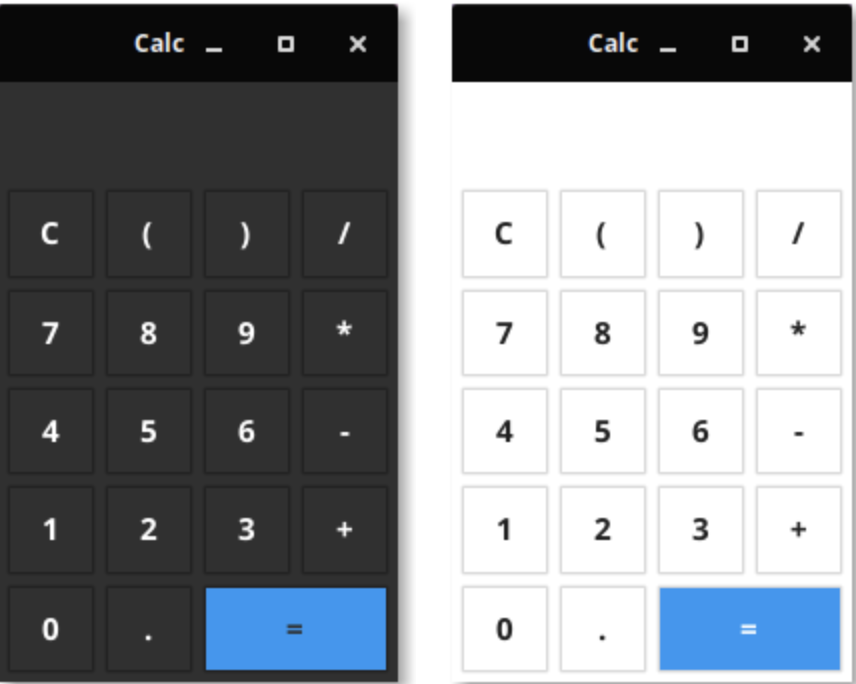
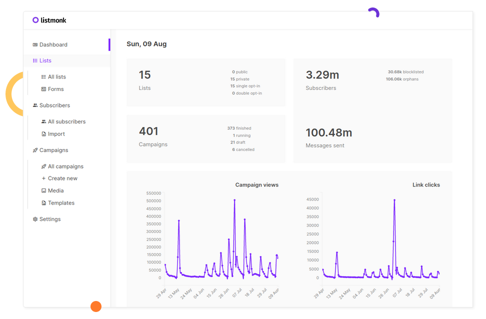
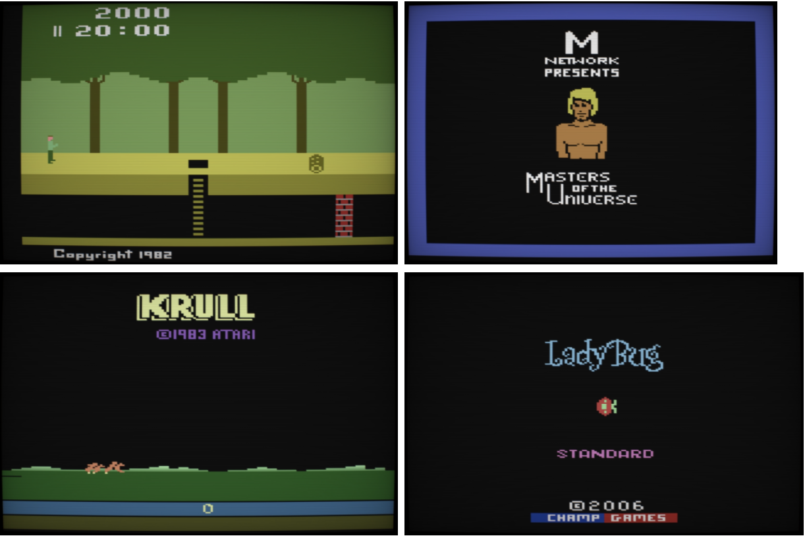

# Go语言爱好者周刊：第 96 期

这里记录每周值得分享的 Go 语言相关内容，周日发布。

本周刊开源（GitHub：[polaris1119/golangweekly](https://github.com/polaris1119/golangweekly)），欢迎投稿，推荐或自荐文章/软件/资源等，请[提交 issue](https://github.com/polaris1119/golangweekly/issues) 。

鉴于一些人可能没法坚持把英文文章看完，因此，周刊中会尽可能推荐优质的中文文章。优秀的英文文章，我们的 GCTT 组织会进行翻译。



题图：纯 Go 实现的计算器

## 刊首语

[94 周刊题解：常量表达式这个规则应该了解下](https://mp.weixin.qq.com/s/8fG0OMvwKziMSRs8bZFj2Q)。

[上期的题目](https://mp.weixin.qq.com/s/yBUlIhhGNSDUv7_J8Y0NmA)其实相当于 r := s，然后修改 r[0] 的值。根据 slice 和 array 的关系，s[0] 的值和 r[0] 是一样的，所以是 11，正确率也只有 69%。

上期周刊说，欢迎大家投稿题目，今天的题目就是网友投递的：<https://github.com/polaris1119/golangweekly/issues/40>，作者：[iMarlboro](https://github.com/iMarlboro)

```go
package main

import (
	"fmt"
	"sync"
)

func main() {
	var m sync.Map
	m.Store("address", map[string]string{"province": "江苏", "city": "南京"})
	v, _ := m.Load("address")
	fmt.Println(v["province"])
}
```

A：江苏；B：v["province"]取值错误；C：m.Store存储错误；D：不知道

## 资讯

1、[TinyGo 0.18.0 发布](https://github.com/tinygo-org/tinygo/releases/tag/v0.18.0)

该版本对 Go 的最低要求是 1.13。

2、[godocs.io](https://godocs.io/)

因为 godoc.org 现在已经重定向到 pkg.go.dev 了，但有些人依然喜欢 godoc.org。因此有人 fork 了一份，地址是：godocs.io。

3、[AWS Toolkit for Visual Studio Code](https://aws.amazon.com/cn/about-aws/whats-new/2021/05/aws-toolkit-visual-studio-code-adds-java-go-support/)

该插件增加对无服务器应用程序的 Java 和 Go 支持。你现在可以创建、本地调试和部署使用 Java 和 Go 编写的 Lambda 函数。

4、[原生 fuzzing 测试的支持已进入 Beta 阶段](https://twitter.com/katie_hockman/status/1394387692083990530)

模糊测试，感兴趣的可以了解下，这是提案：<https://go.googlesource.com/proposal/+/master/design/draft-fuzzing.md>。

5、[go-mysql 1.2.0 发布](https://github.com/go-mysql-org/go-mysql)

纯 Go 实现的 MySQL 网络协议库。

6、[Istio 1.10 发布](https://istio.io/latest/news/releases/1.10.x/announcing-1.10/)

为 Istio 用户改善 Day 2 操作。

7、[Delve v1.6.1 发布](https://github.com/go-delve/delve/blob/master/CHANGELOG.md#161-2021-05-18)

包含两个新的命令：dump 和 toggle。

## 谁在招 Gopher

整理近期的 Go 职位。有招聘需求可以到「Go招聘」发布！ 

1、[咱Gopher好香啊，输入法、搜索Top行业招Gopher，还不快到碗里来？](https://mp.weixin.qq.com/s/HY4CpoPqXroMhJJ250quZQ)

2、[券商公司招Gopher，不会炒股你觉得还有戏嘛？](https://mp.weixin.qq.com/s/MdBxyU7bfeuQzrUZS7YZzw)

3、[辣妹子、辣火锅、辣个工作，咱Gopher都值得拥有](https://mp.weixin.qq.com/s/wzb6YDt1BBw62X0MfTPOCg)

4、[成都Gopher可真香，上班还能开黑打王者](https://mp.weixin.qq.com/s/C06NmbVU0Mj5fYrmXMbIGw)

## 文章

1、[也许是你从来没用过的利器：GODEBUG](https://mp.weixin.qq.com/s/lqOs34aMs7AYCxM_Jv0Hug)

Go 协程是轻量的，在很多场景能提升你的程序性能。不幸的是，如果使用不当，也可能降低你程序的性能，因为 Go 协程的上线文切换也需要消耗一定的资源。

2、[Go缓存系列之-freecache](https://mp.weixin.qq.com/s/SwGTdFe9AgHPGqkDbZoUjQ)

Go 缓存库，具有零 GC 开销和高并发性能。

3、[优化 Golang 服务来减少 40% 以上的 CPU](https://mp.weixin.qq.com/s/dgVv6p8HQtc-krPGEdU2cQ)

十年前，谷歌正在面临一个由 C++ 编译时间过长所造成的严重瓶颈，并且需要一个全新的方式来解决这个问题。

4、[推荐一位高产的 Go 开源库作者](https://mp.weixin.qq.com/s/NlbUsovyqlIfnY9xQE-crA)

gjson 就是其中的优秀库。

5、[写了50万行Go代码是一种什么样的体验？](https://mp.weixin.qq.com/s/pzoTAl8xA9sefI_Ckpv8PA)

竟然有人评论说 10 万是 if err != nil 。。。

6、[盘点那些使用 Go 语言的国外公司](https://mp.weixin.qq.com/s/_3ef_wwuZG2BC9AHBjYGew)

盘点一下那些使用 Go 的国外公司，看看他们的案例，希望对大家的技术选型有所借鉴！

7、[小函数的调用开销需要考虑吗？Go 内联了解下](https://mp.weixin.qq.com/s/nW0Cye1G_A72fm7MuBAM1A)

内联优化。

8、[Go sync.Pool 浅析](https://mp.weixin.qq.com/s/MTf_4WEvCnCMKeQC_Wm_xw)

本篇文章会从使用方式，源码剖析，运用场景等方面，让你对 sync.Pool 有一个清晰的认知。

9、[曹大带我学 Go（1）——调度的本质](https://mp.weixin.qq.com/s/5E5V56wazp5gs9lrLvtopA)

这个说法挺新颖。

10、[用Go实现一个直播系统难吗？看看这个开源项目](https://mp.weixin.qq.com/s/5YPp7WFgVfPlGxim7tmQ5A)

## 开源项目

1、[listmonk](https://github.com/knadh/listmonk)

具有现代仪表板的高性能，自托管通讯和邮寄列表管理器。Go + Vue 构建。



2、[go-feature-flag](https://github.com/thomaspoignant/go-feature-flag)

一个 flag 轮子。

3、[authority](https://github.com/harranali/authority)

Role Based Access Control (RBAC)，带有数据库存储。

4、[go-notion](https://github.com/dstotijn/go-notion)

Notion API 的 Go 客户端。

5、[Gopher2600](https://github.com/JetSetIlly/Gopher2600)

纯 Go 实现的 Atari 2600/VCS 模拟器。



6、[magia](https://github.com/pokemium/magia)

纯 Go 实现的 GBA 模拟器。


## 资源&&工具

1、[go-sqldb](https://github.com/auxten/go-sqldb)

一个 SQL 数据库只使用了 2000 行 golang 代码并且没有任何第三方依赖。

2、[clipboard](https://github.com/golang-design/clipboard)

跨平台剪贴板，当包使用，也有命令行工具可以用。

3、[gmocker](https://github.com/Ananto30/mocker)

使用 JSON 文件生成 mock 服务器。

4、[graphjin](https://github.com/dosco/graphjin)

基于数据库快速生成 GraphQL 服务器。

5、[calculator](https://github.com/fyne-io/calculator)

基于 Fyne Go UI 框架的计算器。

## 订阅

这个周刊每周日发布，同步更新在[Go语言中文网](https://studygolang.com/go/weekly)和[微信公众号](https://weixin.sogou.com/weixin?query=Go%E8%AF%AD%E8%A8%80%E4%B8%AD%E6%96%87%E7%BD%91)。

微信搜索"Go语言中文网"或者扫描二维码，即可订阅。

