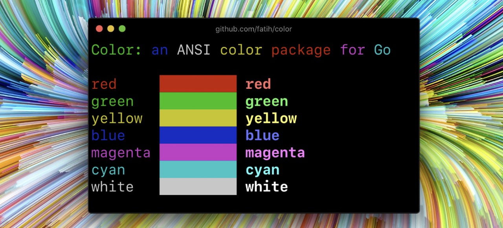
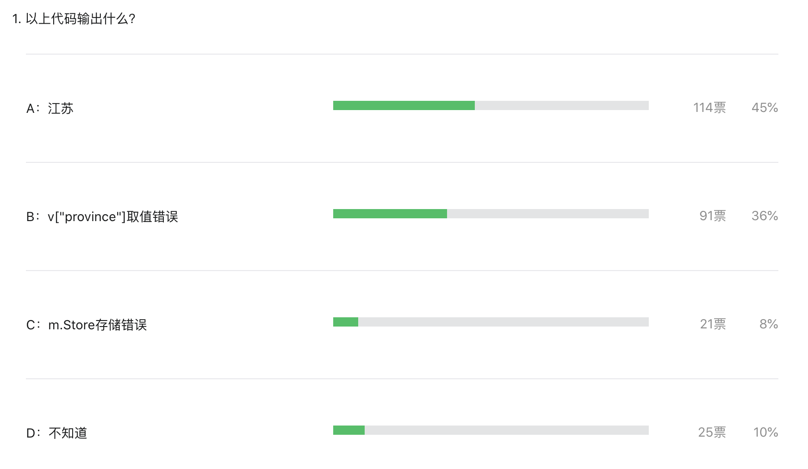
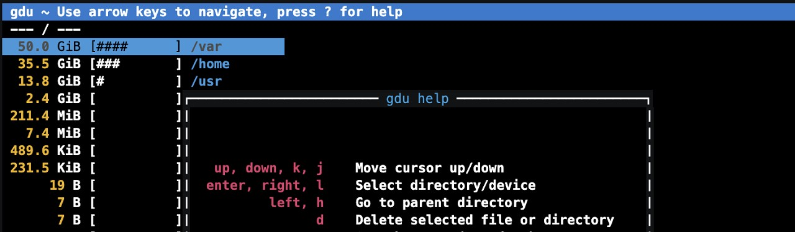

# Go语言爱好者周刊：第 97 期

这里记录每周值得分享的 Go 语言相关内容，周日发布。

本周刊开源（GitHub：[polaris1119/golangweekly](https://github.com/polaris1119/golangweekly)），欢迎投稿，推荐或自荐文章/软件/资源等，请[提交 issue](https://github.com/polaris1119/golangweekly/issues) 。

鉴于一些人可能没法坚持把英文文章看完，因此，周刊中会尽可能推荐优质的中文文章。优秀的英文文章，我们的 GCTT 组织会进行翻译。



题图：Go 带颜色输出的库 fatih/color

## 刊首语

应大家要求，先简单解析下上期周刊的题目，出题者：[iMarlboro](https://github.com/iMarlboro)

```go
package main

import (
	"fmt"
	"sync"
)

func main() {
	var m sync.Map
	m.Store("address", map[string]string{"province": "江苏", "city": "南京"})
	v, _ := m.Load("address")
	fmt.Println(v["province"])
}
```

以下是答题投票情况：



正确答案是 B。为什么？

这道题目的关键是 sync.Map 相关的定义（主要看本题使用了的 Store 和 Load）：

```go
func (m *Map) Load(key interface{}) (value interface{}, ok bool)
func (m *Map) Store(key, value interface{})
```

看到了没？接收的 key 和 value 都是 interface{}（返回的 value 也是 interface{}），所以，通过 Load 获取 key 对应的 value 是一个 interface{}。`fmt.Println(v["province"])` 这句相当于把 interface{} 当成 map 了，肯定报错，必须进行类型断言。你答对了吗？

有些人可能不明白为什么要泛型。有了泛型，这道题目就不需要做类型断言了。

看看本期周刊的题目。以下代码输出什么？

```go
package main

import (
	"fmt"
)

func hello(i *int) int {
	defer func() {
		*i = 19
	}()
	return *i
}

func main() {
	i := 10
	j := hello(&i)
	fmt.Println(i, j)
}
```

A：10 10；B：10 19；C：19 10；D：19 19

## 资讯

1、[gdu 5.0 发布](https://github.com/dundee/gdu)

带控制台接口的磁盘使用分析器。



2、[Caire 1.3 发布](https://github.com/esimov/caire)

使用接缝雕刻来拉伸图像的不重要部分，从而允许在调整大小的过程中考虑图像的内容。

3、[color 1.12.0 发布](https://github.com/fatih/color)

颜色文本输出包。

4、[go-elasticsearch 7.13.0 发布](https://github.com/elastic/go-elasticsearch)

官方的 Go 客户端。

5、[Go 新提案](https://github.com/golang/go/issues/46336)

bytes、strings 包增加 Cut 函数。

6、[提案：将 Go 移植到中科龙芯指令架构](https://github.com/golang/go/issues/46229)

支持的架构越来越多了。

## 谁在招 Gopher

整理近期的 Go 职位。有招聘需求可以到「Go招聘」发布！ 

1、[贝壳找房找Gopher咯，快到壳里来。](https://mp.weixin.qq.com/s/JyHCNufE7jYPd20nTH4jlw)

2、[华顺信安招Gopher](https://mp.weixin.qq.com/s/xQoEj43nRNkW_g4caLs3XA)

## 文章

1、[Go 中为什么应该使用接口](https://mp.weixin.qq.com/s/KqXI9ekYAZYd5oYmhqFH8Q)

强调一下是我个人的见解以及接口在 Go 语言中的意义。

2、[我这样升级 Go 版本，你呢？](https://mp.weixin.qq.com/s/jEhX5JHAo9L6iD3N54x6aA)

官方用的多版本管理方法。

3、[gRPC 可以不用 pb 而使用 JSON 吗？](https://mp.weixin.qq.com/s/oQ4aG0pIJmQFQd2TKGxsXg)

JSON payload 实现简易的请求和响应的内省。

4、[为什么Go程序占用那么大的虚拟内存？](https://mp.weixin.qq.com/s/tkAWtSJ4ebAUcQG9AmeXWA)

虚拟内存，不用惊慌！

5、[如何让 Go 的缓存库 BigCache 更好用？](https://mp.weixin.qq.com/s/Zn1rP18GtmZsbaRnRfJ8ug)

增加对 interface{} 的支持。	

6、[validator库你知多少？govalidator了解一下](https://mp.weixin.qq.com/s/FnvvREHWeN1UdRliFjxQ9A)

Web 开发基本必备的。

7、[Go 中如何让消息队列达到最大吞吐量？](https://mp.weixin.qq.com/s/K9qZVNP4AKsHNcrDyZq_eA)

本文带你一起探讨下消息队列消费端高吞吐的 `Go` 框架实现。

## 开源项目

1、[revive](https://github.com/mgechev/revive)

一个旨在提供更多结构和可配置性的 Golint 的替代品。它的速度据说有数倍提升。

2、[render](https://github.com/unrolled/render)

轻松 Render JSON，XML，二进制数据和HTML 模板响应。

3、[limitio](https://github.com/nanmu42/limitio)

带有 limiit 功能的 io.Reader 和 io.Writer。

4、[lima](https://github.com/AkihiroSuda/lima)

Linux 中的 macOS 子系统 lima。

5、[sealer](https://github.com/alibaba/sealer)

一款分布式应用打包交付运行的解决方案，阿里巴巴出品。

6、[netmaker](https://github.com/gravitl/netmaker)

通过安全，快速，专用网络连接任何计算机，并从中央服务器管理多个网络。

7、[forms](https://github.com/coscms/forms)

让表单创建和处理更简单。

8、[couper](https://github.com/avenga/couper)

一种轻量级 API 网关，旨在支持构建和操作 API 驱动的 Web 项目的开发人员。

## 资源&&工具

1、[go-map-schema](https://github.com/Kangaroux/go-map-schema)

简单的 JSON 类型检查。

2、[cocert](https://github.com/Dentrax/cocert)

私钥安全分发工具。

3、[Go 编码安全指南](https://github.com/Tencent/secguide/blob/main/Go%E5%AE%89%E5%85%A8%E6%8C%87%E5%8D%97.md)

腾讯出品。

4、[油管视频](https://www.youtube.com/watch?v=N-E-qtQhsHw)

Go 还是 Rust，看 Go 专家与 Rust 专家的圆桌辩论。

5、[mtail](https://github.com/google/mtail)

从应用程序日志中提取 WhiteBox 监视数据以在时间序列数据库中收集。Google 出品。

## 订阅

这个周刊每周日发布，同步更新在[Go语言中文网](https://studygolang.com/go/weekly)和[微信公众号](https://weixin.sogou.com/weixin?query=Go%E8%AF%AD%E8%A8%80%E4%B8%AD%E6%96%87%E7%BD%91)。

微信搜索"Go语言中文网"或者扫描二维码，即可订阅。

