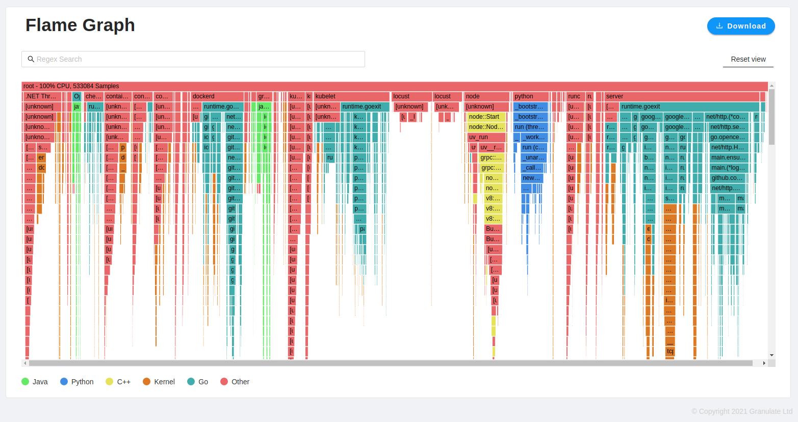

# Go语言爱好者周刊：第 98 期

这里记录每周值得分享的 Go 语言相关内容，周日发布。

本周刊开源（GitHub：[polaris1119/golangweekly](https://github.com/polaris1119/golangweekly)），欢迎投稿，推荐或自荐文章/软件/资源等，请[提交 issue](https://github.com/polaris1119/golangweekly/issues) 。

鉴于一些人可能没法坚持把英文文章看完，因此，周刊中会尽可能推荐优质的中文文章。优秀的英文文章，我们的 GCTT 组织会进行翻译。


题图：生成的 O’RLY 图书封面。地址见后文。

## 刊首语

上期周刊题解见：[《说好 defer 在 return 之后执行，为什么结果却不是》](https://mp.weixin.qq.com/s/jdSGxh0k_WWu8oCeHMSn_w)。

这次来一道更简单的题目。以下代码输出什么？

```go
package main

import (
  "fmt"
)

func main() {
  a := make([]int, 20)
  a = []int{7, 8, 9, 10}
  b := a[15:16]
  fmt.Println(b)
}
```

A：[0]；B：panic；C：7；D：不清楚

## 资讯

1、[GoLand 2021.2 EAP 版本可用](https://blog.jetbrains.com/go/2021/05/28/goland-2021-2-early-access-program-is-open/)

免费试用 30 天。	

2、[测试版已经有 Fuzzing 了](https://blog.golang.org/fuzz-beta)

官方博文。

3、[gock 1.1 发布](https://github.com/h2non/gock)

让 HTTP 流量 mock 和测试变得简单。

4、[GoLand 的 TinyGo 插件](https://blog.jetbrains.com/go/2021/06/02/tinygo-for-tiny-applications-discover-a-new-plugin-for-goland/)

发布在 GoLand 官方博客。

5、[go-redis 8.10.0 发布](https://github.com/go-redis/redis)

类型安全的 Redis 客户端。

6、[Go1.16.5 发布](https://mp.weixin.qq.com/s/-dYlKTEWuGTqIQYKQ3sETQ)

安全小版本更新。

## 谁在招 Gopher

整理近期的 Go 职位。有招聘需求可以到「Go招聘」发布！ 

1、[【阿里巴巴】云原生布道师的机会，这要求。。。](https://mp.weixin.qq.com/s/3cQLB7hEp5snlFmc1ueAfA)

## 文章

1、[Go1.16 中的新函数 signal.NotifyContext 怎么用？](https://mp.weixin.qq.com/s/mnR_wADjyHtyjdkSwcnkSw)

os/signal 这个包大家可能用的不多。但自从 Go1.8 起，有些人开始使用这个包了。

2、[Go避坑指南：这些错误你犯过吗？](https://mp.weixin.qq.com/s/UPvMC-JD5qpE0_4MdczwwA)

有些错误很常见。

3、[一文带你由浅入深地解读Zap的高性能](https://mp.weixin.qq.com/s/Qc5tGELKPZOA9LEBOEkuow)

uber 开源的提供快速，结构化，高性能的日志记录包。

4、[惊！这个 Go 开源项目号称「不改一行代码做秒杀」](https://mp.weixin.qq.com/s/NSJmV-hBucaXoBAfD3TKLA)

看到耗子叔发推文推荐了一个新开源的网关：Easegress。

5、[Go: stringer 命令，通过代码生成提高效率](https://mp.weixin.qq.com/s/Ik3PxNRbddtbm6E-Xo_rdA)

stringer 命令的目标是自动生成满足 fmt.Stringer 接口的方法。它将为指定的类型生成 String() 方法， String() 返回的字符串用于描述该类型。

6、[被黑惨了：一句话，说明自己会 Go，咋整？](https://mp.weixin.qq.com/s/igB7Zl-InaWdDCAX7OdVWQ)

高端黑？

7、[用 cgo 生成用于 cgo 的 C 兼容的结构体](https://mp.weixin.qq.com/s/bqUPN6wwua4x2_FOwyzkYg)

cgo 使用者可以看看。

8、[竟然还在争论是否学Go？本文彻底终结该话题](https://mp.weixin.qq.com/s/2jYX2iMp0z7v09-AxdLDMg)

永远的话题。

9、[Go语言如何实现可重入锁？](https://mp.weixin.qq.com/s/wBp4k7pJLNeSzyLVhGHLEA)

什么是可重入锁？

10、[如何设计 API 接口，实现统一格式返回？](https://mp.weixin.qq.com/s/6c6uapjIzJC9wmjUFyZuZA)

前端通常会通过后台提供的接口来获取数据来完成前端页面的渲染，前端可以为 PC 端、M 端、小程序、APP 等。

11、[Go 中的动态作用域变量是什么鬼？](https://mp.weixin.qq.com/s/bU6U5LfRsPLAN7DSoVkbUA)

这是一个 API 设计的思想实验。

12、[搞 Go 要了解的 2 个 Header，你知道吗？](https://mp.weixin.qq.com/s/rGqM1wMlqQEoJSgyrgZNLg)

SliceHeader 和 StringHeader。

## 开源项目

1、[gopatch](https://github.com/uber-go/gopatch)

Go 实现的 patch 工具（类似 Unix 的 patch 工具），Uber 出品。

2、[quic](https://github.com/goburrow/quic)

Go 语言 quic 实现。

3、[tstorage](https://github.com/nakabonne/tstorage)

快速时间序列数据库。

4、[sonic](https://github.com/bytedance/sonic)

字节开源的高性能 json 编解码库。

5、[easegress](https://github.com/megaease/easegress)

全能型流量编排系统。国人开发。

6、[go-i18n](https://github.com/nicksnyder/go-i18n)

Go 国际化库。

## 资源&&工具

1、[Go 性能工具 Cheat Sheet](https://steveazz.xyz/blog/go-performance-tools-cheat-sheet/)

建议收藏。

2、[GoWebSSH](https://github.com/o8oo8o/GoWebSSH)

Go 实现的一个 WebSSH 管理工具，支持文件上传下载。作者投稿。

3、[orly](https://github.com/nanmu42/orly)

使用 Go 生成你自己的 O’RLY 动物书封面。在线使用：<https://orly.nanmu.me/>。

4、[xo-grpc](https://github.com/walterwanderley/xo-grpc)

从数据库创建 gRPC 服务器。

5、[netz](https://github.com/SpectralOps/netz)

发现互联网组件服务的配置错误。

6、[ebpf-profiler](https://blog.px.dev/cpu-profiling-2/)

用 eBPF 编写的简单跨语言（Go、Rust、C/C++）连续性能剖析器。地址：<https://github.com/pixie-labs/pixie-demos/tree/main/ebpf-profiler>。

7、[gProfiler](https://github.com/Granulate/gprofiler)

结合多个采样分析器，对 CPU 开销进行统一的可视化分析，支持 Go、Java 和 Python。



8、[vtprotobuf](https://github.com/planetscale/vtprotobuf)

一个 protobuf 编译器，为 ProtoBuf APIv2 生成优化的 marshaling 和 unmarshaling Go 代码。

9、[slides](https://github.com/maaslalani/slides)

Go 实现的基于命令行终端的 slide 演示工具。

10、[promdump](https://github.com/ihcsim/promdump)

支持读取和打印 Prometheus 持久性数据块，支持按时间范围过滤持久性块。

## 订阅

这个周刊每周日发布，同步更新在[Go语言中文网](https://studygolang.com/go/weekly)和[微信公众号](https://weixin.sogou.com/weixin?query=Go%E8%AF%AD%E8%A8%80%E4%B8%AD%E6%96%87%E7%BD%91)。

微信搜索"Go语言中文网"或者扫描二维码，即可订阅。

