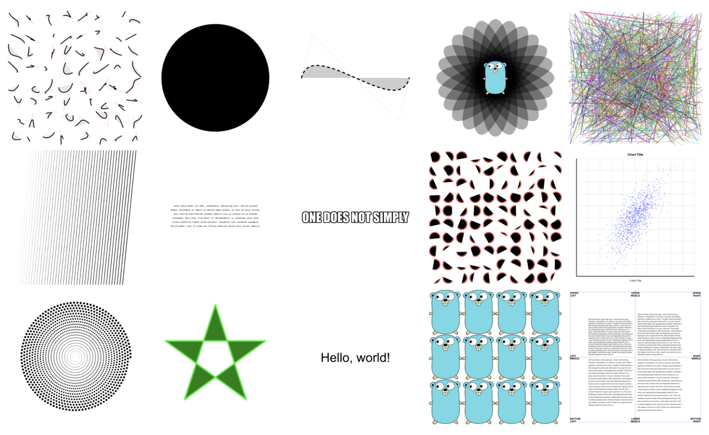
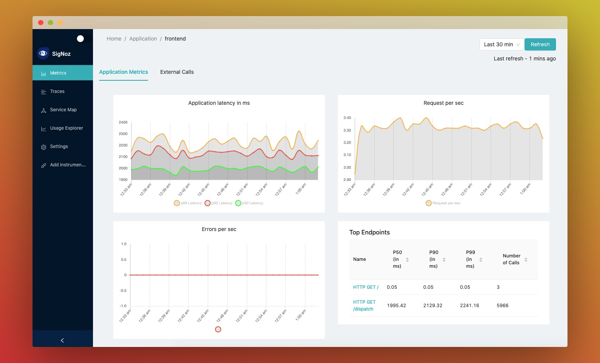

# Go语言爱好者周刊：第 100 期

这里记录每周值得分享的 Go 语言相关内容，周日发布。

本周刊开源（GitHub：[polaris1119/golangweekly](https://github.com/polaris1119/golangweekly)），欢迎投稿，推荐或自荐文章/软件/资源等，请[提交 issue](https://github.com/polaris1119/golangweekly/issues) 。

鉴于一些人可能没法坚持把英文文章看完，因此，周刊中会尽可能推荐优质的中文文章。优秀的英文文章，我们的 GCTT 组织会进行翻译。


题图：父亲节快乐

## 刊首语

上周周刊，虽然答题人数不多，但正确率才 28%。题目是这样的：

```go
package main

import "fmt"

func named() (n, _ int) {
	return 1, 2
}

func main() {
	fmt.Print(named())
}
```

以上代码输出什么？

A：1 0；B：1 2；C：不能编译；D：0 0

正确答案是 B。记住一点：命名返回值会被 return 后面的值覆盖掉。

看看本周的题目：

Go 版本 1.12 以上，以下代码输出什么？

```go
package main

import (
	"fmt"
)

func main() {
	m := map[string]int{"foo": 0, "bar": 1, "baz": 2}
	for k := range m {
		if k == "foo" {
			delete(m, "bar")
		}
		if k == "bar" {
			delete(m, "foo")
		}
	}
	fmt.Println(m)
}
```

A：map[baz:2 foo:0]；B：map[bar:1 baz:2]；C：map[baz:2]；D：不确定

## 资讯

1、[SFTPGo 2.1.0 发布](https://github.com/drakkan/sftpgo/releases/tag/v2.1.0)

Go 实现的功能齐全的 SFTP 服务器。

2、[mock 1.6.0 发布](https://github.com/golang/mock)

官方出品的 Mock 框架。

3、[GoLand 2021.2 EAP 发布](https://mp.weixin.qq.com/s/YKuur9QjU6BFnuHqqW5xDw)

预览版本。

## 谁在招 Gopher

整理近期的 Go 职位。有招聘需求可以到「Go招聘」发布！ 

1、[百度健康急聘Gopher](https://mp.weixin.qq.com/s/xOJNa5EWXtYOIi_h76r32Q)

## 文章

1、[Go就这待遇？2021年6月程序员工资排行榜](https://mp.weixin.qq.com/s/HTb0R7qrAP5ElZFchaHCjw)

数据来源不知道是否可信。

2、[鸭子类型 vs 结构化类型 vs 标称类型？Go是哪种？](https://mp.weixin.qq.com/s/IITCKfywi-9FUq47fq4Iuw)

编程语言具有类型概念 - 布尔类型，字符串，整型或者被称为类或者结构体的更加复杂的结构。

3、[搭建了一个Go官网](https://mp.weixin.qq.com/s/7lkBRmjEkElvqHmJVVBWwQ)

<https://docs.studygolang.com>。

4、[图解 Go 逃逸分析](https://mp.weixin.qq.com/s/80pv2gpnbKMPNLDr3dnSCA)

逃逸分析 是 Golang 编译器中的一个阶段，它通过分析用户源码，决定哪些变量应该在堆栈上分配，哪些变量应该逃逸到堆中。

5、[Go：字符串以及转换优化](https://mp.weixin.qq.com/s/PbmhUrfNu3slmnVyRK_KRw)

在 Go 语言中，将 byte 数组转换为 string 时，随着转换后字符串的拷贝，可能会触发内存分配。

6、[Go1.17 新特性之切片变数组](https://mp.weixin.qq.com/s/cl-Qsj6oK_6MKuMZHSDV5Q)

目前没太看出有多大用处。

7、[从一道题讲起：Go 的不可寻址值和切片](https://mp.weixin.qq.com/s/mY_Tf2M-su-urHw2ItbC1A)

Dave Cheney 在 Twitter 上发布了一个 Go 的小测验。

8、[Go 结构体的另类玩法：命名空间](https://mp.weixin.qq.com/s/8QRLiFMM8c5MX04f4ScUtA)

挺有意思。

## 开源项目

1、[go-vcr](https://github.com/dnaeon/go-vcr)

记录并重放 HTTP 交互以获得快速，确定性和准确的测试。

2、[gg](https://github.com/fogleman/gg)

用于渲染 2D 图形的纯 Go 库。



3、[scan](https://github.com/blockloop/scan)

将 database/sql 行直接扫描到结构体，切片和原始类型。

4、[domui](https://github.com/reusee/domui)

使用纯 Go 语言编写 Web 应用的框架。

5、[LinDB](https://github.com/lindb/lindb)

用 Go 重新实现饿了么在用的分布式时序数据库。

6、[access-controller](https://github.com/authorizer-tech/access-controller)

“谷歌一致性全球授权系统”论文的一个实现。

7、[erda](https://github.com/erda-project/erda)

Golang 开发的一站式云原生 PaaS 平台。

8、[column](https://github.com/kelindar/column)

Go 实现的具有位图索引的高性能、列式、内存存储库。

## 资源&&工具

1、[signoz](https://github.com/signoz/signoz)

帮助开发人员监控他们的应用程序和故障排除问题，是 DataDog，Newrelic 等的开源替代品。官方介绍博文：<https://signoz.io/blog/monitoring-your-go-application-with-signoz/>。



2、[trivy](https://github.com/aquasecurity/trivy)

一个针对容器镜像、Git 存储库和文件系统的漏洞扫描器，适用于 CI。

3、[mqtts](https://github.com/SPuerBRead/mqtts)

mqtt 协议安全检查工具。

4、[csv-sql](https://github.com/dhamith93/csv-sql)

加载 csv 和 excel（xlsx）文件并运行 sql 命令的命令行工具。

5、[gobrew](https://github.com/kevincobain2000/gobrew)

另一个 Go 版本管理器。

6、[Mmark](https://github.com/mmarkdown/mmark)

面向 IETF RFC 文档的 Markdown 处理器。

7、[migrate](https://github.com/maragudk/migrate)

基于 sql.DB 和 fs.FS 实现的数据库迁移工具。

8、[nancy](https://github.com/sonatype-nexus-community/nancy)

由 Sonatype OSS Index 提供的检查 Go 依赖项中漏洞的工具。

9、[plow](https://github.com/six-ddc/plow)

基于 fasthttp 实现的高性能http压测工具。

## 订阅

这个周刊每周日发布，同步更新在[Go语言中文网](https://studygolang.com/go/weekly)和[微信公众号](https://weixin.sogou.com/weixin?query=Go%E8%AF%AD%E8%A8%80%E4%B8%AD%E6%96%87%E7%BD%91)。

微信搜索"Go语言中文网"或者扫描二维码，即可订阅。


