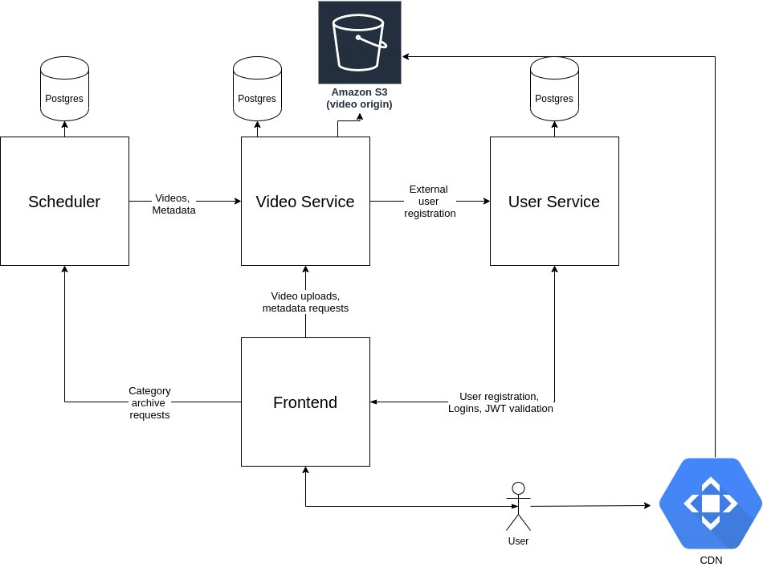

# Go语言爱好者周刊：第 102 期

这里记录每周值得分享的 Go 语言相关内容，周日发布。

本周刊开源（GitHub：[polaris1119/golangweekly](https://github.com/polaris1119/golangweekly)），欢迎投稿，推荐或自荐文章/软件/资源等，请[提交 issue](https://github.com/polaris1119/golangweekly/issues) 。

鉴于一些人可能没法坚持把英文文章看完，因此，周刊中会尽可能推荐优质的中文文章。优秀的英文文章，我们的 GCTT 组织会进行翻译。


题图：GORM

## 刊首语

简单解释下上期的题目：

```go
package main

var n = -99

func main() {
  m := make(map[string]int, n)
  println(m["Go"])
}
```

A：0；B：panic；C：不知道

答案是 A。48% 的人答对了。注意，从 map 获取数据，即使 map 是 nil，也不会 panic。通过 make 创建 map 时，第 2 个参数可以为负数，以下是等价的：

```go
make(map[string]int, -99)
make(map[string]int, 0)
make(map[string]int)
```

具体可以参考：<https://github.com/golang/go/issues/46909>。

本期是一道关于 channel 的题目：

```go
package main

import (
	"fmt"
)

func main() {
	c := make(chan int)
	close(c)
	val, _ := <-c
	fmt.Println(val)
}
```

A：运行时死循环；B：0；C：编译不通过；D：不确定

## 资讯

1、[cobra 1.2.0 发布](https://github.com/spf13/cobra/releases/tag/v1.2.0)

[Cobra](https://cobra.dev/) 是一个构建现代 CLI APP 的框架。

2、[sso 3.0 发布](https://github.com/buzzfeed/sso)

内部服务的 Go 单点登录方案。

3、[copilot-go-experiments](https://github.com/Pisush/copilot-go-experiments)

github copilot 的 Go 编码实践。

4、[惊呆了！Go 代码的第一次提交竟然是 1972 年。。。](https://mp.weixin.qq.com/s/LlX1a2DoaYjTEChc7Dbyqg)

Go Team 的彩蛋？

5、[tinygo 0.19.0 发布](https://github.com/tinygo-org/tinygo/releases/tag/v0.19.0)

这是一个基于 LLVM 的、用于一些特定小场景的 Go 编译器，比如 WebAssembly、Microcontrollers 和 命令行工具等。在周刊的第 1 期推荐过。这次版本主要提升了反射性能、扩展和提升调度器性能等。

6、[GoLand 2021.2 EAP Build #6 发布](https://blog.jetbrains.com/go/2021/07/02/goland-2021-2-eap-build-6-is-out/)

新增 “保存和清理的欢迎” 界面上的 “新设置” 菜单。

7、[Ultimate Go Notebook 发布](https://education.ardanlabs.com/courses/ultimate-go-notebook)

这本书之前介绍过。现在可以购买。

## 谁在招 Gopher

整理近期的 Go 职位。有招聘需求可以到「Go招聘」发布！ 

1、[Aibee开放大量Golang职位，快来和小姐姐做同事喽！](https://mp.weixin.qq.com/s/MD71qYFeCXQOrRgRvbgjUQ)

2、[【北京|深圳-腾讯微视】短视频Top企业招聘Gopher](https://mp.weixin.qq.com/s/qnh5LdNtVShO0qizWc7EJQ)

3、[回响科技招聘 | 潮玩社区由你来打造](https://mp.weixin.qq.com/s/utVTOWRpD6hQoDTyIH1-JA)

## 文章

1、[推荐三个Go实战开源项目](https://mp.weixin.qq.com/s/v_wonIeuxQWT_qPTGv7GIw)

新手练习项目。

2、[在 Golang 中使用 -w 和 -s 标志](https://mp.weixin.qq.com/s/aPP1Eb6jEJS7oKy4KZLI4g)

本文致力于说明在 Go 中实现 -w 和 -s 标志的效果，并提供可以更有效地使用它们的方法。

3、[深入 Go Module 之讨厌的 v2](https://colobu.com/2021/06/28/dive-into-go-module-2/)

Go module不但遵循语义化版本规范 2.0.0,而且还更进一步，对语义化版本中的major还还赋予了更深的意义。

4、[在 Go 中编写令人愉快的 HTTP 中间件](https://mp.weixin.qq.com/s/ZUdUdlrnndcCZnjwqC6PcQ)

在使用 Go 编写复杂的服务时，您将遇到一个典型的主题是中间件。

5、[Go中的error居然可以这样封装](https://mp.weixin.qq.com/s/q2VrY8ksNsmYzvqhUNv72A)

本文我们将探讨如何封装Go的error类型以在应用程序中带来更大的价值。

6、[这本 Go 新书挺期待的](https://mp.weixin.qq.com/s/ZDMHec34ixqMaVo365InHg)

明年出版。

7、[知乎热议：java太卷了，要不要转go啊？](https://mp.weixin.qq.com/s/Hb41qkaUTaXCCZrhQSO0QQ)

真的卷的飞起。

8、[Go 字符串中的潜在问题](https://mp.weixin.qq.com/s/_ScaGaB8mr2aSyQjL-VIaA)

什么问题呢？

9、[通过实例理解Go Execution Tracer](https://tonybai.com/2021/06/28/understand-go-execution-tracer-by-example/)

采样工具（Sampling tools）采用一个测量的子集来描绘目标的粗略情况；这也被称为创建一个profile或profiling（剖析）。

## 开源项目

1、[kubewebhook](https://github.com/slok/kubewebhook)

创建 Kubernetes mutating 和 validating 网络钩子的 Go 框架。

2、[horahora](https://github.com/horahoradev/horahora)

Niconico, Bilibili 和 Youtube 的自托管视频托管网站和视频档案管理器。



3、[riot](https://github.com/go-ego/riot)

开源，分布式，简单高效的全文搜索引擎。

4、[kazaam](https://github.com/qntfy/kazaam)

JSON 的任意变换。

## 资源&&工具

1、[fibratus](https://github.com/rabbitstack/fibratus)

Windows 内核勘探和追踪的现代工具。

2、[alda](https://github.com/alda-lang/alda)

用于音乐创作的基于文本的编程语言。

3、[spotify-cli](https://github.com/brianstrauch/spotify-cli)

Spotify 终端客户端。

4、[coronaqr](https://github.com/stapelberg/coronaqr)

用于欧盟数字 Covid 证书（EUDCC）QR 码数据的 Go 解码器。

5、[播客第 186 期](https://changelog.com/gotime/186)

通过 pop quiz 来学习 Go。

6、[x-stock](https://github.com/axiaoxin-com/x-stock)

财报分析，股票检测，基本面选股，基金检测，基金筛选，Go 实现。

7、[json-to-go](https://github.com/misakafs/json-to-go)

用 vue3 开发的一个 json 转 Go 结构体工具网站。

8、[go-strip](https://github.com/boy-hack/go-strip)

消除 Go 的编译特征。

## 订阅

这个周刊每周日发布，同步更新在[Go语言中文网](https://studygolang.com/go/weekly)和[微信公众号](https://weixin.sogou.com/weixin?query=Go%E8%AF%AD%E8%A8%80%E4%B8%AD%E6%96%87%E7%BD%91)。

微信搜索"Go语言中文网"或者扫描二维码，即可订阅。


