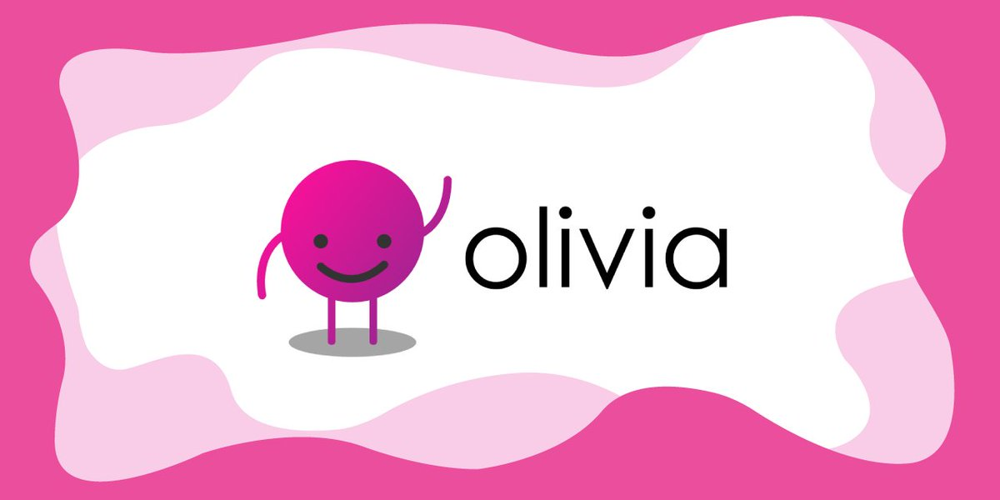
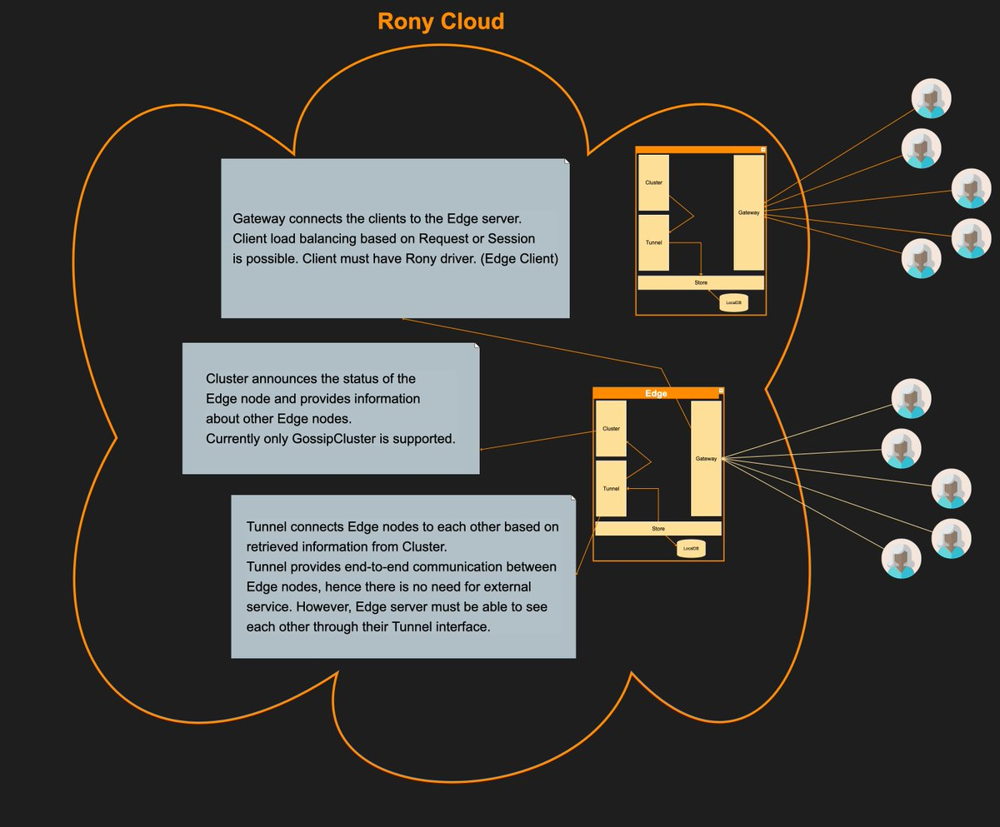

# Go语言爱好者周刊：第 103 期

这里记录每周值得分享的 Go 语言相关内容，周日发布。

本周刊开源（GitHub：[polaris1119/golangweekly](https://github.com/polaris1119/golangweekly)），欢迎投稿，推荐或自荐文章/软件/资源等，请[提交 issue](https://github.com/polaris1119/golangweekly/issues) 。

鉴于一些人可能没法坚持把英文文章看完，因此，周刊中会尽可能推荐优质的中文文章。优秀的英文文章，我们的 GCTT 组织会进行翻译。



题图：Go 实现的开源聊天机器人

## 刊首语

上期是一道关于 channel 的题目，正确率还不错，达到了 66%。现简单解释下。

```go
package main

import (
	"fmt"
)

func main() {
	c := make(chan int)
	close(c)
	val, _ := <-c
	fmt.Println(val)
}
```

A：运行时死循环；B：0；C：编译不通过；D：不确定

答案 B。答案来自标准库 close 函数的文档说明：

> After the last value has been received from a closed channel c, any receive from c will succeed without blocking, returning the zero value for the channel element.

即从关闭了的 channel 接收不会堵塞，并返回零值，因此答案是 B。

本期是一道关于 reflect 的题，以下代码输出什么？

```go
package main

import (
	"fmt"
	"reflect"
)

func main() {
	i := 1
	j := 1
	no1 := &i
	no2 := &j
	if reflect.DeepEqual(no1, no2) {
		fmt.Println("equal")
		return
	}
	fmt.Println("not equal")
}
```

A：equal；B：not equal；C：不确定

## 资讯

1、[Russ Cox 关于内存模型的系列文章](https://research.swtch.com/hwmm)

rsc 通过研究，希望能够更好的服务 Go 内存模型。

2、[Kratos 2.0 发布](https://github.com/go-kratos/kratos)

一个国产的 Go 微服务框架。

3、[GoLand 2021.2 发布](https://blog.jetbrains.com/go/2021/07/08/goland-2021-2-reaches-beta/)

表示不增加新特性了。

## 谁在招 Gopher

整理近期的 Go 职位。有招聘需求可以到「Go招聘」发布！ 

1、[CloudFine多云转晴 寻找优秀的你](https://mp.weixin.qq.com/s/CzJSmvXrb7D6p6i1nxjH1A)

## 文章

1、[Go项目实战：从零构建一个并发文件下载器](https://mp.weixin.qq.com/s/MxjLrYfvgk5kdi43xm6kVA)

今天为大家带来一个实战项目。建议你一定要动手实践。

2、[网友很强大，发现了Go并发下载的Bug](https://mp.weixin.qq.com/s/g_v9ZOotpMfvgQtM5GqB-g)

处理上篇的留言问题。

3、[详解 Go 语言 Protobuf 之 Message](https://mp.weixin.qq.com/s/Q8peFKy8Ftv21E4qmjNCXQ)

Protobuf 几乎必学的了？

4、[在 Go 中我是如何组织包的](https://mp.weixin.qq.com/s/Y-tQ8AYMGHEgXphKVK1afA)

你一般怎么组织？

5、[在Go中如何用Redlock实现分布式锁呢？](https://mp.weixin.qq.com/s/e8sUwTBfgzXdCXd3ViCNdw)

在多线程编程环境中，我们通常使用锁来限制对共享资源的访问。互斥锁就是其中的一个例子。

[关于Go Test这些小技巧，Gopher应该知道](https://mp.weixin.qq.com/s/HzET8y7lRa7NzJhB49ATtg)

关于测试的必要性，这里就不多说了，很多人反感写测试代码，觉得浪费时间。但实际上写好测试代码后，后期代码调整，能够节省大量的调试时间。

7、[在 5 分钟之内部署一个 Go 应用](https://mp.weixin.qq.com/s/ENKYHrWv_Ayz2XdjvQ3sVQ)

很方便。

8、[类似 Go 中的表格驱动测试的步骤驱动评估](https://mp.weixin.qq.com/s/saIuPyEW_yFNrcnP8qG0LQ)

如果你听说过表驱动测试，那你就能更容易理解本文所描述的概念，因为它们使用的是相同的技术，只不过本文使用在非测试场景中。

9、[如何选择一门编程语言](https://mp.weixin.qq.com/s/M-NlM8lzzL7IZJMNi0hIIw)

考虑哪些因素？

10、[为什么把 dig 迁移到 wire](https://mp.weixin.qq.com/s/ZAHInPGKT4UZqzmfkqUCMQ)

dig 和 wire 都是 Go 依赖注入的工具，那么，本质上功能相似的工具，为什么要从 dig 切换成 wire？

## 开源项目

1、[certmagic](https://github.com/caddyserver/certmagic)

为任意 Go 程序自动加上 HTTPS，Caddy 使用的一个库。

2、[bluemonday](https://github.com/microcosm-cc/bluemonday)

一个快速的 Go HTML sanitizer，不受信任的用户输入的内容，返回可以安全显示的 HTML 内容。

3、[di](https://github.com/go-tk/di)

一个小巧的依赖注入框架。

4、[dragon](https://github.com/azerothyang/dragon)

简单的 Web 框架。

5、[dtm](https://github.com/yedf/dtm)

国人开源的分布式事务框架。

6、[rony](https://github.com/ronaksoft/rony)

快速可扩展的 RPC 框架。



7、[olivia](https://github.com/olivia-ai/olivia)

Olivia 是一个使用机器学习技术用 Golang 建立的开源聊天机器人。它的目标是提供一个免费的、开源的服务来替代像 DialogFlow 这样的大型服务。

## 资源&&工具

1、[Go 播客第 187 期](https://changelog.com/gotime/187)

讨论将要加入 Go 标准库的 Fuzzing。

2、[balerter](https://github.com/balerter/balerter)

基于 Lua 脚本的报警管理，可以发送到 Slack、Telegram 等。

3、[semverbot](https://github.com/restechnica/semverbot)

一个根据 git 信息自动进行 semver 版本管理的 cli 工具。

4、[ADBTuiFM](https://github.com/darkhz/adbtuifm)

基于 tui 的 ADB 文件管理器。

5、[Dave 讲故事（视频）](https://www.youtube.com/watch?v=bwQS7PO6_Ho)

Go 是如何避免隐式整数提升和类型转换的。

6、[d0zer](https://github.com/sad0p/d0zer)

用 Go 编写的 Elf 二进制感染器（infector）。

7、[GopherChina](https://github.com/fanjindong/GopherChina)（fanjindong 投稿）

15~21 年历届 GopherChina 大会资料。

## 订阅

这个周刊每周日发布，同步更新在[Go语言中文网](https://studygolang.com/go/weekly)和[微信公众号](https://weixin.sogou.com/weixin?query=Go%E8%AF%AD%E8%A8%80%E4%B8%AD%E6%96%87%E7%BD%91)。

微信搜索"Go语言中文网"或者扫描二维码，即可订阅。


