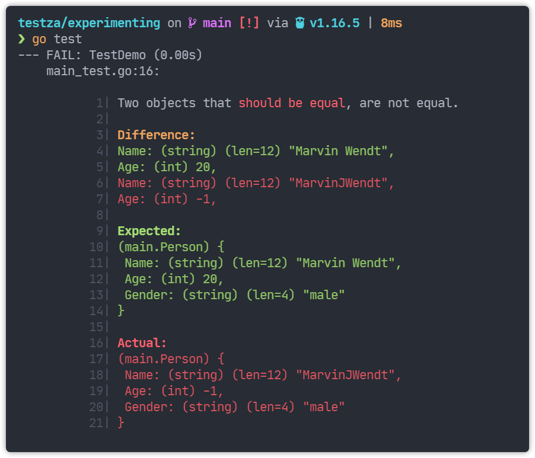

# Go语言爱好者周刊：第 104 期

这里记录每周值得分享的 Go 语言相关内容，周日发布。

本周刊开源（GitHub：[polaris1119/golangweekly](https://github.com/polaris1119/golangweekly)），欢迎投稿，推荐或自荐文章/软件/资源等，请[提交 issue](https://github.com/polaris1119/golangweekly/issues) 。

鉴于一些人可能没法坚持把英文文章看完，因此，周刊中会尽可能推荐优质的中文文章。优秀的英文文章，我们的 GCTT 组织会进行翻译。


题图：Go1.17 RC1 发布

## 刊首语

上期是一道关于 reflect 的题，以下代码输出什么？

```go
package main

import (
	"fmt"
	"reflect"
)

func main() {
	i := 1
	j := 1
	no1 := &i
	no2 := &j
	if reflect.DeepEqual(no1, no2) {
		fmt.Println("equal")
		return
	}
	fmt.Println("not equal")
}
```

A：equal；B：not equal；C：不确定

答案是 A。一半人答对！从 DeepEqual 这个函数名可以看出，它会进行“深度”比较。对于指针类型，它会比较它们指向的值是否相等。因为 i 和 j 的值都是 1，所以结果是 A。详细信息可以查看 DeepEqual 函数的文档。

本期题目来自 Go101。以下代码输出什么？

```go
package main

func main() {
  var x *struct {
    s [][32]byte
  }
  
  println(len(x.s[99]))
}
```

A：运行时 panic；B：32；C：编译错误；D：0

## 资讯

1、[Go 1.17 RC 1 发布](https://groups.google.com/g/golang-announce/c/gJE7OtHlRbM/m/21x8zAR-AAAJ)

官方常规安装方式：

```bash
$ go get golang.org/dl/go1.17rc1
$ go1.17rc1 download
```

2、[Go1.16.6 发布](https://mp.weixin.qq.com/s/s1q6YKzFX0FLec394es-0g)

又一个小问题引发安全 Bug。

3、[uuid 1.3.0 发布](https://github.com/google/uuid)

谷歌出品。

4、[ws 1.1 发布](https://github.com/gobwas/ws)

小型的 WebSocket 库。

## 谁在招 Gopher

整理近期的 Go 职位。有招聘需求可以到「Go招聘」发布！ 

1、[诺瓦科技诚聘Gopher，共同创造智能视界](https://mp.weixin.qq.com/s/Psgfopy8j5sZFX-l9uk4WQ)

## 文章

1、[这个工具真好：看看你的Go项目依赖有无漏洞](https://mp.weixin.qq.com/s/pzCefw0g82f6fNqiW3wqEg)

建议查查你的项目。

2、[Go 微服务中的熔断器和重试](https://mp.weixin.qq.com/s/4-n-mpSPrT8kbxRT1qv0Xw)

讨论微服务架构中的自我恢复能力。

3、[图解 Go 协程，操作系统线程和 CPU 管理](https://mp.weixin.qq.com/s/INW0vr9_9cQhbTBR5ho0Sw)

对于一个程序来说，从内存和性能角度讲创建一个 OS 线程或切换线程花费巨大。

4、[Go 项目从 Travis 迁移至 GitHub Actions](https://mp.weixin.qq.com/s/P8-ob4F70J03Hv_CQvJVcw)

使用新的 GitHub Actions 将手动发版过程自动化。

5、[Go1.17 新特性：新版构建约束](https://mp.weixin.qq.com/s/1JfYNZR8dH2eaCRuLJmJcg)

使用 `//go:build` 格式。

6、[Go程序内存分配过多？试试本文的方法](https://mp.weixin.qq.com/s/nQMgB76ecuF86TtO1NjiOA)

由于Go语言在抽象和垃圾回收内存管理模型方面介于C和Python之间，这对于那些希望能够找到一门处理效率高但同时又容易理解的高级程序语言的程序员来说，具有相当大的吸引力。

7、[一顿操作猛如虎：Rust 能避免 Go 的 Bug？](https://mp.weixin.qq.com/s/qxgTsATqGLjx89d9rE2Vmg)

两门语言配合挺好的吧！

8、[Go日志库zero-log大解剖](https://mp.weixin.qq.com/s/knayd7gQSChyDfSJCxh3uA)

挺有名的一个 Go 日志库。

9、Russ Cox 三篇关于内存模型的新文章，[中文翻译版](https://colobu.com/2021/06/30/hwmm/)

这里是[第二](https://colobu.com/2021/07/11/Programming-Language-Memory-Models/)、[第三篇](https://colobu.com/2021/07/13/Updating-the-Go-Memory-Model/)。

10、[Rust + Go 双剑合璧：WebAssembly 领域应用](https://mp.weixin.qq.com/s/501wCGxATJ0J7kGZqsKiJw)

一个 CNCF 项目。

## 开源项目

1、[LiveKit](https://livekit.io/)

实时通信的开源平台，有相当完整的前后端实现，支持音视频，服务端基于 Go 实现。

2、[golfcart](https://github.com/healeycodes/golfcart)

生命不息，折腾不止。又一个 Go 语言实现的脚本语言。

3、[testza](https://github.com/MarvinJWendt/testza)

全功能测试框架！断言、mock 等。



4、[mpb](https://github.com/vbauerster/mpb)

多进度条实现，并发下载可能需要。

5、[ergo](https://github.com/halturin/ergo)

Erlang/TOP 技术的 Go 实现。

6、[cap](https://github.com/hashicorp/cap)

Hashicorp 开源，一个认证包的集合。

7、[gotk4](https://github.com/diamondburned/gotk4)

Go GTK4 绑定生成器。

8、[bool-expr-indexer](https://github.com/csimplestring/bool-expr-indexer)

Go 布尔表达式索引器库。

9、[stealthpool](https://github.com/Link512/stealthpool)

提供了一个内存池，它在堆外分配的块不会被垃圾收集器追踪到。

10、[go-thinkium](https://github.com/ThinkiumGroup/go-thinkium)

Go 实现的全能公链 thinkium。

11、[netpoll](https://github.com/cloudwego/netpoll)

开源网络库。

## 资源&&工具

1、[minimock](https://github.com/gojuno/minimock)

强大的 mock 生成工具。

2、[gan-go](https://github.com/LdDl/gan-go)

通过 Gorgonia 在 Go 中使用生成对抗性网络(GAN) 。

3、[mimeheader](https://github.com/aohorodnyk/mimeheader)

MIME 头分析工具 mimeheader。

4、[GOP-Server](https://github.com/i-rme/GOP-Server)

内置 Go 语言扩展引擎的 Go Web 服务器。

## 订阅

这个周刊每周日发布，同步更新在[Go语言中文网](https://studygolang.com/go/weekly)和[微信公众号](https://weixin.sogou.com/weixin?query=Go%E8%AF%AD%E8%A8%80%E4%B8%AD%E6%96%87%E7%BD%91)。

微信搜索"Go语言中文网"或者扫描二维码，即可订阅。


