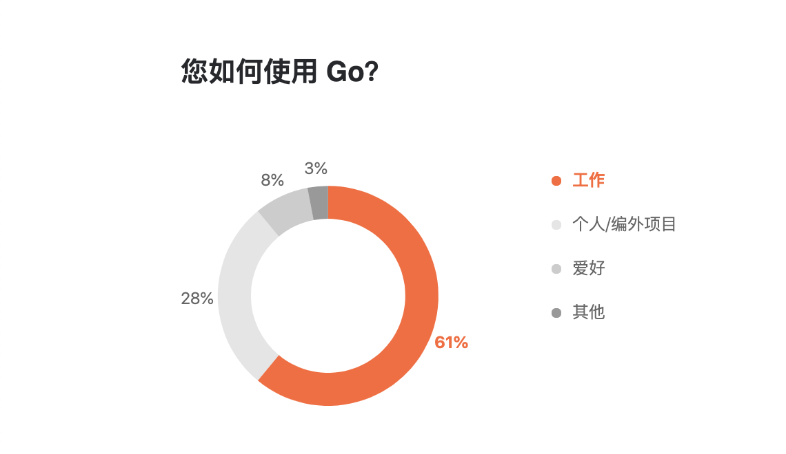

# Go语言爱好者周刊：第 105 期

这里记录每周值得分享的 Go 语言相关内容，周日发布。

本周刊开源（GitHub：[polaris1119/golangweekly](https://github.com/polaris1119/golangweekly)），欢迎投稿，推荐或自荐文章/软件/资源等，请[提交 issue](https://github.com/polaris1119/golangweekly/issues) 。

鉴于一些人可能没法坚持把英文文章看完，因此，周刊中会尽可能推荐优质的中文文章。优秀的英文文章，我们的 GCTT 组织会进行翻译。



题图：你如何使用Go？来自 jetbrains，后续分享。

## 刊首语

上期的题目正确率很低，也确实很偏的一道题，因此我会专门写文讲解。请留意公众号文章。

本期不出题了。

## 资讯

1、[Delve 1.7.0 发布](https://github.com/go-delve/delve/blob/master/CHANGELOG.md#170-2021-07-19)

支持 Go1.17。

2、[EggOS 0.2](https://github.com/icexin/eggos)

在 x86 裸机上运行单个 Go 应用程序，支持大多数 Go 功能和标准库，并配备网络堆栈，该堆栈将与大多数基于网络的库一起使用。 0.2 增加浮点数，鼠标和 GUI 支持。

3、[Go 提案](https://github.com/golang/go/discussions/47330)

讨论在标准库中增加泛型版 set 包与 maps 包。

## 谁在招 Gopher

整理近期的 Go 职位。有招聘需求可以到「Go招聘」发布！ 

- [利好！又有二线城市招聘Go工程师](https://mp.weixin.qq.com/s/TQFyc0-jpyhEqwjWAygjBQ)

## 文章

1、[听说过对 Go map 做 GC 吗？](https://mp.weixin.qq.com/s/fTyfcBhRGNo3Q3Gl12_XNw)

在 Golang 中的 map 结构，在删除键值对的时候，并不会真正的删除，而是标记。那么随着键值对越来越多，会不会造成大量内存浪费？

2、[厉害了我的 Go：国人开源的推荐系统](https://mp.weixin.qq.com/s/eN5I067dJpvUIVT7V5YUAA)

一个用 Go 编写的开源推荐系统。

3、[助力你成为更好Gopher的7个Go库](https://mp.weixin.qq.com/s/UWrs05EoIapwSCS11aJH7w)

一些项目推荐。

4、[Go中签名采坑记](https://mp.weixin.qq.com/s/QRg51DgV8TQKfrbcEpfTsw)

本文主要记录在go(gin框架)验签时，踩到的一些坑，加以总结和记录。

5、[用Go构建一个快速的现代化网络爬虫](https://mp.weixin.qq.com/s/sDKLzCiZzh4Od-4xd_J8tA)

什么是网络爬虫？

6、[用 Go 造一个 Redis：推荐两个开源项目供参考](https://mp.weixin.qq.com/s/-xtreimiPbOuiq_bbsA3KA)

对 Redis 实现感兴趣的可以看看。

7、[使用 Hugo 和 Github Pages 创建你的开发者作品集](https://mp.weixin.qq.com/s/SN_Ulgoa1N3gBnSSKB13vA)

在本指导中，我会带领你快速且免费的建立并且上线你的工作集网站。

8、[解密为何 Golang 能从众多语言中脱颖而出](https://mp.weixin.qq.com/s/wHUm-siLH70nKZ_q9PrIDw)

你认为是哪些点？

9、[通过 Go 搞懂一致性hash的原理和实现](https://mp.weixin.qq.com/s/eY-ARZfhsutoloxcflba0Q)

本文来详细讲讲一致性hash的原理和在 go-zero 中的实现。

10、[一文搞懂 Go 语言的 plugin](https://tonybai.com/2021/07/19/understand-go-plugin)

在 Go 1.8 版本中引入的。

## 开源项目

1、[gocv](https://github.com/hybridgroup/gocv)

使用 OpenCV 4+ 的计算机视觉包。

2、[Gort](https://github.com/getgort/gort)

一个从头开始为聊天机器人设计的 Go 框架。

3、[easemesh](https://github.com/megaease/easemesh)

与 Spring Cloud 完全兼容的 Ease Mesh 开源。

4、[endless](https://github.com/fvbock/endless)

实现优雅重启的工具 endless。

5、[tarmac](https://github.com/madflojo/tarmac)

用 Web Assembly 构建分布式服务的 Go 框架。

6、[gowasmer](https://github.com/mattn/gowasmer)

wasm_exec.js 文件的一个移植，它假定 WebAssembly 的运行时是 wasmer-go。

7、[Coraza WAF](https://github.com/jptosso/coraza-waf)

一个兼容 go modsecurity 的 Web 应用防火墙库。

8、[easytcp](https://github.com/DarthPestilane/easytcp)

一个用 Go 编写的轻量级 TCP 框架。

## 资源&&工具

1、[httpstat](https://github.com/davecheney/httpstat)

可视化 HTTP 连接统计信息。


2、[askgit](https://github.com/askgitdev/askgit)

通过 SQL 的方式查询 Git。例如：

```bash
askgit "SELECT * FROM commits"
```

3、[播客第 188 期](https://changelog.com/gotime/188)

Go 的语义导入版本管理（SIV）以及“v2+问题”

4、[torpar](https://github.com/varbhat/torpar)

Torrent Paradise 的 TUI Go 客户端，Torrent Paradise 是去中心化的 DHT Torrent 搜索网站。

5、[td](https://github.com/gotd/td)

纯 go 实现的 telegram 客户端。

6、[numb](https://github.com/nkanaev/numb)

numb 数字与单位转换工具。

## 订阅

这个周刊每周日发布，同步更新在[Go语言中文网](https://studygolang.com/go/weekly)和[微信公众号](https://weixin.sogou.com/weixin?query=Go%E8%AF%AD%E8%A8%80%E4%B8%AD%E6%96%87%E7%BD%91)。

微信搜索"Go语言中文网"或者扫描二维码，即可订阅。


