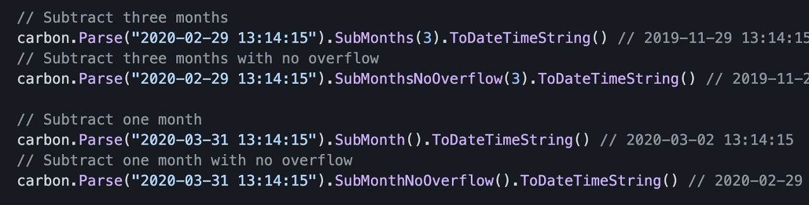

# Go语言爱好者周刊：第 106 期

这里记录每周值得分享的 Go 语言相关内容，周日发布。

本周刊开源（GitHub：[polaris1119/golangweekly](https://github.com/polaris1119/golangweekly)），欢迎投稿，推荐或自荐文章/软件/资源等，请[提交 issue](https://github.com/polaris1119/golangweekly/issues) 。

鉴于一些人可能没法坚持把英文文章看完，因此，周刊中会尽可能推荐优质的中文文章。优秀的英文文章，我们的 GCTT 组织会进行翻译。


题图：GoLand 2021.2 发布

## 刊首语

本期题目由网友「爱笑」投稿，以下代码输出什么，你知道为什么吗？

```go
package main

import (
	"fmt"
)

func main() {
	nums := []int{1, 2, 3, 4, 5, 6, 7}
	k := 3
	rotate(nums, k)
	fmt.Println(nums)
}

func rotate(nums []int, k int) {
	k = k % len(nums)
	nums = append(nums[len(nums)-k:], nums[0:len(nums)-k]...)
}
```

A：[5 6 7 1 2 3 4]    B：[1 2 3 4 5 6 7]   C：[4 5 6 7 1 2 3]

## 资讯

1、[todocheck 0.4.0 发布](https://github.com/preslavmihaylov/todocheck/tree/v0.4.0)

Go 用于带注释的 TODO 注释的静态代码分析器。

2、[重磅！GoLand 2021.2 发布了，支持 Go1.17](https://mp.weixin.qq.com/s/Uw0MIjEO8ro7aKpeYynJfQ)

可以试用 30 天。

## 谁在招 Gopher

整理近期的 Go 职位。有招聘需求可以到「Go招聘」发布！ 

- [利好！又有二线城市招聘Go工程师](https://mp.weixin.qq.com/s/TQFyc0-jpyhEqwjWAygjBQ)
- [京东零售|系统优化部虚位以待，就等你来优化](https://mp.weixin.qq.com/s/djXRa861KB7WsNDXaO_lrQ)

## 文章

1、[Go开源项目推荐：500行代码确认请求时间花在哪](https://mp.weixin.qq.com/s/s2JJFKl5GRWuWynfPdr7Ow)

开源项目：<https://github.com/davecheney/httpstat>。

2、[一道关于 len 函数的诡异 Go 面试题解析](https://mp.weixin.qq.com/s/1fAmtwDTc7Gv8sGilKdGTQ)

Go语言爱好者周刊第 104 期题解。

3、[Go：语法糖的代价](https://mp.weixin.qq.com/s/-lps3sl-riDOLxUIUyIrWA)

在 Go 语言中，你可以用少量的代码表达很多东西。您通常可以查看一小段代码并清楚地了解此程序的功能。这在 Go 社区中被称为地道的 Go 代码。

4、[Go 语言实现安全计数的若干种方法](https://mp.weixin.qq.com/s/9fZUEJSLLnq0sn_6Y9YZ-g)

本文是一篇如何用 goroutine-safe 的方式实现计数器的方法汇总。

5、[你真的了解泛型 Generic 嘛？](https://mp.weixin.qq.com/s/4PlneTYivBoBdZCBLso6jw)

泛型将在 1.18 发布。

## 开源项目

1、[carbon](https://github.com/golang-module/carbon)

一个轻量级、语义化、对开发者友好的 golang 时间处理库，支持链式调用。



2、[harmonica](https://github.com/charmbracelet/harmonica)

一个简单，高效的动画库。

3、[goqu](https://github.com/doug-martin/goqu)

一个富有表现力的 SQL Builder 和查询库。

4、[health](https://github.com/alexliesenfeld/health)

一个简单而灵活的健康检查库。

5、[hdfs](https://github.com/colinmarc/hdfs)

hdfs 的 Go 客户端。

6、[go-linq](https://github.com/ahmetb/go-linq)

Go 中的.NET LINQ 功能。

7、[goscript](https://github.com/oxfeeefeee/goscript)

将 Go 作为 Rust 中的脚本语言。

8、[kubernetes-testing-framework](https://github.com/Kong/kubernetes-testing-framework)

Go 集成测试框架，用于 Kong Kubernetes APIs 和控制器。

## 资源&&工具

1、[concourse](https://github.com/concourse/concourse)

持续集成工具。


2、[全网最全的Go书单来喽](https://mp.weixin.qq.com/s/eZ0qQmSpu2bLjb02sAW3ag)

本书单翻译自 <https://github.com/dariubs/GoBooks>，书单主要分为入门、高级、Web和其他在线资源的Go书籍和教程。

3、[rediloper](https://github.com/p1gd0g/rediloper)

Go 实现的 protobuf 文件生成器。

4、[gofu](https://github.com/codr7/gofu)

一个脚本语言工具包。

5、[油管视频](https://www.youtube.com/watch?v=Uk1hscXhlY0)

用于生产的动态 Go 仪表盘。

6、[powerproto](https://github.com/storyicon/powerproto)

一款多功能 proto 工具。

7、[kubesurveyor](https://github.com/viralpoetry/kubesurveyor)

Kubernetes 命名空间可视化工具。

8、[naml](https://github.com/kris-nova/naml)

将 Kubernetes YAML 替换为纯 Go。

9、[expr](https://github.com/regeda/expr)

一个用 Go 编写的基于堆栈的微小虚拟机。

10、[karma](https://github.com/prymitive/karma)

Prometheus Alertmanager 的警报仪表板。

## 订阅

这个周刊每周日发布，同步更新在[Go语言中文网](https://studygolang.com/go/weekly)和[微信公众号](https://weixin.sogou.com/weixin?query=Go%E8%AF%AD%E8%A8%80%E4%B8%AD%E6%96%87%E7%BD%91)。

微信搜索"Go语言中文网"或者扫描二维码，即可订阅。


