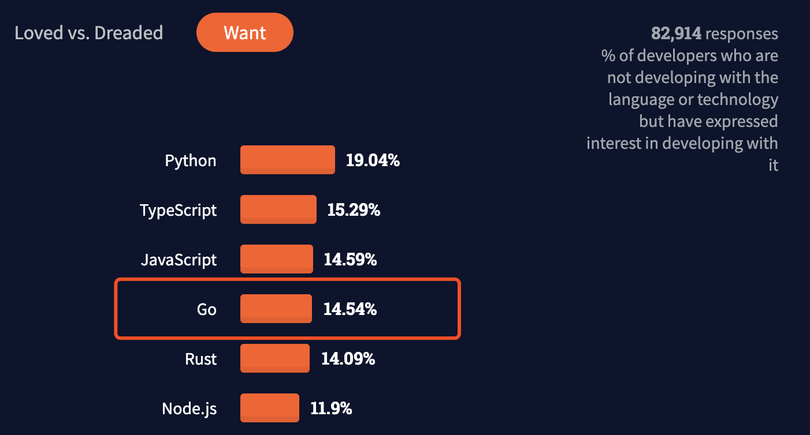
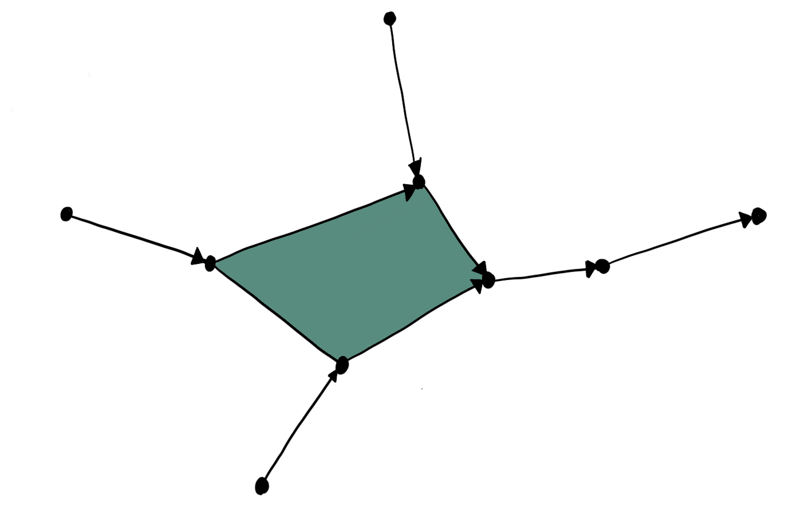

# Go语言爱好者周刊：第 107 期

这里记录每周值得分享的 Go 语言相关内容，周日发布。

本周刊开源（GitHub：[polaris1119/golangweekly](https://github.com/polaris1119/golangweekly)），欢迎投稿，推荐或自荐文章/软件/资源等，请[提交 issue](https://github.com/polaris1119/golangweekly/issues) 。

鉴于一些人可能没法坚持把英文文章看完，因此，周刊中会尽可能推荐优质的中文文章。优秀的英文文章，我们的 GCTT 组织会进行翻译。



题图：Stack Overflow 2021 年调查报告

## 刊首语

上期题目由网友「爱笑」投稿，以下代码输出什么，你知道为什么吗？

```go
package main

import (
	"fmt"
)

func main() {
	nums := []int{1, 2, 3, 4, 5, 6, 7}
	k := 3
	rotate(nums, k)
	fmt.Println(nums)
}

func rotate(nums []int, k int) {
	k = k % len(nums)
	nums = append(nums[len(nums)-k:], nums[0:len(nums)-k]...)
}
```

A：[5 6 7 1 2 3 4]    B：[1 2 3 4 5 6 7]   C：[4 5 6 7 1 2 3]

正确答案是 B。主要原因是 append 后的 nums 是新数组，它并不会影响 main 函数中的 nums。如果最后不是赋值给 nums，而是使用 copy，结果就是 A 了：

```go
copy(nums, append(nums[len(nums)-k:], nums[0:len(nums)-k]...))
```

本期是一道关于 json 的题目，以下代码输出什么？

```go
package main

import (
	"encoding/json"
	"fmt"
)

func main() {
	var p *int
	b, err := json.Marshal(p)
	if err != nil {
		fmt.Println(err)
		return
	}
	fmt.Println(string(b))
}
```

A：panic；B：编译错误；C：json marshal 报错；D：null

## 资讯

1、[Go 1.16.7 和 Go1.15.15 发布](https://studygolang.com/topics/14096)

同时，[Go 1.17 发布了 RC2](https://groups.google.com/g/golang-announce/c/yk30ovJGXWY)，离正式版发布不远了。

2、[Ent 0.9.0 发布](https://entgo.io/blog/2021/08/05/announcing-upsert-api/)

Facebook 出品，新的 Upsert API。

3、[Stack Overflow 发布 2021 年调查报告](https://insights.stackoverflow.com/survey/2021#technology-most-loved-dreaded-and-wanted)

Go 在最想学习榜中排名第四。

4、[gohugo v0.87.0 发布](https://gohugo.io/news/0.87.0-relnotes/)

支持时间、日期以及货币的本地化。

5、[Kubernetes 1.22 版本发布](https://kubernetes.io/blog/2021/08/04/kubernetes-1-22-release-announcement/)

号称达到新的巅峰。

6、[TIOBE 发布 8 月编程语言榜单：Go 排名如何？](https://mp.weixin.qq.com/s/oNZOZlrAT3kr2bx8ynIexw)

大家比较看好 Go，但感觉这榜单。。。

## 谁在招 Gopher

整理近期的 Go 职位。有招聘需求可以到「Go招聘」发布！ 

- [这个行业也用 Go？内推一个 Go 职位](https://mp.weixin.qq.com/s/o-mOyKterK44KskFLnBEgA)

## 文章

1、[Go 程序中的非 Go 后缀文件](https://mp.weixin.qq.com/s/1-2CP-S3apnHP0hMR6E1SA)

Go1.16 后有了更多选择。

2、[Go 标准库 encoding/json 真的慢吗？](https://mp.weixin.qq.com/s/UWmnI2kPRYbjlF8Kgh2-ew)

大部分时候，标准库是最好的选择。

3、[用 Go 实现类似 Nginx 的 Access Log](https://mp.weixin.qq.com/s/gif7zEB0FnyYtQABpxf20Q)

看看是如何处理的。

4、[重磅！GitHub 为 Go 社区带来安全支持](https://mp.weixin.qq.com/s/m3VkJU-m_TXnY59ELW12fQ)

安全问题越来越受到重视。

5、[只用 3 步构建 Go docker 最小镜像](https://mp.weixin.qq.com/s/7PGR_1xQUbQgI225rx245Q)

你一般怎么构建呢？

6、[你负责的服务熔断了，还不赶紧进来看看。](https://mp.weixin.qq.com/s/plCS0Zv8U27Us4AED5M-nQ)

微服务必备。

7、[Go 基于 I/O 多路复用的 TCP 协议流解析实践](https://tonybai.com/2021/07/31/io-multiplexing-model-tcp-stream-protocol-parsing-practice-in-go)

基于Go经典的阻塞I/O模型实现了一个基于TCP流的自定义协议的解析

8、[两款 go 开发实用工具](https://mp.weixin.qq.com/s/TXfAZYOTABdSY-Jq8Igaag)

方便日常使用。

## 开源项目

1、[virgo](https://github.com/r2d4/virgo)

基于图的配置语言。



2、[cloudflare-go](https://github.com/cloudflare/cloudflare-go)

CloudFlare API 的 Go 库。

3、[v2](https://github.com/miniflux/v2)

简约而有主见的 Feed 阅读器。

4、[phonenumbers](https://github.com/nyaruka/phonenumbers)

Google 电话号码解析库的 Go 移植版。

## 资源&&工具

1、[cxgo](https://github.com/gotranspile/cxgo)

将 C 转为 Go 的工具，纯 Go 实现。

2、 [Peanut](https://github.com/Clivern/Peanut)

为开发和测试管道轻松地部署数据库和服务。

3、[chezmoi](https://github.com/twpayne/chezmoi)

安全地在多个不同的机器上管理你的 dotfiles。

4、[播客第 191 期](https://changelog.com/gotime/191)

Go 语言实践观点集合。

## 订阅

这个周刊每周日发布，同步更新在[Go语言中文网](https://studygolang.com/go/weekly)和[微信公众号](https://weixin.sogou.com/weixin?query=Go%E8%AF%AD%E8%A8%80%E4%B8%AD%E6%96%87%E7%BD%91)。

微信搜索"Go语言中文网"或者扫描二维码，即可订阅。


