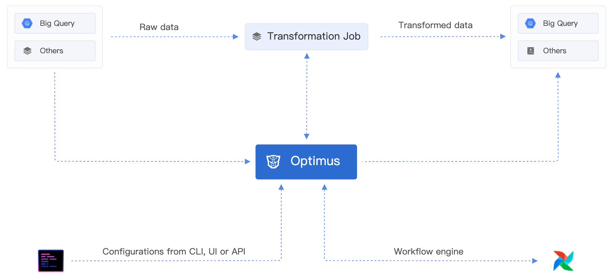

# Go语言爱好者周刊：第 108 期

这里记录每周值得分享的 Go 语言相关内容，周日发布。

本周刊开源（GitHub：[polaris1119/golangweekly](https://github.com/polaris1119/golangweekly)），欢迎投稿，推荐或自荐文章/软件/资源等，请[提交 issue](https://github.com/polaris1119/golangweekly/issues) 。

鉴于一些人可能没法坚持把英文文章看完，因此，周刊中会尽可能推荐优质的中文文章。优秀的英文文章，我们的 GCTT 组织会进行翻译。


题图：GoLand

## 刊首语

上期是一道关于 json 的题目，以下代码输出什么？

```go
package main

import (
	"encoding/json"
	"fmt"
)

func main() {
	var p *int
	b, err := json.Marshal(p)
	if err != nil {
		fmt.Println(err)
		return
	}
	fmt.Println(string(b))
}
```

A：panic；B：编译错误；C：json marshal 报错；D：null

正确答案是 D。在 encoding/json 文档有如下说明：

```bash
bool, for JSON booleans
float64, for JSON numbers
string, for JSON strings
[]interface{}, for JSON arrays
map[string]interface{}, for JSON objects
nil for JSON null
```

本期的题目。以下代码是否能正确运行？

```go
package main

import (
	"fmt"
	"sync"
)

func main() {
	wg := sync.WaitGroup{}
	wg.Add(1)
	go hello(wg)
	wg.Wait()
}

func hello(wg sync.WaitGroup) {
	fmt.Println("hello")
	wg.Done()
}
```

A：否，会 panic；B：是，能正确运行；C：不清楚，看投票结果

## 资讯

1、[bleve 2.1.0 发布](https://github.com/blevesearch/bleve/releases/tag/v2.1.0)

文本索引库。

2、[sqlc 1.9.0 发布](https://github.com/kyleconroy/sqlc/releases/tag/v1.9.0)

从 SQL 生成类型安全 Go 代码。

3、[maddy 0.5.0](https://github.com/foxcpp/maddy/releases/tag/v0.5.0)

SMTP email 服务器。

4、[grpc-go 1.40.0](https://github.com/grpc/grpc-go/releases/tag/v1.40.0)

gRPC Go 的实现。

5、[go-github 38.1.0](https://github.com/google/go-github)

GitHub API v3 的客户端，Google 出品。

6、[MongoDB Go Driver 1.7.1](https://github.com/mongodb/mongo-go-driver/releases/tag/v1.7.1)

MongoDB 的 Go 驱动，官方出品。

7、[Go+ v1.0.0-beta1 发布](https://github.com/goplus/gop)

所有语法都已经实现。

8、[GoLand 2021.3 路线图发布：为支持 Go1.18 做准备](https://mp.weixin.qq.com/s/cnzioGAb8I_G4oJLlFLTmA)

2021.3 的路线图又出来了，一起看看会有哪些特性。

9、[Excelize 2.4.1 发布](https://xuri.me/excelize/zh-hans/releases/v2.4.1.html)

2021 年 8 月 2 日，社区正式发布了 2.4.1 版本，该版本包含了多项新增功能、错误修复和兼容性提升优化。

## 文章

1、[线上优化实战：大内存 Go 服务性能优化](https://mp.weixin.qq.com/s/Y4oHfY77BPhD9xORkeRsqA)

本文是在上家的 case, 以前很多人在公开大会上拿该案例做分享，所以觉得有印象的同学勿喷，虽然冷饭，但是原创，而且干货十足。

2、[Go Modules 教程 第 1 部分：为什么和做什么](https://mp.weixin.qq.com/s/0yYmctOe47ENW90pXEn_sg)

群里时不时有人问的问题还跟 GOPATH 有关，还在使用 GOPATH 的方式，于是把这一系列翻译发布出来，希望能够帮助到新手；老手也可以温习下。

3、[CGO：关于回调函数和指针的传递](https://mp.weixin.qq.com/s/_IMBRrqkf2EQGfBWaLhCOg)

本文并不是一个 `Cgo` 的使用教程-在阅读前，需要你对它对简单使用案例有所熟悉。在本文最后列了一些有用的 `Cgo` 使用教程和相关的文章。

4、[Go 第三方库推荐：类型转换如此简单](https://mp.weixin.qq.com/s/NFiVI1Xu-jIAU2MZxxwe2Q)

你大概率会用到。

5、[Go 编译器的四个阶段](https://mp.weixin.qq.com/s/6jGnHsWqwFurJOc7GSQbGg)

一篇关于 Go 编译器的四个阶段的文章，大家可以学习一下，正好为后续一篇文章做一下铺垫。

6、[一文告诉你如何帮助测试Go语言Beta公测版与RC候选发布版](https://tonybai.com/2021/08/11/how-to-test-go-beta-or-rc)

这是一篇关于如何测试（Beta 和 RC），测试什么，以及为什么测试的文章。

7、[全面讲解 Go 中的 interface{}](https://mp.weixin.qq.com/s/pfYTRuJSw5Pkm6Co9bawhw)

空接口可用于保存任何数据，它可以是一个有用的参数，因为它可以使用任何类型。

## 开源项目

1、[Virgo](https://matt-rickard.com/virgo-lang/)

一种基于图形的配置语言。

2、[staticbackend](https://github.com/staticbackendhq/core)

一个轻量级的 Firebase 替代品，你可以自行托管。没有供应商的锁定，你的数据保持在你的控制之中。

3、[goelftools](https://github.com/hnts/goelftools)

纯 Go 编写的 ELF 文件解析库。

## 资源&&工具

1、[dasel](https://github.com/TomWright/dasel)

从命令行查询和更新数据结构，支持 JSON, TOML, YAML, XML 和 CSV 等格式。可以作为命令行或 Go 包使用。

2、[optimus](https://github.com/odpf/optimus)

轻松、可靠、快速的工作流协调器，用于数据转换、数据建模等。



3、[xsync](https://github.com/puzpuzpuz/xsync)

Go 并发数据结构。

4、[播客第 192 期](https://changelog.com/gotime/192)

Go 与数据流处理。

5、[ssaviewer](https://github.com/kkHAIKE/ssaviewer)

GOSSAFUNC 显示的是用 internal ssa，和平常分析代码用的 xtools ssa 不是一个东西，故做了个简单的工具。

## 订阅

这个周刊每周日发布，同步更新在[Go语言中文网](https://studygolang.com/go/weekly)和[微信公众号](https://weixin.sogou.com/weixin?query=Go%E8%AF%AD%E8%A8%80%E4%B8%AD%E6%96%87%E7%BD%91)。

微信搜索"Go语言中文网"或者扫描二维码，即可订阅。


