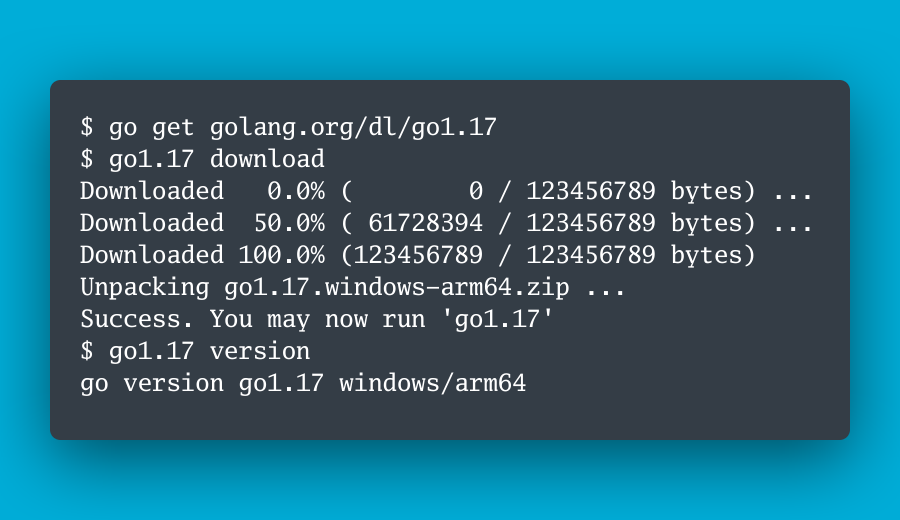
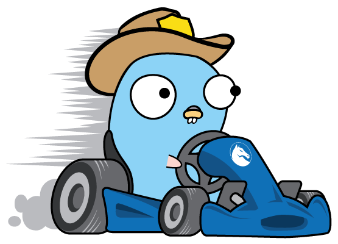

# Go语言爱好者周刊：第 109 期

这里记录每周值得分享的 Go 语言相关内容，周日发布。

本周刊开源（GitHub：[polaris1119/golangweekly](https://github.com/polaris1119/golangweekly)），欢迎投稿，推荐或自荐文章/软件/资源等，请[提交 issue](https://github.com/polaris1119/golangweekly/issues) 。

鉴于一些人可能没法坚持把英文文章看完，因此，周刊中会尽可能推荐优质的中文文章。优秀的英文文章，我们的 GCTT 组织会进行翻译。



题图：Go1.17 发布

## 刊首语

上期的题目是关于 sync.WaitGroup 的。以下代码是否能正确运行？

```go
package main

import (
	"fmt"
	"sync"
)

func main() {
	wg := sync.WaitGroup{}
	wg.Add(1)
	go hello(wg)
	wg.Wait()
}

func hello(wg sync.WaitGroup) {
	fmt.Println("hello")
	wg.Done()
}
```

A：否，会 panic；B：是，能正确运行；C：不清楚，看投票结果

答案是 A，因为 hello 的参数是 sync.WaitGroup，这会导致 main 中 wg 被复制一份，起不到该有的作用，应该改为 `*sync.WaitGroup`。答对的人 56%。

本期歇歇，不出题目了。

## 资讯

1、[为了支持 Go1.18 泛型，sync 包计划增加一些函数](https://github.com/golang/go/issues/47657)

比如 PoolOf, MapOf, ValueOf 等。不少标准库都会对泛型做出改进、调整，对泛型更友好。

2、[glog 包发布 1.0.0](https://github.com/golang/glog)

这是类似谷歌 C++ 的 glog 包，支持 level 的纯 Go 实现。

3、[GoLand 2021.2.1 发布](https://blog.jetbrains.com/go/2021/08/20/goland-2021-2-1-is-out/)

除了修复 bug，还有一些新特性。

4、[Delve v1.7.1 发布](https://github.com/go-delve/delve/blob/master/CHANGELOG.md#171-2021-08-18)

首次内置 eBPF 跟踪后端。

5、[官方问卷：帮 Go 完善原生模糊测试](https://mp.weixin.qq.com/s/VLbb8AcZJMgRaOQNtd-MJw)

帮官方反馈建议。

## 谁在招 Gopher

整理近期的 Go 职位。有招聘需求可以到「Go招聘」发布！ 

- [又一家游戏公司招Gopher啦](https://mp.weixin.qq.com/s/rdmstM7FstdeCGtcpTjRSw)

## 文章

1、[Go1.17 重磅发布了！泛型版 Go1.18 重新开放开发](https://mp.weixin.qq.com/s/McbBAaxpX1usEo8m_m_hNw)

20201-08-16 日如期发布。

2、[Go Modules 教程第 2 部分：项目、依赖和 gopls](https://mp.weixin.qq.com/s/KfguN8Gu-10wEcPBhTSCbA)

2019 年的文章，虽然有些旧，但值得一读。这是第三篇：[《Go Module 教程第 3 部分：最小版本选择》](https://mp.weixin.qq.com/s/A7QpfWz1qS_Q11Hp_KtB0Q)。

3、[在 Go 中使用微服务架构的好处](https://mp.weixin.qq.com/s/GLbh68cZ-jItcixcmKOmpA)

什么是微服务呢？我们为什么要使用它？为什么要在 Golang 中使用微服务架构?它有哪些优点？

4、[Go 1.17 新特性：Module 有哪些变化？](https://mp.weixin.qq.com/s/vmmVYP9OSoBjqL20GDkhiA)

自从 Go1.11 增加 Go Module 以来，每个版本都在不断改进 Module。Go1.17 也不例外，看看有哪些变化？

5、[Go 1.17 新特性详解：使用基于寄存器的调用惯例](https://tonybai.com/2021/08/20/using-register-based-calling-convention-in-go-1-17)

看看编译器与运行时中那些值得关注的变化。

## 开源项目

1、[unixtransport](https://github.com/peterbourgon/unixtransport)

在 Go HTTP 客户端中支持 Unix 域套接字。

2、[testcase](https://github.com/adamluzsi/testcase)

Go 行为驱动的测试库。

3、[IceFireDB](https://github.com/gitsrc/IceFireDB)

基于 Raft 和 Redis 协议的分布式磁盘存储系统。

4、[viddy](https://github.com/sachaos/viddy)

使用纯 Go 实现的现代 watch 命令。

5、[pqssh](https://github.com/mattn/pqssh)

通过 SSH 的 PostgreSQL 的 Go 驱动。

6、[base64](https://github.com/cristalhq/base64)

更快的 Base64 编码。

7、[ZITADEL](https://github.com/caos/zitadel)

云时代的"云原生身份和访问管理"解决方案。

## 资源&&工具

1、[golang-samples](https://github.com/GoogleCloudPlatform/golang-samples)

Google 云 Go 应用实例。

2、[gokart](https://github.com/praetorian-inc/gokart)

Go 代码的静态安全分析工具。



3、[croc](https://github.com/schollz/croc)

Go 开发的文件传输工具。

4、[DorkScout](https://github.com/R4yGM/dorkscout)

可自动对整个互联网或特定目标进行 google dork 扫描的 Go 工具。

5、[go-generics-example](https://github.com/mattn/go-generics-example)

Go 1.17 可运行的 Go 泛型示例。需要加上 `-gcflags=-G=3`。

6、[油管视频]( https://www.youtube.com/watch?v=wQglU5aB5NQ)

Go Workspaces 提案的原型实现演示。

7、[播客第 193 期](https://changelog.com/gotime/193)

与 Caddy 作者 Matt Holt 聊 Caddy V2。

8、[regexp2go](https://github.com/CAFxX/regexp2go)

将 Go 正则表达式编译为 Go 代码。

## 订阅

这个周刊每周日发布，同步更新在[Go语言中文网](https://studygolang.com/go/weekly)和[微信公众号](https://weixin.sogou.com/weixin?query=Go%E8%AF%AD%E8%A8%80%E4%B8%AD%E6%96%87%E7%BD%91)。

微信搜索"Go语言中文网"或者扫描二维码，即可订阅。


