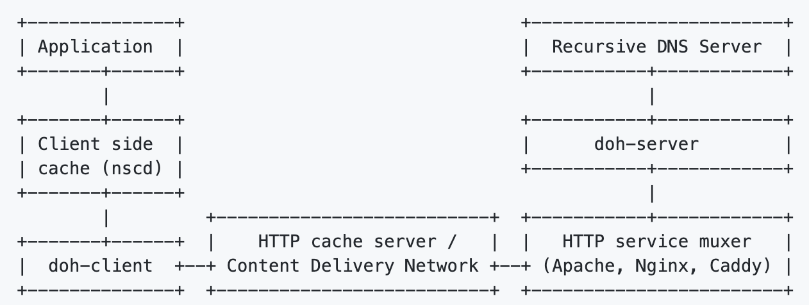

# Go语言爱好者周刊：第 110 期

这里记录每周值得分享的 Go 语言相关内容，周日发布。

本周刊开源（GitHub：[polaris1119/golangweekly](https://github.com/polaris1119/golangweekly)），欢迎投稿，推荐或自荐文章/软件/资源等，请[提交 issue](https://github.com/polaris1119/golangweekly/issues) 。

鉴于一些人可能没法坚持把英文文章看完，因此，周刊中会尽可能推荐优质的中文文章。优秀的英文文章，我们的 GCTT 组织会进行翻译。



题图：dns over https

## 刊首语

以下代码输出什么？

```go
func main() {
    v := math.Log(-1)
    m := map[float64]int{v: 1, v: 2, v: 3}
    fmt.Println(m[v], len(m))
}
```

A：1 1；B：3 1；C：0 3；D：不能编译

## 资讯

1、[Gitea 1.15.0 发布](https://blog.gitea.io/2021/08/gitea-1.15.0-is-released/)

流行的基于 Go 的 Git 系统。

2、[GLAuth 2.0 发布](https://github.com/glauth/glauth)

LDAP 认证服务器。

3、[GitHub CLI 2.0 发布](https://github.com/cli/cli/releases/tag/v2.0.0)

官方 GitHub CLI 客户端。

4、[rqlite 6.2 发布](https://github.com/rqlite/rqlite/releases/tag/v6.2.0)

支持参数化 SQL 语句。

5、[slides 0.5.0 发布](https://github.com/maaslalani/slides/releases/tag/v0.5.0)

基于终端的 slidedeck 工具。

6、[Go Micro 3.6.0 发布](https://github.com/asim/go-micro)

分布式系统框架。

## 文章

1、[扬眉吐气：刚刚，Go 已经默认支持泛型了](https://mp.weixin.qq.com/s/EMcarjLe2CCJZO9t5rM_Ww)

gotip 默认启用了。

2、[Go 中的并发 bug 在真实场景的情况分析](https://mp.weixin.qq.com/s/O-tjWE216f4xFWvEdSVdSg)

Go 目前正在通过新的并发原语（concurrency primitives）goroutine 和 channel 试图简化并发编程并减少报错。

3、[Go整洁架构模版，建议收藏](https://mp.weixin.qq.com/s/9iQiaZCQaGgnnz6vtfdEFA)

本文翻译自 <https://github.com/evrone/go-clean-template>。

4、[结合 MySQL 构建一个基于 Go 的 REST API 微服务](https://mp.weixin.qq.com/s/u0VLC4IRputge42lPvWlow)

在本篇迷你指导中，我会结合 MySQL 数据库创建一个简单的 REST-API。

5、[Go 中的进阶测试模式](https://mp.weixin.qq.com/s/bVBX5sYbd32Il7IuL0waTw)

Go 使编写测试非常简单。实际上，测试工具是内置在标准工具链里的，你可以简单地运行 go test 来运行你的测试，无需安装任何额外的依赖或任何别的东西。测试包是标准库的一部分，我很高兴地看到它的使用范围非常广泛。

6、[Go：以编程方式查找 DNS 记录](https://mp.weixin.qq.com/s/JlHxKk5BKmYZW-6z8hHR_Q)

DNS 记录是与 DNS 服务器关联的映射文件，无论每个域名与哪个 IP 地址关联，它们都能处理发送到每个域名的请求。

7、[担心密码提交到 GitHub？建议使用这个 Go 开源工具](https://mp.weixin.qq.com/s/wMaEkWr1O64tx7NkMooIpg)

今天要分享的这个开源工具，我个人认为更实用，可以当作一个 vet 工具使用，切切实实检查日常开发经常会忽略的安全问题，最常见的，比如将密码提交到 GitHub 上了。。。

8、[Gin 这是要成为 Go 官方框架？](https://mp.weixin.qq.com/s/xDx1HW5mehnYGT61eGYB9A)

常浏览 Go 官方网站的朋友可能留意到，Go 网站近一段时间增加了不少文档、教程。

## 开源项目

1、[gateway](https://github.com/apex/gateway)

运行在 AWS Lambda 时，替代 net/http 的 API Gateway。

2、[acmez](https://github.com/mholt/acmez)

适用于 Go 的 Premier ACME 客户端库。

3、[regit-go](https://github.com/WithGJR/regit-go)

一个与 Git 兼容的小型 Git 实现。

4、[ledger](https://github.com/numary/ledger)

一个可编写脚本的财务账簿，旨在使复杂的财务交易模型变得容易。

5、[plinko](https://github.com/shipt/plinko)

Go 轻量级状态机以及基于状态机的工作流实现。

6、[exatorrent](https://github.com/varbhat/exatorrent)

纯 Go 实现的可自托管、易用、轻量级的 torrent 客户端。

## 资源&&工具

1、[dns-over-https](https://github.com/m13253/dns-over-https)

高性能的 DNS over https。

2、[blocky](https://github.com/0xERR0R/blocky)

快速和轻量级的 DNS 代理。

3、[go-cosmic-blog](https://github.com/cosmicjs/go-cosmic-blog)

用 Go 和 Cosmic Headless CMS 建立的博客实例。

4、[entviz](https://github.com/hedwigz/entviz)

这是一个 ent 扩展，提供模式图的可视化。

5、[gosq](https://github.com/sanggonlee/gosq)

基于模板的 SQL 查询生成器。

6、[Go 播客第 194 期](https://changelog.com/gotime/194)

别忘了内存管理。

## 订阅

这个周刊每周日发布，同步更新在[Go语言中文网](https://studygolang.com/go/weekly)和[微信公众号](https://weixin.sogou.com/weixin?query=Go%E8%AF%AD%E8%A8%80%E4%B8%AD%E6%96%87%E7%BD%91)。

微信搜索"Go语言中文网"或者扫描二维码，即可订阅。


