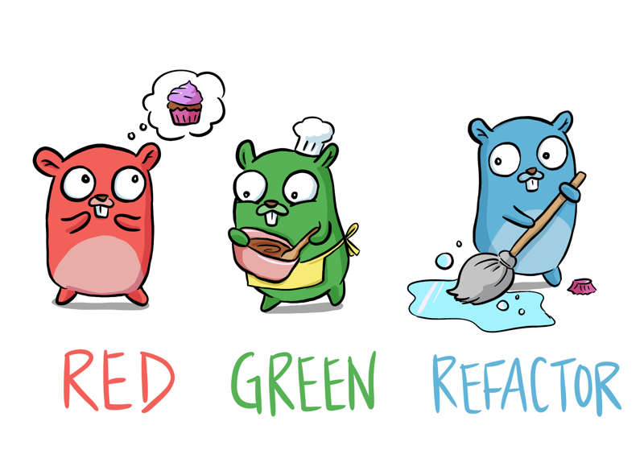

# Go语言爱好者周刊：第 111 期

这里记录每周值得分享的 Go 语言相关内容，周日发布。

本周刊开源（GitHub：[polaris1119/golangweekly](https://github.com/polaris1119/golangweekly)），欢迎投稿，推荐或自荐文章/软件/资源等，请[提交 issue](https://github.com/polaris1119/golangweekly/issues) 。

鉴于一些人可能没法坚持把英文文章看完，因此，周刊中会尽可能推荐优质的中文文章。优秀的英文文章，我们的 GCTT 组织会进行翻译。



题图：测试的几种状态

## 刊首语

上期的题目，正确率只有 28%。一起看看：

```go
func main() {
    v := math.Log(-1)
    m := map[float64]int{v: 1, v: 2, v: 3}
    fmt.Println(m[v], len(m))
}
```

A：1 1；B：3 1；C：0 3；D：不能编译

正确答案是 C。首先，math.Log(-1)，这是高中数学，负数不能取对数，所以这里的结果是 NaN，即不是一个数。这是关于计算机浮点数的知识了。对浮点数知识不熟悉的可以看看该文：[《15 张图带你深入理解浮点数》](https://mp.weixin.qq.com/s/BmXbChq3RVRmdGNgfxLyvw)。

关键知识点：任何一个 NaN 都不相等。因此 m[v] 会查找不到，所以返回 int 的默认值 0，而 m 中三个元素，key 都是 NaN，因此不相等，所有 len(m) 等于 3。

本期来一道简单的题目。以下代码输出什么？

```go
package main

import (
	"fmt"
)

func main() {
	num := 65
	str := string(num)
	fmt.Printf("%v, %T\n", str, str)
}
```

A：65, string；B：A, string；C：65, int；D：报错

## 资讯

1、[Go1.18 计划增加 workspace mode](https://github.com/golang/go/issues/45713)

这样可以多模块编辑，可能会增加 go.work 这个文件来控制。

2、[Russ Cox 发推文咨询建议](https://twitter.com/_rsc/status/1433128358683029506)

Go 是否应该增加 int128？issue 见：< https://github.com/golang/go/issues/9455>。

3、[Go语言带来的生活质量提升](https://docs.google.com/presentation/d/1sBXrDYiSCPVBeguQbCJebxIVptjTFKjGOBsElkbp040/edit?resourcekey=0-TM-u9xTZZHUyt3-y9-tZow)

这是一个 PPT，回顾了 Go1.16 和 1.17 的变化。

4、[chezmoi 2.2.0 发布](https://github.com/twpayne/chezmoi)

安全地管理你的 DotFiles 跨多种不同的机器。

## 文章

1、[原来sync.Once还能这么用](https://mp.weixin.qq.com/s/JcZi8GjA_sn_Oo74bqvipg)

`sync.Once`估计大家都不陌生，但用法可以很多。

2、[新书推荐：用 Gin 框架构建分布式应用](https://mp.weixin.qq.com/s/geFEA3ydBiB6nwMJwJ_dQw)

英文的。

3、[Go select 竟然死锁了。。。](https://mp.weixin.qq.com/s/YB_mBJMAmRruNrb4NPy8sw)

Stack Overflow 上的一个问题分析。

4、[Go：自适应负载均衡算法原理和实现](https://mp.weixin.qq.com/s/BiJyD7V8yEFjKyCFXo3PPg)

go-zero 如何实现的？

5、[Go泛型是怎么实现的?](https://colobu.com/2021/08/30/how-is-go-generic-implemented/)

Go 的泛型实现，可以了解下。

6、[为什么要使用 Go module proxy](https://mp.weixin.qq.com/s/2XfBNSbllD4AzSd3yAihdg)

proxy 是近年来 Go 语言最重要的变化之一。

7、[Go：无缓冲和有缓冲通道](https://mp.weixin.qq.com/s/WvlVQuyMsPQzWJqBW6qQ_g)

Go 中的通道（channel）机制十分强大，但是理解内在的概念甚至可以使它更强大。

8、[go vet：超出预期的强大](https://mp.weixin.qq.com/s/6Q5SqkpPUaR2JXipt1sDEA)

Go vet 命令在编写代码时非常有用。它可以帮助您检测应用程序中任何可疑、异常或无用的代码。

9、[Go: 监控模式](https://mp.weixin.qq.com/s/vkLfBYHh-zUpT78AeIsp9Q)

Go 能实现监控模式，归功于 sync 包和 sync.Cond 结构体。

10、[高德渲染网关Go语言重构实践](https://mp.weixin.qq.com/s/i9da19Z9MU5ENZ572P87rw)

高德Go业务落地过程是如何实现的，遇到过哪些问题，如何解决？本文将为大家介绍相关经验。

11、[几行代码为老板省百万-某高并发服务Go GC及UDP Pool优化](https://mp.weixin.qq.com/s/YAz5NyiNWJCMlGsJRTAaxw)

鹅厂代码优化。

## 开源项目

1、[centrifugo](https://github.com/centrifugal/centrifugo)

可扩展的实时消息服务器。

2、[coraza-waf](https://github.com/jptosso/coraza-waf)

Web 应用程序防火墙。

3、[trafficcontrol](https://github.com/apache/trafficcontrol)

Apache 开源的 Go 实现的 CDN 网络。

4、[ns-x](https://github.com/bytedance/ns-x)

一个易于使用、灵活的 Go 网络模拟器库，字节跳动出品。

## 资源&&工具

1、[gomonkey](https://github.com/agiledragon/gomonkey)

一个在单元测试中使用 money patch 的库。

2、[countdown](https://github.com/antonmedv/countdown)

终端秒表器。

3、[star-tex](https://git.sr.ht/~sbinet/star-tex)

Go 实现的开源 Tex 引擎。

4、[ztrace](https://github.com/zartbot/ztrace)

Go 实现的 Traceroute。

5、[gobencher](https://github.com/marketplace/gobencher)

GitHub 针对 Go 仓库提供免费的持续 Benchmark 服务。

6、[微软教程：使用Go构建无服务器应用](https://docs.microsoft.com/zh-cn/learn/modules/serverless-go/)

基于微软 Azure 的。

7、[termdbms](https://github.com/mathaou/termdbms)

用于查看和编辑数据库文件的 TUI。目前仅支持 SQLite，很快就会添加对 MySQL 的支持。

## 订阅

这个周刊每周日发布，同步更新在[Go语言中文网](https://studygolang.com/go/weekly)和[微信公众号](https://weixin.sogou.com/weixin?query=Go%E8%AF%AD%E8%A8%80%E4%B8%AD%E6%96%87%E7%BD%91)。

微信搜索"Go语言中文网"或者扫描二维码，即可订阅。


