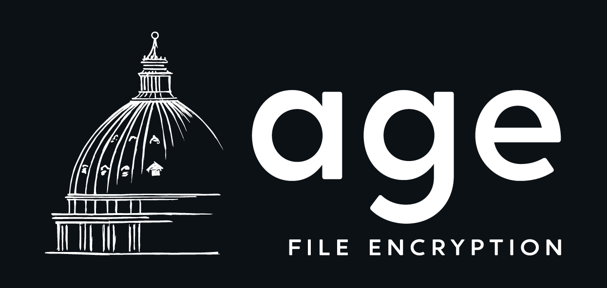

# Go语言爱好者周刊：第 112 期

这里记录每周值得分享的 Go 语言相关内容，周日发布。

本周刊开源（GitHub：[polaris1119/golangweekly](https://github.com/polaris1119/golangweekly)），欢迎投稿，推荐或自荐文章/软件/资源等，请[提交 issue](https://github.com/polaris1119/golangweekly/issues) 。

鉴于一些人可能没法坚持把英文文章看完，因此，周刊中会尽可能推荐优质的中文文章。优秀的英文文章，我们的 GCTT 组织会进行翻译。



题图：现代加密工具

## 刊首语

上期的题目竟然只有 48% 的人做对。这里简单解释下。

以下代码输出什么？

```go
package main

import (
	"fmt"
)

func main() {
	num := 65
	str := string(num)
	fmt.Printf("%v, %T\n", str, str)
}
```

A：65, string；B：A, string；C：65, int；D：报错

正确答案：B。

不过，如果你使用 go vet 检查，会提示：`conversion from int to string yields a string of one rune, not a string of digits (did you mean fmt.Sprint(x)?)`。

也就是说，如果要将数字 65 转为字符串，不能使用 `string(num)`，如果使用这种方式转，得到的是一个 rune 的字符串表示，因为字面 A 的 ASCII 码是 65，因此这里输出结果是 A,string。

本次不出新题目了！

## 资讯

1、[Go 官网要变天。。。](https://mp.weixin.qq.com/s/FfifPrpEWL_yn7YeLWI1kw)

官网最近一直在变。

2、[Go1.17.1 发布](https://mp.weixin.qq.com/s/DMrJcgIRkMQHxF7r6zcbxg)

小版本发布，修复安全问题。

3、[clash 1.7 发布](https://github.com/Dreamacro/clash)

Go 中基于规则的隧道。

## 文章

1、[Go Module 教程第 4 部分：镜像、校验和以及 Athens](https://mp.weixin.qq.com/s/b1mTUOKCs-L9Tt9TdzJpQw)

Go Module 系列教程的第 4 部分，[Go Module 教程第 5 部分：Vendoring](https://mp.weixin.qq.com/s/VN1CrUzYfvQ1BxdLNie9Ng)。

2、[Go 实现 Photoshop 的功能。。。](https://mp.weixin.qq.com/s/SLiXxKMEtj7CS1k80cZ9sw)

实现了很多 Photoshop 的功能。

3、[Go: Finalizers 怎么使用？](https://mp.weixin.qq.com/s/H-VIhce4N3aH5HIhY-5UlQ)

Go runtime 提供了一种允许开发者将一个函数与一个变量绑定的方法 runtime.SetFinalizer，被绑定的变量从它无法被访问时就被垃圾回收器视为待回收状态。

4、[看看国外的Gopher培训教程是怎样的？](https://mp.weixin.qq.com/s/HIA-4AsPmvhtpCGj7Ij-8w)

一个 Go 培训的课程资料仓库 gotraining。

5、[Go1.17 新特性：testing 包的相关变化](https://mp.weixin.qq.com/s/j7KTvXwmqly1_dklMNf_qw)

今天介绍下 Go1.17 中的特性：testing 包的一些变化。

6、[Go1.17 新特性：go get 变了](https://mp.weixin.qq.com/s/jyr2mdq7hAOy7wKpBJHMgQ)

为什么把 Go 的一些小变化单独写文章，而不是一篇文章介绍所有的变化？主要是想让大家对某一个特性有更深的记忆。

7、[在 Go 代码中如何绑定 Host？](https://mp.weixin.qq.com/s/iZ_ntmFcMEBdb1LHGTd5dg)

有些场景会用到。

8、[疯了吧！这帮人居然用 Go 写“前端”？](https://mp.weixin.qq.com/s/FpRfh-4lb25hzriirTQeCg)

无一例外，谈到前后端分离“必定”是 RESTful API，算是定式了。

## 开源项目

1、[go-pst](https://github.com/mooijtech/go-pst)

一个读写 PST 文件的库。

2、[gorm-sqlchaos](https://github.com/u2386/gorm-sqlchaos)

GORM SQLChaos 在程序运行时基于 gorm 对 DML 进行操作。

3、[bun](https://github.com/uptrace/bun)

用于 PostgreSQL、MySQL 和 SQLite 的简单且性能良好的数据库客户端。

4、[krok](https://github.com/krok-o/krok)

支持 GitHub、GitLab、Bitbucket 等的 Webhook 管理服务。

5、[pgx](https://brandur.org/sqlc)

使用 sqlc/pgx 操作 Postgres 数据库。

6、[go-mutesting](https://github.com/zimmski/go-mutesting)

Go 变异测试（Mutation testing）框架。

## 资源&&工具

1、[age](https://github.com/FiloSottile/age)

一个简单、现代且安全的加密工具（和 Go 库），具有小的显式密钥、无配置选项和 UNIX 风格的可组合性。

2、[cli](https://github.com/create-go-app/cli)

通过运行一个 CLI 命令，创建一个具有后端、前端和部署自动化的项目。

3、[slo-tracker](https://github.com/roshan8/slo-tracker)

跟踪 SLA、SLO 和错误预算的工具。

4、[kubernetes-best-practices](https://github.com/diegolnasc/kubernetes-best-practices)

Kubernetes 最佳实践。

5、[changie](https://github.com/miniscruff/changie)

自动从 commit log 提取用于发布的更新日志工具。

## 订阅

这个周刊每周日发布，同步更新在[Go语言中文网](https://studygolang.com/go/weekly)和[微信公众号](https://weixin.sogou.com/weixin?query=Go%E8%AF%AD%E8%A8%80%E4%B8%AD%E6%96%87%E7%BD%91)。

微信搜索"Go语言中文网"或者扫描二维码，即可订阅。


